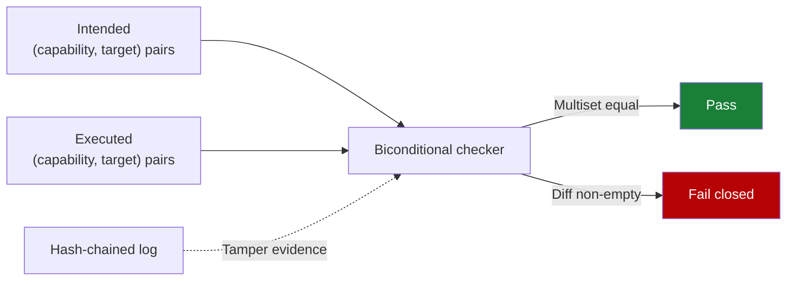

# Audit-Record Divergence as an Agent Runtime Invariant

> Treat "every executed action equals exactly one audit record on the same target" as a load-bearing safety invariant. Four divergence modes — F1 gate-bypass, F2 audit-forgery, F3 silent partial failure, F4 wrong-target — exhaust the failure space, and each maps to a specific runtime primitive that detects it.

## The Invariant

[Metere (2026)](https://arxiv.org/abs/2605.01740) formalises runtime safety as a multiset equality between intended and executed (capability, target) pairs. Four divergence modes enumerate how the diff becomes non-empty:

| Mode | Divergence | Concrete failure |
|------|------------|------------------|
| **F1 gate-bypass** | Executed action without matching audit entry | Tool call mutates state; runtime never recorded the request |
| **F2 audit-forgery** | Audit entry without matching executed action | Log shows action ran; underlying state never changed |
| **F3 silent partial failure** | Operation half-completes; record incoherent with state | Egress succeeded; persistence failed; record claims both |
| **F4 wrong-target** | Approved target A; mutation landed on target B | Agent approved `repo:foo`; commit pushed to `repo:bar` |

The set is exhaustive modulo the threat model — anything else reduces to one of the four or is out of scope (process compromise, cryptographic attacks, operator collusion) ([Metere, 2026](https://arxiv.org/abs/2605.01740)).

## The Reconciliation Mechanism

Two structural pieces sit beneath the invariant:

- **Multiset reconciliation.** The runtime computes a diff between intended and executed pairs after each action; non-empty diff fails closed.
- **Tamper-evident log.** Each audit entry chains to the previous via a cryptographic hash so post-hoc cleanup of an F1 or F2 record breaks the chain on verification ([Metere, 2026](https://arxiv.org/abs/2605.01740); [cryptographic governance audit trail](cryptographic-governance-audit-trail.md)).

## Mapping Primitives to Modes

Metere identifies seven detection primitives that, together, close all four modes. Most map onto patterns already covered on this site:

| Primitive | Closes | On-site coverage |
|-----------|--------|------------------|
| Biconditional checker | F1, F2, F4 | (gap — see below) |
| Hash-chained audit log | F2 | [Cryptographic governance audit trail](cryptographic-governance-audit-trail.md) |
| Extension admission gate (signed manifest + capability declaration) | F1 | [Tool signing and signature verification](tool-signing-verification.md) |
| Two-layer egress guard (fetch wrapper + socket interception) | F1, F4 | [Agent network egress policy](agent-network-egress-policy.md) |
| Bell-LaPadula classification policy | F4 | (cross-cutting; not a single page) |
| Module-signing trust root (Ed25519) | F1 | [Tool signing and signature verification](tool-signing-verification.md) |
| Bootstrap seal (fail-closed init) | F1, F3 | [Fail-closed remote settings enforcement](fail-closed-remote-settings-enforcement.md) |

The biconditional checker is the only piece without a parallel pattern on this site — it is the primitive doing the reconciliation work. The other six prevent classes of divergence; the checker detects them when prevention fails ([Metere, 2026](https://arxiv.org/abs/2605.01740)).

## Conditions of Applicability

The empirical claim is single-author and single-comparator: a 1,600-sample baseline through OpenClaw yielded recall = 0.000 on every confusion-matrix cell; a stress extension to n = 80,000 held false-positive bound to 3.84×10⁻⁴ per cell at recall = 1.000 on the hardened comparator ([Metere, 2026](https://arxiv.org/abs/2605.01740)). Apply the architecture where the conditions match:

- **Long-running, multi-user, write-heavy runtimes.** Persistent state and concurrent users make F2 and F3 load-bearing; the seven primitives are proportionate.
- **Regulated environments.** EU AI Act Article 12, finance, and healthcare audits already demand tamper-evident logs and target classification.
- **Vendor-managed coding agents.** Claude Code, Copilot, and Cursor already produce transcripts and tool-call logs; the control point is platform retention policy, not re-implementation.
- **Ephemeral per-PR agents.** No cross-run state plus an inspectable transcript collapses F2 and F3 to near-zero — narrower controls suffice.

## What This Adds Over Existing Patterns

[Cryptographic governance audit trail](cryptographic-governance-audit-trail.md) gives the log primitive. [Tool signing](tool-signing-verification.md) gives admission. [Egress policy](agent-network-egress-policy.md) gives target enforcement. The invariant frame is the contract those primitives jointly satisfy: each pattern in isolation prevents one failure class; the F1-F4 frame names the load-bearing safety property they collectively underwrite.

## Reference Findings

[Metere (2026)](https://arxiv.org/abs/2605.01740) reports two empirical results worth retaining:

- **Cooperation rates across ten LLMs varied from 0% (Llama 3.2:3b) to 100% (Llama 3.1:8b)** on identical F1 prompts — model refusal is not a security primitive.
- **A six-line append-only regex extension to the DLP catalog raised F3 true-positive detection by 14.6%** at unchanged precision — the architecture, not configuration tuning, governs detection capability.

## Key Takeaways

- The agent runtime safety invariant is a multiset equality between intended and executed (capability, target) pairs.
- F1-F4 enumerate the divergences from that invariant; the set is exhaustive modulo the threat model.
- Six of seven detection primitives map onto existing site patterns; the biconditional checker is the missing reconciliation step.
- The strict-dominance result is single-comparator. Apply the full architecture to long-running multi-user runtimes; rely on simpler controls for ephemeral coding agents.
- Treat model refusal as defence-in-depth, not a primitive — cross-model cooperation rates span the full 0-100% range on identical prompts.

## Related

- [Cryptographic Governance Audit Trail](cryptographic-governance-audit-trail.md) — hash-chained, signed audit log primitive
- [Tool Signing and Signature Verification](tool-signing-verification.md) — module-signing trust root and admission gate
- [Agent Network Egress Policy](agent-network-egress-policy.md) — two-layer egress guard against F1 and F4
- [Fail-Closed Remote Settings Enforcement](fail-closed-remote-settings-enforcement.md) — bootstrap seal for fail-closed initialisation
- [Four-Layer Taxonomy of Agent Security Risks](four-layer-agent-security-taxonomy.md) — execution-surface layering that places audit divergence at L4
- [Defense-in-Depth Agent Safety](defense-in-depth-agent-safety.md) — independent mechanisms layered against single-point compromise
