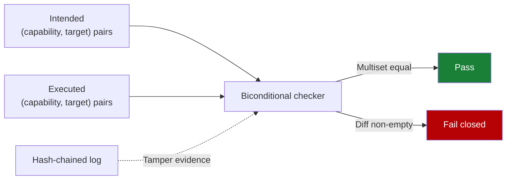

# Audit-Record Divergence as an Agent Runtime Invariant

> Treat "every executed action equals exactly one audit record on the same target" as a load-bearing safety invariant. Four divergence modes — F1 gate-bypass, F2 audit-forgery, F3 silent partial failure, F4 wrong-target — exhaust the failure space, and each maps to a specific runtime primitive that detects it.

## The Invariant

[Metere (2026)](https://arxiv.org/abs/2605.01740) formalises runtime safety as a multiset equality between intended and executed (capability, target) pairs. Four divergence modes enumerate how the diff becomes non-empty:

| Mode | Divergence | Concrete failure |
|------|------------|------------------|
| **F1 gate-bypass** | Executed action without matching audit entry | Tool call mutates state; runtime never recorded the request |
| **F2 audit-forgery** | Audit entry without matching executed action | Log shows action ran; underlying state never changed |
| **F3 silent partial failure** | Operation half-completes; record incoherent with state | Egress succeeded; persistence failed; record claims both |
| **F4 wrong-target** | Approved target A; mutation landed on target B | Agent approved `repo:foo`; commit pushed to `repo:bar` |

The set is exhaustive modulo the threat model — anything else reduces to one of the four or is out of scope (process compromise, cryptographic attacks, operator collusion) ([Metere, 2026](https://arxiv.org/abs/2605.01740)).

## The Reconciliation Mechanism

```mermaid
graph LR
    A["Intended<br/>(capability, target) pairs"] --> C["Biconditional checker"]
    B["Executed<br/>(capability, target) pairs"] --> C
    C -->|"Multiset equal"| D["Pass"]
    C -->|"Diff non-empty"| E["Fail closed"]
    F["Hash-chained log"] -.->|"Tamper evidence"| C
    style E fill:#b60205,color:#fff
    style D fill:#1a7f37,color:#fff
```

Two structural pieces sit beneath the invariant. **Multiset reconciliation** computes a diff between intended and executed pairs after each action; non-empty diff fails closed. **Tamper-evident log** chains each audit entry to the previous via a cryptographic hash so post-hoc cleanup of an F1 or F2 record breaks the chain on verification ([Metere, 2026](https://arxiv.org/abs/2605.01740); [cryptographic governance audit trail](cryptographic-governance-audit-trail.md)).

## Mapping Primitives to Modes

Metere identifies seven detection primitives that close all four modes. Six map onto patterns already on this site:

| Primitive | Closes | On-site coverage |
|-----------|--------|------------------|
| Biconditional checker | F1, F2, F4 | (gap — see below) |
| Hash-chained audit log | F2 | [Cryptographic governance audit trail](cryptographic-governance-audit-trail.md) |
| Extension admission gate (signed manifest + capability declaration) | F1 | [Tool signing and signature verification](tool-signing-verification.md) |
| Two-layer egress guard (fetch wrapper + socket interception) | F1, F4 | [Agent network egress policy](agent-network-egress-policy.md) |
| Bell-LaPadula classification policy | F4 | (cross-cutting; not a single page) |
| Module-signing trust root (Ed25519) | F1 | [Tool signing and signature verification](tool-signing-verification.md) |
| Bootstrap seal (fail-closed init) | F1, F3 | [Fail-closed remote settings enforcement](fail-closed-remote-settings-enforcement.md) |

The biconditional checker is the only piece without a parallel pattern here — the other six prevent classes of divergence; the checker detects them when prevention fails ([Metere, 2026](https://arxiv.org/abs/2605.01740)).

## Why It Works

Multiset equality is the soundness witness. Each action emits one entry on the intended stream and one on the executed stream; the runtime is sound for F1-F4 *if and only if* the streams agree as multisets after every action, because the checker reads both streams from independent observation points and any divergence produces a non-empty diff it is structurally guaranteed to surface ([Metere, 2026](https://arxiv.org/abs/2605.01740)). [Kaptein, Khan, and Podstavnychy (2026)](https://arxiv.org/abs/2603.16586) generalise this by arguing execution *paths* — not single (capability, target) pairs — are the central runtime-governance object; multiset reconciliation is the per-action specialisation of that path-policy frame. The hash chain underwrites the *retention* leg: mutating any past audit entry breaks the head verification in linear time, so F2 reduces from "did the attacker get write access" (unanswerable) to "does the head verify" ([Metere, 2026](https://arxiv.org/abs/2605.01740)).

## Conditions of Applicability

The empirical claim is single-author and single-comparator: a 1,600-sample OpenClaw baseline yielded recall = 0.000 on every confusion-matrix cell; an n = 80,000 stress extension held false-positive bound to 3.84×10⁻⁴ per cell at recall = 1.000 on the hardened comparator ([Metere, 2026](https://arxiv.org/abs/2605.01740)). The full architecture fits **long-running, multi-user, write-heavy runtimes** (persistent state and concurrent users make F2 and F3 load-bearing) and **regulated environments** (EU AI Act Article 12, finance, and healthcare audits already demand tamper-evident logs and target classification). For **vendor-managed coding agents** (Claude Code, Copilot, Cursor) the control point is platform retention policy, not re-implementation.

## When This Backfires

The seven-primitive architecture is operationally heavy. Three conditions make the simpler-controls steelman correct:

- **Ephemeral, single-user runtimes.** Per-PR coding agents with no cross-run state collapse F2 and F3 to near-zero. A transcript and tool-call log cover residual F1 and F4 risk; adding a hash-chained log, bootstrap seal, and Bell-LaPadula classifier costs latency without proportional lift ([Metere, 2026](https://arxiv.org/abs/2605.01740)).
- **High-throughput, low-stakes tool calls.** Read-only retrieval pipelines issuing thousands of invocations per minute pay the biconditional checker's per-action cost against a base-rate of essentially zero exploitable divergence. The same budget spent on rate-limiting or output filtering displaces more risk per dollar.
- **Trajectory-shaped failure modes.** [Kaptein et al. (2026)](https://arxiv.org/abs/2603.16586) and trajectory-audit work ([arxiv 2605.14271](https://arxiv.org/abs/2605.14271)) argue some safety violations are properties of *paths*, not single pairs — an agent can accumulate individually-licit actions into a globally-unsafe trajectory. Per-action reconciliation passes every step; trajectory-level audit catches what F1-F4 cannot.

The strict-dominance result is also single-comparator: Metere benchmarked OpenClaw against one hardened fork, not the broader OpenClaw-variant landscape evaluated in [Wang et al. (2026)](https://arxiv.org/abs/2604.03131).

## What This Adds Over Existing Patterns

[Cryptographic governance audit trail](cryptographic-governance-audit-trail.md) gives the log primitive. [Tool signing](tool-signing-verification.md) gives admission. [Egress policy](agent-network-egress-policy.md) gives target enforcement. The invariant frame is the contract those primitives jointly satisfy: each pattern alone prevents one failure class; F1-F4 names the load-bearing safety property they collectively underwrite.

## Reference Findings

[Metere (2026)](https://arxiv.org/abs/2605.01740) reports two empirical results worth retaining: cooperation rates across ten LLMs varied from 0% (Llama 3.2:3b) to 100% (Llama 3.1:8b) on identical F1 prompts — model refusal is not a security primitive. And a six-line append-only regex extension to the DLP catalog raised F3 true-positive detection by 14.6% at unchanged precision — the architecture, not configuration tuning, governs detection capability.

## Key Takeaways

- The agent runtime safety invariant is a multiset equality between intended and executed (capability, target) pairs.
- F1-F4 enumerate the divergences from that invariant; the set is exhaustive modulo the threat model.
- Six of seven detection primitives map onto existing site patterns; the biconditional checker is the missing reconciliation step.
- The strict-dominance result is single-comparator. Apply the full architecture to long-running multi-user runtimes; rely on simpler controls for ephemeral coding agents.
- Treat model refusal as defence-in-depth, not a primitive — cross-model cooperation rates span the full 0-100% range on identical prompts.

## Related

- [Action-Audit Divergence: A Four-Mode Taxonomy for Runtime Hardening](action-audit-divergence-taxonomy.md) — controls-mapping view of the same F1-F4 model; pair with this invariant page as the review checklist
- [Cryptographic Governance Audit Trail](cryptographic-governance-audit-trail.md) — hash-chained, signed audit log primitive
- [Tool Signing and Signature Verification](tool-signing-verification.md) — module-signing trust root and admission gate
- [Agent Network Egress Policy](agent-network-egress-policy.md) — two-layer egress guard against F1 and F4
- [Fail-Closed Remote Settings Enforcement](fail-closed-remote-settings-enforcement.md) — bootstrap seal for fail-closed initialisation
- [Four-Layer Taxonomy of Agent Security Risks](four-layer-agent-security-taxonomy.md) — execution-surface layering that places audit divergence at L4
- [Defense-in-Depth Agent Safety](defense-in-depth-agent-safety.md) — independent mechanisms layered against single-point compromise
