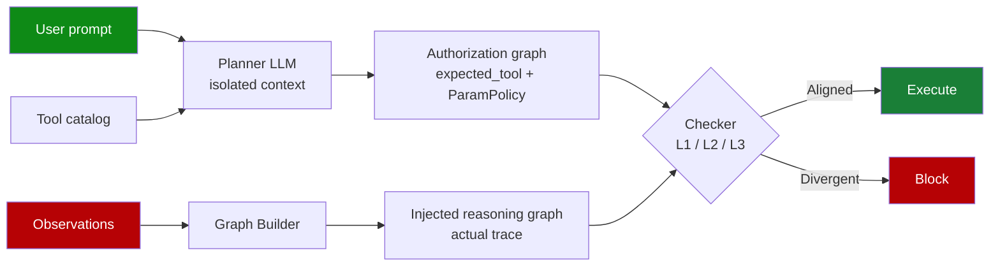

# Dual-Graph Alignment for Indirect Prompt Injection Defense (AuthGraph)

> A dual-graph defense compares a clean authorization graph from user intent against an execution-trace provenance graph; structural divergence flags injection-driven tool calls.

The defense applies when an agent calls tools that consume attacker-controllable observations and the deployment can absorb a 4.23× token cost and 1.87× latency overhead for a 1–2% residual attack success rate ([Wang et al., 2026](https://arxiv.org/abs/2605.26497)). It does **not** cover same-observation pollution, multi-agent handoffs, or adaptive attacks against the LLM-judged layers — those are explicit out-of-scope conditions enumerated below.

## How It Works

Two graphs are constructed per agent run ([Wang et al., 2026](https://arxiv.org/abs/2605.26497)):

- **Authorization graph** — produced by a Planner LLM (the paper uses GPT-4o-mini) with input strictly limited to `{user_prompt, tool_catalog}`. The Planner emits an `expected_tool` sequence and a `ParamPolicy` for every security-critical parameter (`send_*`, `book_*`, `transfer_*`, etc.). It also emits `replan` flags with `replan_allowed_tools` whitelists when the user intent permits runtime extension.
- **Injected reasoning graph** — built from the actual execution trace by a Graph Builder, attributing each parameter value to its source observation.

A three-layer Checker compares the two ([Wang et al., 2026](https://arxiv.org/abs/2605.26497)):

| Layer | Mechanism | What it catches |
|-------|-----------|-----------------|
| **L1 Hard block** | Programmatic allowlist — tool calls outside the authorized set `𝒮` are rejected with no LLM in the loop | Out-of-spec tool invocations |
| **L2 Tool-name check** | LLM judges ambiguous tool calls as `extra_step_ok`, `skipped_step_ok`, or `suspicious` (unrelated to user task) | Plausible-looking injected tool calls |
| **L3 Parameter source** | For each `ParamPolicy`, verify the value originates from the declared `source_tools` observation via string match against original observation text (not the Graph Builder's summary, "because the Graph Builder is an attack surface") with LLM fallback | Argument-substitution attacks (e.g. `EVIL-123` from `search_hotels` passed into a parameter that must come from `search_flights`) |

Ablations show every layer is load-bearing: removing L2 jumps ASR from 0.01 to 0.21, removing L3 to 0.18, removing L1 to 0.12 ([Wang et al., 2026](https://arxiv.org/abs/2605.26497)).



## Why It Works

The authorization graph carries **zero channel capacity from untrusted input**. The Planner LLM only receives the user prompt and the tool catalog; it never observes any tool return, retrieved document, or inter-agent message. This is the paper's Property 1: "information-theoretic independence of any injected content" ([Wang et al., 2026](https://arxiv.org/abs/2605.26497)). The downstream Checker therefore has a contamination-free reference to compare the execution trace against — divergence between the graphs is structurally attributable to the only side of the system that can see attacker content. Single-graph provenance defenses such as [ARGUS-style influence auditing](provenance-aware-decision-auditing.md) lack this clean baseline and must instead trace per-span trust through the same graph the attacker can perturb ([Weng et al., 2026](https://arxiv.org/abs/2605.03378)).

## Where It Sits on the Security-Utility Frontier

Reported numbers on AgentDojo (GPT-4o-mini) ([Wang et al., 2026](https://arxiv.org/abs/2605.26497)):

| Defense | Attack success rate | Utility rate |
|---------|---------------------|--------------|
| Baseline (no defense) | 0.40 | 0.79 |
| **AuthGraph** | **0.01** | **0.69** |
| [CaMeL](camel-control-data-flow-injection.md) | 0.00 | 0.48 |
| Progent | 0.02 | 0.64 |
| DRIFT | 0.03 | 0.52 |

On the AgentDyn dynamic-task benchmark, AuthGraph holds 0.02 ASR / 0.37 UR while CaMeL collapses to 0.00 UR — the strict control/data separation cannot accommodate runtime tool extension ([Wang et al., 2026](https://arxiv.org/abs/2605.26497)). The overhead is 4.61 s added latency (1.87× baseline) and 47.4 K tokens per task (4.23× baseline 11.2 K) — cheaper than CaMeL's 9.21× but well above Progent's 1.61×.

## When This Backfires

The authors enumerate four boundary conditions ([Wang et al., 2026](https://arxiv.org/abs/2605.26497)):

- **Same-observation pollution.** When the attacker controls the authoritative source — a compromised flight-search backend, a [poisoned RAG corpus](rag-architecture-poisoning-robustness.md), or a [poisoned knowledge graph](oracle-poisoning-knowledge-graph.md) — the `source_tools` check passes because the value really does originate from the declared tool. AuthGraph cannot distinguish a clean from a corrupted tool. Pair with carrier authenticity controls.
- **Multi-agent scenarios.** The design targets single-agent execution. When one agent's output is another agent's input, cross-agent information flow is not tracked; the Checker has no visibility into the upstream trace. The paper marks this as out of scope. Multi-agent injection propagation needs orthogonal coverage — see [foresight-guided multi-agent jailbreak defense](foresight-guided-multi-agent-jailbreak-defense.md) and [constraint drift](constraint-drift-multi-agent-safety.md).
- **Liberal replan whitelists.** When the user intent permits dynamic behaviour, `replan_allowed_tools` opens a controlled trust boundary. A sophisticated attacker can compose harmful sequences entirely inside the whitelist — the Checker sees nothing "extra," but the attack completes. Keep replan whitelists narrow.
- **Cost-bounded workloads.** The 4.23× token cost and 1.87× latency make AuthGraph unsuitable for high-throughput or low-cost agents. For fixed-action flows the [action-selector pattern](action-selector-pattern.md) covers the same risk at near-zero overhead.

A fifth caveat applies to any defense reporting static-benchmark ASR: defenses evaluated against fixed attack suites tend to degrade under optimization-based adaptive pressure ([Nasr et al., 2025](https://arxiv.org/abs/2510.09023)). Layers 2 and 3 use LLM judgment, which is an adaptive attack surface in its own right; treat the 0.01–0.02 ASR as a ceiling, not a stable bound.

The Plan-Then-Execute pattern family that AuthGraph extends also "does not prevent prompt injections contained in the user prompt itself" — the user prompt is trusted by assumption ([Beurer-Kellner et al., 2025](https://arxiv.org/abs/2506.08837)). If the user prompt is itself attacker-influenced (relayed instructions, voice transcription from a public channel), the authorization graph is no longer clean and the design collapses to single-graph auditing.

## Example

The paper's worked example: the user asks the agent to book a flight. The authorization graph contains:

```
expected_tool: [search_flights, book_flight]
ParamPolicy(book_flight.flight_id):
  allowed_source: observation_direct
  source_tools: [search_flights]
```

A prompt injection in a `search_hotels` observation tries to substitute `flight_id = "EVIL-123"`. The Graph Builder attributes `EVIL-123` to `search_hotels`. L3 fires: the policy requires `flight_id` to come from `search_flights`; `search_hotels` is not in `source_tools`; block. The search runs against the **original** observation text, not the Graph Builder's summary, because the Graph Builder itself is part of the attack surface ([Wang et al., 2026](https://arxiv.org/abs/2605.26497)).

## Key Takeaways

- Two graphs — a clean authorization graph from user intent only and a provenance graph from the actual trace — give the Checker a contamination-free baseline that single-graph provenance audits lack.
- The information-theoretic isolation of the Planner is the load-bearing property; if user prompt itself is attacker-influenced, the guarantee collapses.
- Three layers (hard block, tool-name check, parameter-source check) are all load-bearing in ablations.
- On AgentDojo, 0.01 ASR with 0.69 UR sits between CaMeL (0.00 / 0.48) and Progent (0.02 / 0.64) — a better security-utility Pareto point for dynamic tasks at 4.23× token cost.
- Boundary conditions: same-observation pollution, multi-agent handoffs, liberal replan whitelists, cost-bounded workloads, and adaptive attacks on the LLM-judged layers.

## Related

- [CaMeL: Defeating Prompt Injections by Separating Control and Data Flow](camel-control-data-flow-injection.md) — strict control/data separation with provable ASR=0.00 at higher utility cost; AuthGraph trades a small ASR increase for substantially better utility on dynamic tasks
- [Provenance-Aware Decision Auditing for LLM Agents](provenance-aware-decision-auditing.md) — single-graph influence auditing (ARGUS); covers the same problem space without the isolated-intent reference graph
- [Designing Agents to Resist Prompt Injection](prompt-injection-resistant-agent-design.md) — the broader defense-in-depth catalogue this pattern slots into
- [Action-Selector Pattern](action-selector-pattern.md) — near-zero-overhead alternative when the action space can be enumerated up front
- [Human-in-the-Loop Confirmation Gates](human-in-the-loop-confirmation-gates.md) — deterministic backstop for the residual 1–2% ASR
- [Prompt Injection: A First-Class Threat to Agentic Systems](prompt-injection-threat-model.md) — parent threat model
