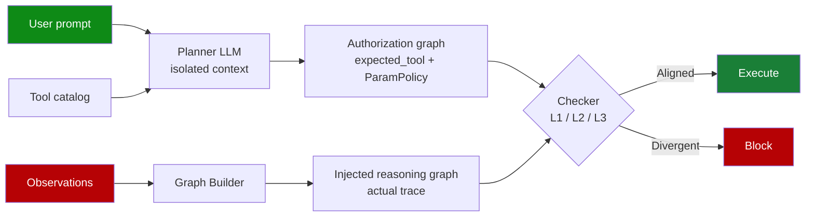

# Dual-Graph Alignment for Indirect Prompt Injection Defense (AuthGraph)

> A dual-graph defense compares a clean authorization graph from user intent against an execution-trace provenance graph; structural divergence flags injection-driven tool calls.

Use this defense when an agent calls tools on attacker-controllable observations and the deployment can absorb a 4.23× token and 1.87× latency overhead for a 1–2% residual attack success rate ([Wang et al., 2026](https://arxiv.org/abs/2605.26497v1)). It does not cover same-observation pollution, multi-agent handoffs, or adaptive attacks on the LLM-judged layers — all covered below.

## How it works

The system builds two graphs per agent run ([Wang et al., 2026](https://arxiv.org/abs/2605.26497)):

- Authorization graph — a Planner LLM (the paper uses GPT-4o-mini) builds it from `{user_prompt, tool_catalog}` only. It emits an `expected_tool` sequence and a `ParamPolicy` per security-critical parameter (`send_*`, `book_*`, `transfer_*`), plus `replan` flags with `replan_allowed_tools` whitelists when intent permits runtime extension.
- Injected reasoning graph — a Graph Builder builds it from the execution trace, attributing each parameter value to its source observation.

A three-layer Checker compares them ([Wang et al., 2026](https://arxiv.org/abs/2605.26497)):

| Layer | Mechanism | What it catches |
|-------|-----------|-----------------|
| L1 Hard block | Programmatic allowlist — calls outside the authorized set `𝒮` are rejected, no LLM in the loop | Out-of-spec tool invocations |
| L2 Tool-name check | LLM judges ambiguous calls as `extra_step_ok`, `skipped_step_ok`, or `suspicious` | Plausible-looking injected calls |
| L3 Parameter source | Per `ParamPolicy`, verify the value comes from the declared `source_tools` observation via string match on the original observation text (not the Graph Builder summary — itself an attack surface), with LLM fallback | Argument-substitution (`EVIL-123` from `search_hotels` into a `search_flights`-only field) |

Ablations show every layer is load-bearing: removing L2 raises ASR from 0.01 to 0.21, L3 to 0.18, L1 to 0.12 ([Wang et al., 2026](https://arxiv.org/abs/2605.26497)).



## Why it works

The authorization graph carries no channel capacity from untrusted input. The Planner LLM sees only the user prompt and tool catalog, never a tool return, document, or inter-agent message — the paper's Property 1, "information-theoretic independence of any injected content" ([Wang et al., 2026](https://arxiv.org/abs/2605.26497v1)). That gives the Checker a contamination-free reference, so divergence points to the only side that sees attacker content. Single-graph defenses like [ARGUS influence auditing](provenance-aware-decision-auditing.md) lack this baseline. They must trace per-span trust through the graph the attacker can perturb ([Weng et al., 2026](https://arxiv.org/abs/2605.03378)).

## Where it sits on the security-utility frontier

On AgentDojo (GPT-4o-mini) ([Wang et al., 2026](https://arxiv.org/abs/2605.26497)):

| Defense | Attack success rate | Utility rate |
|---------|---------------------|--------------|
| Baseline (no defense) | 0.40 | 0.79 |
| AuthGraph | 0.01 | 0.69 |
| [CaMeL](camel-control-data-flow-injection.md) | 0.00 | 0.48 |
| Progent | 0.02 | 0.64 |
| DRIFT | 0.03 | 0.52 |

On AgentDyn (dynamic tasks), AuthGraph holds 0.02 ASR / 0.37 UR while CaMeL collapses to 0.00 UR — strict control/data separation cannot accommodate runtime tool extension ([Wang et al., 2026](https://arxiv.org/abs/2605.26497v1)). Overhead: 4.61 s latency (1.87×) and 47.4 K tokens/task (4.23× the 11.2 K baseline) — cheaper than CaMeL's 9.21×, above Progent's 1.61×.

## When this backfires

The authors list four boundary conditions ([Wang et al., 2026](https://arxiv.org/abs/2605.26497)):

- Same-observation pollution. When the attacker controls the authoritative source — a compromised flight-search backend, a [poisoned RAG corpus](rag-architecture-poisoning-robustness.md), or a [poisoned knowledge graph](oracle-poisoning-knowledge-graph.md) — the `source_tools` check passes: the value really does come from the declared tool. AuthGraph cannot tell a clean tool from a corrupted one, so pair it with carrier authenticity controls.
- Multi-agent scenarios. The design targets single-agent execution. Cross-agent flow is untracked and the Checker cannot see an upstream trace — out of scope per the paper. Propagation needs separate coverage — see [foresight-guided multi-agent jailbreak defense](foresight-guided-multi-agent-jailbreak-defense.md) and [constraint drift](constraint-drift-multi-agent-safety.md).
- Liberal replan whitelists. `replan_allowed_tools` opens a controlled trust boundary. An attacker can compose harmful sequences entirely inside the whitelist — the Checker sees nothing extra, but the attack completes. Keep whitelists narrow.
- Cost-bounded workloads. The 4.23× token and 1.87× latency cost rules out high-throughput or low-cost agents. For fixed-action flows, the [action-selector pattern](action-selector-pattern.md) covers the same risk at near-zero overhead.

Two further caveats: defenses scored on fixed attack suites degrade under adaptive pressure ([Nasr et al., 2025](https://arxiv.org/abs/2510.09023v1)), and L2/L3 are LLM-judged — themselves an adaptive attack surface — so treat the 0.01–0.02 ASR as a ceiling. And Plan-Then-Execute "does not prevent prompt injections contained in the user prompt itself" ([Beurer-Kellner et al., 2025](https://arxiv.org/abs/2506.08837v3)); an attacker-influenced user prompt (relayed instructions, public-channel voice transcription) makes the authorization graph unclean and collapses the design to single-graph auditing.

## Example

The paper's worked example: the user asks the agent to book a flight. The authorization graph holds:

```
expected_tool: [search_flights, book_flight]
ParamPolicy(book_flight.flight_id):
  allowed_source: observation_direct
  source_tools: [search_flights]
```

A prompt injection in a `search_hotels` observation tries to substitute `flight_id = "EVIL-123"`. The Graph Builder attributes `EVIL-123` to `search_hotels`. L3 fires: the policy requires `flight_id` to come from `search_flights`; `search_hotels` is not in `source_tools`; block. The search runs against the original observation text, not the Graph Builder's summary, because the Graph Builder itself is part of the attack surface ([Wang et al., 2026](https://arxiv.org/abs/2605.26497)).

## Key Takeaways

- Two graphs — a clean authorization graph from user intent only and a provenance graph from the actual trace — give the Checker a contamination-free baseline that single-graph provenance audits lack.
- The information-theoretic isolation of the Planner is the load-bearing property; if user prompt itself is attacker-influenced, the guarantee collapses.
- Three layers (hard block, tool-name check, parameter-source check) are all load-bearing in ablations.
- On AgentDojo, 0.01 ASR with 0.69 UR sits between CaMeL (0.00 / 0.48) and Progent (0.02 / 0.64) — a better security-utility Pareto point for dynamic tasks at 4.23× token cost.
- Boundary conditions: same-observation pollution, multi-agent handoffs, liberal replan whitelists, cost-bounded workloads, and adaptive attacks on the LLM-judged layers.

## Related

- [CaMeL: Defeating Prompt Injections by Separating Control and Data Flow](camel-control-data-flow-injection.md) — strict control/data separation with provable ASR=0.00 at higher utility cost; AuthGraph trades a small ASR increase for substantially better utility on dynamic tasks
- [Provenance-Aware Decision Auditing for LLM Agents](provenance-aware-decision-auditing.md) — single-graph influence auditing (ARGUS); covers the same problem space without the isolated-intent reference graph
- [Designing Agents to Resist Prompt Injection](prompt-injection-resistant-agent-design.md) — the broader defense-in-depth catalog this pattern slots into
- [Action-Selector Pattern](action-selector-pattern.md) — near-zero-overhead alternative when the action space can be enumerated up front
- [Human-in-the-Loop Confirmation Gates](human-in-the-loop-confirmation-gates.md) — deterministic backstop for the residual 1–2% ASR
- [Prompt Injection: A First-Class Threat to Agentic Systems](prompt-injection-threat-model.md) — parent threat model
