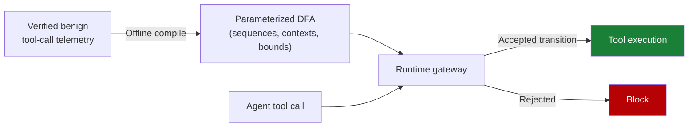

# Behavioral Firewall for Tool-Call Trajectories

> Compile verified benign tool-call telemetry into a parameterized deterministic finite automaton, then enforce permitted sequences and parameter bounds at runtime. Fits structured workflows with stable tool catalogs; an unwhitelisted string parameter remains the residual attack surface.

## Core Concept

A behavioral firewall converts a record of safe tool-call traces into a parameterized deterministic finite automaton (pDFA) that defines permitted tool sequences, sequential contexts, and parameter bounds. Every runtime tool call must traverse a transition the automaton accepts; anything off-path is rejected before reaching the tool ([Dang, 2026](https://arxiv.org/abs/2604.26274)).

The mechanism shifts expensive policy synthesis offline. The runtime gateway performs an O(1) state-transition lookup per call, which is why the approach reaches 2.2 ms per-call latency in the published evaluation — roughly 3.7x faster than [AEGIS](https://arxiv.org/abs/2603.12621), a stateless pre-execution scanner ([Dang, 2026](https://arxiv.org/abs/2604.26274)).

## How It Works

Three structural components define the policy:

- **Permitted tool sequences** — which tool follows which, expressed as automaton transitions
- **Sequential contexts** — the prior states under which a transition is valid
- **Parameter bounds** — numeric ranges or enumerated value sets allowed on a transition

Because the structure is finite, the runtime cost is a state-table lookup. Because expensive analysis happens at compile time, novel attack patterns that violate the structural shape fail before the model's intent is interpreted.

## When It Outperforms Stateless Scanners

Evaluated on Agent Security Bench (ASB) — 10 scenarios, ~400 tools, 27 attack/defense methods across 13 LLM backbones ([Zhang et al., 2024](https://arxiv.org/abs/2410.02644)) — the pDFA firewall reports the following on five scenarios:

| Metric | pDFA firewall | Aegis (stateless) |
|---|---|---|
| Macro attack success rate (5 scenarios) | 5.6% | — |
| Attack success rate (3 structured workflows) | 2.2% | 12.8% |
| ASR on multi-step / context-sequential attacks | 0% | — |
| Per-call latency | 2.2 ms | ~8.1 ms |
| Benign task failure rate | 2.0% | — |

Source: [Dang, 2026](https://arxiv.org/abs/2604.26274). Latency comparison computed from the reported 3.7x speedup.

The 0% ASR on multi-step attacks is the structural reason to prefer this approach over stateless content scanners in narrow, repeatable workflows. Stateless scanners evaluate each call in isolation; multi-step obfuscation distributes harmful intent across calls that each look benign — the same gap [mid-trajectory guardrails](mid-trajectory-guardrail-selection.md) address with a model-based check.

## The Parameter-Whitelist Requirement

Sequence enforcement is necessary but not sufficient. Against 1,000 algorithmically spliced exfiltration payloads, only 1.4% matched valid structural paths — but the 14 surviving paths required end-to-end string parameter guards to fail (0 successes, 95% CI [0%, 23.2%]) ([Dang, 2026](https://arxiv.org/abs/2604.26274)).

Without continuous parameter-bound enforcement, synonym-substitution attacks reach an 18% evasion rate by varying string values within a permitted shape ([Dang, 2026](https://arxiv.org/abs/2604.26274)). Exact-match whitelisting of sensitive string parameters bears the final defensive load — sequences contain the attack surface, but unwhitelisted parameters remain a hole.

## When It Fits

Conditions where compiling benign trajectories into a fixed automaton pays off:

- **Structured workflows** — narrow, repeatable agent loops with a small finite vocabulary of tool-call shapes (the paper's strongest results, 0% ASR on multi-step attacks, are confined to this regime)
- **Stable tool catalogs** — tools and skills change on weeks-not-days cadence, so the pDFA can be recompiled without blocking development
- **Sensitive parameters that admit exact-match whitelists** — file paths, table names, command verbs where enumeration is feasible

## When It Backfires

The pDFA approach is not a drop-in defense for general agents:

- **Open-ended agents** — research, debugging, and general coding agents have trajectory shapes too diverse to compile without rejecting legitimate work; the BTFR will dominate
- **Frequently changing tool catalogs** — projects that add MCP tools or skills daily cannot keep pDFA recompilation in lockstep with development
- **Free-form string parameters** — search queries, URLs, prose arguments that cannot be enumerated leave the synonym-substitution gap the paper itself surfaces
- **Drift in benign telemetry** — automata learned from yesterday's traces reject novel-but-legitimate sequences; a model-based [mid-trajectory guardrail](mid-trajectory-guardrail-selection.md) adapts without recompilation

## Composition with Other Defenses

The pDFA firewall layers cleanly with the rest of the security stack:

- Pair with [tool signing and signature verification](tool-signing-verification.md) so the tools whose calls form transitions are themselves trusted
- Pair with [exact-match command whitelists](permission-gated-commands.md) on string parameters to close the synonym-substitution gap
- Treat as one layer of [defense in depth](defense-in-depth-agent-safety.md), not a standalone control — the residual 5.6% ASR confirms a single layer is insufficient
- Use [mid-trajectory guardrail](mid-trajectory-guardrail-selection.md) selection as the model-based complement when trajectory shapes drift

## Key Takeaways

- A pDFA compiled from benign telemetry enforces permitted tool sequences, contexts, and parameter bounds at O(1) runtime cost ([Dang, 2026](https://arxiv.org/abs/2604.26274))
- Reported 0% ASR on multi-step and context-sequential attacks in structured workflows — the structural reason to prefer it over stateless scanners on narrow loops
- 18% synonym-substitution evasion rate on uncontrolled string parameters; exact-match whitelisting bears the final defensive load
- Fits structured workflows with stable tool catalogs; misfits open-ended agents and free-form parameters
- Compose with tool signing, command whitelists, and a model-based guardrail rather than treating it as a standalone control

## Related

- [Mid-Trajectory Guardrail Selection](mid-trajectory-guardrail-selection.md) — model-based complement when trajectory shapes drift beyond a finite automaton
- [Tool-Invocation Attack Surface](tool-invocation-attack-surface.md) — the argument-generation and return-processing vectors a behavioral firewall constrains
- [MCP Runtime Control Plane](mcp-runtime-control-plane.md) — single policy evaluation point at which a pDFA check can be wired
- [Tool Signing and Signature Verification](tool-signing-verification.md) — ensures the tools whose calls form transitions are themselves trusted
- [Permission-Gated Custom Commands](permission-gated-commands.md) — exact-match whitelists that close the synonym-substitution gap
- [Defense-in-Depth Agent Safety](defense-in-depth-agent-safety.md) — layering principle the pDFA firewall plugs into rather than replaces
- [Single-Layer Prompt Injection Defence](../anti-patterns/single-layer-injection-defence.md) — anti-pattern the residual 5.6% ASR confirms
