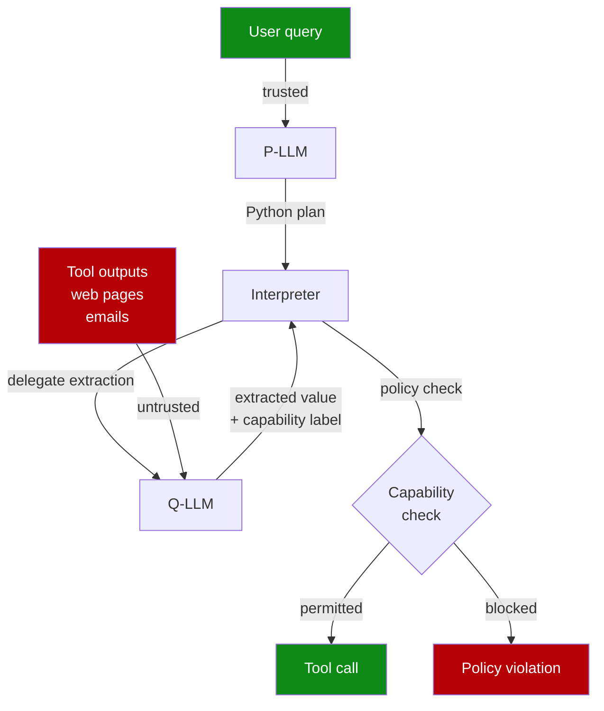

# Control/Data-Flow Separation for Prompt Injection Defense (CaMeL)

> Most prompt injection defenses are probabilistic. CaMeL eliminates whole classes of injection by construction: untrusted data can never alter which tools an agent calls.

Related lesson: [Decide Before You Look](https://learn.agentpatterns.ai/security/decide-before-you-look/) — this concept features in a hands-on lesson with quizzes.

## The architectural insight

Probabilistic defenses (detection classifiers, [adversarial training](close-attack-to-fix-loop.md), instruction hierarchies) reduce injection success rates but cannot eliminate them. CaMeL, proposed by Debenedetti et al. at Google DeepMind, takes a different approach. It enforces the instruction/data boundary at the harness level, so the model's susceptibility to injection no longer matters. [Source: [Debenedetti et al., 2025](https://arxiv.org/abs/2503.18813)]

Prompt injection succeeds because untrusted data (tool outputs, web pages, emails) and trusted control flow (the user's query) enter the same context. CaMeL keeps the two apart.

## How CaMeL works

CaMeL uses four components: [Source: [Debenedetti et al., 2025](https://arxiv.org/abs/2503.18813)]

Privileged LLM (P-LLM) — sees only the trusted user query. It converts the query into a plan in restricted Python and never receives raw tool outputs or untrusted content.

Quarantined LLM (Q-LLM) — the quarantined half of the [Dual LLM pattern](prompt-injection-resistant-agent-design.md). It processes untrusted external data (emails, web pages, documents) and cannot invoke tools directly. The P-LLM delegates extraction tasks to it ("extract the sender's email address"), receives the result, but never sees the raw untrusted content.

Custom Python interpreter — executes the P-LLM's plan and tracks taint. Every value carries capability metadata that records its provenance and permitted uses. The interpreter enforces security policies at tool-call time.

Security policies — capability labels on each value specify what you can do with it. If untrusted data tries to flow into a tool it is not permitted to reach, the Python interpreter blocks it regardless of what the model intends.

```mermaid
graph TD
    U[User query] -->|trusted| P[P-LLM]
    P -->|Python plan| I[Interpreter]
    I -->|delegate extraction| Q[Q-LLM]
    T[Tool outputs<br/>web pages<br/>emails] -->|untrusted| Q
    Q -->|extracted value<br/>+ capability label| I
    I -->|policy check| TC{Capability<br/>check}
    TC -->|permitted| A[Tool call]
    TC -->|blocked| B[Policy violation]

    style T fill:#b60205,color:#fff
    style U fill:#0e8a16,color:#fff
    style B fill:#b60205,color:#fff
    style A fill:#0e8a16,color:#fff
```

The P-LLM is never exposed to raw untrusted tokens. The interpreter enforces that data cannot alter control flow — which tools are called, in what order, with what parameters — regardless of injected content.

## Security guarantee

CaMeL's security is architectural rather than behavioral. Because:

- the execution plan is derived solely from the trusted user query (via the P-LLM), and
- capability labels block untrusted data from reaching prohibited tool parameters,

a successful injection in a tool output cannot redirect the agent to call unauthorized tools or exfiltrate data over unauthorized channels. The guarantee holds even if the underlying models are susceptible to injection. [Source: [Debenedetti et al., 2025](https://arxiv.org/abs/2503.18813)]

## Trade-offs

Task completion: CaMeL solves 77% of AgentDojo tasks with provable security, versus 84% for an undefended system — a 7 percentage point cost for architectural security guarantees. [Source: [Debenedetti et al., 2025](https://arxiv.org/abs/2503.18813)]

Latency: The dual-LLM design roughly doubles model invocations. When the Q-LLM processes complex artifacts, latency can exceed 10 seconds — too slow for interactive applications. [Source: [Tallam & Miller, 2025](https://arxiv.org/abs/2505.22852)]

Residual risk: CaMeL does not protect against text-to-text attacks. An injected email can instruct the Q-LLM to produce a misleading summary, which the P-LLM then acts on. The structural guarantee covers tool invocation; it does not cover the semantic content of Q-LLM outputs. [Source: [Debenedetti et al., 2025](https://arxiv.org/abs/2503.18813)]

Side channels: The authors explicitly exclude side-channel attacks from the guarantee. An adversary can still leak a secret by observing data-dependent behavior — for example, a loop whose iteration count depends on a private value, or execution that halts only when a condition on the secret holds. Capability labels constrain explicit data flow, not these implicit channels. [Source: [Debenedetti et al., 2025](https://arxiv.org/abs/2503.18813)]

Policy maintenance: You must author and maintain the security policies. As tool sets evolve, the policies need updates. [Source: [Tallam & Miller, 2025](https://arxiv.org/abs/2505.22852)]

## Relation to the Dual LLM pattern

CaMeL is a formally implemented instance of the [Dual LLM pattern](prompt-injection-resistant-agent-design.md). The conceptual pattern separates a privileged LLM from a quarantined LLM; CaMeL adds:

- a Python interpreter as the enforcement engine,
- capability labels for taint tracking,
- formal security policies checked at tool-call time.

The distinction matters: the conceptual pattern relies on careful system design and prompt discipline; CaMeL's interpreter enforces the boundary mechanically.

## When to use CaMeL

Use CaMeL-style control/data separation when:

- agents process high volumes of untrusted external content (email, web, documents)
- data exfiltration or unauthorized tool invocation would cause significant harm
- the task-completion cost (77% vs 84%) is acceptable given the security context
- latency requirements allow for dual-LLM overhead

For lower-risk contexts, the [defense-in-depth](defense-in-depth-agent-safety.md) layered approach (schema filtering, confirmation gates, sandbox isolation) achieves strong probabilistic reduction with lower operational overhead.

## Key Takeaways

- CaMeL separates control flow (trusted user query → P-LLM) from data flow (untrusted tool outputs → Q-LLM), making injection-driven tool misuse structurally impossible.
- A capability-labeled Python interpreter enforces security policies at tool-call time, independent of model behavior.
- Achieves 77% task completion with provable security vs 84% undefended — a measurable utility cost for architectural guarantees.
- Does not protect against text-to-text attacks: the Q-LLM can still be misled into producing inaccurate summaries.
- Complements, rather than replaces, defense-in-depth; blast-radius containment and confirmation gates address residual risks CaMeL cannot eliminate.

## Related

- [Designing Agents to Resist Prompt Injection](prompt-injection-resistant-agent-design.md)
- [Defense-in-Depth Agent Safety](defense-in-depth-agent-safety.md)
- [Prompt Injection: A First-Class Threat to Agentic Systems](prompt-injection-threat-model.md)
- [Tool-Invocation Attack Surface](tool-invocation-attack-surface.md) — instruction-data separation is the structural defense against the two-channel injection chain described there
- [Action-Selector Pattern: LLM as Intent Decoder with Deterministic Execution](action-selector-pattern.md)
- [Blast Radius Containment: Least Privilege for AI Agents](blast-radius-containment.md)
- [Lethal Trifecta Threat Model](lethal-trifecta-threat-model.md)
- [Adaptive Evaluation of Out-of-Band Prompt-Injection Defenses](adaptive-evaluation-out-of-band-defenses.md) — CaMeL is one of the five out-of-band defenses; this evaluation page explains why even structurally sound defenses need defense-aware adaptive testing.
- [Single-Layer Prompt Injection Defence](../patterns/anti-patterns/single-layer-injection-defence.md)
