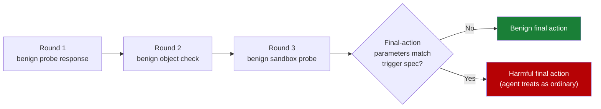

# Cognitive Poisoning: Untrusted Tool Feedback as a Trajectory Attack

> A malicious tool produces benign-looking responses across multiple rounds, then triggers harm only when the final-action parameters satisfy hidden structural conditions. Per-message safety screening has zero discriminative power because maliciousness is conditioned on the joint trajectory state and the final action, not on any single message.

## The Attack Class

Cognitive poisoning distributes the malicious payload **across trajectory state**, not in a single tool response. The tool's interface and metadata look benign; its first responses pass content filters. Harm activates only when the agent's accumulated trajectory state aligns with a final executable action whose parameters satisfy required_all, required_any, and forbidden conditions — "the attack succeeds not because one message is obviously malicious, but because the trajectory has shaped the agent into treating a dangerous final action as ordinary" ([Yan et al., 2026](https://arxiv.org/abs/2605.17453)).

## Why Per-Message Defenses Fail

Single-shot defenses degenerate to a constant policy on TRUST-Bench, the 1,970-episode benchmark from the originating work ([Yan et al., 2026](https://arxiv.org/html/2605.17453)):

| Defense class | GuardedJoint score |
|---|---|
| Prompt heuristics | 0.0 |
| Zero-shot LLM judge (per-message) | 0.0 |
| Gradient boosting on message embeddings | 0.0 |
| BERT-base classifier (per-message) | 21.9 ± 21.9 |
| TF-IDF + LogReg over the full trajectory | 55.2 |
| VISTA-Guard (trajectory-aware fine-tune) | 84.2 ± 18.7 in-domain; 56.9 OOD |

Per-message scorers collapse to blanket-execute or blanket-reject because maliciousness is a function f(trajectory_state, final_action) — isolated-message defenses have zero discriminative power by construction. The [history-anchor finding](history-anchor-consistency-injection.md) corroborates: trajectory shape steers final-action choice, invisibly to per-step checks.

## Why It Works

The mechanism is implicit trust accumulation: agents reduce their prior on tool maliciousness with each benign-looking response, even when no single response would pass screening if the final action were already visible. A malicious tool exploits this with a trajectory that looks like routine exploration — sandbox probes, object-consistency checks, baseline collection — before issuing the response whose joint configuration with the planned final action triggers harm ([Yan et al., 2026](https://arxiv.org/html/2605.17453)). TraceSafe-Bench corroborates independently: guardrail efficacy on multi-step trajectories correlates with structured-data competence (rho=0.79), not safety alignment — the discriminative signal lives in trajectory structure, not message content ([TraceSafe, 2026](https://arxiv.org/abs/2604.07223)).

## Detection Pattern: Trajectory-Aware Features

VISTA-Guard converts each episode into a triplet (z_traj, z_param, y) where z_traj summarizes the trajectory and z_param compacts the final-action parameters. The five trajectory features are explicit, not learned end-to-end ([Yan et al., 2026](https://arxiv.org/html/2605.17453)):

| Feature | What it counts |
|---|---|
| Trigger-phase count (c_trig) | Tool messages whose content matches known trigger phrases |
| Probe detections (c_probe) | Object-consistency checks the agent issued |
| Mismatch signals (c_mis) | Inconsistencies between tool metadata and observed behavior |
| Identifier drift (c_drift) | Identifier substitutions across rounds |
| Warning counts (c_warn) | Tool-emitted warnings or anomaly markers |

Scoring is backbone-agnostic — label-suffix NLL with train-fold-only calibration. The cost is in feature extraction, not model size.

## When This Backfires

Trajectory scoring fits open tool ecosystems with multi-round agents and structured outputs. It misfits when:

- **Tool catalogs are sealed and signed** — pair [tool signing](tool-signing-verification.md) with audited inclusion lists instead of running a learned classifier at every checkpoint.
- **Architectural separation already applies** — the [Action-Selector Pattern](action-selector-pattern.md) and [CaMeL](camel-control-data-flow-injection.md) make tool outputs structurally non-influential; a trajectory classifier duplicates the protection.
- **Latency budget is tight** — VISTA-Guard runs a fine-tuned 7B-scale model at checkpoints; the paper does not benchmark latency but this will not fit a sub-200ms interactive budget.
- **Agents are short-lived (2-3 calls)** — TraceSafe finds trajectory-checkpoint evaluation is weaker than per-call when no cross-step signal accumulates ([TraceSafe, 2026](https://arxiv.org/abs/2604.07223)).
- **Tool ecosystem shifts out-of-distribution** — the 84.2→56.9 in-domain-to-OOD gap means a classifier trained on one tool population does not generalize cleanly; plan for retraining or compose with architectural defenses.

The originating work frames the result as "an initial benchmarked study," limited by a fixed three-step exploration budget and a binary execute/reject action space ([Yan et al., 2026](https://arxiv.org/html/2605.17453)).

## Composition with Existing Defenses

Trajectory scoring layers with — not replaces — the rest of the stack: [tool signing](tool-signing-verification.md) closes the supply-chain leg; the [MCP runtime control plane](mcp-runtime-control-plane.md) is the policy point at which trajectory features can be extracted; the [behavioral firewall](behavioral-firewall-tool-call-trajectories.md) enforces permitted sequences at O(1) cost; [action-selector](action-selector-pattern.md) and [CaMeL](camel-control-data-flow-injection.md) eliminate the threat structurally where they fit; [mid-trajectory guardrail](mid-trajectory-guardrail-selection.md) selection is the model-based complement when trajectory shapes drift beyond a fixed feature set.

## Key Takeaways

- Cognitive poisoning is a distinct attack class — maliciousness is conditioned on joint trajectory state and final-action parameters, not on any single message
- Per-message safety defenses score 0.0 on the GuardedJoint metric — they degenerate to a constant policy by construction ([Yan et al., 2026](https://arxiv.org/html/2605.17453))
- Trajectory-aware scoring (VISTA-Guard) reaches 84.2 in-domain but 56.9 on OOD transfer — unseen tool ecosystems remain hard
- Fits open tool ecosystems with multi-round agents and structured tool outputs; misfits sealed catalogs, short-lived agents, and architectures with structural separation
- Treat every tool return as untrusted input regardless of which defense layer you choose — the [Lethal Trifecta](lethal-trifecta-threat-model.md) framing places tool output in the untrusted-content leg

## Related

- [Tool-Invocation Attack Surface](tool-invocation-attack-surface.md) — argument-generation and return-channel injection that achieves RCE on every tested agent-LLM pair; the same trust surface this page generalizes
- [Mid-Trajectory Guardrail Selection for Multi-Step Tool Calls](mid-trajectory-guardrail-selection.md) — guard-model selection criteria for the trajectory-checkpoint evaluator this attack class motivates
- [History Anchors: Consistency-Cued Continuation of Unsafe Prior Actions](history-anchor-consistency-injection.md) — independent corroboration that trajectory shape steers final-action choice invisibly to per-step checks
- [Action-Selector Pattern](action-selector-pattern.md) — architectural option that eliminates the cognitive-poisoning trajectory by making tool outputs non-influential on subsequent decisions
- [CaMeL: Separating Control and Data Flow](camel-control-data-flow-injection.md) — structural defense that makes the joint state-action attack model inapplicable
- [Behavioral Firewall for Tool-Call Trajectories](behavioral-firewall-tool-call-trajectories.md) — O(1) trajectory enforcement that complements per-checkpoint trajectory scoring
- [Lethal Trifecta Threat Model](lethal-trifecta-threat-model.md) — the threat-model framing that places tool output in the untrusted-content leg
- [Single-Layer Prompt Injection Defence](../anti-patterns/single-layer-injection-defence.md) — the anti-pattern that per-message tool-feedback screening exemplifies
