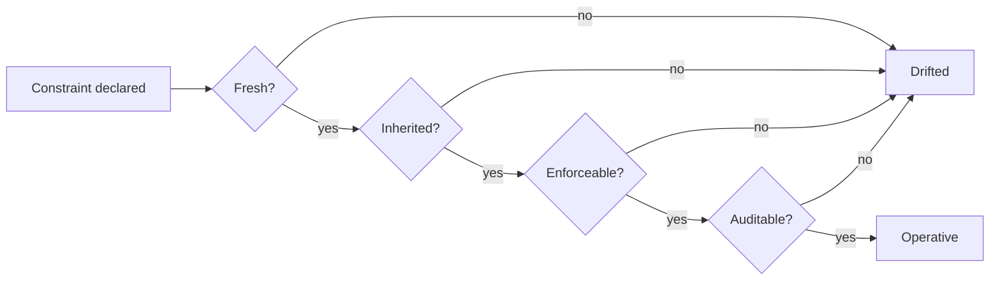

# Constraint Drift: Why Safety Must Be Maintained, Not Asserted

> Prompt-encoded safety constraints drift across memory, delegation, communication, tool use, audit, and optimization; treat them as runtime state that stays fresh, inherited, enforceable, and auditable.

## The Drift Problem

A multi-agent system can produce a compliant final answer while leaking private information through an internal message, delegating authority beyond scope, calling a tool with sensitive context, or losing the evidence needed to reconstruct why an action was allowed ([Li et al., 2026](https://arxiv.org/abs/2605.10481)). The output passes review; the trajectory does not.

Constraints encoded in the same medium as every other prompt token — natural language — face the same degradation pressures: positional decay, paraphrasing during inter-agent forwarding, summarisation during compaction, reward pressure during optimisation. The signal weakens at the rate of ordinary context, but its semantic load is much higher: one weakened clause changes which actions are permitted ([Anthropic: effective context engineering](https://www.anthropic.com/engineering/effective-context-engineering-for-ai-agents)).

## Six Drift Surfaces

[Li et al., 2026](https://arxiv.org/abs/2605.10481) enumerate six runtime dimensions along which constraints drift:

| Surface | Drift mechanism | Concrete failure |
|---|---|---|
| **Memory** | Long history positional decay; compaction summarisation | Initial spending limit gets buried as conversation grows; agent quotes a higher cap later |
| **Delegation** | Subordinate agent receives task but not the constraint scope | Orchestrator enforces a deny-list; worker spawned without it calls the denied tool |
| **Communication** | Constraints encoded in prose get paraphrased across handoffs | Reviewer's "do not approve PRs touching `/auth`" becomes "be careful with auth PRs" downstream |
| **Tool use** | Tool gateway operates outside the agent's constraint model | Code-exec tool runs the script the agent generated under a constraint it never saw |
| **Audit** | Log lacks the constraint state at decision time | Post-hoc review cannot reconstruct why an action was permitted |
| **Optimization** | Reward signal pulls behavior toward task completion at the cost of constraint adherence | Fine-tuned model trades a small safety margin for measurable utility gains |

This taxonomy maps cleanly onto the four-mode [audit-record divergence invariant](action-audit-divergence-taxonomy.md) and its [controls-mapping view](action-audit-divergence-taxonomy.md) ([Metere, 2026](https://arxiv.org/abs/2605.01740)): F1 gate-bypass surfaces as tool-use and delegation drift, F2 audit-forgery as audit drift, F3 partial failure as memory drift, F4 wrong-target as delegation drift in inheritance chains.

## Four Invariant Properties

A constraint that survives the trajectory satisfies four properties simultaneously ([Li et al., 2026 §3](https://arxiv.org/abs/2605.10481)):

- **Fresh** — Re-validated at each decision point against the current state, not read once at the start.
- **Inherited** — Propagates through delegation and sub-agent spawning. The child cannot exceed the parent's scope.
- **Enforceable** — Implemented in a deterministic runtime channel (gateway, hook, sandbox), not by model adherence to prose.
- **Auditable** — The constraint state at the moment of each action is recoverable from the log.

A constraint that fails any one of these has effectively drifted, even if the natural-language statement is still present in context. The four properties are necessary together, not in isolation.

## When Constraint State Governance Is Worth It

The four-property invariant scales overhead with system complexity. It is warranted under three composing conditions:

1. **Deep delegation chains.** Orchestrator-worker fan-out where subordinate agents make consequential decisions ([agent handoff protocols](../multi-agent/agent-handoff-protocols.md)).
2. **Persistent memory across sessions.** State that carries between runs creates a [trojan-hippo](trojan-hippo-memory-attack.md) drift surface.
3. **Wide tool surface with consequential actions.** Any tool that writes, sends, pays, or shares is a drift target.

Below these thresholds, well-placed component checks suffice. A short-horizon single-agent linter with one tool surface and stateless invocation has no drift surface — its constraints live in the tool gateway, and adding a constraint state object duplicates enforcement without preventing a failure mode. The [Lifecycle-Integrated Security Architecture](lifecycle-security-architecture.md) provides the complementary layered-defense view ([Lin et al., 2026](https://arxiv.org/abs/2604.13630)).

## Mapping to Existing Controls

Each invariant property maps to controls already established on the site:

| Property | Realised by |
|---|---|
| Fresh | [Fail-closed remote settings enforcement](fail-closed-remote-settings-enforcement.md), [provenance-aware decision auditing](provenance-aware-decision-auditing.md) |
| Inherited | [Task scope as security boundary](task-scope-security-boundary.md), [scoped credentials via proxy](scoped-credentials-proxy.md), [permission-gated commands](permission-gated-commands.md) |
| Enforceable | [Action-selector pattern](action-selector-pattern.md), [CaMeL control/data flow](camel-control-data-flow-injection.md), [MCP runtime control plane](mcp-runtime-control-plane.md) |
| Auditable | [Cryptographic governance audit trail](cryptographic-governance-audit-trail.md), [audit-record divergence invariant](action-audit-divergence-taxonomy.md) |

The contribution of the constraint-drift framing is not new mechanisms but a coverage check: a system that lacks any one row has a drift surface a determined attacker — or a long-running trajectory — will reach.

## Key Takeaways

- Constraints encoded only in natural-language prompts drift at the rate of ordinary context decay; the four-property invariant moves them out of the lossy channel into deterministic runtime state.
- Six surfaces — memory, delegation, communication, tool use, audit, optimization — exhaust the trajectory dimensions along which drift can occur ([Li et al., 2026](https://arxiv.org/abs/2605.10481)).
- The four properties (fresh, inherited, enforceable, auditable) are necessary together; one failing leaves an open drift surface even if the prose is intact.
- Apply the framework when delegation depth, memory persistence, and tool surface compose. Below that threshold, a typed tool gateway plus an audit log is sufficient.

## Related

- [Audit-Record Divergence as an Agent Runtime Invariant](action-audit-divergence-taxonomy.md)
- [Lifecycle-Integrated Security Architecture for Agent Harnesses](lifecycle-security-architecture.md)
- [Lethal Trifecta Threat Model](lethal-trifecta-threat-model.md)
- [Agent Handoff Protocols](../multi-agent/agent-handoff-protocols.md)
- [Defense-in-Depth Agent Safety](defense-in-depth-agent-safety.md)
