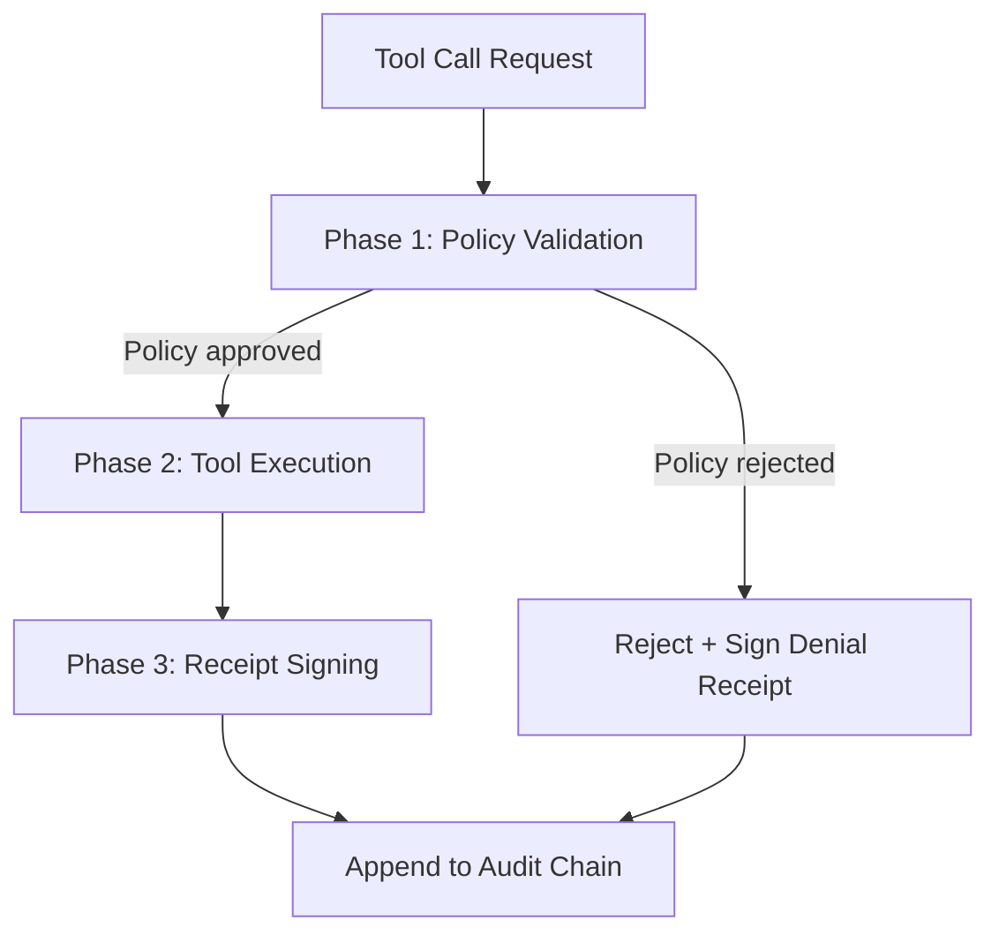

# Cryptographic Governance Audit Trail

> Wrap agent tool calls with middleware that validates policy before execution and signs each action receipt with a post-quantum signature, forming a tamper-evident append-only chain.

## The Compliance Gap

Mutable logs carry no compliance weight. An agent that logs every tool call to a writable file gives no proof that the log was not altered after the fact. Regulated environments — finance, healthcare, EU AI Act Article 12 — require evidence that agents operated within defined bounds and that the record of that operation cannot be modified retroactively.

A cryptographic audit trail closes this gap: each action produces a signed receipt, and receipts are hash-chained so that any modification or omission is detectable by verifying the chain.

## Architecture: Three-Phase Middleware

Middleware wraps the agent's tool-calling interface. Every tool invocation passes through three sequential phases ([nibzard catalog](https://github.com/nibzard/awesome-agentic-patterns/blob/main/patterns/cryptographic-governance-audit-trail.md)):



| Phase | Action |
|---|---|
| **Policy validation** | Check allowed tools, rate limits, data access rules before executing |
| **Tool execution** | Run the tool normally — no change to tool behavior |
| **Receipt signing** | Sign the action record (tool name, parameters, result hash, timestamp, policy outcome) with ML-DSA-65 and append to the chain |

The chain is tamper-evident by construction: each receipt includes a hash of the previous receipt. Modifying or omitting any entry breaks the chain at that point — verification fails automatically ([asqav-sdk](https://github.com/jagmarques/asqav-sdk)).

## Post-Quantum Signatures: ML-DSA

Standard ECDSA or RSA signatures provide adequate security today but are vulnerable to quantum computers. For long-term regulatory validity — where audit records must remain verifiable for years or decades — the signature algorithm must remain secure against quantum attack.

ML-DSA (FIPS 204) is a module-lattice-based digital signature standard finalized by NIST. It is quantum-resistant and is the algorithm used in the reference implementation for this pattern ([asqav-sdk](https://github.com/jagmarques/asqav-sdk)). The ML-DSA-65 parameter set provides security equivalent to AES-192.

Each signed receipt contains ([asqav-sdk](https://github.com/jagmarques/asqav-sdk)):

```json
{
  "signature_id": "sig_a1b2c3",
  "agent_id": "agt_x7y8z9",
  "action": "api:call",
  "algorithm": "ML-DSA-65",
  "timestamp": "2026-04-06T18:30:00Z",
  "chain_hash": "b94d27b9934d3e08...",
  "verify_url": "https://asqav.com/verify/sig_a1b2c3"
}
```

## IETF SCITT Alignment

The append-only signed receipt architecture maps onto [IETF SCITT (RFC 9334)](https://github.com/nibzard/awesome-agentic-patterns/blob/main/patterns/cryptographic-governance-audit-trail.md) — Supply Chain Integrity, Transparency, and Trust. SCITT defines how statements (agent actions) are registered with a Transparency Service, which issues receipts as cryptographic proof of registration. Alignment with SCITT enables interoperability with compliance tooling built on the standard.

## Enforcement Tiers

Three deployment configurations trade enforcement strength for integration complexity ([asqav-sdk](https://github.com/jagmarques/asqav-sdk)):

| Tier | Mechanism | Guarantee |
|---|---|---|
| **Strong** | Non-bypassable MCP proxy — signs before and after each tool call | Tool cannot execute without a signed bilateral receipt |
| **Bounded** | Pre-execution gate (`gate_action`) + post-execution close (`complete_action`) | Approval is cryptographically linked to outcome |
| **Detectable** | Sign and chain each action post-hoc | Tampering or omission is detectable on verification |

Strong enforcement is the highest assurance tier but requires routing all tool calls through a proxy. Detectable enforcement adds minimal latency and suits workflows where post-hoc verification is acceptable.

## Implementation: Decorator Pattern

The reference implementation ([asqav-sdk](https://github.com/jagmarques/asqav-sdk)) wraps tool functions with a decorator:

```python
import asqav

@asqav.sign
def call_database(query: str) -> dict:
    # tool implementation unchanged
    return db.execute(query)
```

For multi-step workflows, sessions group related actions into a single verifiable sequence:

```python
with asqav.session() as s:
    s.sign("step:fetch", {"source": "customer_api"})
    s.sign("step:transform", {"records": 150})
    s.sign("step:write", {"destination": "report_table"})
```

## Trade-offs

| Factor | Impact |
|---|---|
| **Per-call latency** | Each tool call incurs signing overhead; profiling required for latency-sensitive agents |
| **Key management** | Requires infrastructure for key generation, rotation, storage, and distribution |
| **Storage growth** | Audit chain grows linearly with agent activity |
| **Regulatory credibility** | Tamper-evident receipts carry evidentiary weight that mutable logs do not |
| **Quantum durability** | ML-DSA receipts remain verifiable against quantum computers; ECDSA receipts do not |

This pattern targets compliance-first use cases where the regulatory credibility benefit outweighs the infrastructure cost. It is not a security hardening mechanism — it does not prevent a malicious agent from acting; it produces unforgeable evidence of what the agent did. Pair with [Defense-in-Depth Agent Safety](defense-in-depth-agent-safety.md) for preventive controls.

## Regulatory Targets

- **EU AI Act Article 12** — requires record-keeping for high-risk AI systems; signed receipts satisfy this obligation
- **SOC 2 audit trails** — demonstrable, tamper-evident action logs support Type II audits
- **Litigation defense** — a verifiable chain of agent actions with policy-validation outcomes provides evidentiary proof of compliant operation

Missing audit trails are identified as a top vulnerability class in agentic systems [unverified — OWASP Agentic Top 10; source blocked in this environment].

## Key Takeaways

- Mutable logs are insufficient for regulated-industry compliance — tamper evidence requires cryptographic signing
- Three-phase middleware (validate → execute → sign) leaves tool behavior unchanged while producing signed receipts
- Hash-chaining receipts makes modification or omission detectable without a trusted third party holding the full log
- ML-DSA-65 (FIPS 204) provides quantum-resistant signatures for long-term regulatory validity
- IETF SCITT alignment enables interoperability with compliance tooling built on the RFC 9334 standard
- Three enforcement tiers let practitioners choose between maximum assurance and minimum integration friction

## Unverified

- OWASP Agentic Top 10 classifies missing audit trails as a top agentic vulnerability — referenced in the nibzard catalog but the OWASP URL was inaccessible for direct verification

## Related

- [Defense-in-Depth Agent Safety](defense-in-depth-agent-safety.md)
- [Tool Signing and Signature Verification](tool-signing-verification.md)
- [Human-in-the-Loop Confirmation Gates](human-in-the-loop-confirmation-gates.md)
- [Enterprise Agent Hardening](enterprise-agent-hardening.md)
- [Blast Radius Containment](blast-radius-containment.md)
- [Permission-Gated Commands](permission-gated-commands.md)
- [Secrets Management for Agents](secrets-management-for-agents.md)
- [Security Constitution for AI Code Generation](security-constitution-ai-code-gen.md)
- [Lethal Trifecta Threat Model](lethal-trifecta-threat-model.md)
