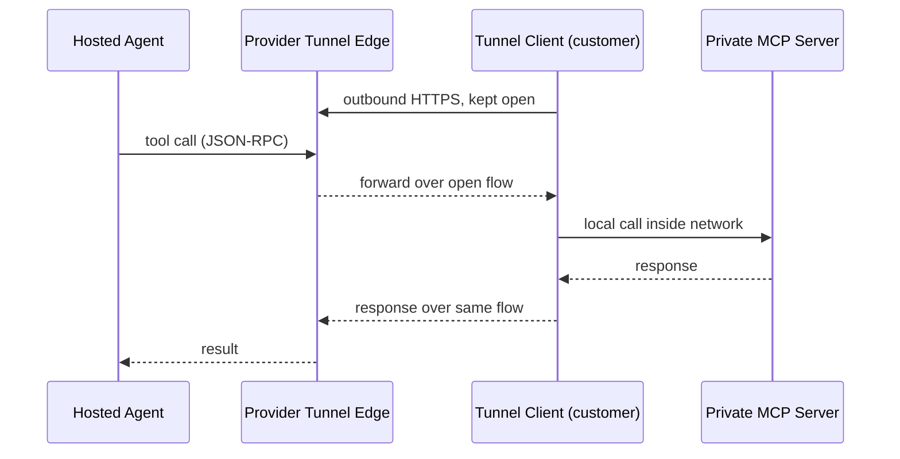

# Customer-Hosted MCP Tunnel: Outbound-Only Connectivity to Private MCP Servers

> Reach a hosted agent's private MCP servers through a customer-run tunnel client that opens outbound HTTPS to the provider: no inbound ports or public exposure.

A customer-hosted MCP tunnel lets a hosted agent reach MCP servers inside a private network with no public listener. A tunnel client inside the customer network holds an outbound HTTPS connection to the provider's tunnel edge, and the provider routes MCP JSON-RPC back through that single open flow. OpenAI's *Secure MCP Tunnel* and Anthropic's *MCP tunnels* both shipped this primitive in May 2026, wired the same way ([OpenAI guide](https://developers.openai.com/api/docs/guides/secure-mcp-tunnels), [Anthropic MCP tunnels overview](https://platform.claude.com/docs/en/agents-and-tools/mcp-tunnels/overview)).

## When This Pattern Fits

The shape is right only when **all three** conditions hold:

- The agent runs on hosted infrastructure you do not control (ChatGPT, Codex, Claude Managed Agents, Messages API).
- The MCP servers it must reach live inside a private network — on-prem databases, internal APIs, ticketing systems, regulated document stores.
- The network posture forbids inbound public exposure of those servers.

When the agent can run inside the network — Anthropic's self-hosted sandboxes, Codex on a self-hosted runner — keeping agent and tools on one tenancy boundary is simpler than tunnelling a remote agent in. No hosted agent, no tunnel ([Anthropic blog](https://claude.com/blog/claude-managed-agents-updates)).

## How It Works

The deployment is a small stack running on infrastructure that can reach the MCP servers:

- **Tunnel client.** OpenAI ships `tunnel-client`; Anthropic ships `cloudflared` paired with a supplied proxy. The client establishes outbound HTTPS to the provider's tunnel edge and keeps it open. OpenAI's tunnel-client "long-polls for queued work, forwards each JSON-RPC request to the private MCP server, and posts the response back through the tunnel" ([OpenAI guide](https://developers.openai.com/api/docs/guides/secure-mcp-tunnels)).
- **Customer-side proxy (Anthropic).** Terminates inner TLS using a customer-held certificate, validates that the upstream IP falls within a configured CIDR (the proxy's "primary SSRF defense"), and routes the request to the correct MCP server by hostname ([Anthropic MCP tunnels overview](https://platform.claude.com/docs/en/agents-and-tools/mcp-tunnels/overview), [security guide](https://platform.claude.com/docs/en/agents-and-tools/mcp-tunnels/security)).



## Why It Works

Outbound HTTPS on 443 is the default-allow direction on essentially every enterprise firewall. The tunnel client opens a long-lived outbound flow over that allowed direction and multiplexes the provider's MCP requests across it: to the firewall it is an ordinary outbound session, and the only client the MCP server ever sees is the local tunnel client. The same primitive underpins Cloudflare Tunnel and ngrok; the MCP variant constrains the multiplexed protocol to JSON-RPC and pins three independent trust anchors — outer mTLS between provider and transport network with IP validation, inner TLS from the provider backend to the customer proxy (the transport network "cannot read request or response payloads" because only the customer holds the inner certificate), and OAuth on each MCP server ([Anthropic MCP tunnels overview](https://platform.claude.com/docs/en/agents-and-tools/mcp-tunnels/overview)).

## Distinct from Adjacent Patterns

The tunnel solves connectivity. It does not solve authorization, identity, or per-call policy:

- **Not a policy gateway.** A [runtime control plane](mcp-runtime-control-plane.md) decides whether the agent is allowed to make a call — identity, tool name, arguments. The tunnel decides how the call reaches the server. Both layers compose; neither replaces the other. Anthropic states the seam directly: the tunnel "carries encrypted traffic to your MCP server but does not authenticate to it" ([Anthropic MCP tunnels overview](https://platform.claude.com/docs/en/agents-and-tools/mcp-tunnels/overview)).
- **Not network egress policy.** [Domain allow/deny](agent-network-egress-policy.md) governs which destinations agent tools can reach from inside the agent runtime; the tunnel governs how a single specific destination (the private MCP fleet) is reachable from a hosted agent at all.
- **Not a sandbox.** The tunnel does not restrict what the MCP server process can touch on its host. Pair with [harness-owned sandbox rules](sandbox-rules-harness-tools.md) on the MCP-server side.

## When This Backfires

The tunnel creates new high-value principals and a long-lived cross-cloud flow. Conditions under which it adds risk or cost without value:

1. **The tunnel-client host has broader privileges than the tools it exposes.** A compromised tunnel client running as a high-permission service account gives the provider effective write access to anything that account can reach. The agent's blast radius equals the tunnel-client's network reach, not the MCP server's interface — apply [blast radius containment](blast-radius-containment.md) to the tunnel-client principal itself.
2. **OAuth on the MCP server is omitted because "the tunnel is authenticated."** The tunnel does not authenticate to the MCP server ([Anthropic MCP tunnels overview](https://platform.claude.com/docs/en/agents-and-tools/mcp-tunnels/overview)). Skipping OAuth on the upstream collapses defence-in-depth; Anthropic's hardening guide lists "require OAuth on every MCP server" as the first best practice ([MCP tunnels security](https://platform.claude.com/docs/en/agents-and-tools/mcp-tunnels/security)).
3. **The proxy's `upstream.allowed_ips` is set wide.** Anthropic names this the proxy's "primary SSRF defense" and recommends "the smallest CIDR ranges that cover your MCP servers" ([MCP tunnels security](https://platform.claude.com/docs/en/agents-and-tools/mcp-tunnels/security)). A `/16` or `0.0.0.0/0` lets a compromised provider-side request reach arbitrary internal hosts via the proxy.
4. **Compound-credential compromise reads payloads.** Anthropic documents the threat explicitly: "If an attacker obtains your tunnel token **and** one of your TLS private keys, they could impersonate your proxy and read MCP request payloads" ([MCP tunnels overview](https://platform.claude.com/docs/en/agents-and-tools/mcp-tunnels/overview)). Store the two secrets in independent rotation domains.
5. **Third-party transport is a compliance blocker.** Anthropic's tunnel transports via Cloudflare as a named subprocessor ([MCP tunnels overview](https://platform.claude.com/docs/en/agents-and-tools/mcp-tunnels/overview)); OpenAI's tunnel is OpenAI-hosted. Some regulators require per-tenant subprocessor approval or forbid third-party transit for in-scope data — a tunnel that fits one jurisdiction can fail another.
6. **Beta status with no continuity commitment.** Anthropic ships MCP tunnels as research preview "without any uptime, support, or continuity commitment" and depending on "a third-party network provider (Cloudflare) that makes no availability commitment for the underlying transport" ([MCP tunnels overview](https://platform.claude.com/docs/en/agents-and-tools/mcp-tunnels/overview)). Production workloads with downtime cost cannot rely on a research-preview path.

If the agent can be moved inside the network, the tunnel is the wrong tool — the [Lethal Trifecta](lethal-trifecta-threat-model.md) tightens because the cross-cloud egress leg disappears.

## Example

A regulated team needs Claude Managed Agents to query an internal documentation MCP server that cannot be exposed publicly. The deployment stack is Docker Compose on a host inside the network:

```yaml
# docker-compose.yaml — Anthropic MCP tunnel
services:
  cloudflared:
    image: cloudflare/cloudflared:pinned-by-sha256-digest
    command: tunnel run --token ${TUNNEL_TOKEN}
    # outbound only to 198.41.192.0/19 :7844
    restart: unless-stopped

  proxy:
    image: anthropic/mcp-tunnel-proxy:pinned-by-sha256-digest
    volumes:
      - ./server.crt:/etc/proxy/server.crt:ro
      - ./server.key:/etc/proxy/server.key:ro
    environment:
      UPSTREAM_ALLOWED_IPS: "10.20.30.0/28"   # primary SSRF defense
      UPSTREAM_ROUTES: "docs=http://docs-mcp.internal:8080"
    restart: unless-stopped
```

Anthropic's hardening guidance applies to this stack: the `UPSTREAM_ALLOWED_IPS` CIDR is the narrowest range covering the upstream MCP server, each MCP server enforces its own OAuth, the tunnel token and TLS private key are stored in separate secret stores, and the `cloudflared` and proxy images are pinned by SHA-256 digest with new releases tracked ([MCP tunnels security](https://platform.claude.com/docs/en/agents-and-tools/mcp-tunnels/security)). The MCP server's address — `docs-mcp.internal:8080` — remains private and is only ever resolved inside the customer environment ([Anthropic MCP tunnels overview](https://platform.claude.com/docs/en/agents-and-tools/mcp-tunnels/overview)). The Messages API call from Claude passes the public-side hostname (e.g., `docs.your-tunnel-domain`) in `mcp_servers`, and Anthropic's infrastructure routes through to the proxy ([Anthropic MCP tunnels overview](https://platform.claude.com/docs/en/agents-and-tools/mcp-tunnels/overview)).

## Key Takeaways

- The customer-hosted MCP tunnel is a connectivity pattern: the tunnel client opens outbound HTTPS to the provider, the provider routes MCP JSON-RPC over that connection, no inbound exposure.
- It is the right pattern only when a hosted agent must reach private MCP servers and the agent cannot be moved inside the network.
- The tunnel does not authorize or authenticate to the MCP server — pair with OAuth on every server and a [runtime control plane](mcp-runtime-control-plane.md) for policy.
- The tunnel-client host is a high-value principal; treat its identity, network reach, and credential rotation as you would any production service account.
- Compound-credential compromise (tunnel token plus TLS private key) lets an attacker read payloads — store them in independent rotation domains and treat the proxy's `upstream.allowed_ips` as the primary SSRF defense.

## Related

- [MCP Runtime Control Plane: Policy Evaluation Between Agent and Tool](mcp-runtime-control-plane.md)
- [Agent Network Egress Policy: Admin-Controlled Domain Allow/Deny](agent-network-egress-policy.md)
- [Selective Network Access in Agent Sandboxes: The `allowNetwork` Pattern](selective-network-sandbox-mode.md)
- [Scope Sandbox Rules to Harness-Owned Tools, Not Third-Party MCP Tools](sandbox-rules-harness-tools.md)
- [Scoped Credentials via Proxy Outside the Agent Sandbox](scoped-credentials-proxy.md)
- [Blast Radius Containment: Least Privilege for AI Agents](blast-radius-containment.md)
- [Lethal Trifecta Threat Model](lethal-trifecta-threat-model.md)
