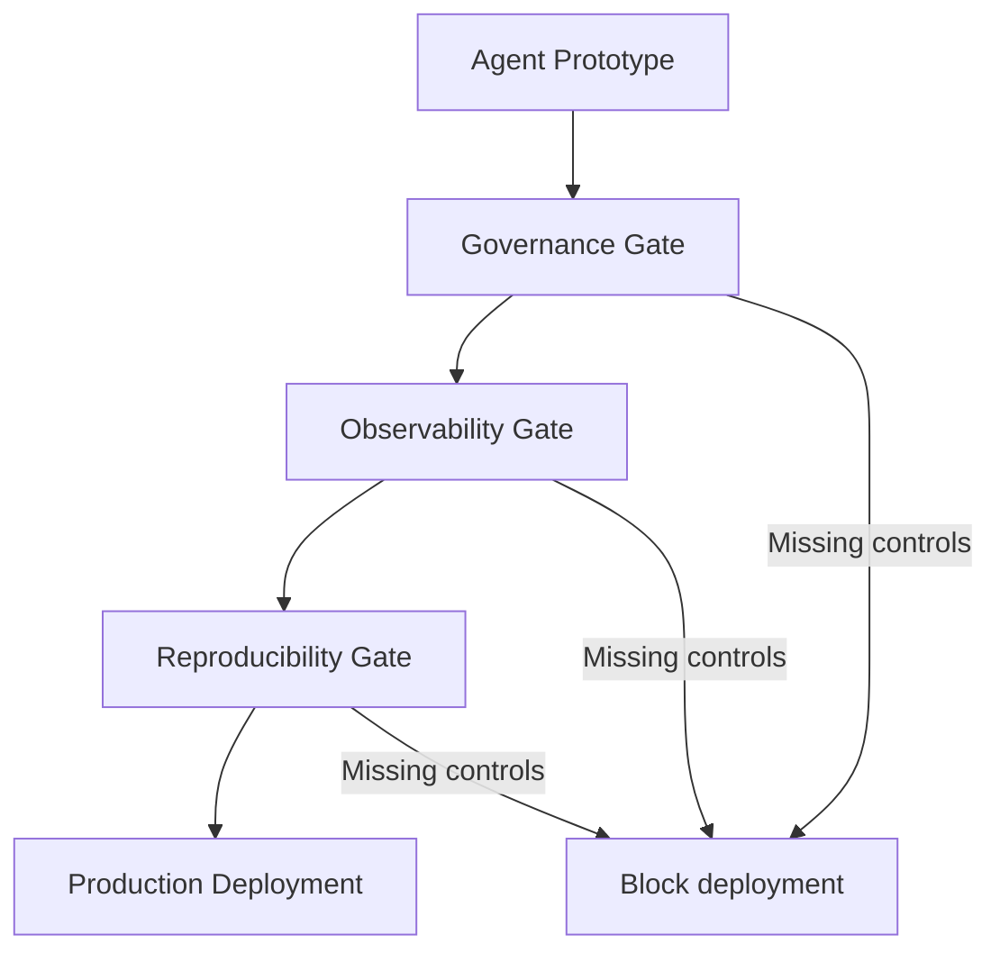

# Enterprise Agent Hardening: Governance, Observability, and Reproducibility

> Enterprise agent hardening secures agentic systems for production through three control layers — governance (what agents may do), observability (what they did), and reproducibility (that outcomes are auditable and resumable) — enforced as deployment gates.

Moving an agent to production requires three categories of control. An enterprise survey across Kore.ai, Salesforce Agentforce, TrueFoundry, ZenML, and LangChain converged on MUST/SHOULD checklists for each pillar ([arXiv:2602.10479](https://arxiv.org/abs/2602.10479)).



## Governance Gate

Claude Code's sub-agent permission modes (`default`, `acceptEdits`, `dontAsk`, `bypassPermissions`, `plan`) restrict tool access per agent; a parent's `bypassPermissions` cannot be overridden by children. `PreToolUse` hooks enforce operation-level validation — exit code 2 blocks the tool and feeds stderr to the model ([Claude Code sub-agents docs](https://code.claude.com/docs/en/sub-agents)). See [Blast Radius Containment](blast-radius-containment.md) for deny-list and allowlist syntax.

### Deny Lists and Agent Type Restrictions

`permissions.deny` with `Agent(subagent-name)` blocks specific subagent types from spawning. `Agent(worker, researcher)` allowlist restricts which types a coordinator can spawn, limiting blast radius if compromised ([Claude Code sub-agents docs](https://code.claude.com/docs/en/sub-agents)).

### Managed Settings for Org-Wide Enforcement

Managed settings via MDM, Group Policy, or the Anthropic admin console enforce governance rules users cannot override: `allowManagedPermissionRulesOnly`, `disableBypassPermissionsMode`, and plugin allowlists ([Claude Code settings docs](https://code.claude.com/docs/en/settings)). `ConfigChange` hooks audit or block runtime settings changes ([Claude Code security docs](https://code.claude.com/docs/en/security)).

### Policy Enforcement Gateway

The survey identifies a Policy Enforcement Gateway: tool invocations mediated through typed interfaces with schema validation and sandboxing. RBAC/ABAC, SSO, and immutable audit logs capturing principal identity, prompt version, and policy decisions are MUST requirements ([arXiv:2602.10479](https://arxiv.org/abs/2602.10479)).

## Observability Gate

`CLAUDE_CODE_ENABLE_TELEMETRY=1` enables native OpenTelemetry export (OTLP, Prometheus, or console) covering session counts, token usage, cost, and tool decisions. `prompt.id` links all events from a single prompt for trace correlation ([Claude Code monitoring docs](https://code.claude.com/docs/en/monitoring-usage)).

`claude_code.tool_decision` events record every tool accept/reject with `decision_source` (`config`, `hook`, `user_permanent`, `user_temporary`) — a built-in compliance audit trail ([Claude Code monitoring docs](https://code.claude.com/docs/en/monitoring-usage)).

LangSmith records every agent action with latency, token counts, and cost; TrueFoundry integrates OTel into Grafana and Datadog. Standardized trace metadata for regression and safety benchmarks is a MUST requirement ([arXiv:2602.10479](https://arxiv.org/abs/2602.10479)).

See [Pre-Completion Checklists](../verification/pre-completion-checklists.md) for governance at the completion boundary.

## Reproducibility Gate

`claude-progress.txt` combined with git history creates a session-portable audit trail. Sessions read progress state rather than relying on [agent memory](../agent-design/agent-memory-patterns.md), so any session can resume where a prior left off. Feature-state JSON holds pass/fail flags per feature; agents toggle `passes` while scope and acceptance criteria stay read-only ([Anthropic harness engineering blog](https://www.anthropic.com/engineering/effective-harnesses-for-long-running-agents)).

Git snapshots log each session's work; sessions verify before new work to prevent compounding failures (see [Worktree Isolation](../workflows/worktree-isolation.md) and [Idempotent Agent Operations](../agent-design/idempotent-agent-operations.md)).

Claude Code's persistent memory scopes (`user`, `project`, `local`) carry institutional knowledge across sessions ([Claude Code sub-agents docs](https://code.claude.com/docs/en/sub-agents)). ZenML and TrueFoundry add reproducibility through artifact versioning ([arXiv:2602.10479](https://arxiv.org/abs/2602.10479)).

## When This Backfires

**Overfitted deny patterns block legitimate operations.** Broad glob patterns like `Bash(rm*)` silently block needed cleanup commands; agents loop or fail instead of explaining the denial. Scope deny lists to the narrowest form (`Bash(rm -rf /)` not `Bash(rm*)`).

**Provider coupling raises switching costs.** Claude Code primitives (`bypassPermissions`, `PreToolUse` hooks, `CLAUDE_CODE_ENABLE_TELEMETRY`) are not portable. An org that hard-wires governance to these APIs faces rewrite-level switching costs if it migrates to a different runtime.

**Reproducibility ceremony slows iteration.** `claude-progress.txt` updates and git snapshots per session add mandatory steps that stall rapid prototyping loops. Apply the reproducibility gate only to long-running or multi-session tasks, not interactive one-shot usage.

## Open Challenge

Verifiability and safe autonomy remain unsolved. Current hardening reduces but does not eliminate human oversight ([arXiv:2602.10479](https://arxiv.org/abs/2602.10479)). Hard-wiring governance to one provider creates rewrite-level switching costs; the survey paper notes conformance testing and interoperability contracts as open research directions but does not prescribe specific migration strategies ([arXiv:2602.10479](https://arxiv.org/abs/2602.10479)).

Passing these gates is not sufficient. Industry data from early 2026 identifies a "governance-containment gap" — 58–59% of organizations report continuous monitoring and human-in-the-loop oversight, but only 37% have purpose binding and 40% have kill-switch capability, a 15–20 point spread between *watching* agents and *stopping* them ([CSA AI Agent Governance Framework Gap, April 2026](https://labs.cloudsecurityalliance.org/research/csa-research-note-ai-agent-governance-framework-gap-20260403/); [RSAC 2026 coverage](https://www.techrepublic.com/article/news-agentic-ai-governance-rsac-2026-insights/)). Observability without containment leaves the response path unimplemented: alerts fire, but nothing halts the agent. Pair the observability gate with enforceable containment — kill-switches, purpose binding, network isolation — or the audit trail only documents incidents after the fact.

## Example

The following `.claude/settings.json` wires up all three gates for a production deployment. Governance uses deny lists and a `PreToolUse` hook to block destructive operations; observability is enabled via environment variable; reproducibility is enforced through a `claude-progress.txt` convention referenced in `CLAUDE.md`.

```json
{
  "permissions": {
    "deny": [
      "Bash(rm -rf*)",
      "Bash(git push --force*)",
      "Agent(untrusted-scraper)"
    ]
  },
  "hooks": {
    "PreToolUse": [
      {
        "matcher": "Bash",
        "hooks": [
          {
            "type": "command",
            "command": "bash .claude/hooks/validate-bash.sh"
          }
        ]
      }
    ]
  }
}
```

The `validate-bash.sh` hook exits with code `2` and writes to stderr to block any command matching a deny pattern, feeding the rejection reason back to the model. Enable telemetry alongside this config:

```bash
export CLAUDE_CODE_ENABLE_TELEMETRY=1
export OTEL_EXPORTER_OTLP_ENDPOINT=otel-collector.internal:4318
claude
```

For reproducibility, begin every session by reading `claude-progress.txt` rather than relying on conversation memory:

```markdown
<!-- CLAUDE.md -->
## Session Start Protocol
1. Read `claude-progress.txt` to restore task state
2. Run `npm test` to confirm baseline passes before starting new work
3. After each completed task, update `claude-progress.txt` with: task name, commit SHA, pass/fail status
```

This setup satisfies all three gates: denied operations and hook rejections are logged as `tool_decision` events with `decision_source: config` or `decision_source: hook`, and `claude-progress.txt` provides a session-portable audit trail any future session can resume from.

## Key Takeaways

- **Governance**: permission modes, `PreToolUse` hooks, deny lists, [managed settings](../tools/claude/managed-settings-drop-in.md).
- **Observability**: `CLAUDE_CODE_ENABLE_TELEMETRY=1` for `tool_decision` events and `prompt.id` correlation.
- **Reproducibility**: session-portable artifacts (progress files, feature-state JSON, git snapshots) over memory.

## Related

- [Agent Observability in Practice: OTel, Cost Tracking, and Trajectory Logging](../observability/agent-observability-otel.md)
- [OpenTelemetry for AI Agent Observability and Tracing](../standards/opentelemetry-agent-observability.md)
- [Agent Harness: Initializer and Coding Agent](../agent-design/agent-harness.md)
- [Blast Radius Containment: Least Privilege for AI Agents](blast-radius-containment.md)
- [Circuit Breakers for Agent Loops](../observability/circuit-breakers.md)
- [Close the Attack-to-Fix Loop: Adversarially Train Agent Checkpoints Against New Injections](close-attack-to-fix-loop.md)
- [Cryptographic Governance and Audit Trail](cryptographic-governance-audit-trail.md)
- [Defense-in-Depth Agent Safety](defense-in-depth-agent-safety.md)
- [Event Sourcing for Agents: Separating Cognitive Intention from State Mutation](../observability/event-sourcing-for-agents.md)
- [Human-in-the-Loop Confirmation Gates for Consequential Agent Actions](human-in-the-loop-confirmation-gates.md)
- [Plugin and Extension Packaging](../standards/plugin-packaging.md)
- [Human-in-the-Loop Placement: Where to Gate Agent Pipelines](../workflows/human-in-the-loop.md)
- [Idempotent Agent Operations: Safe to Retry](../agent-design/idempotent-agent-operations.md)
- [Lethal Trifecta Threat Model](lethal-trifecta-threat-model.md)
- [Lifecycle Security Architecture](lifecycle-security-architecture.md)
- [Permission-Gated Custom Commands](permission-gated-commands.md)
- [Pre-Completion Checklists](../verification/pre-completion-checklists.md)
- [Worktree Isolation](../workflows/worktree-isolation.md)
- [Trajectory Logging via Progress Files and Git History](../observability/trajectory-logging-progress-files.md)
- [Safe Command Allowlisting: Reducing Approval Fatigue](../human/safe-command-allowlisting.md)
- [Dual-Boundary Sandboxing](dual-boundary-sandboxing.md)
- [Code Injection and Multi-Agent Defence](code-injection-multi-agent-defence.md)
- [PostToolUse Hooks: Automatic Formatting and Linting After Every File Edit](../workflows/posttooluse-auto-formatting.md)
- [Sandbox Rules and Harness Tools](sandbox-rules-harness-tools.md)
- [Secrets Management for Agents](secrets-management-for-agents.md)
- [Task Scope Security Boundary](task-scope-security-boundary.md)
- [Security Drift in Iterative LLM Code Refinement](security-drift-iterative-refinement.md)
- [Transcript-Driven Permission Allowlist](transcript-driven-permission-allowlist.md)
- [Scoped Credentials via Proxy Outside the Agent Sandbox](scoped-credentials-proxy.md)
- [Designing Agents to Resist Prompt Injection](prompt-injection-resistant-agent-design.md)
- [Prompt Injection: A First-Class Threat to Agentic Systems](prompt-injection-threat-model.md)
- [Protecting Sensitive Files from Agent Context](protecting-sensitive-files.md)
- [Safe Outputs Pattern](safe-outputs-pattern.md)
- [Tool Signing and Signature Verification for Agents](tool-signing-verification.md)
- [Fail-Closed Remote Settings Enforcement](fail-closed-remote-settings-enforcement.md)
