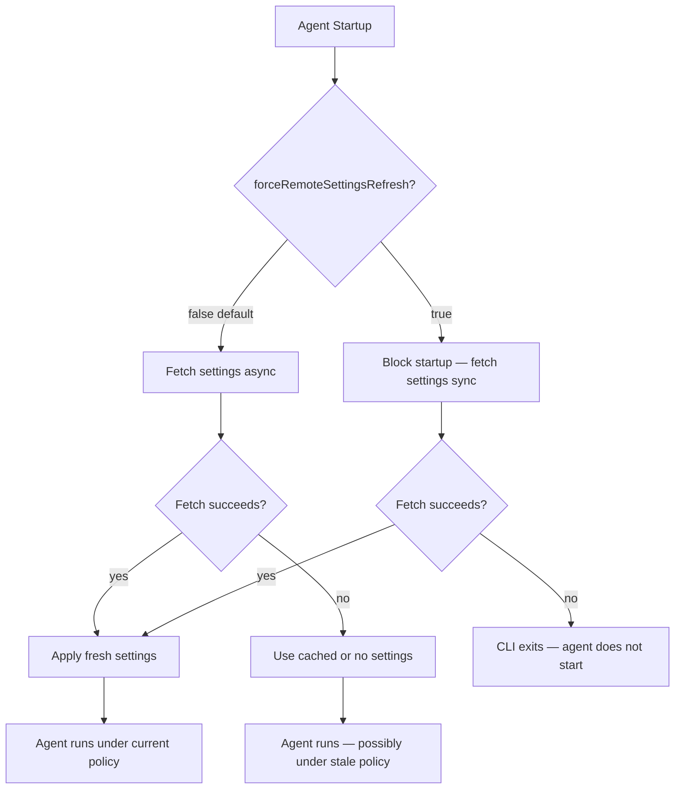

# Fail-Closed Remote Settings Enforcement

> Block agent startup until remote managed settings are freshly fetched; exit rather than run with stale or missing policy.

## The Startup Gap

Claude Code's managed settings system delivers organizational policy — permission deny lists, hook configurations, bypass-mode restrictions — from a central authority. By default, if the remote fetch fails at startup, the CLI continues with cached settings, or without any managed settings if no cache exists.

This creates a brief unenforced window on first launch and a permanent gap whenever the policy store is unreachable: the agent starts, operates, and commits changes under policy that may be revoked, expired, or absent.

The pattern is analogous to hard-fail certificate revocation in TLS. An OCSP responder that is unreachable fails closed in hard-fail mode — the handshake is rejected rather than proceeding without revocation data ([RFC 6960, §2.6](https://www.rfc-editor.org/rfc/rfc6960#section-2.6)). The cost (occasional connection failure) is lower than the risk (connecting to a server whose certificate has been revoked). The same logic applies here: an agent that cannot verify its current policy should not operate.

## Enabling Fail-Closed Enforcement

Set `forceRemoteSettingsRefresh: true` in your Claude Code managed settings configuration ([Claude Code settings docs](https://code.claude.com/docs/en/settings#available-settings)):

```json
{
  "forceRemoteSettingsRefresh": true
}
```

When this setting is active ([Claude Code server-managed-settings docs](https://code.claude.com/docs/en/server-managed-settings#enforce-fail-closed-startup)):

- The CLI blocks at startup until remote settings are freshly fetched from Anthropic's servers
- If the fetch fails, the CLI exits — it does not fall back to cached or absent settings
- The setting self-perpetuates: once delivered, it is cached locally so that subsequent startups enforce the same behavior even before the first successful fetch of a new session

This is a managed-settings-only key. Placing it in user or project `settings.json` has no effect.

## Behavioral Comparison



## Failure Scenarios

The Claude Code documentation provides a scenario table for this setting ([server-managed-settings docs](https://code.claude.com/docs/en/server-managed-settings#security-considerations)):

| Scenario | Without forceRemoteSettingsRefresh | With forceRemoteSettingsRefresh |
|---|---|---|
| API unavailable at startup | Cached settings apply if available; otherwise unmanaged | CLI exits — agent does not start |
| User deletes cached settings file | First-launch behavior: brief unenforced window | CLI exits until fetch succeeds |
| User tampers with cached settings file | Tampered settings apply until next server fetch | CLI exits if fetch fails; fresh settings restore on success |

## Operational Prerequisites

Before enabling this setting:

- Verify network policies allow connectivity to `api.anthropic.com` from all machines running Claude Code
- Confirm the Anthropic admin console has settings saved — an empty configuration still satisfies the fetch requirement
- Implement a break-glass procedure: if the endpoint becomes unreachable, users cannot start Claude Code until connectivity is restored

The availability trade-off is explicit: a `forceRemoteSettingsRefresh: true` deployment accepts that network outages affecting `api.anthropic.com` will prevent agent startup. For security-critical environments, this is acceptable. For environments where uptime is the higher priority, the default fail-open model is the documented alternative.

## Layering with Endpoint-Managed Settings

Server-managed settings are a client-side control. Users with admin or sudo access on unmanaged devices can modify the Claude Code binary or network configuration to circumvent them ([server-managed-settings docs](https://code.claude.com/docs/en/server-managed-settings#security-considerations)).

For stronger enforcement guarantees, combine with endpoint-managed settings deployed via MDM (macOS managed preferences, Windows registry, or Linux `managed-settings.json` at `/etc/claude-code/`). Endpoint-managed settings are protected at the OS level and cannot be bypassed without admin access to the OS itself. When multiple teams own different slices of endpoint policy, use the [managed-settings drop-in directory](../tools/claude/managed-settings-drop-in.md) so each team deploys its own fragment independently.

| Approach | Enforcement boundary | Best for |
|---|---|---|
| Server-managed + `forceRemoteSettingsRefresh` | Network-level; policy verified at every startup | Organizations without MDM, or users on unmanaged devices |
| Endpoint-managed (MDM) | OS-level; policy deployed to device | Organizations with MDM/endpoint management |
| Both combined | Defense-in-depth | High-assurance environments |

## Key Takeaways

- The default fail-open model creates a startup window where managed policy is not enforced; `forceRemoteSettingsRefresh: true` closes it
- Fail-closed enforcement is the agent equivalent of TLS hard-fail certificate revocation: treat inability to verify current policy as a reason to block, not proceed
- The setting self-perpetuates via local cache, so the fail-closed contract survives session restarts even before the first successful remote fetch
- Network reachability to `api.anthropic.com` becomes a startup dependency — plan break-glass procedures accordingly
- For OS-level enforcement guarantees, combine with MDM-deployed endpoint-managed settings

## Related

- [Enterprise Agent Hardening: Governance and Observability](enterprise-agent-hardening.md)
- [Blast Radius Containment: Least Privilege for AI Agents](blast-radius-containment.md)
- [Defense-in-Depth Agent Safety](defense-in-depth-agent-safety.md)
- [Permission-Gated Custom Commands](permission-gated-commands.md)
- [Sandbox Rules for Harness-Owned Tools](sandbox-rules-harness-tools.md)
- [Protecting Sensitive Files from Agent Context](protecting-sensitive-files.md)
- [Secrets Management for Agent Workflows](secrets-management-for-agents.md)
- [Human-in-the-Loop Confirmation Gates](human-in-the-loop-confirmation-gates.md)
