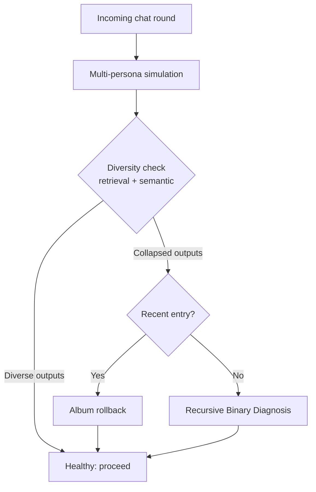

# Foresight-Guided Defense Against Infectious Jailbreaks in Multi-Agent Systems

> Per-agent foresight simulation detects the diversity collapse that signals an infectious jailbreak, then surgically removes the contaminated retrieval entry without homogenizing healthy agent behavior.

## The threat model

Infectious jailbreak is a propagation attack on multi-agent systems with shared multimodal retrieval. [Gu et al. (ICML 2024)](https://arxiv.org/abs/2402.08567) showed that a single adversarial image inserted into one agent's memory spreads exponentially through randomized pair-wise chat. Up to one million LLaVA-1.5 agents were compromised without further attacker action. The contagion channel is retrieval: neighbours pull poisoned entries during routine inter-agent communication.

The attack needs three preconditions:

- Agents share a retrieval pool that crosses agent boundaries
- Inter-agent communication includes content drawn from that pool
- The pool accepts multimodal input

Production coding-agent topologies with isolated sub-agent context usually do not meet these. This defense targets retrieval-coupled multimodal MAS, not generic agent fleets.

## Why global cure-factor defenses fail

First-generation defenses, for example Cowpox, train a more contagious counter-stimulus — a "cure factor" — that wins the retrieval race against the virus adversarial example (VirAE). [Ma, Yang, and Zhang (2026)](https://arxiv.org/abs/2605.01758) identify the structural cost: a globally-shared cure homogenizes responses across agents and destroys the diversity that justified multi-agent deployment.

## The foresight-guided local purification mechanism

[FLP (Ma et al., 2026)](https://arxiv.org/abs/2605.01758) is training-free and works per-agent. Each agent simulates near-future behavior across several personas. It then treats inconsistency in the simulated outputs as an infection signal.


```mermaid
graph TD
    A[Incoming chat round] --> B[Multi-persona simulation]
    B --> C{Diversity check<br/>retrieval + semantic}
    C -->|Diverse outputs| D[Healthy: proceed]
    C -->|Collapsed outputs| E{Recent entry?}
    E -->|Yes| F[Album rollback]
    E -->|No| G[Recursive Binary Diagnosis]
    F --> D
    G --> D
```

Multi-persona simulation. Before responding, the agent runs the upcoming interaction under several distinct personas. Each persona produces a candidate retrieval and response ([Ma et al., 2026](https://arxiv.org/abs/2605.01758)). In a healthy MAS, these candidates differ in expected ways.

Diversity inconsistency as the signal. A VirAE collapses persona-driven diversity: every persona retrieves the same poisoned entry and converges on the same target. You can measure the collapse at the retrieval-result level (which entries get pulled) and the semantic level (what responses say). [Ma et al. (2026)](https://arxiv.org/abs/2605.01758) report that this diagnostic holds across LLaVA-1.5-7B, InternVL2-8B, InstructBLIP-7B, and Qwen2-VL-8B.

Two remediation paths follow:

- Album rollback — remove the most recent FIFO entry. Cheap and surgical when the infection just landed.
- Recursive Binary Diagnosis (RBD) — partition the album in half, apply the diversity test to each half, recurse on the failing half until subset size ≤3, then remove. Complexity is `O(log m · T_sim)` for `m` images.

## Reported effectiveness

The table below covers the Agent Smith attack ([arXiv:2402.08567](https://arxiv.org/abs/2402.08567)) under border perturbations (widths h=6,8,10,12) and pixel perturbations (`ε=4/255` to `32/255`):

| Condition | Cumulative infection (no defense) | Cumulative infection (FLP) |
|---|---|---|
| Border h=6 | ~100% | 5.47% |
| Most other settings | ~100% | 0.00% |
| Current infection rate | up to 100% | 0–3.12% |

Source: [Ma et al., 2026](https://arxiv.org/abs/2605.01758). Retrieval and semantic metrics under FLP "closely match benign baselines", so the diversity preservation that motivated the design holds empirically.

## When this pattern applies

Apply FLP-style local purification when all three conditions hold:

1. Shared retrieval pool across agents — without a propagation channel there is nothing to defend against
2. Multimodal or otherwise opaque inputs — text-only retrieval is out of scope. The paper restricts evaluation to multimodal MAS and excludes "purely textual interactions or different task types".
3. Diversity is worth preserving — if a homogenizing defense is acceptable, simpler global filters cost less than per-round simulation

## When simpler defenses suffice

Coding-agent fleets with isolated sub-agent contexts already break the contagion channel, because there is no shared pool to poison. Standard isolation and sandboxing contain the threat without per-round simulation overhead, as covered in [Blast Radius Containment](blast-radius-containment.md) and [Defense-in-Depth Agent Safety](defense-in-depth-agent-safety.md). [Anthropic's context engineering guidance](https://www.anthropic.com/engineering/effective-context-engineering-for-ai-agents) treats sub-agent isolation as a primary tool for cross-agent failure modes.

## Limitations

- Inference overhead — per-round multi-persona simulation adds cost. The paper flags this for "large-scale MASs or long interaction processes" ([Ma et al., 2026](https://arxiv.org/abs/2605.01758)).
- Adversary-controlled diagnostic — the simulation runs on the same model class as the agents, so prompt injection against the simulation step can suppress the diversity signal. The paper does not address this.
- No provable containment — [Gu et al. (2024)](https://arxiv.org/abs/2402.08567) state that designing a defense to provably restrain spread "remains an open question". FLP shows empirical reduction, not formal guarantees.
- Modality scope — evaluation is multimodal-RAG-specific. Generalizing to tool-use chains or code pipelines requires re-deriving the diversity-signal premise.

## Example

A multimodal customer-support MAS has five agents that share a CLIP-indexed image album. One user upload delivers a poisoned product photo. Without defense, every agent in the fleet returns a malicious response by chat round 24. With FLP wired into each agent:

```yaml
# per-agent defense config
foresight:
  personas: 4                     # four diverse simulation personas
  diversity_metrics:
    - retrieval_entropy           # which album entries get pulled
    - semantic_divergence         # what responses say
  collapse_threshold: 0.15        # below this, treat as infection signal
remediation:
  recent_window: 1                # most-recent entry → rollback
  fallback: recursive_binary_diagnosis
  rbd_min_subset: 3               # stop recursing at 3 entries
```

When the user-uploaded VirAE lands in agent A's album, A's next chat round triggers the diagnostic: all four personas retrieve the same entry and converge on the same harmful response. The agent detects the diversity collapse, rolls back the FIFO-most-recent entry, and returns a benign next response. The contagion never reaches agents B–E. The reported numbers translate: 100% cumulative infection at round 24 drops to under 5.5% across the fleet.

## Key Takeaways

- Infectious jailbreak is a propagation attack specific to multi-agent systems with shared multimodal retrieval — not a general MAS threat
- Global "cure factor" defenses suppress infection by homogenizing responses, destroying the diversity that motivated multi-agent deployment
- Local foresight simulation detects infection through persona-driven diversity collapse, preserving healthy heterogeneity
- Album rollback handles fresh infections; Recursive Binary Diagnosis localises older ones via `O(log m)` bisection
- For coding-agent topologies with isolated sub-agent contexts, sub-agent isolation already breaks the contagion channel — FLP-grade defense is overkill

## Related

- [Code Injection Attacks on Multi-Agent Systems: Coder-Reviewer-Tester as Defence](code-injection-multi-agent-defence.md)
- [RAG Architecture as a Poisoning Robustness Decision](rag-architecture-poisoning-robustness.md)
- [Constraint Drift: Why Safety Must Be Maintained, Not Asserted](constraint-drift-multi-agent-safety.md)
- [Prompt Injection: A First-Class Threat to Agentic Systems](prompt-injection-threat-model.md)
- [Defense-in-Depth Agent Safety](defense-in-depth-agent-safety.md)
- [Blast Radius Containment: Least Privilege for AI Agents](blast-radius-containment.md)
- [Lethal Trifecta Threat Model](lethal-trifecta-threat-model.md)
