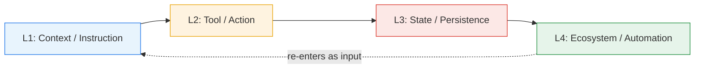

# Four-Layer Taxonomy of Agent Security Risks

> Group agent threats into four layers — context/instruction, tool/action, state/persistence, ecosystem/automation — to map existing controls against attack surfaces and surface coverage gaps where threats propagate across boundaries.

## The Four Layers

[Xu and Chen (2026)](https://arxiv.org/abs/2604.27464) survey autonomous agent security risks and organise them into four execution-relevant layers. The taxonomy is a navigation tool — it does not prescribe defenses, it tells you which defenses sit at which boundary.

| Layer | Surface | Representative threats | Site coverage |
|-------|---------|------------------------|---------------|
| **L1 Context / Instruction** | System prompt, user input, fetched content | Direct and indirect [prompt injection](prompt-injection-threat-model.md), [goal reframing](goal-reframing-exploitation-trigger.md), hidden-instruction smuggling | [CaMeL](camel-control-data-flow-injection.md), [action-selector](action-selector-pattern.md), [indirect injection discovery](indirect-injection-discovery.md) |
| **L2 Tool / Action** | Tool catalog, argument generation, return processing, MCP servers | [Tool-invocation attacks](tool-invocation-attack-surface.md), [skill supply-chain poisoning](skill-supply-chain-poisoning.md), unauthorised egress | [Behavioural firewall](behavioral-firewall-tool-call-trajectories.md), [MCP control plane](mcp-runtime-control-plane.md), [tool signing](tool-signing-verification.md) |
| **L3 State / Persistence** | Memory store, scratchpads, workspace files, retrieved history | Memory poisoning, persistent context contamination, secrets in transcripts | [Protect sensitive files](protecting-sensitive-files.md), [PII tokenisation](pii-tokenization-in-agent-context.md), [secrets management](secrets-management-for-agents.md) |
| **L4 Ecosystem / Automation** | Schedulers, hooks, multi-agent links, third-party registries, deployment pipelines | Cross-agent privilege escalation, supply-chain compromise, drift in unattended automation | [Cryptographic audit trail](cryptographic-governance-audit-trail.md), [enterprise hardening](enterprise-agent-hardening.md), [security drift](security-drift-iterative-refinement.md) |

## Cross-Layer Propagation

The survey's core observation is that threats chain across layers. A successful injection at L1 produces an unauthorised tool call at L2; the tool writes attacker-controlled data into agent memory at L3; the next scheduled run at L4 propagates the contamination to downstream agents.

Per-layer monitoring misses chains because each checkpoint sees only a fragment of the signal — the pattern that motivates [Lin et al.'s (2026)](https://arxiv.org/abs/2604.13630) lifecycle-integrated architecture, which maps a coordinated defense layer onto each phase of the agent execution loop.

## Using the Taxonomy

The four-layer model is most useful for two specific tasks:

1. **Coverage mapping.** List your existing controls and place each in a layer. Layers with no controls are gaps — a coding agent with five L1 prompt-injection defenses, one L2 sandbox, no L3 memory hygiene, and no L4 supply-chain verification has a recognisable shape on the grid.
2. **Attack-chain decomposition.** Given an incident, walk the chain across layers. Most published agent attacks ([poisoned dependency](https://developer.nvidia.com/blog/from-assistant-to-adversary-exploiting-agentic-ai-developer-tools/), [cross-agent privilege escalation](https://embracethered.com/blog/posts/2025/cross-agent-privilege-escalation-agents-that-free-each-other/), [MCP tool poisoning](https://invariantlabs.ai/blog/mcp-security-notification-tool-poisoning-attacks)) involve at least three layers — analysing the chain reveals which boundary, if hardened, breaks it earliest.

The taxonomy does not say which defense to apply — for that, mechanism-based models do better work. The [lethal trifecta](lethal-trifecta-threat-model.md) names which capability combination produces exploitability. [Defense-in-depth](defense-in-depth-agent-safety.md) prescribes independent mechanisms. The four-layer taxonomy complements both: trifecta tells you what to remove, defense-in-depth tells you how to layer, and the four-layer model tells you where the layers sit in the execution path.

## Competing Layerings

There is no single canonical layering for agent security. Two independent 2026 surveys propose different schemas:

- **Xu and Chen (2026)** — execution-surface layers (context, tool, state, ecosystem) used on this page.
- **[Lin et al. (2026)](https://arxiv.org/abs/2604.13630)** — lifecycle-phase layers (input processing, decision making, action execution, state update) with cross-layer feedback channels.

The first three Lin layers map roughly onto Xu/Chen L1-L3, but Lin's "state update" is internal to a single agent run while Xu/Chen's L4 covers cross-run and cross-agent ecosystem effects. Use whichever schema fits the question — Xu/Chen is better for coverage mapping, Lin et al. is better for runtime defense composition.

## When This Backfires

The taxonomy is a map, not a defense. Three failure modes:

1. **False sufficiency.** "We have L1 controls" implies L2-L4 are protected; in fact, attackers chain across boundaries. A page-level slot does not reduce risk on its own.
2. **Single-layer agents.** A one-shot agent with no persistent state and no scheduler has L3 and L4 reduced to near-zero. Applying the four-layer grid to such systems generates empty cells without insight; [trifecta analysis](lethal-trifecta-threat-model.md) is more direct.
3. **Niche framework dependence.** The Xu and Chen survey uses [OpenClaw](https://arxiv.org/abs/2604.27464) as its case study; OpenClaw is not widely deployed and most readers run Claude Code, Copilot, Cursor, or ADK agents. Treat the case study as illustrative; the layer definitions transfer, the OpenClaw-specific component names do not.

## Key Takeaways

- Four execution-surface layers — context/instruction, tool/action, state/persistence, ecosystem/automation — give a navigation grid for placing existing controls and threats.
- Threats chain across layers; per-layer monitoring misses cross-boundary propagation.
- Use the taxonomy for coverage mapping and attack-chain decomposition, not as a defense in itself.
- Two competing 2026 layerings exist (Xu/Chen execution-surface vs. Lin et al. lifecycle-phase); pick the one that fits the question.
- Pair the layered map with mechanism-based models — [lethal trifecta](lethal-trifecta-threat-model.md) and [defense-in-depth](defense-in-depth-agent-safety.md) — to choose specific controls.

## Related

- [Lethal Trifecta Threat Model](lethal-trifecta-threat-model.md) — capability-based companion to the layered taxonomy
- [Defense-in-Depth Agent Safety](defense-in-depth-agent-safety.md) — independent mechanisms layered across the four surfaces
- [Lifecycle-Integrated Security Architecture for Agent Harnesses](lifecycle-security-architecture.md) — competing lifecycle-phase layering with cross-layer feedback
- [Prompt Injection: A First-Class Threat to Agentic Systems](prompt-injection-threat-model.md) — primary L1 threat
- [Tool-Invocation Attack Surface](tool-invocation-attack-surface.md) — primary L2 threat
- [Protecting Sensitive Files from Agent Context](protecting-sensitive-files.md) — L3 control example
- [Skill Supply-Chain Poisoning](skill-supply-chain-poisoning.md) — L4 supply-chain threat
- [Enterprise Agent Hardening](enterprise-agent-hardening.md) — production controls across all four layers
