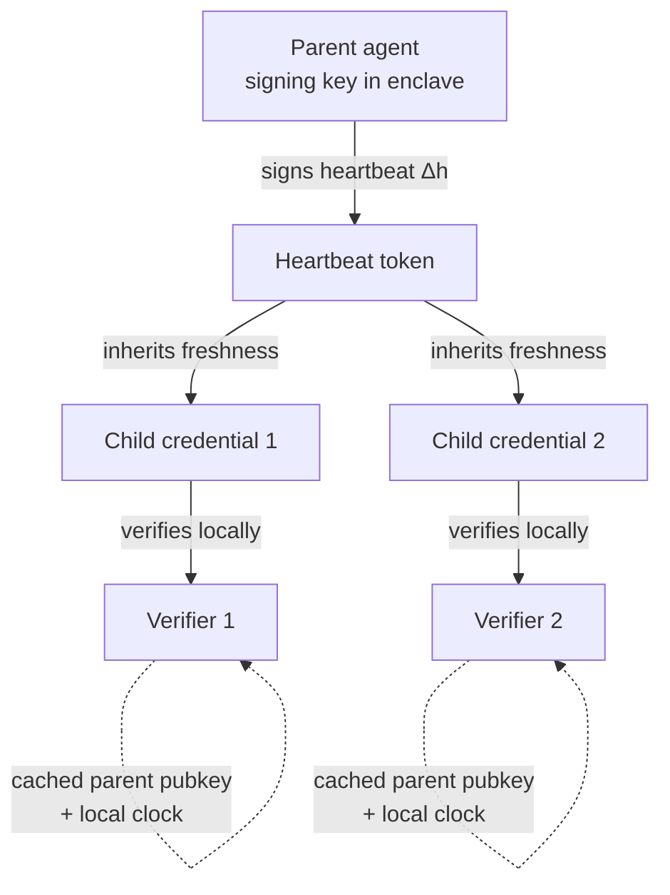

# Heartbeat-Bound Hierarchical Credentials for Agent Swarms

> Bind every sub-agent credential to a periodic parent liveness proof so descendants become unusable within a deterministic window once the parent stops — no network round-trip to a revocation authority required.

Heartbeat-Bound Hierarchical Credentials (HBHC) are a cryptographic protocol that binds the validity of every sub-agent credential to a heartbeat signed by its parent. Verifiers check freshness locally with a cached public key and a local clock; when the parent stops heartbeating, every descendant credential becomes unusable within a bounded window `W_z ≤ W_max + Δ_h + ε`. [Source: Deochake, *Heartbeat-Bound Hierarchical Credentials*, arXiv 2605.20704](https://arxiv.org/abs/2605.20704)

The pattern applies under specific conditions. For short-task agents already on SPIFFE-style short-TTL rotation, TTL expiry already bounds zombie risk and HBHC adds complexity without changing the realized blast radius. [Source: SPIFFE Concepts](https://spiffe.io/docs/latest/spiffe-about/spiffe-concepts/)

## When This Pattern Applies

The mechanism pays its complexity cost in three conditions:

- **Hierarchical sub-agent swarms where cascading revocation is the design goal.** Revoking a parent credential must cascade transitively to every descendant within a known time bound. The paper demonstrates this across a 49-agent four-level hierarchy within the theoretical bound. [Source: arXiv 2605.20704](https://arxiv.org/abs/2605.20704)
- **Long-running agents holding broad credentials.** When agent lifetime exceeds reasonable short-TTL rotation intervals, OAuth/OCSP/Status-List approaches leave a zombie window of minutes to hours after operator shutdown. [Source: arXiv 2605.20704](https://arxiv.org/abs/2605.20704)
- **Parent signing keys can live in an HSM or TEE.** The freshness guarantee is conditional on parent keys in secure enclaves; without that, the deterministic-revocation property is lost. [Source: arXiv 2605.20704](https://arxiv.org/abs/2605.20704)

Outside these conditions, short-TTL workload identity (SPIFFE/SPIRE: typically 1-hour or shorter SVIDs with proactive rotation) is the simpler default. [Source: SPIFFE Concepts](https://spiffe.io/docs/latest/spiffe-about/spiffe-concepts/)

## How It Works

Every descendant credential carries an expectation that "a heartbeat signed by my parent's key was issued at time `t` with TTL `Δ_h`". A verifier with the cached parent public key checks the heartbeat's signature and compares `t + Δ_h + ε` against its local clock — no network call to an issuer. When the parent stops signing heartbeats, the next verifier evaluating a descendant credential after the bound rejects it independently and without coordination. [Source: arXiv 2605.20704](https://arxiv.org/abs/2605.20704)

Stopping the parent's heartbeat is the revocation event. There is no central status list to update and no network introspection to wait on; descendant credentials simply fail the next local check after the bound elapses.

## Reported Results

The paper's evaluation against OAuth 2.0 introspection, OCSP, and W3C Status Lists reports a 90x reduction in zombie window over OAuth 2.0, 0.26 ms full authentication in Rust, 18,000+ verifications/second under concurrent HTTP load, stable per-verification latency from 10 to 10,000 agents, 0.71% end-to-end overhead on tool calls with GPT-4o-mini, zero post-revocation tool calls under prompt-injection guardrail bypass, and successful cascading revocation across a 49-agent four-level hierarchy within the theoretical bound. [Source: arXiv 2605.20704](https://arxiv.org/abs/2605.20704)

The 90x figure is over OAuth 2.0 specifically. SPIFFE-style short-TTL rotation collapses zombie windows by a different mechanism (implicit expiry), so the relevant baseline depends on what the deployment runs today.

## Why It Works

The pattern relocates the freshness check from a network round-trip to a local cryptographic verification. Verifying a parent-signed heartbeat is the same cheap operation as validating a short-lived JWT — signature plus clock — applied transitively up a credential chain. The novelty is the chain itself: revoking the parent cascades to every descendant by construction, not by an explicit revocation list, so the revocation event is the absence of new heartbeats rather than a positive write to a status server that every verifier must poll. That eliminates both the network round-trip and the consistency-window problem that defines OAuth 2.0 introspection and OCSP. [Source: arXiv 2605.20704](https://arxiv.org/abs/2605.20704)

## When This Backfires

- **Unbounded clock skew.** The freshness bound holds only while skew stays within `ε`; drift past `ε` either reopens the zombie window or rejects valid credentials. NTP discipline is a prerequisite. [Source: arXiv 2605.20704](https://arxiv.org/abs/2605.20704)
- **No secure enclave for parent keys.** If the parent process can have its memory dumped, an attacker exfiltrates the signing key and forges heartbeats post-shutdown — the deterministic-revocation property is lost. [Source: arXiv 2605.20704](https://arxiv.org/abs/2605.20704)
- **Heartbeat issuer as a new SPOF.** The parent becomes a hard liveness dependency for every descendant. A parent crash or a partition isolating the parent revokes the entire subtree even when descendants are healthy — fail-closed by design, operationally severe for long-running batch jobs.
- **Short-task agents already on rotation.** When the entire lifecycle fits inside one short-TTL SVID, the TTL approach already bounds zombie risk to the TTL window. HBHC adds a heartbeat broker and protocol without reducing realized blast radius. [Source: SPIFFE Concepts](https://spiffe.io/docs/latest/spiffe-about/spiffe-concepts/)
- **Downstream cache desync.** Cryptographically correct revocation at the verifier does not bind downstream APIs, queues, or replicated systems that may honour a cached token after local rejection. HBHC closes the verifier window, not the downstream coherence window. [Source: GitGuardian, *Short-Lived Credentials in Agentic Systems*](https://blog.gitguardian.com/short-lived-credentials-in-agentic-systems-a-practical-trade-off-guide/)

## Key Takeaways

- HBHC is the right pattern when cascading revocation across a parent-child agent tree is the design goal and TTL rotation alone is too coarse.
- The deterministic-revocation bound holds only under bounded clock skew and parent keys in secure enclaves — these are hard prerequisites, not nice-to-haves.
- For short-task agents already on SPIFFE-style rotation, TTL expiry already bounds zombie risk; HBHC adds protocol complexity without changing realized blast radius.
- The parent process becomes a hard liveness dependency for the entire subtree — fail-closed by design, but partitions revoke healthy descendants.

## Related

- [Workload Identity Federation for Agent Runtimes](workload-identity-federation-for-agents.md) — Replace long-lived API keys with short-lived OIDC tokens minted from the runtime's existing workload identity
- [Scoped Credentials via Proxy Outside the Agent Sandbox](scoped-credentials-proxy.md) — Keep broad credentials entirely outside the agent sandbox and let a proxy attach scoped tokens to allowlisted requests
- [Secrets Management for Agent Workflows](secrets-management-for-agents.md) — Inject credentials as environment variables so secrets never appear in context or generated code
- [Blast Radius Containment: Least Privilege for AI Agents](blast-radius-containment.md) — Limit agent access to only what the current task requires
- [Task-Based Access Control with Hybrid Inspection](task-based-access-control-hybrid-inspection.md) — Bind each tool call to the user's current task via short-lived signed credentials
