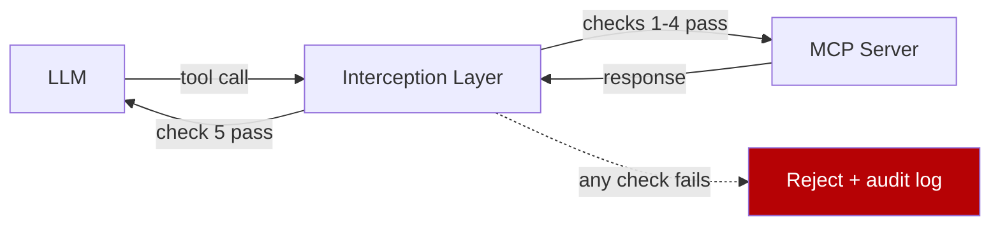

# Hybrid Deterministic + Semantic Authorization for Agent Tool Calls

> Five deterministic checks at the agent-tool interception layer cover structural attacks; a semantic task-to-tool matcher covers intent drift. The two attack classes are orthogonal — one layer cannot replace the other.

## Two Orthogonal Attack Classes

A compromised or misled agent can attack tool calls along two independent dimensions:

- **Structural attacks** — the call's *form* is wrong. Tampered tool description, name swap (`get_balance` → `transfer_amount`), parameter mutation between LLM and tool, falsified return.
- **Semantic attacks** — the call's *form* is correct but its *purpose* is not. A properly typed call to a tool unrelated to the user's stated task — `delete_repository` during a documentation read.

Deterministic checks on call structure pass semantic attacks; a semantic intent matcher passes structural attacks. The CASA framework ([El Helou et al., 2026](https://arxiv.org/abs/2605.02682)) combines both at one zero-trust interception layer between the agent and the MCP server.

## The Five Deterministic Checks

Each check is a binary structural comparison enforced before the call leaves the interception layer ([El Helou et al., 2026, §3](https://arxiv.org/html/2605.02682)):

| # | Check | What it compares | Attack it blocks |
|---|-------|------------------|------------------|
| 1 | Tool Definition Integrity | Cached authoritative MCP tool definition vs. the description served to the LLM | Description-injection rewriting tool semantics in-flight |
| 2 | Request Authorization Verification | Whether the LLM response actually contained the tool call being executed | Autonomous calls fabricated by the runtime outside LLM reasoning |
| 3 | Action Alignment Validation | Function name in LLM output vs. function name in outgoing MCP call | Name swap (e.g., `get_balance` → `transfer_amount`) |
| 4 | Parameter Integrity Enforcement | Parameter names and values in LLM output vs. outgoing call | Recipient/amount mutation between LLM and tool |
| 5 | Data Fidelity Verification | Raw MCP response vs. content relayed back to the LLM | Result falsification or hidden-instruction injection on return |

Checks 1, 3, 4, and 5 are byte-level comparisons; check 2 is set membership. None require an LLM at decision time — failures reject the call deterministically.

## The Semantic Layer: Task-to-Tool Matching

Structural checks pass a clean call to an unrelated tool. Two stages add intent matching ([El Helou et al., 2026, §4](https://arxiv.org/html/2605.02682)):

1. **Task extraction** — process conversation history up to the first tool call; emit a concise natural-language description of the user's objective. Decoupling extraction from matching keeps raw conversation off the authorization server.
2. **Task-tool matching** — binary classify whether each requested tool aligns with the extracted task. Mismatches are denied; matches proceed to the deterministic checks.

This is **Task-Based Access Control (TBAC)** ([El Helou et al., 2025](https://arxiv.org/abs/2510.26702)) extended from single-task to multi-turn — the multi-turn extension handles "clarification exchanges, tangential information, and conversational drifts" without re-prompting the user.

## What the Empirical Numbers Buy You

Reported accuracy on the extended ASTRA benchmark for Claude Sonnet 4.6 ([El Helou et al., 2026, §6](https://arxiv.org/html/2605.02682)):

| Setting | Accuracy | F1 | FPR | FNR |
|---------|----------|-----|-----|-----|
| Single-turn (ASTRA) | 0.98 | 0.98 | 2% | 2% |
| Multi-turn (augmented) | 0.97 | 0.97 | 2% | 4% |
| Multi-turn (multi-agent) | 0.92 | 0.92 | 10% | 7% |

Single-turn matching is near-deterministic. Multi-turn matching degrades: 7% FNR denies roughly 1 in 14 legitimate calls; 10% FPR over-allows on multi-agent traffic. The paper concludes current semantic checks remain "insufficient for high-stakes, long-horizon autonomous tool use" ([§7](https://arxiv.org/html/2605.02682)) — design fallbacks.

## When Hybrid Beats Deterministic-Only

The deterministic-only alternative pairs a [Scoped Credentials Proxy](scoped-credentials-proxy.md) with the [Action-Selector pattern](action-selector-pattern.md): the agent holds no broad credentials, all permitted (URL, method) tuples are pre-declared, and the LLM picks from a fixed action set. For small, enumerable action spaces this beats hybrid on latency, predictability, and FPR.

Hybrid earns its complexity only when **both** conditions hold:

- The tool catalogue is large and dynamic (MCP servers exposing dozens to hundreds of tools, where pre-declaring every (task, tool) pair is impractical).
- Conversations are multi-turn and the per-turn task can drift (interactive coding, research, customer support).

## Where It Sits in the Defense Stack

Hybrid authorization complements existing controls. The [Lethal Trifecta Threat Model](lethal-trifecta-threat-model.md) and [Task Scope Security Boundary](task-scope-security-boundary.md) define architectural and per-task contracts; the deterministic checks catch in-flight violations of those contracts; the semantic matcher enforces task scope at runtime; the [MCP Runtime Control Plane](mcp-runtime-control-plane.md) is the architectural slot where these checks live.

## Example

A coding agent with read access to two MCP servers — `github` (repo operations) and `db-readonly` (analytics queries). The user asks: *"Summarize the last week's failing tests in the auth-service repo."* The interception layer extracts the task: *"Read CI test results from the auth-service repository."*

The agent emits `github.list_workflow_runs(repo="auth-service", status="failure")`. Checks 1–4 pass (definition cached, call present in LLM output, name and parameters identical end-to-end); semantic match passes (`list_workflow_runs` aligns with "read CI test results"). The call proceeds; check 5 verifies the relayed content matches the raw MCP response.

Now suppose an injected instruction in a fetched issue body causes the LLM to emit `db-readonly.export_full_users_table()`. Checks 1–4 still pass — the call is structurally clean. The semantic matcher rejects: `export_full_users_table` does not align with "read CI test results from auth-service". Only the semantic layer sees the intent drift.

## When This Backfires

- **High-frequency tool use.** Each decision adds an LLM round-trip for task extraction. AgentSpec-style declarative predicates run in 1–3 ms ([Singh et al., 2025](https://arxiv.org/abs/2503.18666)) vs. hundreds of milliseconds for an LLM call. Cache extracted tasks per turn or fall back to deterministic allowlists for hot paths.
- **Shared-failure mode.** Using the same model class for policy as for the agent creates correlated weakness — a jailbreak that misleads one may mislead both. Reported FPR/FNR varies across model families ([§6](https://arxiv.org/html/2605.02682)); use a different family for policy.
- **High-FNR cost on critical paths.** 7% multi-turn FNR is unacceptable for utility-critical workflows without a fallback (operator review or a deterministic allowlist for known-good pairs).
- **Sensitive content in extracted tasks.** Summaries may carry PII to the auth server — encrypt at rest and minimise retention.

## Key Takeaways

- Structural and semantic attacks on tool calls are orthogonal; covering only one leaves the other open.
- The five deterministic checks are byte-level comparisons that block tampering without LLM-in-the-loop overhead.
- Task-to-tool semantic matching extends single-task TBAC to multi-turn conversations by separating task extraction from matching.
- Multi-turn semantic matching is meaningfully less reliable than single-turn (10% FPR / 7% FNR for the best-performing model on multi-agent traffic) — design fallbacks.
- Hybrid authorization earns its complexity only when the tool catalogue is large/dynamic and conversations are multi-turn; for static action sets, deterministic allowlists plus a credential proxy are cheaper and tighter.

## Related

- [Treat Task Scope as a Security Boundary](task-scope-security-boundary.md)
- [Action-Selector Pattern: LLM as Intent Decoder with Deterministic Execution](action-selector-pattern.md)
- [Tool-Invocation Attack Surface](tool-invocation-attack-surface.md)
- [MCP Runtime Control Plane: Policy Evaluation Between Agent and Tool](mcp-runtime-control-plane.md)
- [Scoped Credentials via Proxy Outside the Agent Sandbox](scoped-credentials-proxy.md)
- [Lethal Trifecta Threat Model](lethal-trifecta-threat-model.md)
- [Mid-Trajectory Guardrail Selection for Multi-Step Tool Calls](mid-trajectory-guardrail-selection.md)
- [Defense-in-Depth Agent Safety](defense-in-depth-agent-safety.md)
