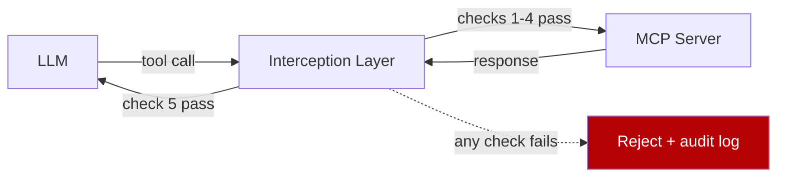

# Hybrid Deterministic + Semantic Authorization for Agent Tool Calls

> Deterministic checks at the agent-tool layer cover structural attacks; a semantic task-to-tool matcher covers intent drift. The two attack classes are orthogonal.

## Two orthogonal attack classes

A compromised agent attacks tool calls along two independent dimensions:

- Structural attacks — the call's form is wrong: tampered description, name swap (`get_balance` → `transfer_amount`), parameter mutation, falsified return.
- Semantic attacks — the form is correct but the purpose is not: a typed call to a tool unrelated to the user's task, such as `delete_repository` during a documentation read.

Each layer passes the other's attack class. The CASA framework ([El Helou et al., 2026](https://arxiv.org/abs/2605.02682)) combines both at a zero-trust layer between agent and MCP server.

## The five deterministic checks

Each check is a binary comparison enforced before the call leaves the layer ([El Helou et al., 2026, §III-A](https://arxiv.org/html/2605.02682)):

| # | Check | What it compares | Attack it blocks |
|---|-------|------------------|------------------|
| 1 | Tool Definition Integrity | Cached MCP tool definition vs. description served to the LLM | Description-injection rewriting tool semantics in-flight |
| 2 | Request Authorization | Whether the LLM response actually contained the tool call being executed | Autonomous calls fabricated by the runtime outside LLM reasoning |
| 3 | Action Alignment | Function name in LLM output vs. outgoing MCP call | Name swap (`get_balance` → `transfer_amount`) |
| 4 | Parameter Integrity | Parameter names and values in LLM output vs. outgoing call | Recipient/amount mutation between LLM and tool |
| 5 | Data Fidelity | Raw MCP response vs. content relayed back to the LLM | Result falsification or hidden-instruction injection on return |

Checks 1, 3, 4, 5 are byte-level; check 2 is set membership. No LLM at decision time — failures reject deterministically.

```mermaid
graph LR
    LLM[LLM] -->|tool call| INT[Interception Layer]
    INT -->|checks 1-4 pass| MCP[MCP Server]
    MCP -->|response| INT
    INT -->|check 5 pass| LLM
    INT -.->|any check fails| BLOCK[Reject + audit log]
    style BLOCK fill:#b60205,color:#fff
```

## The semantic layer: task-to-tool matching

Structural checks pass a clean call to an unrelated tool. Two stages add intent matching ([El Helou et al., 2026, §III-B](https://arxiv.org/html/2605.02682)):

1. Task extraction emits a concise natural-language description of the user's objective from the conversation. Separating extraction from matching keeps raw conversation off the authorization server.
2. Task-tool matching classifies whether each requested tool [aligns with the task](task-scope-security-boundary.md). Mismatches deny; matches proceed to deterministic checks.

This extends Task-Based Access Control (TBAC) ([El Helou et al., 2025](https://arxiv.org/abs/2510.26702v1)) to multi-turn use, handling "clarification exchanges, tangential information, and conversational drifts" without re-prompting.

## What the empirical numbers buy you

Accuracy on the extended ASTRA benchmark for Claude Sonnet 4.6 ([§V](https://arxiv.org/html/2605.02682)):

| Setting | Accuracy | F1 | FPR | FNR |
|---------|----------|-----|-----|-----|
| Single-turn (ASTRA) | 0.98 | 0.98 | 2% | 2% |
| Multi-turn (augmented) | 0.97 | 0.97 | 2% | 4% |
| Multi-turn (multi-agent) | 0.92 | 0.92 | 10% | 7% |

Single-turn is near-deterministic. Multi-turn degrades: a 7% FNR denies about 1 in 14 legitimate calls, and a 10% FPR over-allows on multi-agent traffic. The paper concludes semantic checks remain "insufficient for high-stakes, long-horizon autonomous tool use" ([§VII](https://arxiv.org/html/2605.02682v1)), so design fallbacks.

## When hybrid beats deterministic-only

The deterministic-only alternative pairs a [Scoped Credentials Proxy](scoped-credentials-proxy.md) with the [Action-Selector pattern](action-selector-pattern.md): pre-declared (URL, method) tuples and a fixed action set. For small action spaces this beats hybrid on latency, predictability, and FPR.

Hybrid earns its complexity only when both conditions hold:

- Tool catalog is large and dynamic, so pre-declaring every (task, tool) pair is impractical.
- Conversations are multi-turn with drifting per-turn tasks (interactive coding, research, support).

## Where it sits in the defense stack

The [Lethal Trifecta Threat Model](lethal-trifecta-threat-model.md) and [Task Scope Security Boundary](task-scope-security-boundary.md) define the contracts; deterministic checks catch in-flight violations; the semantic matcher enforces task scope at runtime; the [MCP Runtime Control Plane](mcp-runtime-control-plane.md) is the architectural slot.

## Example

A coding agent has read access to `github` and `db-readonly` MCP servers. The user asks: "Summarize the last week's failing tests in the auth-service repo." The interception layer extracts: "Read CI test results from the auth-service repository."

The agent emits `github.list_workflow_runs(repo="auth-service", status="failure")`. Checks 1–4 pass; semantic match aligns; check 5 verifies the relayed content matches the raw response.

Now an injected instruction in a fetched issue body makes the LLM emit `db-readonly.export_full_users_table()`. Checks 1–4 still pass — structurally clean. The semantic matcher rejects: `export_full_users_table` does not align with "read CI test results". Only the semantic layer sees the drift.

## When this backfires

- High-frequency tool use. Each decision adds an LLM round-trip for task extraction. AgentSpec-style declarative predicates run with millisecond-level overhead ([Wang et al., 2025](https://arxiv.org/abs/2503.18666)), against hundreds of milliseconds per LLM call. Cache per turn or fall back to deterministic allowlists for hot paths.
- Shared-failure mode. The same model class for policy and agent creates correlated weakness, because a jailbreak that misleads one may mislead both ([§V](https://arxiv.org/html/2605.02682)). Use a different family for policy.
- High FNR on critical paths. A 7% multi-turn FNR is unacceptable for utility-critical workflows without a fallback (operator review or an allowlist for known-good pairs).
- PII in tasks. Summaries may carry PII to the auth server, so encrypt at rest and keep retention short.

## Key Takeaways

- Structural and semantic attacks are orthogonal; covering only one leaves the other open.
- The five deterministic checks are byte-level comparisons that block tampering without LLM overhead.
- Semantic matching extends single-task TBAC to multi-turn by separating extraction from matching.
- Multi-turn matching is meaningfully less reliable than single-turn (10% FPR / 7% FNR on multi-agent traffic) — design fallbacks.
- Hybrid earns its complexity only when the tool catalog is large/dynamic and conversations are multi-turn; for static action sets, deterministic allowlists are cheaper and tighter.

## Related

- [Treat Task Scope as a Security Boundary](task-scope-security-boundary.md)
- [Action-Selector Pattern: LLM as Intent Decoder with Deterministic Execution](action-selector-pattern.md)
- [Intent-Governed Tool Authorization for AI Agents (IGAC)](intent-governed-tool-authorization.md) — CASA gates call *form* via byte-level checks; IGAC gates call *justification* via a per-request manifest-narrowing certificate. Orthogonal layers.
- [Tool-Invocation Attack Surface](tool-invocation-attack-surface.md)
- [MCP Runtime Control Plane: Policy Evaluation Between Agent and Tool](mcp-runtime-control-plane.md)
- [Scoped Credentials via Proxy Outside the Agent Sandbox](scoped-credentials-proxy.md)
- [Lethal Trifecta Threat Model](lethal-trifecta-threat-model.md)
- [Mid-Trajectory Guardrail Selection for Multi-Step Tool Calls](mid-trajectory-guardrail-selection.md)
- [Defense-in-Depth Agent Safety](defense-in-depth-agent-safety.md)
