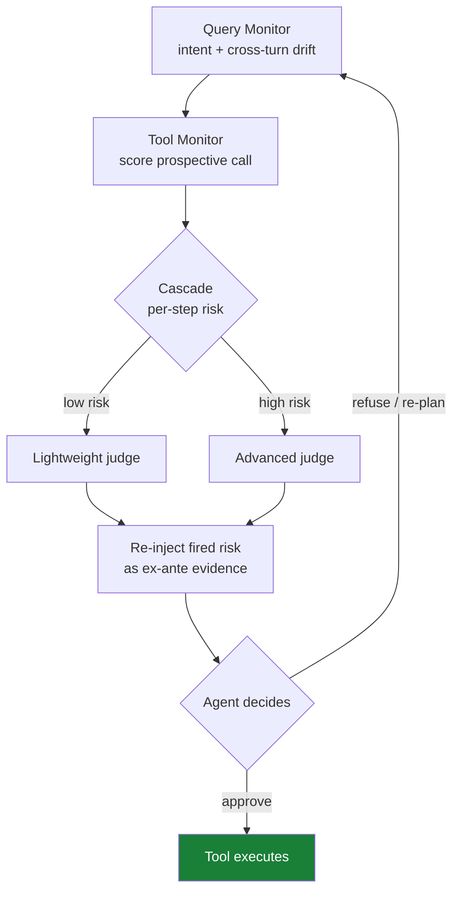

# Inline Safety Harness with Cascade Verification (FinHarness)

> Wrap each agent turn with prospective per-call monitors and route verification between a cheap and an advanced judge by per-step risk.

An inline safety harness evaluates each prospective tool call before it executes, and adaptively chooses how much verification to spend on it. It does not filter only at the conversation boundary or audit after the agent terminates. FinHarness ([Jia et al., 2026](https://arxiv.org/abs/2605.27333)) is the finance-domain instance: a Query Monitor that fuses single-turn intent with cross-turn drift, a Tool Monitor that scores each prospective call, and a Cascade module that routes verification between a lightweight and an advanced-tier judge.

The pattern pays off only under specific conditions. Outside this envelope, a simpler stack wins.

## When this applies

The harness earns its cost only when these conditions hold together:

- Irreversible mid-trajectory actions. Boundary filters miss tool calls that fire mid-turn. Post-hoc judges audit only after termination, too late to intervene and at a cost that scales linearly with trace length ([Jia et al., 2026](https://arxiv.org/abs/2605.27333)). Prospective per-call evaluation is the only placement that can block an irreversible call before it commits.
- High tool-call volume per session. Cascade routing amortizes over many calls. At a low call count, the routing overhead exceeds the advanced-judge cost it saves.
- A two-tier judge budget worth optimizing. Routed FinHarness used 4.7x fewer advanced-judge calls than an always-advanced ablation. It cut attack success rate from 38.3% to 15.0% on the FinVault benchmark, and largely preserved benign approval (41.1% to 39.3%) ([Jia et al., 2026](https://arxiv.org/abs/2605.27333v1)). The saving matters only when the advanced judge is expensive enough to ration.
- Bounded, trustworthy context. The re-injection step assumes the agent can reliably act on safety evidence delivered through its own context. That assumption degrades as context grows or is poisoned.

## How it works

Three monitors run inline on every turn ([Jia et al., 2026](https://arxiv.org/abs/2605.27333)):

- Query Monitor — fuses the current turn's intent with accumulated cross-turn drift, catching goals that shift gradually across a workflow.
- Tool Monitor — scores each prospective tool call against policy before it executes.
- Cascade module — routes verification by per-step risk: low-risk steps get the cheap judge, high-risk steps escalate to the advanced one.

The distinctive step is re-injection. Fired risk factors go back into the agent input as ex-ante evidence, so the agent can refuse, re-plan, or approve on its own ([Jia et al., 2026](https://arxiv.org/abs/2605.27333)). The harness does not just block. It returns the verdict as a governance signal.

## Why it works

Cascade routing cuts total verification cost without surrendering coverage, because risk is unevenly distributed across steps. Most calls are routine, and a cheap judge clears them. The expensive judge is reserved for the few high-risk transitions ([Jia et al., 2026](https://arxiv.org/abs/2605.27333)). The same economics apply to general cost-optimal cascade routing, where calibrated per-call uncertainty decides when to escalate ([UCCI, 2026](https://arxiv.org/abs/2605.18796)). Prospective inline monitoring closes the gap that boundary filters (blind to mid-trajectory calls) and post-hoc judges (too late, and linear in trace length) both leave open.

## When this backfires

The re-injection design makes a contested bet: that the agent's context is trustworthy enough to act on. Three conditions break it.

- Long or poisoned context. Refusal behavior in long-context agents is unstable. Refusal rates shift unpredictably as context grows: one model rose from about 5% to about 40%, another fell from about 80% to about 10% at 200K tokens, and task performance dropped over 50% by 100K tokens ([Hadeliya et al., 2026](https://arxiv.org/abs/2512.02445v1)). Re-injecting risk evidence into the same context relies on exactly the behavior that degrades. An agent under active indirect injection is worse still: feedback-guided payloads achieve full success on a majority of tested targets, including production coding agents ([IterInject, 2026](https://arxiv.org/abs/2605.24659v1)). Where the control plane can sit outside the model context, that is the stronger guarantee. [CaMeL](camel-control-data-flow-injection.md) makes the opposite architectural bet for this reason.
- Low call volume or tight latency. Below roughly five tool calls per session, the cascade overhead exceeds the advanced-judge cost it saves. Under a tight latency budget (sub-200ms p99), tiered judging adds inference hops that break the SLA. A single fast classifier or a [behavioral firewall](behavioral-firewall-tool-call-trajectories.md) fits better.
- Reversible tools. Pre-execution evaluation is unnecessary when actions can be undone. Saga-style compensation after the fact is cheaper and easier to test.

For most deployments below a high-stakes-regulated bar, a simpler stack — deterministic per-call policy, one capable judge at high-risk transitions, and compensation for reversible tools — covers the same surface at lower cost.

## Key Takeaways

- Inline prospective monitoring blocks irreversible mid-trajectory calls that boundary filters miss and post-hoc judges catch too late ([Jia et al., 2026](https://arxiv.org/abs/2605.27333)).
- Cascade routing between a cheap and an advanced judge cut advanced-judge calls 4.7x while reducing attack success rate from 38.3% to 15.0% — the saving matters only when the advanced judge is expensive enough to ration.
- Re-injecting fired risk into the agent's context for self-governance assumes a trustworthy context; long-context refusal instability and indirect injection make that conditional.
- Apply the full harness only to high-stakes, high-call-volume, irreversible-action workflows; simpler defenses dominate elsewhere.

## Related

- [Lifecycle-Integrated Security Architecture for Agent Harnesses](lifecycle-security-architecture.md) — the closest neighbour: four-phase lifecycle defense with cross-layer feedback, without the cost-adaptive cascade routing
- [Mid-Trajectory Guardrail Selection for Multi-Step Tool Calls](mid-trajectory-guardrail-selection.md) — how to pick the judge model the cascade routes between
- [Behavioral Firewall for Tool-Call Trajectories](behavioral-firewall-tool-call-trajectories.md) — deterministic alternative for stable-catalog, latency-sensitive workflows
- [Control/Data-Flow Separation for Prompt Injection Defense (CaMeL)](camel-control-data-flow-injection.md) — the opposite bet: keep the control plane outside the model context
- [Defense-in-Depth Agent Safety](defense-in-depth-agent-safety.md) — the layering principle the harness extends rather than replaces
