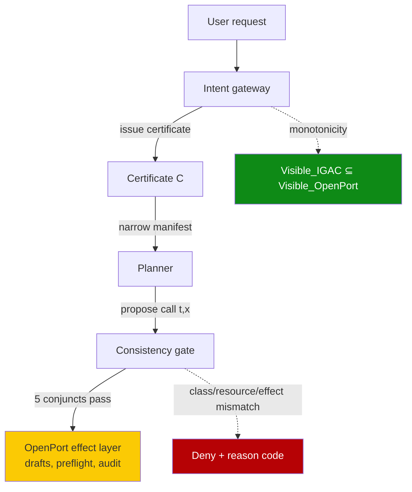

# Intent-Governed Tool Authorization for AI Agents (IGAC)

> A server-issued intent certificate narrows the static tool manifest per request — monotone-only — so injection can suppress tools but never widen the planner's reach.

## When this recommendation applies

The pattern produces a real security delta only inside these conditions ([Zhu & Wang, 2026](https://arxiv.org/abs/2606.22916)):

- The tool catalog is typed and bounded by named effect classes — IGAC's consistency predicate is written against `read | summarize | create | update | delete | export | admin`. A generic `bash` or wildcard MCP server collapses every call to `unknown`, so the check gates nothing concrete (the same precondition that bounds [PORTICO](revocable-resource-effect-capabilities.md) and [monotonic capability attenuation](monotonic-capability-attenuation.md)).
- All effectful tool traffic goes through one gateway — raw shellouts, embedded SDK calls, and cached state bypass the intent layer, the same mediated-control-plane limitation that bounds the [MCP runtime control plane](mcp-runtime-control-plane.md).
- A draft-first effect layer already exists underneath — IGAC narrows what the planner sees; it does not replace human-review gates, preflight impact binding, or audit. The paper plugs into OpenPort precisely because that pipeline already exists ([Zhu & Wang, 2026, §Integration](https://arxiv.org/html/2606.22916v1)).
- The team can absorb classifier failure on the utility axis — monotonicity is a one-way safety property. A classifier that mis-extracts `summarize` for a request that needed `export` returns a narrower manifest that denies legitimate work.

Outside these conditions, tightening the static manifest plus the [task-scope security boundary](task-scope-security-boundary.md) and a [draft-first write pipeline](human-in-the-loop-confirmation-gates.md) close most of the same gap with less authorship cost. See [when this backfires](#when-this-backfires).

## The gap static scopes leave open

OAuth scopes, ABAC rules, and signed agent identities answer "what can this credential call?" They do not answer "does the user's current request justify this call?" A credential that can read and export records exposes export authority on every turn — including a later turn whose justification an attacker controls ([Zhu & Wang, 2026, §1](https://arxiv.org/html/2606.22916v1)). RFC 9396 Rich Authorization Requests narrow per-transaction parameters, but do not standardize provenance-aware evaluation of whether the call still reflects the user's expressed ask ([Microsoft Security, 2026](https://techcommunity.microsoft.com/blog/microsoft-security-blog/authorization-and-governance-for-ai-agents-runtime-authorization-beyond-identity/4509161)).

This is distinct from [task-based access control](task-based-access-control-hybrid-inspection.md) — there the deterministic axis is a signed task-bound credential the user's session issues; IGAC's certificate is server-issued from the canonicalized user request itself. It is distinct from [PORTICO's epoch handles](revocable-resource-effect-capabilities.md) — that pattern closes lingering authority across time; IGAC narrows authority per request. And it is distinct from [CASA's hybrid checks](hybrid-deterministic-semantic-tool-authorization.md) — those validate the call's form (description integrity, parameter integrity, name swap); IGAC validates the call's justification.

## How the certificate lifecycle works

IGAC inserts an intent-control layer before the existing effect-control layer. A certificate `C = (h_u, I, B_R, B_E, γ, ρ, τ, σ)` is issued server-side from the canonicalized user request — not signed by the model — and carries intent classes, resource bounds, effect bounds, confidence, review mode, expiry, and audit digest ([Zhu & Wang, 2026, §IGAC](https://arxiv.org/html/2606.22916v1)).

| Phase | What happens | Failure mode it closes |
|---|---|---|
| Issue | Gateway parses the user request and emits a certificate bound to the request hash, intent classes (`read|export|delete|…`), resource bounds, and a review mode (`allow|draft|preflight|confirm|deny|clarify`) | Authority granted on credentials alone, with no per-request justification |
| Narrow manifest | `Visible_IGAC(a,u) = {t ∈ T | t ∈ Visible_OpenPort(a) ∧ P_C(u,t) = 1}` — tools incompatible with the certificate's intent classes are hidden from the planner | Planner reaching a tool the current ask does not justify |
| Consistency-check call | Each `(t, x)` is gated by five conjuncts: class alignment, resource bound, effect bound, date/row limits, review compatibility | Payload mutation that stays within scope but outside the request |
| Route mismatch | Failure produces a typed reason code (`agent.intent_tool_mismatch`) and routes to deny / draft / preflight / clarify | Silent over-execution; no audit trail of intent failure |



The HTTP surface is concrete: `POST /api/agent/v1/intent` issues the certificate, `GET /api/agent/v1/manifest?intentCertificateId=…` returns the narrowed tool list, `POST /api/agent/v1/preflight` and `POST /api/agent/v1/actions` accept the certificate id and refuse mismatches before any side effect ([Zhu & Wang, 2026, §Endpoints](https://arxiv.org/html/2606.22916v1)).

## Why it works

The mechanism shifts enforcement from "per-credential scope" to "per-request justification" through a structural property: the IGAC manifest is derived by filtering the static OpenPort manifest through the certificate, so no construction in `C(u)` can add tools outside `Visible_OpenPort(a)`. Classifier error, prompt injection on the planner, or certificate corruption may suppress tools — they cannot reveal unauthorized ones (Proposition 1, [Zhu & Wang, 2026](https://arxiv.org/html/2606.22916v1)). This is the same local-enforceability property [CaMeL](camel-control-data-flow-injection.md) achieves through dual-LLM control/data separation and [PORTICO](revocable-resource-effect-capabilities.md) achieves through epoch-bound handles — applied here to intent-to-manifest binding per request rather than control/data flow or effect-handle lifetime. Because the authorization rule fires as `Allow_IGAC = Allow_OpenPort ∧ Valid(C) ∧ Consistent(C, t, x, e)` — a conjunction with static policy checked first — a compromised classifier cannot override the static deny, and a compromised planner cannot override the certificate ([Zhu & Wang, 2026, Proposition 1](https://arxiv.org/html/2606.22916v1)).

## When this backfires

The mechanism degrades or fails outside its operating envelope.

- Untyped tool catalogs collapse the consistency check. A generic `bash`, free-form `exec`, or wildcard MCP server makes every certificate a wildcard certificate — the five-conjunct check runs, but the class-alignment and effect-bound conjuncts gate nothing concrete. Pattern-based permission rules without typed catalogs cannot capture context-sensitive policies ([Augment Code, Common Agentic Attack Patterns](https://www.augmentcode.com/guides/common-agentic-attack-patterns)).
- Intent classification fails on multi-turn drift. Assistant interpretation progressively diverges from the user's actual intent across turns ([Laban et al., 2026, Intent Mismatch](https://arxiv.org/abs/2602.07338)). A certificate issued at turn 1 binds through `expiresAt`; if the user pivots mid-conversation, every classifier-vs-user disagreement is a denied legitimate call. The paper's own pilot finding 1 acknowledges: "resource/effect extraction remains challenging" ([Zhu & Wang, 2026, §Pilot Findings](https://arxiv.org/html/2606.22916v1)).
- Materializing intent concentrates a privacy-attack target. IntentMiner reconstructs user intent at over 85% semantic alignment from authorized MCP tool-call metadata alone ([Wang et al., 2025, IntentMiner](https://arxiv.org/abs/2512.14166)). Storing an explicit intent certificate in audit creates a richer reconstruction target than the side channel already provides — for privacy-sensitive deployments this is a regression, not an improvement.
- Deterministic alternatives reach 0% attack success without an LLM in the decision path. Pre-action deterministic policy enforcement (OAP) cuts social-engineering success from 74.6% on permissive policy to 0% across 879 attempts under restrictive policy ([Aller et al., 2026, Before the Tool Call](https://arxiv.org/abs/2603.20953)). When the static manifest can be tightened safely, the LLM-derived intent layer adds two failure modes (classifier wrong, certificate stale) without removing the underlying ones.
- Upstream-injected user requests narrow toward the attack. When the "user request" is itself an agent-authored prompt or a templated retrieval document (multi-agent pipeline, RAG-driven planning), the certificate is issued from attacker-controlled text. Monotonicity still holds (no widening of OpenPort's static manifest), but the direction of narrowing is whatever the injection chose.
- The author acknowledges an evaluation gap. Pilots are small (12 and 34 synthetic tasks, 3 models); classifier accuracy is not characterized; persistent revocation, externally verifiable audit, and policy-version binding are unimplemented. The paper itself states the real-world safety improvement claim is "not yet fully supported" ([Zhu & Wang, 2026, §Limitations](https://arxiv.org/html/2606.22916v1)).

## Example

A read-only certificate hiding export tools from the planner's manifest:

```http
POST /api/agent/v1/intent
Content-Type: application/json

{
  "request": "Show me total Q1 revenue from ledger US-2026.",
  "tenant": "acme-corp",
  "session": "sess_8f3a"
}
```

```json
{
  "id": "cert_01HZ...",
  "requestHash": "sha256:9a1c...",
  "intentClasses": ["read", "summarize"],
  "resourceBounds": {"ledgers": ["US-2026"], "dateRange": "2026-01-01..2026-03-31"},
  "effectBounds": {"maxEffect": "read", "maxRows": 10000, "maxMutations": 0},
  "confidence": 0.87,
  "reviewMode": "allow",
  "expiresAt": "2026-06-25T11:00:00Z"
}
```

The narrowed manifest hides `export_ledger`, `delete_record`, `create_journal_entry`, and `admin_transfer` — they remain in the static OpenPort manifest but are not visible to the planner this turn. A planner that nonetheless emits an `export_ledger` call (for example, under [prompt injection](prompt-injection-threat-model.md) from a retrieved document) is rejected at `POST /api/agent/v1/actions` with reason code `agent.intent_tool_mismatch` before reaching the OpenPort effect layer ([Zhu & Wang, 2026, §Consistency](https://arxiv.org/html/2606.22916v1)).

## Key Takeaways

- IGAC is a per-request intent layer above the static effect-control pipeline, not a replacement for it; drafts, preflight, state-witness, and audit still carry the high-stakes load.
- The monotonicity property (`Visible_IGAC ⊆ Visible_OpenPort`) is what makes the layer load-bearing: classifier failure or injection can deny legitimate work but cannot widen authority.
- Adopt only when the tool catalog is typed, traffic is mediated, and the team can absorb both classifier-driven false denials and the intent-materialization privacy regression flagged by IntentMiner.
- Where the static manifest can be tightened per-task-context, deterministic per-action policy (OAP) achieves stronger empirical attack reduction without an LLM in the authorization path.

## Related

- [Hybrid Deterministic + Semantic Authorization for Agent Tool Calls](hybrid-deterministic-semantic-tool-authorization.md) — CASA's five byte-level checks gate call *form*; IGAC gates call *justification*. Complementary, not overlapping.
- [Task-Based Access Control with Hybrid Inspection](task-based-access-control-hybrid-inspection.md) — TBAC's deterministic axis is signed task-bound credentials; IGAC's certificate is server-issued from the canonicalized request itself.
- [Revocable Resource-and-Effect Capabilities for Coding Agents (PORTICO)](revocable-resource-effect-capabilities.md) — PORTICO closes lingering authority *across time*; IGAC narrows authority *per request*.
- [Authority Confusion: Untrusted Context Must Not Authorize Side Effects](authority-confusion-untrusted-context.md) — IGAC inherits the same trust assumption: only the trusted user request issues the certificate, never the planner or retrieved content.
- [Semantic Intent Validation for Agent Skills](semantic-intent-validation-skills.md) — intent vs behavior at *skill admission*; IGAC checks intent vs *per-call payload*.
