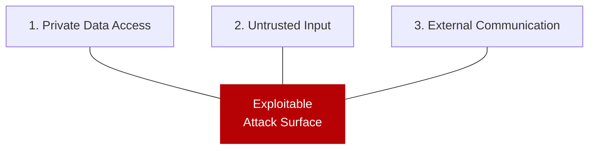

# Lethal Trifecta Threat Model

> Risk emerges when an agent has all three: access to private data, exposure to untrusted content, and the ability to communicate externally. Remove at least one from every execution path.

## The Three Legs

The **lethal trifecta** ([Willison, 2025](https://simonwillison.net/2025/Jun/16/the-lethal-trifecta/)) names three capabilities that together create an exploitable surface:



| Leg | What it means | Examples |
|-----|---------------|---------|
| **Private data** | Secrets, credentials, PII, or proprietary code | `.env` files, DB connections, internal repos |
| **Untrusted input** | Content the agent did not author and cannot fully trust | PR comments, GitHub issues, fetched pages, dependencies |
| **External communication** | Ability to send data outside the sandbox | HTTP tools, MCP servers with outbound calls |

LLMs cannot reliably distinguish trusted from injected instructions — once untrusted input enters context, it influences subsequent tool calls. The trifecta model shifts defense from prompt-level mitigations to architecture.

## Remove a Leg

**Ensure no execution path has all three legs.** Which leg to remove depends on the task:

### Remove egress (most common for coding agents)

Default-deny outbound network. Most coding tasks — read, analyze, edit, commit — need no network.

```yaml
# Docker-based sandbox — no network
docker run --network none agent-image
```

### Remove private data access

Strip sensitive data before it enters context.

- **PII tokenization** — replace real values with opaque tokens resolved in a trusted executor
- **Scoped credentials** — short-lived, minimal-permission tokens injected at runtime
- **File exclusion** — `.env`, credentials, and key files excluded from agent-accessible paths

### Remove untrusted input

Restrict the agent to operator-controlled content only — viable for internal automation but not for external code or user-generated content.

## Design Patterns for Trifecta Mitigation

Six patterns ([Beurer-Kellner et al., 2025](https://arxiv.org/abs/2506.08837)) map to leg removal:

| Pattern | Leg removed | Mechanism |
|---------|-------------|-----------|
| **Dual LLM** | Untrusted input | Privileged LLM decides; quarantined LLM handles untrusted content |
| **[Action-Selector](action-selector-pattern.md)** | Untrusted input | LLM picks from a fixed action set; injected instructions can't add new actions |
| **Plan-Then-Execute** | Untrusted input | Plan formed before untrusted content is seen; execution is deterministic |
| **Context-Minimization** | Untrusted input | Only minimum necessary untrusted content enters context |
| **Code-Then-Execute** | Untrusted input | LLM generates code; sandboxed runtime executes without LLM re-evaluation |
| **[LLM Map-Reduce](../multi-agent/llm-map-reduce.md)** | Private data | Each instance sees only a partition; no single instance has full data access |

[CaMeL](camel-control-data-flow-injection.md) ([Debenedetti et al., 2025](https://arxiv.org/abs/2503.18813)) enforces trifecta separation via control and data flow primitives, achieving 77% task completion with provable security.

## Attack Chains

**Poisoned dependency** ([Lynch / NVIDIA, 2025](https://developer.nvidia.com/blog/from-assistant-to-adversary-exploiting-agentic-ai-developer-tools/)): Agent reads a GitHub issue referencing a malicious pip package, installs it (egress), package exfiltrates env vars (private data). Fix: remove egress.

**Cross-agent privilege escalation** ([Embrace The Red, 2025](https://embracethered.com/blog/posts/2025/cross-agent-privilege-escalation-agents-that-free-each-other/)): Compromised agent rewrites another agent's config to remove sandbox constraints, giving it all three legs. Fix: protect config from agent writes.

**MCP tool exfiltration** ([Invariant Labs, 2025](https://invariantlabs.ai/blog/mcp-security-notification-tool-poisoning-attacks)): Malicious MCP server shadows trusted tools, intercepts calls to access private context, forwards to an external endpoint. Fix: restrict MCP server egress.

## Trifecta Audit Checklist

Map each execution path against the legs:

| Execution path | Private data? | Untrusted input? | Egress? | Safe? |
|----------------|:---:|:---:|:---:|:---:|
| Code review agent | Yes | Yes (PR content) | No | Yes |
| Research agent | No | Yes (web) | Yes | Yes |
| Deployment agent with env vars | Yes | Yes (repo config) | Yes | **No** |
| Internal codegen | Yes | No | Yes | Yes |

Three "Yes" values requires architectural mitigation.

## Mandatory Sandbox Controls

Controls ([Harang, 2025](https://developer.nvidia.com/blog/practical-security-guidance-for-sandboxing-agentic-workflows-and-managing-execution-risk/)):

- **Network egress restriction** — default-deny with explicit allowlists
- **File system isolation** — block writes outside the workspace
- **Config file protection** — prevent modification of `.cursorrules`, `CLAUDE.md`, MCP configs
- **Secret injection** — short-lived, minimal-permission tokens; never in agent-accessible paths

## When This Backfires

The trifecta model is a structural heuristic, not a guarantee. Three specific failure conditions:

1. **Leg removal is not always feasible.** A research agent fetching live web content, holding API keys, and posting to external endpoints has all three legs by design. Removing one breaks the agent. For unavoidable trifectas, teams need compensating controls — output scanning, rate-limiting, egress-volume anomaly detection.

2. **Partial-leg states are underspecified.** "Read-only egress" (fetch but not post) and "tokenized private data" (real values never in context) sit between leg-present and leg-absent. Binary Yes/No columns produce false confidence when a leg is partially present.

3. **Leg removal migrates risk.** Tokenizing PII shifts the attack to the token resolver. Sandboxing egress shifts the attack to sandbox-escape. Each removal creates a new high-value target that must itself be hardened.

## Related

- [Prompt Injection: A First-Class Threat to Agentic Systems](prompt-injection-threat-model.md)
- [Defense-in-Depth Agent Safety](defense-in-depth-agent-safety.md)
- [Prompt Injection-Resistant Agent Design](prompt-injection-resistant-agent-design.md)
- [Enterprise Agent Hardening](enterprise-agent-hardening.md)
- [PII Tokenization in Agent Context](pii-tokenization-in-agent-context.md)
- [Secrets Management for Agents](secrets-management-for-agents.md)
- [Blast Radius Containment](blast-radius-containment.md)
- [Dual-Boundary Sandboxing](dual-boundary-sandboxing.md)
- [Task Scope Security Boundary](task-scope-security-boundary.md)
- [Code Injection Defence in Multi-Agent Pipelines](code-injection-multi-agent-defence.md)
- [Scoped Credentials Proxy](scoped-credentials-proxy.md)
- [Scope Sandbox Rules to Harness-Owned Tools](sandbox-rules-harness-tools.md)
- [Guarding Against URL-Based Data Exfiltration](url-exfiltration-guard.md)
- [Protecting Sensitive Files from Agent Context](protecting-sensitive-files.md)
- [Safe Outputs Pattern](safe-outputs-pattern.md)
- [Human-in-the-Loop Confirmation Gates](human-in-the-loop-confirmation-gates.md)
- [Tool Signing and Signature Verification](tool-signing-verification.md)
- [Use a Public-Web Index to Gate Automatic URL Fetching](url-fetch-public-index-gate.md)
- [RL-Trained Automated Red Teamers for Prompt Injection Discovery](rl-automated-red-teamers.md)
- [Close the Attack-to-Fix Loop](close-attack-to-fix-loop.md)
- [Goal Reframing: The Primary Exploitation Trigger for LLM Agents](goal-reframing-exploitation-trigger.md)
- [Discovering Indirect Injection Vulnerabilities in Your Agent](indirect-injection-discovery.md)
