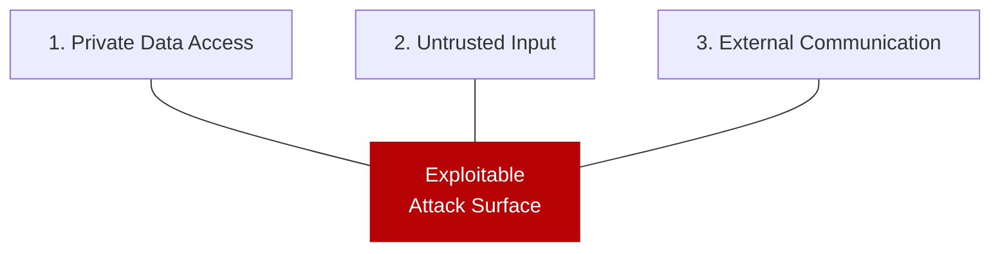

# Lethal Trifecta Threat Model

> The lethal trifecta is private data, untrusted input, and external egress on one path — remove at least one leg from every execution path.

Learn it hands-on with [The Lethal Trifecta guided lesson](https://learn.agentpatterns.ai/security/the-lethal-trifecta/), which includes quizzes.

## The three legs

The lethal trifecta ([Willison, 2025](https://simonwillison.net/2025/Jun/16/the-lethal-trifecta/)) names three capabilities that together create an exploitable surface:


```mermaid
graph TD
    PD["1. Private Data Access"]
    UI["2. Untrusted Input"]
    EC["3. External Communication"]

    PD --- RISK["Exploitable<br/>Attack Surface"]
    UI --- RISK
    EC --- RISK

    style RISK fill:#b60205,color:#fff,stroke:#b60205
```

| Leg | What it means | Examples |
|-----|---------------|---------|
| Private data | Secrets, credentials, PII, or proprietary code | `.env` files, DB connections, internal repos |
| Untrusted input | Content the agent did not author and cannot fully trust | PR comments, GitHub issues, fetched pages, dependencies |
| External communication | Ability to send data outside the sandbox | HTTP tools, MCP servers with outbound calls |

LLMs cannot reliably separate trusted instructions from injected ones. Once untrusted input enters context, it influences tool calls. The trifecta moves defense from prompt-level mitigation to architecture.

## Remove a leg

No execution path should hold all three legs. Which leg to remove depends on the task.

### Remove egress (most common for coding agents)

Default-deny outbound network — most coding tasks need none.

```yaml
# Docker-based sandbox — no network
docker run --network none agent-image
```

Vendors ship this as a deterministic control: OpenAI's Lockdown Mode caps outbound requests with no AI evaluation in the loop — no reliance on the model to police itself ([Willison, 2026](https://simonwillison.net/2026/Jun/5/lockdown-mode/)).

### Remove private data access

Strip sensitive data before it reaches context. You have three options:

- PII tokenization — replace real values with opaque tokens that a trusted executor resolves
- Scoped credentials — inject short-lived, minimal-permission tokens at runtime
- File exclusion — keep `.env`, credentials, and key files out of agent-accessible paths

### Remove untrusted input

Restrict the agent to operator-controlled content — viable for internal automation, not external or user-generated content.

## Design patterns for trifecta mitigation

Six patterns ([Beurer-Kellner et al., 2025](https://arxiv.org/abs/2506.08837)) harden agents against injection — five remove the untrusted-input leg outright; LLM Map-Reduce instead isolates untrusted input, bounding blast radius without removing a leg:

| Pattern | Leg removed | Mechanism |
|---------|-------------|-----------|
| Dual LLM | Untrusted input | Privileged LLM decides; quarantined LLM handles untrusted content |
| [Action-Selector](action-selector-pattern.md) | Untrusted input | LLM picks from a fixed action set; injected instructions can't add new actions |
| [Plan-Then-Execute](plan-then-execute-web-agents.md) | Untrusted input | Plan formed before untrusted content is seen; execution is deterministic |
| Context-Minimization | Untrusted input | Only minimum necessary untrusted content enters context |
| Code-Then-Execute | Untrusted input | LLM generates code; sandboxed runtime executes without LLM re-evaluation |
| [LLM Map-Reduce](../multi-agent/llm-map-reduce.md) | None — isolates untrusted input | Each isolated instance processes one untrusted partition; only constrained, format-checked map outputs reach the reducer, so an injection in one partition cannot steer the whole run |

[CaMeL](camel-control-data-flow-injection.md) ([Debenedetti et al., 2025](https://arxiv.org/abs/2503.18813)) enforces separation via control- and data-flow primitives — 77% task completion with provable security.

## Attack chains

Poisoned dependency ([Lynch / NVIDIA, 2025](https://developer.nvidia.com/blog/from-assistant-to-adversary-exploiting-agentic-ai-developer-tools/)): an agent reads a GitHub issue that names a malicious pip package and installs it (egress). The package then exfiltrates env vars (private data). Fix: remove egress.

Cross-agent privilege escalation ([Embrace The Red, 2025](https://embracethered.com/blog/posts/2025/cross-agent-privilege-escalation-agents-that-free-each-other/)): one agent rewrites another's config to drop sandbox constraints, granting all three legs. Fix: protect config from writes.

MCP tool exfiltration ([Invariant Labs, 2025](https://invariantlabs.ai/blog/mcp-security-notification-tool-poisoning-attacks)): a malicious MCP server shadows trusted tools, reads private context, and forwards it externally. Fix: restrict MCP server egress.

WebFetch exfiltration ([Willison, 2026](https://simonwillison.net/2026/Jul/15/claude-web-fetch-exfiltration/)): a worked demonstration against Claude's WebFetch tool, manipulated into leaking prior conversation context (private data) through a crafted request URL once untrusted input enters context — private data, untrusted input, and egress converging on a single tool call in a first-class coding-agent tool. Fix: remove egress or constrain the fetch destination.

## Trifecta audit checklist

| Execution path | Private data? | Untrusted input? | Egress? | Safe? |
|----------------|:---:|:---:|:---:|:---:|
| Code review agent | Yes | Yes (PR content) | No | Yes |
| Research agent | No | Yes (web) | Yes | Yes |
| Deployment agent with env vars | Yes | Yes (repo config) | Yes | No |
| Internal codegen | Yes | No | Yes | Yes |

Three "Yes" values require architectural mitigation.

## Mandatory sandbox controls

Set four controls ([Harang, 2025](https://developer.nvidia.com/blog/practical-security-guidance-for-sandboxing-agentic-workflows-and-managing-execution-risk/)):

- Network egress — default-deny with explicit allowlists
- File system — block writes outside the workspace
- Config protection — prevent changes to `.cursorrules`, `CLAUDE.md`, and MCP configs
- Secret injection — short-lived, minimal-permission tokens

## When this backfires

The trifecta model is a structural heuristic, not a guarantee:

1. Leg removal is not always feasible. A research agent that fetches live web content, holds API keys, and posts to external endpoints has all three legs by design. For unavoidable trifectas, add compensating controls such as output scanning, rate-limiting, and egress anomaly detection.

2. Partial-leg states are underspecified. "Read-only egress" and "[tokenized private data](pii-tokenization-in-agent-context.md)" sit between leg-present and leg-absent. Binary Yes/No columns produce false confidence when a leg is partially present.

3. Leg removal migrates risk. Tokenizing PII shifts the attack to the token resolver, and sandboxing egress shifts it to sandbox-escape. Each removal creates a new high-value target that you must harden in turn.

## FAQ

**Why isn't it enough to just tell the agent not to trust injected content?**

LLMs cannot reliably separate trusted instructions from injected ones — once untrusted input enters context, it influences tool calls no matter how firmly a system prompt warns against it. That's why the trifecta model treats defense as an architecture problem: remove one of the three legs so no single execution path can act on an injected instruction, instead of relying on the model to police itself.

**What if a task genuinely needs all three legs, like a research agent that fetches the web and posts results externally?**

Leg removal isn't always feasible — a research agent that fetches live web content, holds API keys, and posts to external endpoints has all three legs by design. For unavoidable trifectas, add compensating controls such as output scanning, rate-limiting, and egress anomaly detection. These narrow how much damage an injected instruction can do; they don't eliminate the exploitable surface, so they're a second-best option, not a substitute for removing a leg.

**Does read-only egress or tokenized data count as fully removing a leg?**

Not necessarily. States like read-only egress or [tokenized private data](pii-tokenization-in-agent-context.md) sit between leg-present and leg-absent, so a binary Yes/No audit column can produce false confidence when a leg is only partially removed. Treat a partial mitigation as reducing risk, not eliminating a leg, and re-check whether the remaining exposure still completes an exploitable path before calling the risk closed.

## Key Takeaways

- Risk requires all three legs at once: private data, untrusted input, and external egress. Removing any one closes the exfiltration path.
- Remove egress first for coding agents — most tasks need no network, and a [default-deny sandbox](dual-boundary-sandboxing.md) is a deterministic control the model cannot override.
- Audit per execution path, not per agent. A single path with three "Yes" values demands architectural mitigation, not prompt-level defenses.
- Leg removal migrates risk rather than erasing it: each removed leg creates a new high-value target (token resolver, sandbox boundary) that must itself be hardened.

## Related

- [Prompt Injection: A First-Class Threat to Agentic Systems](prompt-injection-threat-model.md)
- [Defense-in-Depth Agent Safety](defense-in-depth-agent-safety.md)
- [Prompt Injection-Resistant Agent Design](prompt-injection-resistant-agent-design.md)
- [PII Tokenization in Agent Context](pii-tokenization-in-agent-context.md)
- [Secrets Management for Agents](secrets-management-for-agents.md)
- [Dual-Boundary Sandboxing](dual-boundary-sandboxing.md)
- [Guarding Against URL-Based Data Exfiltration](url-exfiltration-guard.md)
- [Enterprise Agent Hardening](enterprise-agent-hardening.md)
