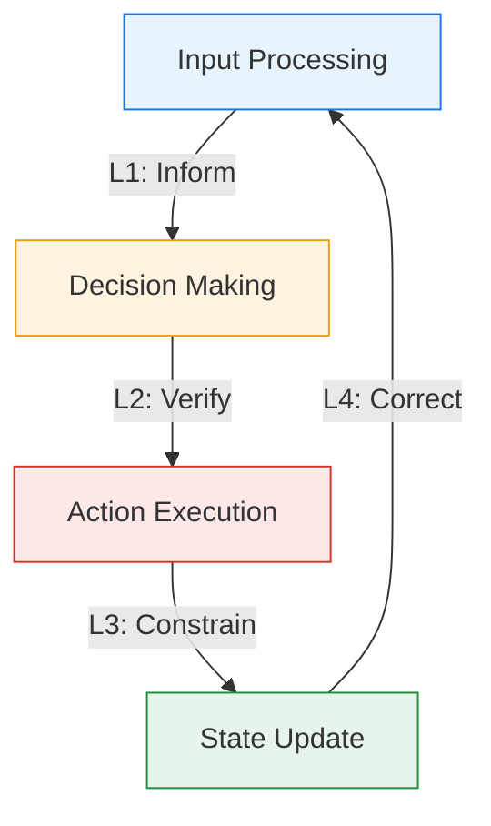
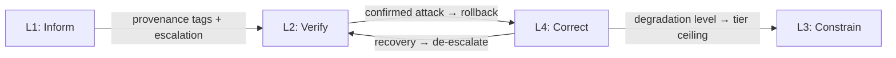

# Lifecycle-Integrated Security Architecture for Agent Harnesses

> Embed defense mechanisms into each phase of the agent execution lifecycle so layers coordinate through feedback channels rather than operating in isolation.

## Three Structural Gaps in Component-Level Defenses

Independent security components bolted on at fixed points create three gaps ([Lin et al., 2026 §1](https://arxiv.org/abs/2604.13630)):

- **Context blindness** — external guardrails like [NeMo Guardrails](https://docs.nvidia.com/nemo/guardrails/latest/index.html) and [Llama Guard](https://arxiv.org/abs/2312.06674) filter conversational boundaries with no visibility into harness-internal state; a poisoned tool output in the reasoning chain shapes actions undetected.
- **Inter-layer isolation** — checks cannot coordinate, so composite attacks leave each checkpoint seeing only a fragment of the signal.
- **Lack of resilience** — once outer defenses are penetrated, binary pass/block offers no mechanism for progressive restriction or graceful degradation.

## Four Defense Layers Mapped to the Execution Lifecycle

One defense layer maps to each phase of the agent execution loop ([Lin et al., 2026 §3.2](https://arxiv.org/abs/2604.13630)):

### L1: Inform — Input Filtering with Provenance

A three-stage pipeline sanitizes external content before it enters agent context ([Lin et al., 2026 §3.3.1](https://arxiv.org/abs/2604.13630)):

1. **Structural sanitization** — strips encoding obfuscation (hidden Unicode, HTML comments, homoglyphs via NFKC)
2. **Pattern detection** — regex fast-path for known injection patterns before LLM inference
3. **Semantic filtering** — a judge model strips override attempts when Stage 2 flags content

Each chunk gets a provenance tag (source type, trust, modification). Tool outputs and retrieved content default to "low" trust, reflecting elevated [indirect prompt injection](https://arxiv.org/abs/2302.12173) risk.

### L2: Verify — Tiered Decision Verification

Every tool invocation passes through three tiers ([Lin et al., 2026 §3.3.2](https://arxiv.org/abs/2604.13630)):

- **Tier 1 (Rule):** deterministic scoring on tool identity, argument patterns, path constraints — low-risk passes, high-risk blocks, ambiguous escalates.
- **Tier 2 (Judge):** a separate LLM rates the call as safe, uncertain, or unsafe given name, arguments, and recent reasoning.
- **Tier 3 (Causal):** causal analysis determines whether an ambiguous call reflects legitimate intent or adversarial injection.

### L3: Constrain — Privilege-Separated Execution

Three mechanisms enforce least-privilege at execution ([Lin et al., 2026 §3.3.3](https://arxiv.org/abs/2604.13630)):

- **Risk tier classification** — five tiers (read-only, write, execute, network, destructive); each call is checked against the ceiling.
- **Capability tokens** — session tokens carry TTL, max invocations, and a cryptographic signature, bounding blast radius of a compromised session.
- **Integrity verification** — HMAC-SHA256 signatures on tool descriptions, recomputed on access to block tampering.

### L4: Correct — Rollback and Adaptive Degradation

Last-line defense when upstream layers fail ([Lin et al., 2026 §3.3.4](https://arxiv.org/abs/2604.13630)):

**Checkpointing** snapshots file system, execution history, and memory at intervals; rollback restores environment and persistent state so memory corruption does not survive recovery.

**Adaptive degradation** replaces binary pass/block with progressive restriction — each confirmed attack raises the level:

| Level | Effect |
|-------|--------|
| 0 | All tool tiers enabled (normal) |
| 1 | Destructive tools disabled |
| 2 | Network tools additionally disabled |
| 3 | Execute tools disabled |
| 4 | Read-only operations only |

**Adaptive recovery** prevents permanent capability loss: after a window without violations (default 5 steps), degradation drops one step.

## Cross-Layer Feedback

Unlike independent [defense-in-depth](defense-in-depth-agent-safety.md), layers communicate through feedback channels ([Lin et al., 2026 §3.3.5-3.3.6](https://arxiv.org/abs/2604.13630)):

**Entropy monitor.** A sliding window (default 20 actions) tracks violation rate across L1, L2, L3 signals. Exceeding the threshold (default 0.3) raises L2's minimum tier, forcing LLM scrutiny ([Lin et al., 2026 §3.3.5](https://arxiv.org/abs/2604.13630)) — catching bursts of borderline actions that individually pass but are jointly suspicious.

Feedback paths: L1→L2 raises the verification floor on injection detection; L2→L4 rolls back on confirmed attacks; L4→L3 caps the tool tier by degradation level; L4→L2 relaxes verification as privileges restore.

## Empirical Results

On Agent-SafetyBench with DeepSeek-V3.2 across three harness configurations (ReAct, Multi-Agent, Self-Evolving) and five attack types ([Lin et al., 2026 §4](https://arxiv.org/abs/2604.13630)):

- **ReAct:** 22.4 pp UBR reduction, 22.8 pp ASR reduction vs baseline
- **Aggregate:** ~38% UBR and ~42% ASR reduction; task completion within 1-2 pp of baselines
- **Residual:** memory injection retains 55-56% UBR; composite attacks carry highest residual risk ([§4.3](https://arxiv.org/abs/2604.13630))

## When This Pattern Fails

- **Simulated evaluation only.** The paper's execution environment is simulated; production transfer is future work ([§5](https://arxiv.org/abs/2604.13630)).
- **Memory injection remains potent.** Persistent memory still reaches 55%+ unsafe behavior rates.
- **Cost exceeds ROI for low-risk agents.** For read-only agents or prototypes, independent [defense-in-depth](defense-in-depth-agent-safety.md) delivers most of the benefit at lower complexity.
- **Coupling amplifies false positives.** A misconfigured entropy monitor can cascade blocks system-wide.
- **Latency-sensitive pipelines.** LLM-judge escalation may add unacceptable overhead in high-frequency tool-calling.

## Key Takeaways

- Three structural gaps — context blindness, inter-layer isolation, lack of resilience — explain why independent components fail against composite attacks
- Map one defense layer to each execution phase (input, decision, execution, state) to eliminate unprotected stages
- Cross-layer feedback turns independent defenses into a coordinated system where sustained anomalies escalate responses
- Adaptive degradation with automatic recovery replaces binary pass/block, preserving functionality under attack
- Capability tokens with TTL and invocation limits provide time-bounded least-privilege access
- Use the full architecture for high-stakes deployments; simpler defense-in-depth suffices for low-risk agents

## Related

- [Defense-in-Depth Agent Safety](defense-in-depth-agent-safety.md)
- [Enterprise Agent Hardening](enterprise-agent-hardening.md)
- [Harness Engineering](../agent-design/harness-engineering.md)
- [Blast Radius Containment: Least Privilege for AI Agents](blast-radius-containment.md)
- [Prompt Injection Threat Model](prompt-injection-threat-model.md)
- [Tool Signing and Signature Verification](tool-signing-verification.md)
- [Close the Attack-to-Fix Loop](close-attack-to-fix-loop.md)
- [Dual-Boundary Sandboxing](dual-boundary-sandboxing.md)
