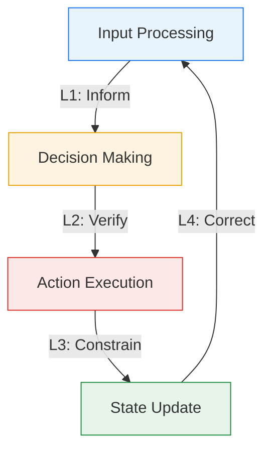
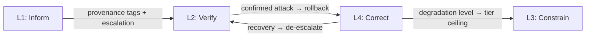

# Lifecycle-Integrated Security Architecture for Agent Harnesses

> Embed defense mechanisms into each phase of the agent execution lifecycle so layers coordinate through feedback channels rather than operating in isolation.

## Three structural gaps in component-level defenses

Independent components bolted on at fixed points create three gaps ([Lin et al., 2026 §1](https://arxiv.org/abs/2604.13630)):

- Context blindness — external guardrails like [NeMo Guardrails](https://docs.nvidia.com/nemo/guardrails/latest/index.html) and [Llama Guard](https://arxiv.org/abs/2312.06674) filter conversational boundaries blind to harness-internal state, so a poisoned tool output shapes actions undetected.
- Inter-layer isolation — checks cannot coordinate, so composite attacks leave each checkpoint seeing only a signal fragment.
- Lack of resilience — once outer defenses are breached, pass or block offers no progressive restriction or graceful degradation.

## Four defense layers mapped to the execution lifecycle

One defense layer maps to each phase of the execution loop ([Lin et al., 2026 §3.2](https://arxiv.org/abs/2604.13630)):

```mermaid
graph TD
    A[Input Processing] -->|L1: Inform| B[Decision Making]
    B -->|L2: Verify| C[Action Execution]
    C -->|L3: Constrain| D[State Update]
    D -->|L4: Correct| A

    style A fill:#e8f4fd,stroke:#1a73e8
    style B fill:#fef3e0,stroke:#e8a100
    style C fill:#fce8e6,stroke:#d93025
    style D fill:#e6f4ea,stroke:#1e8e3e
```

### L1: Inform — input filtering with provenance

A three-stage pipeline sanitizes content before it enters agent context ([Lin et al., 2026 §3.3.1](https://arxiv.org/abs/2604.13630)):

1. Structural sanitization strips encoding obfuscation: hidden Unicode, HTML comments, homoglyphs via NFKC.
2. Pattern detection runs a regex fast-path for known injection patterns before LLM inference.
3. Semantic filtering uses a judge model to strip override attempts when stage 2 flags content.

Each chunk gets a provenance tag (source type, trust, modification). Tool outputs and retrieved content default to "low" trust, reflecting elevated [indirect prompt injection](https://arxiv.org/abs/2302.12173) risk.

### L2: Verify — tiered decision verification

Every tool call passes through three tiers ([Lin et al., 2026 §3.3.2](https://arxiv.org/abs/2604.13630)):

- Tier 1 (rule): deterministic scoring on tool identity, argument patterns, path constraints — low-risk passes, high-risk blocks, ambiguous escalates.
- Tier 2 (judge): a separate LLM rates the call as safe, uncertain, or unsafe given name, arguments, and reasoning.
- Tier 3 (causal): causal analysis decides whether an ambiguous call reflects legitimate intent or adversarial injection.

### L3: Constrain — privilege-separated execution

Three mechanisms enforce least privilege at execution ([Lin et al., 2026 §3.3.3](https://arxiv.org/abs/2604.13630)):

- Risk tier classification defines five tiers (read-only, write, execute, network, destructive); each call is checked against the ceiling.
- Capability tokens carry a TTL, max invocations, and a cryptographic signature, bounding blast radius of a compromised session.
- Integrity verification adds HMAC-SHA256 signatures to tool descriptions, recomputed on access to block tampering.

### L4: Correct — rollback and adaptive degradation

These are the last-line defense when upstream layers fail ([Lin et al., 2026 §3.3.4](https://arxiv.org/abs/2604.13630)).

Checkpointing snapshots file system, execution history, and memory at intervals; rollback restores environment and persistent state so memory corruption does not survive recovery.

Adaptive degradation replaces pass or block with progressive restriction. Each confirmed attack raises the level:

| Level | Effect |
|-------|--------|
| 0 | All tool tiers enabled (normal) |
| 1 | Destructive tools disabled |
| 2 | Network tools additionally disabled |
| 3 | Execute tools disabled |
| 4 | Read-only operations only |

Adaptive recovery prevents permanent capability loss: after a clean window (default 5 steps), degradation drops one step.

## Cross-layer feedback

Unlike independent [defense-in-depth](defense-in-depth-agent-safety.md), the layers communicate through feedback channels ([Lin et al., 2026 §3.3.5-3.3.6](https://arxiv.org/abs/2604.13630)):

```mermaid
graph LR
    L1[L1: Inform] -->|provenance tags + escalation| L2[L2: Verify]
    L2 -->|confirmed attack → rollback| L4[L4: Correct]
    L4 -->|degradation level → tier ceiling| L3[L3: Constrain]
    L4 -->|recovery → de-escalate| L2
```

An entropy monitor's sliding window (default 20 actions) tracks violation rate across L1, L2, and L3 signals. Exceeding the threshold (default 0.3) raises L2's minimum tier and forces LLM scrutiny ([Lin et al., 2026 §3.3.5](https://arxiv.org/abs/2604.13630)), catching bursts of actions that individually pass but are jointly suspicious.

Feedback paths: L1→L2 raises the verification floor on injection detection; L2→L4 rolls back on confirmed attacks; L4→L3 caps the tool tier by degradation level; L4→L2 relaxes verification as privileges restore.

## Empirical results

On Agent-SafetyBench with DeepSeek-V3.2 across three configurations (ReAct, Multi-Agent, Self-Evolving) and five attack types ([Lin et al., 2026 §4](https://arxiv.org/abs/2604.13630)):

- ReAct: 22.4 pp UBR reduction, 22.8 pp ASR reduction versus baseline
- Aggregate: about 38% UBR and 42% ASR reduction, task completion within 1 to 2 pp of baselines
- Residual: memory injection retains 55 to 56% UBR; composite attacks carry highest residual risk ([§4.3](https://arxiv.org/abs/2604.13630))

## When this pattern fails

- Simulated evaluation only. The execution environment is simulated; production transfer is future work ([§5](https://arxiv.org/abs/2604.13630)).
- Memory injection remains potent. Persistent memory still reaches over 55% unsafe behavior rates.
- Cost outweighs the benefit for low-risk agents. For read-only agents or prototypes, independent [defense-in-depth](defense-in-depth-agent-safety.md) delivers most of the benefit at lower complexity.
- Coupling amplifies false positives. A misconfigured entropy monitor can cascade blocks system-wide.
- Latency-sensitive pipelines suffer. LLM-judge escalation may add unacceptable overhead in high-frequency tool-calling.

## Key Takeaways

- Three structural gaps — context blindness, inter-layer isolation, lack of resilience — explain why independent components fail against composite attacks
- Map one defense layer to each execution phase (input, decision, execution, state) to eliminate unprotected stages
- Cross-layer feedback turns independent defenses into a coordinated system where sustained anomalies escalate responses
- Adaptive degradation with automatic recovery replaces binary pass/block, preserving functionality under attack
- Capability tokens with TTL and invocation limits provide time-bounded least-privilege access
- Use the full architecture for high-stakes deployments; simpler defense-in-depth suffices for low-risk agents

## Related

- [Defense-in-Depth Agent Safety](defense-in-depth-agent-safety.md)
- [Four-Layer Taxonomy of Agent Security Risks](four-layer-agent-security-taxonomy.md) — competing execution-surface framing of the same risks, organized by surface rather than lifecycle phase
- [OWASP LLM Top 10 (2025): Agent Security Crosswalk](owasp-llm-top-10-2025-agent-crosswalk.md) — named-threat lookup table that maps onto the lifecycle phases here, not a competing taxonomy
- [Constraint Drift: Why Safety Must Be Maintained, Not Asserted](constraint-drift-multi-agent-safety.md)
- [Enterprise Agent Hardening](enterprise-agent-hardening.md)
- [Blast Radius Containment: Least Privilege for AI Agents](blast-radius-containment.md)
- [Prompt Injection Threat Model](prompt-injection-threat-model.md)
- [Tool Signing and Signature Verification](tool-signing-verification.md)
- [Dual-Boundary Sandboxing](dual-boundary-sandboxing.md)
