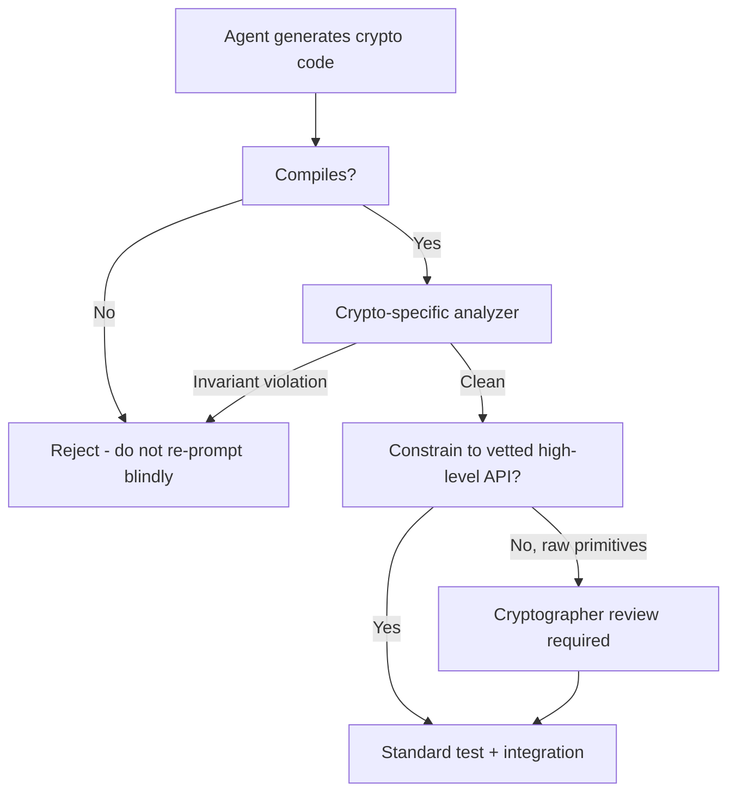

# Verifying LLM-Generated Cryptographic Code

> LLM-generated crypto code rarely compiles and is usually exploitable when it does. Verify with a crypto-specific analyzer, avoid chain-of-thought, and constrain agents to vetted APIs.

## The failure surface

A controlled study of 240 Rust samples produced these results. The study covered three LLMs (Gemini 2.5 Pro, GPT-4o, DeepSeek Coder), two AEAD ciphers, four prompt strategies, and ten samples each ([Elsayed et al., 2026](https://arxiv.org/abs/2604.27001)):

| Metric | Result |
|---|---|
| Samples that compiled | 23.3% (56 / 240) |
| Compiled samples with crypto vulnerabilities | 57% (rule-based analyzer, zero false positives) |
| AES-256-GCM compile rate | 34.2% |
| ChaCha20-Poly1305 compile rate | 12.5% |
| Chain-of-thought vs zero-shot | ~5× worse for CoT (P = 0.002) |

Two failure modes recurred across all three models: nonce reuse and cryptographic API hallucination. The models invented function signatures and got argument orders wrong against the `aes-gcm` and `chacha20poly1305` crates ([Elsayed et al., 2026](https://arxiv.org/abs/2604.27001)).

The pattern matches broader data on AI-generated code. Pearce et al. found that about 40% of Copilot completions across 89 CWE-Top-25 scenarios were vulnerable ([Pearce et al., 2021](https://arxiv.org/abs/2108.09293)). Cryptographic code sits at the worst end of that distribution.

## Why general SAST misses it

The Elsayed et al. analyzer found 57% of compiled samples vulnerable; CodeQL's general-purpose rules did not. The gap is structural:

- Non-syntactic invariants. Nonce uniqueness, key separation, AEAD tag verification, and IND-CCA boundaries are properties of runtime behavior, not source-code shapes. General SAST has no rule for "this nonce has been used twice with the same key."
- API hallucination sits below the lint threshold. Invented signatures fail to compile, and the failure is silent. No security signal reaches the developer, only a build error they may "fix" by re-prompting.
- Compiled-but-wrong is the dangerous quadrant. An agent that iterates against `cargo build` until it passes selects for samples that look correct.

A crypto-specific analyzer encodes the actual invariants: nonce-counter monotonicity, AEAD tag verification on every decrypt path, and KDF parameter floors. Generic SAST is necessary but not sufficient.

## Why chain-of-thought backfires

The 5× CoT penalty inverts the usual prior that CoT improves reasoning ([Wei et al., 2022](https://arxiv.org/abs/2201.11903)). Two mechanisms fit the observation:

- Reasoning amplifies hallucination. Each intermediate step is another decision point where the model can confidently assert a wrong crypto invariant and carry it into the code. Turpin et al. showed that CoT explanations rationalize wrong outputs rather than correct them, with accuracy dropping by up to 36% on biased prompts ([Turpin et al., 2023](https://arxiv.org/abs/2305.04388)).
- Structural anchors compound. Reasoning-to-code transitions are where CoT-induced fragility concentrates ([CoT Robustness in Code Generation](../verification/cot-robustness-code-generation.md)). Crypto code has more such anchors per line than typical application code — algorithm choice, mode, KDF, nonce strategy, and encoding — so CoT has more chances to drift.

For cryptographic generation, prefer zero-shot prompts that name the exact crate and high-level API over reasoning-style prompts.

## Verification architecture


```mermaid
graph TD
    A[Agent generates crypto code] --> B[Compiles?]
    B -->|No| Z[Reject - do not re-prompt blindly]
    B -->|Yes| C[Crypto-specific analyzer]
    C -->|Invariant violation| Z
    C -->|Clean| D[Constrain to vetted high-level API?]
    D -->|No, raw primitives| E[Cryptographer review required]
    D -->|Yes| F[Standard test + integration]
    E --> F
```

Layered defense for any pipeline where an agent may emit cryptographic code:

1. Constrain at the prompt. Specify the high-level AEAD wrapper (for example, from the [RustCrypto `aead` trait](https://docs.rs/aead/latest/aead/)) and the nonce-generation strategy. Forbid raw block-cipher use.
2. Use zero-shot, not CoT, for crypto generation. Reverse the usual default for this code path.
3. Fail closed on compile errors. Do not blindly re-prompt until `cargo build` passes — that loop selects for plausible-looking but invariant-violating code. Treat compile failure as a signal the model lacks coverage for this API.
4. Run a crypto-specific analyzer post-compile. Encode rules for nonce uniqueness, tag verification, KDF floors, and mode misuse. The Elsayed et al. analyzer ran with zero false positives on real LLM output.
5. Require human cryptographer review for any code touching raw primitives, custom KDFs, or new algorithm integrations.

A [security constitution](security-constitution-ai-code-gen.md) encoding these rules at specification time prevents the agent from emitting failing patterns in the first place.

## When this backfires less

The recommendations target direct generation of cryptographic implementation code by general-purpose LLMs. They matter less when:

- The agent uses crypto via a vetted SDK such as AWS KMS or Vault rather than implementing it. API-level use is dominated by argument correctness.
- The task is migration or refactoring of audited code, with reference output the agent can match against.
- A constrained-decoding harness restricts output to a fixed grammar of approved API calls.

The failure surface is concentrated where an agent invents algorithm-level code from a natural-language description against a generalist model with no specialized verification.

## Example

Treat this as a checklist applied to a pull request that adds AEAD encryption.

```yaml
crypto-pr-checklist:
  prompt-discipline:
    - prompt-named-exact-crate: true              # required: e.g., "aes-gcm 0.10"
    - prompt-named-high-level-api: true           # required: AeadInPlace::encrypt
    - cot-or-reasoning-mode-disabled: true        # required for crypto paths
  build-gate:
    - compiles-cleanly-on-first-try: true         # if false, do NOT re-prompt - investigate
  crypto-analyzer:
    - nonce-uniqueness-rule-passes: true
    - aead-tag-verified-on-every-decrypt: true
    - kdf-iterations-above-floor: true            # e.g., PBKDF2 >= 600,000
    - no-raw-block-cipher-use: true
  human-review:
    - cryptographer-signoff-if-raw-primitives: true
    - cryptographer-signoff-if-custom-kdf: true
```

Any `false` in the build-gate or crypto-analyzer rows should block merge regardless of test pass rate. The `compiles-cleanly-on-first-try` flag matters because [iterative fix loops accumulate security regressions invisible to functional tests](security-drift-iterative-refinement.md).

## Key Takeaways

- LLM-generated cryptographic code compiled in only 23.3% of 240 controlled samples; 57% of the compiled code contained crypto-specific vulnerabilities ([Elsayed et al., 2026](https://arxiv.org/abs/2604.27001)).
- General SAST does not catch crypto invariant violations — pair every crypto code path with a rule-based crypto analyzer.
- Chain-of-thought prompting was ~5× worse than zero-shot for crypto generation; reverse the usual CoT default for these prompts.
- Constrain agents to vetted high-level AEAD APIs and require human cryptographer review for any raw-primitive code.

## Related

- [Security Constitution for AI Code Generation](security-constitution-ai-code-gen.md)
- [Security Drift in Iterative LLM Code Refinement](security-drift-iterative-refinement.md)
- [CoT Robustness in Code Generation](../verification/cot-robustness-code-generation.md)
- [Cryptographic Governance Audit Trail](cryptographic-governance-audit-trail.md)
