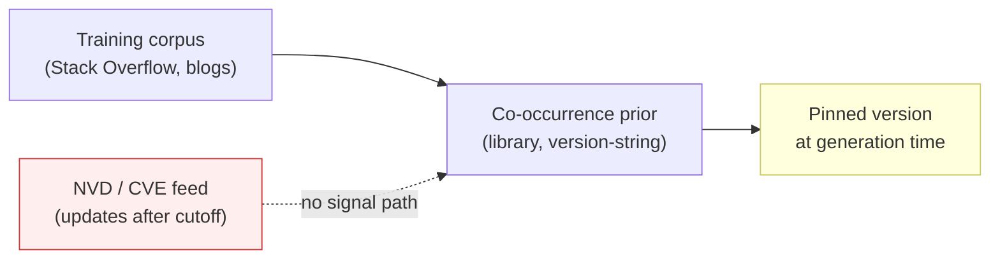

# LLM-Pinned Library Versions Carry Systemic CVE Exposure

> LLM-pinned library versions routinely carry known CVEs because the model's prior favors popular-but-outdated releases; a bias shared across models, so pin against external CVE data.

## The Finding

Wang et al. (May 2026) evaluated 10 LLMs on PinTrace, a 1,000-task Python benchmark drawn from Stack Overflow, checking every generated `requirements.txt`, `pyproject.toml`, and inline `pip install` against the National Vulnerability Database ([arXiv:2605.06279](https://arxiv.org/abs/2605.06279)):

- **36.70%-55.70%** of tasks include at least one library at a version with a known CVE.
- **All ten models converge on the same small set of risky releases** — the failure is systemic, not per-model.

Convergence rules out the "use a better model" remediation. The risk lives in the training distribution, not the weights.

## How Often Models Specify Versions

Specification rate depends on what the model is asked to produce ([arXiv:2605.06279](https://arxiv.org/abs/2605.06279)):

| Surface | Version-specified rate |
|---|:---:|
| Direct prompt ("install X to do Y") | 26.83%-95.18% |
| Manifest file (`requirements.txt`, `pyproject.toml`) | 6.45%-59.19% |

Manifest files — the surface that actually controls reproducible installs — get versions least often. A study of Developer-ChatGPT conversations found version constraints in only 9% of exchanges, almost always at the user's prompting ([arXiv:2401.16340](https://arxiv.org/abs/2401.16340)).

## Severity and Disclosure Cutoff

When the model does pin a version, the CVE distribution is heavy on the dangerous end ([arXiv:2605.06279](https://arxiv.org/abs/2605.06279)):

| Property | Range across 10 models |
|---|:---:|
| CVEs rated Critical or High | 62.75%-74.51% |
| CVEs disclosed before the model's training cutoff | 72.27%-91.37% |

The cutoff result is load-bearing: most vulnerable versions were public in CVE databases before training. The model picked them anyway because its prior reflects historical co-occurrence in the corpus, not current vulnerability state.

## The Versions Often Don't Even Install

Functional compatibility tracks vulnerability incidence — the same prior that picks vulnerable versions picks broken ones ([arXiv:2605.06279](https://arxiv.org/abs/2605.06279)):

| Check | Pass rate range |
|---|:---:|
| Static install (`pip install` succeeds) | 19.70%-63.20% |
| Dynamic functional test (code runs and matches expected behaviour) | 6.49%-48.62% |

A version string that fails to install is loud and self-correcting. One that installs but carries CVE-2023-XXXXX is silent.

## Why Models Converge on Risky Versions



The model learns a co-occurrence prior over `(library, version-string)` pairs. Stack Overflow answers and blogs overrepresent the version current when the popular answer was written. The CVE feed has no signal path into this prior, so every model trained on the same corpus inherits the same bias — no prompt engineering reshapes the underlying statistics. The fix must come from outside the model.

## What to Change

**Externally anchored version constraints** reduce both vulnerability exposure and compatibility failure ([arXiv:2605.06279](https://arxiv.org/abs/2605.06279)). Every effective anchor routes around the model's prior:

- **CVE-aware lookup at install time.** Run `pip-audit`, `npm audit`, or [Dependabot security updates](https://docs.github.com/en/code-security/concepts/supply-chain-security/about-dependabot-security-updates) as a blocking CI gate; the agent's manifest becomes a hint validated against current CVE state.
- **Curated allowlist or internal mirror.** Artifactory or Nexus filters block known-vulnerable versions at install time, so the agent's pin is dead-on-arrival if it points at a blocked release.
- **Auto-bump after merge.** Pair with [Renovate](https://docs.renovatebot.com/dependency-pinning/) or Dependabot so safe-at-merge versions get bumped as new CVEs land.
- **Lock-then-resolve workflow.** Pipe the agent's `requirements.txt` through `pip-compile`, `uv lock`, or `poetry lock` in a clean environment — the same workflow that closes the missing-dependency gap ([Dependency Gap Validation](../verification/dependency-gap-validation.md)) surfaces vulnerable transitive pulls.

## Example

An agent generates a Flask scraper and writes:

```text
# requirements.txt
flask==2.0.3
requests==2.25.1
pyyaml==5.4
```

All three install cleanly. Static checks pass. CI is green.

```bash
$ pip-audit -r requirements.txt
Found 4 known vulnerabilities in 3 packages
Name     Version  ID                  Fix Versions
-------- -------- ------------------- ------------
flask    2.0.3    PYSEC-2023-62       2.2.5,2.3.2
requests 2.25.1   GHSA-j8r2-6x86-q33q 2.31.0
requests 2.25.1   GHSA-9wx4-h78v-vm56 2.32.0
pyyaml   5.4      GHSA-8q59-q68h-6hv4 5.4 (fixed via patch)
```

The model picked the version of each library that dominates Stack Overflow tutorials from 2021-2022. Each carries a publicly-disclosed CVE that landed before the model's training cutoff. A blocking [`pip-audit`](https://pypi.org/project/pip-audit/) step in CI surfaces all four in seconds; the agent (or a follow-up bump PR) rewrites to `flask==2.3.2`, `requests==2.32.0`, `pyyaml==6.0.1` and the pipeline continues. The commit message and the test suite would never have caught this.

## When This Backfires

- **Throwaway prototypes.** A CVE-database step adds latency for code that will never leave a laptop.
- **Already-locked monorepos.** When `pip-compile` / `uv lock` / `poetry lock` already runs in CI, the agent's pin is a hint resolved against existing lockfile policy; a second LLM-side check duplicates work.
- **Air-gapped or curated mirrors.** When Artifactory or Nexus already blocks vulnerable versions at install time, an agent-side step is redundant.
- **Mature canonical libraries.** For `requests`, `numpy`, `pandas`, the bias toward popular versions often selects safe-enough releases; CVE exposure concentrates in the long tail.

## Key Takeaways

- 36.7%-55.7% of LLM-specified library versions carry a known CVE; 62.75%-74.51% of those CVEs are Critical or High severity ([arXiv:2605.06279](https://arxiv.org/abs/2605.06279))
- 72.27%-91.37% of the vulnerable versions had CVEs disclosed before the model's training cutoff — the prior is permanently behind the threat landscape
- All 10 models tested converge on the same risky releases — this is a training-distribution effect, not a per-model defect; switching models does not help
- Treat agent-written manifests as a hint, not a source of truth — validate against `pip-audit`, Dependabot, or a curated mirror as a blocking CI gate
- 19.70%-63.20% of pinned versions even fail to install — the same prior produces both insecure and broken pins, so install-time checks catch both classes

## Related

- [Dependency Gap Validation for AI-Generated Code](../verification/dependency-gap-validation.md) — the missing-dependency complement; the same lock-then-resolve workflow surfaces transitive CVEs
- [The Security Review Gap in AI-Authored PRs](../code-review/security-review-gap-in-ai-prs.md) — companion finding on CWEs in agent-written code itself
- [Always-On PR Security Review](always-on-pr-security-review.md) — the CI surface where CVE-audit gates land
- [Skill Supply-Chain Poisoning](skill-supply-chain-poisoning.md) — adjacent supply-chain attack via the skill registry rather than the package registry
- [Tool Signing and Signature Verification](tool-signing-verification.md) — cryptographic anchor for tools; the package-anchor analogue for dependencies
- [Security Constitution for AI Code Generation](security-constitution-ai-code-gen.md) — specification-layer policy that includes dependency-version constraints

## Sources

- [arXiv:2605.06279](https://arxiv.org/abs/2605.06279) — Wang et al. (May 2026): "Correct Code, Vulnerable Dependencies: A Large Scale Measurement Study of LLM-Specified Library Versions"
- [arXiv:2401.16340](https://arxiv.org/abs/2401.16340) — Versions appear in only 9% of Developer-ChatGPT conversations
- [arXiv:2503.17181](https://arxiv.org/abs/2503.17181) — Library-preference bias, NumPy overuse in up to 45% of cases
- [GitHub Docs — Dependabot security updates](https://docs.github.com/en/code-security/concepts/supply-chain-security/about-dependabot-security-updates)
- [Renovate — Dependency Pinning](https://docs.renovatebot.com/dependency-pinning/)
- [pip-audit](https://pypi.org/project/pip-audit/)
