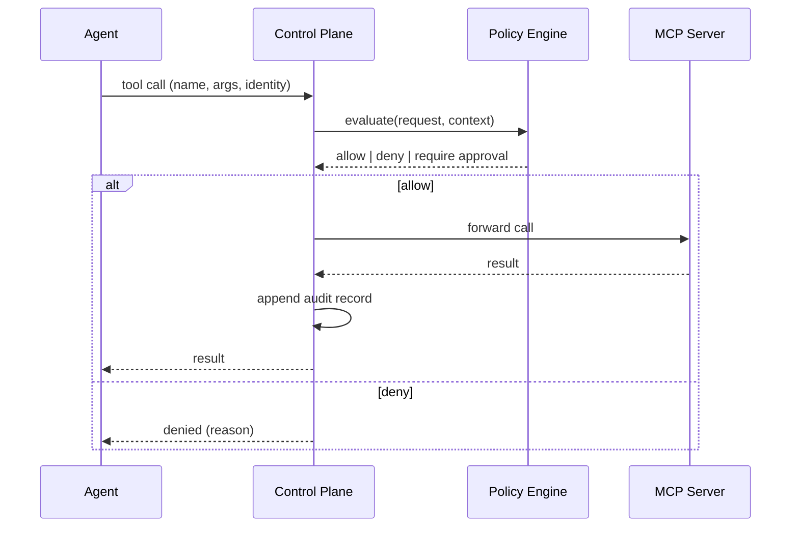

# MCP Runtime Control Plane: Policy Evaluation Between Agent and Tool

> Intercept every MCP tool call at a single policy evaluation point — identity, tool name, arguments, rate limits — before the call reaches the server.

An agent connected to many MCP servers inherits each server's ad-hoc authorisation model. A runtime control plane collapses those N policies into one evaluation point between the agent and the tool: every call is intercepted, checked against a central policy corpus, and either forwarded or denied, with the decision logged. AWS, Microsoft, and Red Hat ship reference implementations of this pattern, all built on the same primitive — a policy decision point that runs before tool execution.

## Interception Loop



AWS Bedrock AgentCore wires this shape explicitly: Policy in AgentCore "intercepts all agent traffic through Amazon Bedrock AgentCore Gateways and evaluates each request against defined policies in the policy engine before allowing tool access" ([AgentCore Policy](https://docs.aws.amazon.com/bedrock-agentcore/latest/devguide/policy.html)). Microsoft's Agent Governance Toolkit takes the same position one layer up, inside the framework: "every tool call, resource access, and inter-agent message is evaluated against policy *before* execution" ([agent-governance-toolkit](https://github.com/microsoft/agent-governance-toolkit)).

## Policy Dimensions

Implementations converge on the same evaluation inputs:

| Dimension | Example rule |
|-----------|--------------|
| Identity | Agent acts on behalf of user in group `finance`; non-finance users may not invoke `ledger.write` |
| Tool name | `shell.exec` is blocked regardless of arguments |
| Argument inspection | `deploy(environment=production)` requires a higher approval tier than `deploy(environment=staging)` |
| Rate limit | Agent may call `search` at most 60/min per session |
| Environment | Tool is callable from staging runners, blocked from developer laptops |
| Data labels | Block if input carries `confidential` tag and destination lacks matching scope |

AgentCore expresses these in [Cedar](https://www.cedarpolicy.com/); Red Hat's MCP Gateway reference uses OPA with JWT `resource_access` claims ([Red Hat Developer](https://developers.redhat.com/articles/2025/12/12/advanced-authentication-authorization-mcp-gateway)). The Microsoft toolkit ships a native evaluator keyed on the same fields ([agent-governance-toolkit](https://github.com/microsoft/agent-governance-toolkit)).

## Distinct from Lower Layers

The control plane is the *runtime governance* layer. It is not:

- **Network egress policy.** Domain allow/deny decides whether a TCP connection leaves the sandbox, below any MCP-level decision — see [Agent Network Egress Policy](agent-network-egress-policy.md).
- **Process sandbox.** Filesystem and PID isolation constrain what a running tool process can touch; the control plane runs before the process starts — see [Scope Sandbox Rules to Harness-Owned Tools](sandbox-rules-harness-tools.md).
- **MCP transport.** `initialize`, capability negotiation, and JSON-RPC framing describe how messages move; policy evaluation rides on top — see [MCP Client/Server Architecture](../tool-engineering/mcp-client-server-architecture.md).

Defence in depth combines all four. The arxiv survey places control planes alongside sandboxing, provenance tracking, and DLP as complementary controls, not substitutes ([Securing the MCP — arxiv 2511.20920](https://arxiv.org/abs/2511.20920)).

## Why Deterministic Enforcement

Prompt-based safety depends on the model following instructions. Microsoft's Agent Governance Toolkit benchmark reports a 26.67% policy violation rate for prompt-only controls against red-team inputs, versus 0.00% for deterministic application-layer enforcement ([agent-governance-toolkit benchmark](https://github.com/microsoft/agent-governance-toolkit)). The control plane's value is that the decision is independent of model judgment — an injected prompt that instructs the agent to call a denied tool still hits the policy check and is rejected.

## When This Backfires

Real limits, documented by practitioners:

1. **Off-protocol actions bypass the plane.** The gateway sees MCP traffic only; shell commands, direct HTTP, DB drivers, and headless browsers are invisible to it, creating blind spots that look like coverage ([Security Boulevard](https://securityboulevard.com/2026/03/why-mcp-gateways-are-a-bad-idea-and-what-to-do-instead/)).
2. **Clients can skip the plane.** Unless every agent runtime is wired through the gateway, direct API calls or shadow connectors reach the server unchecked; partial coverage gives false confidence ([Strata: Prevent MCP Bypass](https://www.strata.io/blog/agentic-identity/prevent-mcp-bypass/)).
3. **Tool-name policies without argument inspection miss injection.** Argument-injection attacks against pre-approved commands (e.g., `shell.exec` with unchecked args) escalate to RCE even with the policy in place ([Trail of Bits: Prompt injection to RCE](https://blog.trailofbits.com/2025/10/22/prompt-injection-to-rce-in-ai-agents/)).
4. **Centralised secrets and single-point-of-failure.** Routing all tool calls through one broker makes it a target for compromise and an outage surface; replicate regionally and keep credentials out of the proxy where possible ([Security Boulevard](https://securityboulevard.com/2026/03/why-mcp-gateways-are-a-bad-idea-and-what-to-do-instead/)).

Pair the control plane with an MCP registry (what tools exist) and framework-level runtime hooks (what the agent did off-protocol) to close these gaps.

## Example

A Cedar policy enforced by AgentCore restricts a deployment agent to staging unless the caller is on-call:

```cedar
permit (
  principal in Role::"deployment-agent",
  action == Action::"invokeTool",
  resource == Tool::"deploy_service"
) when {
  resource.arguments.environment == "staging" ||
  (resource.arguments.environment == "production" &&
   principal.oncall == true)
};
```

AgentCore's gateway evaluates this Cedar document on every `deploy_service` call; production invocations by a non-on-call principal are denied before reaching the MCP server, and both allow and deny decisions are written to the audit log ([AgentCore Policy](https://docs.aws.amazon.com/bedrock-agentcore/latest/devguide/policy.html)).

## Key Takeaways

- A runtime control plane collapses N per-server authorisation models into one policy evaluation point between agent and tool.
- Consistent policy dimensions: identity, tool name, argument inspection, rate limit, environment, data labels.
- Deterministic enforcement (Cedar, OPA) is independent of model judgment; prompt-only controls measure ~27% violation rates in red-team tests vs 0% for policy engines.
- The plane covers only traffic that traverses it; pair with a registry, runtime hooks, and argument-level policy to address bypass and blind-spot failure modes.
- Control plane is distinct from network egress policy (lower), sandbox rules (process), and MCP transport; defence in depth combines all four.

## Related

- [Scope Sandbox Rules to Harness-Owned Tools, Not Third-Party MCP Tools](sandbox-rules-harness-tools.md)
- [Agent Network Egress Policy: Admin-Controlled Domain Allow/Deny](agent-network-egress-policy.md)
- [MCP Client/Server Architecture](../tool-engineering/mcp-client-server-architecture.md)
- [Blast Radius Containment: Least Privilege for AI Agents](blast-radius-containment.md)
- [Tool-Invocation Attack Surface](tool-invocation-attack-surface.md)
- [Defense-in-Depth Agent Safety](defense-in-depth-agent-safety.md)
- [Enterprise Agent Hardening: Governance and Observability](enterprise-agent-hardening.md)
- [Human-in-the-Loop Confirmation Gates for Consequential Agent Actions](human-in-the-loop-confirmation-gates.md)
