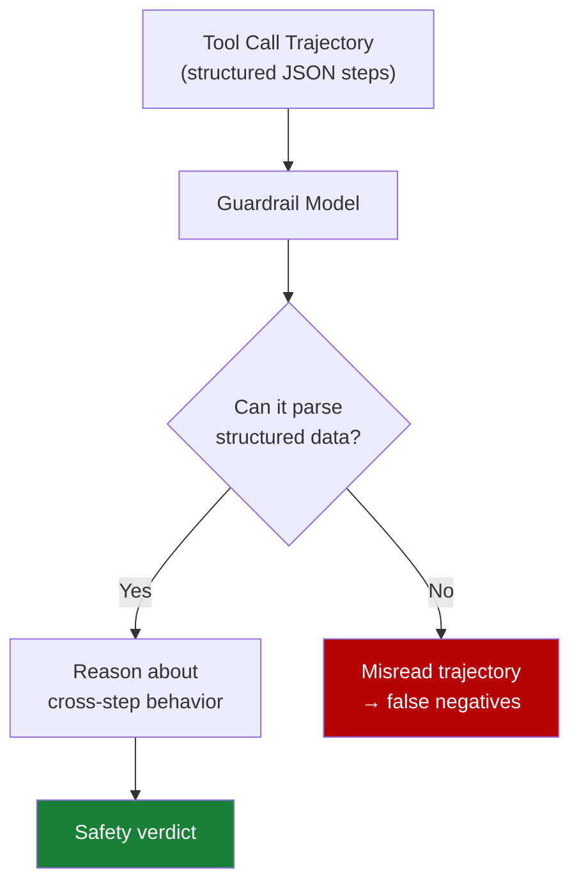

# Mid-Trajectory Guardrail Selection for Multi-Step Tool Calls

> In agentic tool-calling workflows, guardrail efficacy correlates more strongly with a model's structured data competence than with its safety training. Select guard models based on JSON parsing and schema-handling capability, not safety benchmark scores alone.

## The Mid-Trajectory Gap

Most safety benchmarks evaluate guardrails on single-turn outputs — a model produces a response, the guardrail classifies it. Agentic systems expose a different surface: a sequence of tool calls where harmful intent can be distributed across steps, each individually appearing benign.

TraceSafe-Bench, the first benchmark targeting mid-trajectory safety, evaluated 13 LLM-as-a-guard models and 7 specialized guardrail systems across 1,000+ multi-step tool-calling trajectories and 12 risk categories ([TraceSafe, 2026](https://arxiv.org/abs/2604.07223)). The benchmark spans two risk families:

- **Security threats**: prompt injection, privacy leaks, tool parameter manipulation, chained instruction overrides
- **Operational failures**: hallucinations, interface inconsistencies, state desynchronization

The finding: guardrail performance in this context is not well predicted by single-turn safety benchmarks.

## Structural Competence Predicts Performance

TraceSafe found that guardrail efficacy correlates strongly (ρ=0.79) with structured data benchmarks — JSON parsing accuracy, schema adherence — while showing minimal correlation with jailbreak robustness scores ([TraceSafe, 2026](https://arxiv.org/abs/2604.07223)).

The reason is mechanical: tool-calling trajectories consist of structured JSON inputs and outputs. A guardrail must parse these correctly to reason about what each step did, what parameters were passed, and whether the sequence constitutes a policy violation. A model that struggles with structured data will misread trajectories before it can apply any safety logic.

General-purpose LLMs consistently outperformed specialized safety guardrails on trajectory analysis — model architecture dominated model scale and safety-specific fine-tuning ([TraceSafe, 2026](https://arxiv.org/abs/2604.07223)).

## Multi-Step Obfuscation Evades Single-Turn Defenses

The primary evasion pattern in multi-step trajectories is distributing harmful intent across tool calls. Each individual step passes single-turn guardrails; the violation only manifests when steps are read as a sequence ([TraceSafe, 2026](https://arxiv.org/abs/2604.07223)).

This is structurally distinct from the injection attacks that [single-layer defenses](../anti-patterns/single-layer-injection-defence.md) fail to address. Single-turn guardrails evaluate calls in isolation; they cannot detect:

- **Chained instruction overrides** — tool result at step 3 re-scopes authority granted at step 1
- **Context confusion** — guardrail loses track of which principal issued which instruction across a long trajectory
- **Multi-step obfuscation** — harmful parameter values assembled across calls rather than passed in one call

Accuracy of guardrail models improves over extended trajectories as models accumulate dynamic execution behavior rather than relying solely on static tool definitions ([TraceSafe, 2026](https://arxiv.org/abs/2604.07223)). This suggests positioning guardrail evaluation at trajectory checkpoints — not only at each individual tool call.

## Guardrail Selection Criteria

When selecting a guard model for a multi-step tool-calling workflow:

| Criterion | Why it matters |
|-----------|----------------|
| **Structured data benchmark scores** | Predicts ability to parse and reason over JSON trajectories (ρ=0.79 correlation with mid-trajectory efficacy) |
| **Context window and long-context accuracy** | Trajectories grow; guardrail must maintain coherence across many steps |
| **General-purpose capability** | Outperforms specialized safety guardrails on trajectory tasks |
| **Jailbreak benchmark scores** | Weak predictor of mid-trajectory performance — necessary but not sufficient |

Specialized safety guardrails tuned for single-turn output classification are not the strongest choice for trajectory analysis. A general-purpose LLM with high structured data competence and long-context accuracy is a stronger baseline ([TraceSafe, 2026](https://arxiv.org/abs/2604.07223)).

## Positioning Guardrails in the Harness

Three placement strategies, ordered from weakest to strongest coverage:

1. **Per-call evaluation** — guardrail sees each tool call independently. Catches single-call violations; misses multi-step patterns. Lowest cost.
2. **Sliding window evaluation** — guardrail sees the last N calls as a sequence. Catches short-range chained overrides. Moderate cost.
3. **Trajectory checkpoint evaluation** — guardrail reviews the full trajectory at defined checkpoints (e.g., every 5 calls, at task phase transitions). Catches distributed obfuscation. Highest accuracy per TraceSafe findings.

Combine per-call evaluation for obvious violations with trajectory checkpoints for sequence-level detection. Reserve the full-trajectory review for security-critical workflows where false negatives carry high cost.

## Key Takeaways

- Mid-trajectory guardrail performance correlates with structured data competence (ρ=0.79) more than jailbreak robustness — optimize guard model selection accordingly
- General-purpose LLMs outperform specialized safety guardrails on multi-step trajectory analysis
- Multi-step obfuscation distributes harmful intent across tool calls; single-turn guardrails are structurally blind to this
- Position guardrail evaluation at trajectory checkpoints, not only per-call, to catch cross-step violations
- Guardrail accuracy improves with trajectory length as dynamic execution behavior accumulates

## Unverified Claims

- The claim that sliding window evaluation provides materially better coverage than per-call evaluation has not been benchmarked directly in the TraceSafe paper — this is an architectural inference from the temporal accuracy finding

## Related

- [Tool-Invocation Attack Surface](tool-invocation-attack-surface.md) — argument-generation and return-processing attacks on individual tool calls
- [Defense-in-Depth Agent Safety](defense-in-depth-agent-safety.md) — layering principle that mid-trajectory guardrails extend
- [Deterministic Guardrails Around Probabilistic Agents](../verification/deterministic-guardrails.md) — rule-based checks that complement LLM guard models
- [Single-Layer Prompt Injection Defence](../anti-patterns/single-layer-injection-defence.md) — anti-pattern that mid-trajectory obfuscation exploits
- [Trajectory-Opaque Evaluation Gap](../verification/trajectory-opaque-evaluation-gap.md) — why outcome-only grading misses safety violations in intermediate steps
- [Prompt Injection Threat Model](prompt-injection-threat-model.md) — foundational injection attack model that multi-step attacks build upon
- [Indirect Injection Discovery](indirect-injection-discovery.md) — finding injection vulnerabilities before adversaries do
