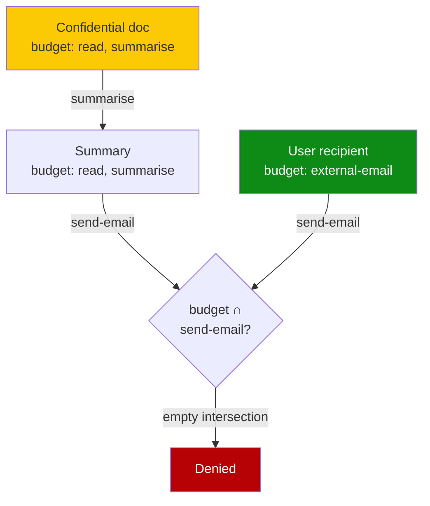

# Monotonic Capability Attenuation for Composition-Safe Tool Use

> Tag every value with a sink-specific capability budget and intersect budgets through composition — authority can only shrink, closing permission laundering.

## When This Recommendation Applies

The pattern produces a real security delta only inside these conditions ([Jiang et al., 2026](https://arxiv.org/abs/2605.26542)):

- **Expert-crafted manifests are feasible.** Capability budgets per sink are authored by someone who understands the threat model. With naive manifests, blocking rate drops to 27.3% — close to no defense.
- **Attacks are explicit-flow.** The adversary exfiltrates data the proxy can see: tool arguments, return values, chained call inputs. Implicit flows (timing, denial signals, side channels) are out of scope.
- **All tool traffic traverses one observation point.** Off-protocol egress — `curl` shellouts, raw HTTP libraries, headless browser sessions — bypasses the proxy and silently breaks the guarantee.
- **A token-budget margin exists.** Capability metadata on every value compounds the [35× MCP proxy overhead](https://www.mindstudio.ai/blog/mcp-vs-cli-agentic-workflows-token-overhead-reliability) over equivalent CLI tools.

Outside these conditions, the mechanism degrades or fails silently. See [When This Backfires](#when-this-backfires).

## What Permission Laundering Is

An agent reads a confidential document, summarises it, sends the summary externally. Each per-tool check passes — read is allowed for that file, summarise is content-agnostic, send-email is permitted to that recipient — yet the chained effect is exfiltration. The vulnerability is not at any single hop; it is the composition itself, which synthesises authority no single value ever held ([Jiang et al., 2026](https://arxiv.org/abs/2605.26542)).

This is structurally distinct from prompt injection (which corrupts the instruction channel) and from [overreaching tool calls](permission-framework-over-model.md) (which exceed authorised scope at one call). Permission laundering chains legal calls into an illegal outcome.

## How Monotonic Attenuation Works

Every value entering the agent's context carries a **sink-specific capability budget** — a set of sinks the value is permitted to reach (`{file-read, summarise}` for a confidential document; `{external-email, log}` for a user-typed recipient). The runtime tracks budgets per value, not per tool ([Jiang et al., 2026](https://arxiv.org/abs/2605.26542)).

Tool composition propagates budgets by **intersection**: when a tool call consumes inputs `A` and `B`, its output carries `budget(A) ∩ budget(B)`. The result: the output can reach a sink only if *every* input was allowed to reach that sink. Authority strictly attenuates — a value can lose sinks through composition, never gain them.

The check at `send-email` reduces to set membership: is `external-email` in `budget(summary)`? Because the summary inherits the document's budget through intersection, it is not — and the call is denied.

Implemented as a transparent MCP proxy, the mechanism requires no changes to the agent or to tool servers; the proxy sees every call, attaches and intersects budgets, and gates each sink ([Jiang et al., 2026](https://arxiv.org/abs/2605.26542)).

## Why It Works

Composition is the lever permission laundering exploits — per-tool checks each pass while the chained effect is unsafe. Monotonic intersection denies the attacker any composition that synthesises new authority. Because intersection is monotonic and local, the proxy needs no global plan: each interception is a set-membership check against the value's accumulated budget ([Jiang et al., 2026](https://arxiv.org/abs/2605.26542)). The enforcement boundary shifts from "per-tool" to "per-value lifetime," which is the layer at which laundering occurs. This matches the architectural reasoning in [CaMeL](camel-control-data-flow-injection.md), which encodes the same logic via a Python interpreter rather than a proxy. Across 82 tasks on five frontier models, the mechanism reduces attack success from 25–68% to 0–4.8% while preserving 96–100% benign completion ([Jiang et al., 2026](https://arxiv.org/abs/2605.26542)).

## When This Backfires

The mechanism degrades or fails outside its operating envelope.

- **Naive manifests collapse the defense.** Blocking rate falls to 27.3% when capability budgets are authored without security expertise — close to no defense ([Jiang et al., 2026](https://arxiv.org/abs/2605.26542)). The paper names manifest quality "the dominant deployment bottleneck." Teams without a dedicated security engineering function inherit the naive number by default.
- **Implicit flows escape.** The scope is explicitly bounded to "explicit-flow composition safety under trusted manifests and proxy-visible data movement" ([Jiang et al., 2026](https://arxiv.org/abs/2605.26542)). Causality laundering — exfiltrating data through denial signals — is invisible because no value carrying a capability budget changes hands ([Causality Laundering, 2026](https://arxiv.org/abs/2604.04035)).
- **Conjunctive emergent capability is structurally missed.** Per-value monotonic intersection cannot detect cases where two individually-safe values combine into an unsafe end-state. A formal result demonstrates this gap and reports 42.6% of 900 real multi-tool trajectories contain at least one conjunctive dependency ([Safety is Non-Compositional, 2026](https://arxiv.org/abs/2603.15973)).
- **Off-protocol egress bypasses the proxy.** Any side channel that does not traverse the [MCP runtime control plane](mcp-runtime-control-plane.md) — direct shell `curl`, embedded SDK calls, cached state — sits outside the mechanism's reach. Projects with skipped-plane clients lose the guarantee without realising it.
- **Token budgets compound.** Capability metadata on every value compounds the [35× MCP proxy overhead](https://www.mindstudio.ai/blog/mcp-vs-cli-agentic-workflows-token-overhead-reliability) over equivalent CLI tools. Agents already near context-budget ceilings cannot absorb the overhead without truncating reasoning context.

A pragmatic alternative when these conditions fail is to remove a leg of the [lethal trifecta](lethal-trifecta-threat-model.md) — disable egress, narrow private-data scope, or sandbox untrusted input — which achieves closure deterministically and carries no manifest authoring debt.

## Relation to CaMeL and the MCP Control Plane

Monotonic capability attenuation, [CaMeL](camel-control-data-flow-injection.md), and the [MCP Runtime Control Plane](mcp-runtime-control-plane.md) sit at three different layers of the same overall architecture:

| Pattern | Enforcement layer | Mechanism | Manifest authoring |
|---------|------------------|-----------|--------------------|
| [CaMeL](camel-control-data-flow-injection.md) | Dual-LLM with custom Python interpreter | Capability labels on values; security policies checked at tool-call time | Per-tool policies authored alongside tool definitions |
| Monotonic capability attenuation | Transparent MCP proxy between agent and tools | Per-value capability budgets; intersection across composition | Per-sink budgets; expert-crafted required for 100% blocking |
| [MCP Runtime Control Plane](mcp-runtime-control-plane.md) | Proxy between agent and tools | Identity, rate-limit, tool-name policy evaluated per call | Identity/policy rules per tool surface |

The patterns compose. A defense-in-depth posture can run all three — the control plane gates on identity, the capability budgets gate on composition, and CaMeL-style separation handles instruction-vs-data integrity. None alone covers the others' failure modes.

## Key Takeaways

- Monotonic capability attenuation closes the permission-laundering gap by tagging every value with a sink-specific budget and intersecting budgets through composition — authority can only shrink.
- Attack success drops from 25–68% to 0–4.8% across 82 tasks on five frontier models when manifests are expert-crafted, with 96–100% benign completion preserved.
- Manifest quality is the deciding variable: naive manifests reach 27.3% blocking, expert-crafted reach 100%. Teams without security-engineering capacity will deploy the naive number.
- The mechanism is bounded to explicit-flow attacks under trusted manifests and proxy-visible data movement. Implicit flows, conjunctive emergent capabilities, and off-protocol egress are not addressed.
- A transparent MCP proxy is the deployment vehicle. The 35× token overhead of MCP versus CLI tools compounds when every value carries capability metadata — confirm context-budget margin before adopting.
- Pair with [lethal-trifecta](lethal-trifecta-threat-model.md) leg removal and [CaMeL](camel-control-data-flow-injection.md) control/data separation as a layered posture; neither alone covers the others' failure modes.

## Related

- [CaMeL: Defeating Prompt Injections by Separating Control and Data Flow](camel-control-data-flow-injection.md)
- [MCP Runtime Control Plane: Policy Evaluation Between Agent and Tool](mcp-runtime-control-plane.md)
- [Lethal Trifecta Threat Model](lethal-trifecta-threat-model.md)
- [Hybrid Deterministic + Semantic Authorization for Agent Tool Calls](hybrid-deterministic-semantic-tool-authorization.md)
- [Blast Radius Containment: Least Privilege for AI Agents](blast-radius-containment.md)
