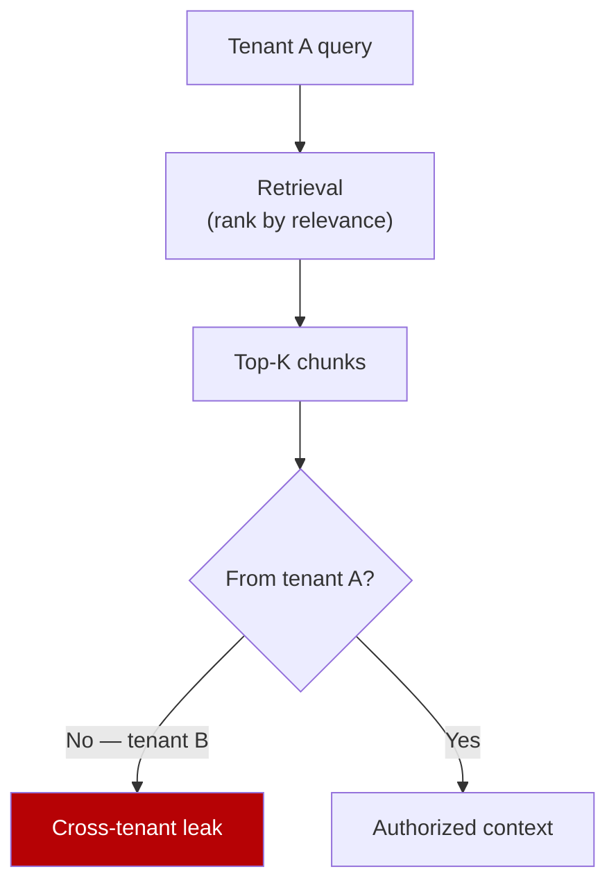

# Multitenant RAG: Closing the Relevance-Authorization Gap

> The multitenant RAG relevance-authorization gap: retrieval ranks by relevance, not authorization, so one tenant's top chunk may belong to another. Gate retrieval by policy.

**Learn it hands-on:** [The Chunk That Wasn't Yours](https://learn.agentpatterns.ai/security/the-chunk-that-wasnt-yours/) — guided lesson with quizzes.

## The Gap

Vector and lexical retrieval rank by similarity, BM25, or hybrid scoring. None of these signals know who the requester is. When tenants share an index, "most relevant chunk" and "chunk this tenant may see" are independent properties — the highest-scoring document for tenant A may belong to tenant B.

In the OGX evaluation ([Arceo and Narsing, 2026](https://arxiv.org/abs/2605.05287)), ungated retrieval leaked cross-tenant data in **98–100% of probes**. The failure is structural, not a model defect: the embedding worked; it had no view into policy.



## The Three-Layer Fix

The paper moves authorization from "filter the output" to "filter the search space" ([Arceo and Narsing, 2026, §3](https://arxiv.org/abs/2605.05287)).

| Layer | What it does | Where it runs |
|-------|--------------|---------------|
| **Policy-aware ingestion** | Tag every chunk with tenant ID and ABAC attributes at ingest | Indexing pipeline |
| **Retrieval-time gating** | Pre-filter the search space by authorization, then post-filter the top-K to catch ANN approximations | Retrieval service |
| **Shared inference** | A single LLM serves all tenants because only authorized chunks ever enter the prompt | Inference service |

The retrieval-time predicate is one set definition: `{d ∈ D: relevance(q,d) > θ ∧ P(u,d) = permit}`. Both conditions must hold for a chunk to reach the model.

### Why two-tier filtering

A pre-filter alone can be bypassed by approximate-nearest-neighbour paths that traverse the index outside the metadata filter; a post-filter alone collapses recall, because the vector DB already spent its top-K budget on forbidden chunks ([Pinecone: RAG with Access Control](https://www.pinecone.io/learn/rag-access-control/)). The pre-filter cuts the search space before scoring; the post-filter is defence-in-depth on the result set.

## Tool-Mediated Disclosure and Context Accumulation

The relevance-authorization gap is one of four failure modes the paper formalizes; the other three appear once tools and multi-turn state enter the picture ([Arceo and Narsing, 2026](https://arxiv.org/abs/2605.05287)):

- **Tool-mediated disclosure** — tools reading a shared backing store (databases, S3, Slack) need per-record authorization. Authorizing the *tool call* is not enough; authorize the *record access* inside the tool.
- **Context accumulation across turns** — multi-turn state carries authorized data forward. If state is keyed only by session, identity switches (token refresh, impersonation) inherit the prior tenant's context, the same cross-tenant state leak that [shared-container isolation knobs](multi-tenant-isolation-knobs-agent-sdk.md) address at the SDK level. Scope state by tenant, not session.
- **Client-side orchestration bypass** — when the client drives the agent loop, the client becomes the enforcement point. Server-side orchestration (the OpenAI Responses API model) keeps tool execution, state, and policy inside one trust boundary; OGX implements this as a vendor-neutral Responses API ([github.com/ogx-ai/ogx](https://github.com/ogx-ai/ogx)).

## Empirical Results

| Metric | Ungated | Gated |
|--------|--------:|------:|
| Cross-Tenant Leakage Rate | 98–100% | **0%** |
| Authorization Violation Rate | non-zero | **0%** |
| Prompt-injection probes leaked | 62–80% | **0/90** |
| Search-path overhead | — | ~19ms (auth 14 + policy <1 + lookup 5) |
| Precision@5 | 0.200 | 0.433 (2.2×) |
| MRR | 0.700 | 1.000 |

All figures from [Arceo and Narsing, 2026](https://arxiv.org/abs/2605.05287). Gating also improves retrieval quality — cross-tenant chunks scoring highest were never relevant signal for the asking tenant.

## Example

The `relevance(q, d) > θ ∧ P(u, d) = permit` predicate, expressed as a Qdrant filter on a shared collection ([Qdrant: Filtering documentation](https://qdrant.tech/documentation/search/filtering/)):

**Before** — relevance only, post-filter in the application layer:

```python
# Vector DB returns top-K from the global corpus,
# the application then drops chunks the user can't see.
results = qdrant.search(
    collection_name="docs",
    query_vector=embed(query),
    limit=10,
)
authorized = [r for r in results if can_read(user, r.payload)]
# authorized may be < 10; ranking reflects the global corpus, not the tenant's
```

**After** — pre-filter in the index, plus post-filter for defence-in-depth:

```python
from qdrant_client.models import Filter, FieldCondition, MatchValue

results = qdrant.search(
    collection_name="docs",
    query_vector=embed(query),
    query_filter=Filter(must=[
        FieldCondition(key="tenant_id", match=MatchValue(value=user.tenant_id)),
        FieldCondition(key="classification", match=MatchValue(value=user.clearance)),
    ]),
    limit=10,
)
# Index excludes other tenants before scoring.
authorized = [r for r in results if policy.permit(user, r.payload)]
# Defence-in-depth — catches ANN paths that bypassed the metadata filter.
```

The pre-filter restricts candidates before scoring; the post-filter catches ANN edge cases.

## When This Backfires

- **Hierarchical permissions** — when access derives from nested folders or group inheritance, ABAC requires expanding ancestor attributes onto every chunk at ingest. Re-ingest cost grows with the depth of the hierarchy. Relationship-based access control (ReBAC) handles this more naturally ([Oso: The Right Approach to Authorization in RAG](https://www.osohq.com/post/right-approach-to-authorization-in-rag)).
- **Cross-tenant aggregation tools** — analytics, billing, or admin tools that legitimately read across tenants cannot be authorized at the tool boundary alone. They need per-record authorization inside the tool implementation.
- **Embedding-level signal carry-over** — if embeddings are fine-tuned per tenant, model weights themselves carry tenant-specific signal, a confidentiality surface distinct from the access slice covered by [embedding inversion](embedding-inversion-vector-store-disclosure.md). Shared inference does not address this; only per-tenant model copies do.
- **Per-tenant infrastructure may be simpler** — for high-value or regulated tenants, a dedicated index, embedding model, and inference endpoint per tenant eliminates the gap by construction. The paper's Kubernetes Operator supports this. The trade-off is cost versus betting compliance on policy code that runs alongside an LLM.

## Key Takeaways

- Retrieval ranks by relevance; authorization is a separate predicate. Compose them at the retrieval boundary, not the application layer.
- A two-tier filter (pre-search ABAC plus post-retrieval chunk filter) closes both ranking-stage leaks and ANN-bypass leaks.
- Move tool execution, multi-turn state, and policy decisions server-side, as the OpenAI Responses API model does. Client-driven loops put the enforcement point on the wrong side of the trust boundary.
- Gating improved Precision@5 by 2.2× — cross-tenant chunks that scored highly were never relevant signal in the first place.

## Related

- [RAG Architecture as a Poisoning Robustness Decision](rag-architecture-poisoning-robustness.md)
- [Lethal Trifecta Threat Model](lethal-trifecta-threat-model.md)
- [Hybrid Deterministic + Semantic Authorization for Agent Tool Calls](hybrid-deterministic-semantic-tool-authorization.md)
- [PII Tokenization in Agent Context](pii-tokenization-in-agent-context.md)
- [Scoped Credentials via Proxy Outside the Agent Sandbox](scoped-credentials-proxy.md)
- [Enterprise Agent Hardening](enterprise-agent-hardening.md)
- [Task-Based Access Control with Hybrid Inspection](task-based-access-control-hybrid-inspection.md)
- [Prompt Injection: A First-Class Threat to Agentic Systems](prompt-injection-threat-model.md)
