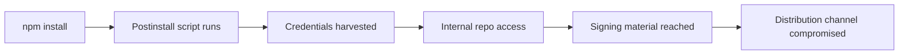

# Containment Playbook: npm-to-Signing-Channel Compromise

> An `npm install` worm harvests developer credentials and pivots into corporate repos. When those repos hold signing material, the compromise reaches the signing channel.

## When This Playbook Applies

All four must hold:

1. You ship **signed binary clients** notarized through Apple, Microsoft, or equivalent.
2. Code-signing keys are **reachable from corporate source repos**.
3. Engineers run `npm install` against the **public registry** from machines that reach those repos.
4. You have **endpoint telemetry** to identify which machines installed a version.

If any fails, scope down: SaaS-only teams skip certificate rotation, and teams on `trustedDependencies` allowlists ([npm 10.3+](https://mondoo.com/blog/npm-supply-chain-security-package-manager-defenses-2026)) or a proxied private registry run a shorter version.

This is the **consumer-side** vector. The publisher-side compromise that hit TanStack itself — GitHub Actions cache poisoning plus OIDC token memory extraction from a CI runner ([TanStack postmortem](https://tanstack.com/blog/npm-supply-chain-compromise-postmortem)) — is out of scope.

## The Attack Chain

A malicious postinstall script runs with the user's full privileges before runtime controls activate. EDR, tuned for file-hash signatures and mass-encryption behavior, does not catch a postinstall script inside a legitimate package manager ([SC Media](https://www.scworld.com/perspective/trusted-by-default-the-npm-attack-pattern-security-teams-miss), [Aikido](https://www.aikido.dev/blog/endpoint-security-for-developer-devices)).

The Mini Shai-Hulud worm — payload behind 170+ npm packages in May 2026, including 84 versions across 42 `@tanstack/*` packages — harvests GitHub, npm, Actions, and cloud credentials, runs TruffleHog over the filesystem, and exfiltrates an AES-256-GCM bundle to a public GitHub repo ([Datadog](https://securitylabs.datadoghq.com/articles/shai-hulud-2.0-npm-worm/), [Orca](https://orca.security/resources/blog/tanstack-npm-supply-chain-worm/)).

## The Playbook

Execute in order; each step has a hard exit criterion.

### 1. Isolate impacted endpoints

Identify every machine that installed an affected version in the breach window and pull it off the network. Suspend SSO sessions and refresh tokens. Do not wipe — preserve package cache and shell history for forensics.

**Exit:** every confirmed host isolated; impacted users signed out of IdP, GitHub, npm, and cloud.

### 2. Rotate credentials by blast radius

Rotate from what the worm targets outward: GitHub PATs and SSH keys, npm tokens, Actions secrets, cloud credentials. Any secret in env vars, the SDK cache, or on disk is assumed compromised ([Datadog](https://securitylabs.datadoghq.com/articles/shai-hulud-2.0-npm-worm/)).

**Revoke only after the host is isolated and imaged.** The Mini Shai-Hulud payload installs a `gh-token-monitor` daemon (macOS LaunchAgent / Linux systemd) that polls every 60 seconds and runs `rm -rf ~/` when it sees a 40X from a revoked GitHub token — so revoking before you have removed the daemon and captured forensic images can destroy the developer machine ([OPSWAT](https://www.opswat.com/blog/mini-shai-hulud-tanstack-openai-and-the-npm-supply-chain-trap), [Wiz](https://www.wiz.io/blog/mini-shai-hulud-strikes-again-tanstack-more-npm-packages-compromised)). Sequence it after step 1, not in parallel.

**Exit:** every credential reachable from an impacted host rotated and revoked at the issuer — after the `gh-token-monitor` daemon is confirmed removed.

### 3. Freeze deploys

Halt automated deploys from any pipeline that touched an impacted credential — a rotation racing a deploy can ship a stolen-key binary that notarizes before the cert is revoked.

**Exit:** deploy workflows disabled; manual deploys gated through a small reviewer pool.

### 4. Re-sign and ship new builds

Issue new code-signing certificates, re-sign every shipping product, and test the update channel first.

**Exit:** new builds live via auto-update on every affected product and platform.

### 5. Coordinate notarization revocation

For macOS, coordinate with Apple to block notarization of the impacted material; fraudulent apps then lack notarization and are blocked by default ([OpenAI](https://openai.com/index/our-response-to-the-tanstack-npm-supply-chain-attack/)). Equivalents apply for SmartScreen, iOS, and Play Integrity.

**Exit:** revocation confirmed by the provider; new signing material registered.

### 6. Ship the forcing-function client update

Announce a certificate-revocation deadline that forces every user to update. OpenAI gave users until **June 12, 2026** after announcing on May 13 — a ~30-day window, short enough to close the breach yet long enough for auto-update to reach users before launches fail ([OpenAI](https://openai.com/index/our-response-to-the-tanstack-npm-supply-chain-attack/), [The Record](https://therecord.media/openai-asks-macos-users-to-update-tanstack-npm)). Communicate the deadline in-app, by email, and on the status page; ship before announcing.

**Exit:** old certificate revoked on schedule; update curve approaching baseline.

## Why It Works

A worm inside `npm install` inherits whatever the user account reaches; when repos hold code-signing keys, one laptop's blast radius reaches the distribution channel. The playbook breaks the chain at distribution: after revocation, even an attacker holding the stolen key cannot ship a fraudulent binary, because the platform refuses to honor it ([OpenAI](https://openai.com/index/our-response-to-the-tanstack-npm-supply-chain-attack/), [Datadog](https://securitylabs.datadoghq.com/articles/shai-hulud-2.0-npm-worm/)).

## When This Backfires

- **No signed-binary distribution.** SaaS-only teams skip steps 4–6 entirely.
- **Small teams** lack the support, legal, and update-channel infrastructure for Apple revocation and a forced-update cycle ([TWiT](https://twit.tv/posts/tech/truth-behind-short-lived-code-signing-certificates-and-rising-costs)).
- **No endpoint telemetry on dev workstations.** Step 1 assumes you can identify which machines ran the install; dev machines are usually under-instrumented ([Aikido](https://www.aikido.dev/blog/endpoint-security-for-developer-devices)).
- **A poorly-sized window.** Tight windows trigger backlash ([Jamf](https://community.jamf.com/general-discussions-2/forcing-macos-updates-29648)); past ~30 days leaves the breach open. Size by telemetry.
- **The playbook is the fallback, not the strategy.** Allowlists like `trustedDependencies` ([npm 10.3+](https://mondoo.com/blog/npm-supply-chain-security-package-manager-defenses-2026)), `pnpm allowBuilds`, `@lavamoat/allow-scripts`, or sandboxed installs block the script outright. Budget there first.

## Example

OpenAI's response to the May 2026 TanStack incident is the worked example of every step ([OpenAI](https://openai.com/index/our-response-to-the-tanstack-npm-supply-chain-attack/)):

| Step | What OpenAI did |
|---|---|
| 1. Isolate | Two impacted employee devices identified and contained |
| 2. Rotate | Credentials in the impacted internal source repositories rotated |
| 3. Freeze | Deploy workflows for affected products paused during cert rotation |
| 4. Re-sign | New certs issued for ChatGPT Desktop, Codex App, Codex CLI, and Atlas across Windows, macOS, iOS, Android |
| 5. Notarization | Coordinated with Apple to block further notarization of macOS apps using the impacted material |
| 6. Forcing-function | Announced May 13, 2026; revocation deadline June 12, 2026; macOS users required to update before that date |

The May 13 announcement landed two days after the May 11 compromise. Rapid initial detection made a ~30-day window viable; teams without that detection speed need a longer window, which means longer breach exposure.

## Key Takeaways

- The consumer-side dev-machine vector is structurally distinct from the publisher-side CI vector. Most public analysis covers the publisher side; this playbook covers the consumer side.
- The breach starts at `npm install` on one laptop and ends at the distribution channel when signing material is reachable from corporate repos.
- Containment runs in a fixed order: isolate, rotate, freeze, re-sign, revoke, force-update. Each step has an exit criterion; skipping ahead leaves a window open.
- A forcing-function client-update deadline closes the distribution channel. Window length trades breach exposure against user disruption.
- Per-package allowlists and sandboxed installs are cheaper than the playbook. Budget prevention first.

## Related

- [Blast Radius Containment: Least Privilege for AI Agents](blast-radius-containment.md) — upstream control that limits how far a single compromised credential can reach
- [Scoped Credentials via Proxy Outside the Agent Sandbox](scoped-credentials-proxy.md) — credential-isolation pattern that shrinks step 2's rotation surface
- [Skill Supply-Chain Poisoning](skill-supply-chain-poisoning.md) — adjacent supply-chain vector targeting agent skill registries
- [Tool Signing and Signature Verification](tool-signing-verification.md) — publisher-side counterpart for tool distribution integrity
- [LLM-Pinned Library Versions Carry Systemic CVE Exposure](llm-pinned-vulnerable-versions.md) — agent-specific failure mode that increases exposure to the same install-time threat surface
