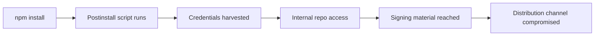

# Containment Playbook: npm-to-Signing-Channel Compromise

> A consumer-side supply-chain attack runs through `npm install` on a developer machine, harvests credentials reachable from that machine, and pivots into corporate source repos. If those repos contain code-signing material, the breach reaches the distribution channel. This page is the containment playbook.

## When This Playbook Applies

This playbook is for teams where **all four conditions hold**:

1. You ship **signed binary clients** — desktop apps, IDE extensions, signed CLIs, mobile apps, or MCP server binaries notarized through Apple, Microsoft, or equivalent.
2. Code-signing private keys (or service credentials) are **reachable from corporate source repositories**.
3. Engineers run `npm install` (or `pip install`, `bun install`) against the **public registry** from corporate machines that can reach those repos.
4. You have **endpoint telemetry** sufficient to identify which machines installed a specific package version after the fact.

If any condition fails, scope down. A SaaS-only team has no certificate rotation step. A team with `trustedDependencies` allowlists ([npm 10.3+ default-script-blocking](https://mondoo.com/blog/npm-supply-chain-security-package-manager-defenses-2026)) or a proxied private registry runs a shorter version.

This is the **consumer-side** vector. The publisher-side compromise that hit TanStack itself was GitHub Actions cache poisoning plus OIDC token memory extraction from a CI runner — no maintainer machine involved ([TanStack postmortem](https://tanstack.com/blog/npm-supply-chain-compromise-postmortem)). That class of attack is out of scope here.

## The Attack Chain

A malicious postinstall script executes with the user's full privileges before runtime security controls activate. EDR is built around file-hash signatures and mass-encryption behavior; it does not catch a JavaScript or Python postinstall script running inside a legitimate package manager invocation ([SC Media](https://www.scworld.com/perspective/trusted-by-default-the-npm-attack-pattern-security-teams-miss), [Aikido](https://www.aikido.dev/blog/endpoint-security-for-developer-devices)).

The Mini Shai-Hulud worm — the payload behind 170+ compromised npm packages in May 2026, including 84 versions across 42 `@tanstack/*` packages — harvests GitHub tokens, npm credentials, GitHub Actions secrets, and AWS/GCP/Azure credentials, then runs TruffleHog over the filesystem. The bundle is AES-256-GCM-encrypted with an RSA-wrapped key and committed to a public GitHub repo created with a stolen token ([Datadog Security Labs](https://securitylabs.datadoghq.com/articles/shai-hulud-2.0-npm-worm/), [Orca Security](https://orca.security/resources/blog/tanstack-npm-supply-chain-worm/)).

OpenAI's May 2026 response reported two employee devices impacted, credential-focused exfiltration from a limited subset of internal source repositories, and those repositories included signing certificates for ChatGPT Desktop, Codex App, Codex CLI, and Atlas ([OpenAI response](https://openai.com/index/our-response-to-the-tanstack-npm-supply-chain-attack/), [The Hacker News](https://thehackernews.com/2026/05/tanstack-supply-chain-attack-hits-two.html)).

## The Playbook

Execute in order. Each step has a hard exit criterion.

### 1. Isolate impacted endpoints

Identify every machine that ran an install against an affected package version in the breach window. Pull the host off the corporate network. Suspend the user's SSO sessions and refresh tokens. Do not wipe — preserve the package cache and shell history.

**Exit:** every confirmed host network-isolated; every potentially-impacted user signed out across IdP, GitHub, npm, and cloud consoles.

### 2. Rotate credentials by blast radius

Rotate in concentric circles, starting from what the worm targets explicitly: GitHub PATs and SSH keys, npm tokens, GitHub Actions secrets, AWS/GCP/Azure credentials. Any secret in environment variables, the SDK credential cache, or readable from disk is assumed compromised ([Datadog](https://securitylabs.datadoghq.com/articles/shai-hulud-2.0-npm-worm/)).

**Exit:** every credential reachable from an impacted host rotated and revoked at the issuer.

### 3. Freeze deploys

Halt automated deploys from any pipeline that touched an impacted credential. A rotation that races a deploy can ship signed-with-stolen-key binaries that pass notarization before the cert is revoked.

**Exit:** deploy workflows disabled; manual deploys gated through a small reviewer pool.

### 4. Re-sign and ship new builds

Issue new code-signing certificates. Re-sign every shipping product. Test through the existing update channel before announcing.

**Exit:** new builds available through the auto-update channel for every affected product across every supported platform.

### 5. Coordinate notarization revocation

For macOS, coordinate with Apple to block further notarization using the impacted material. Any fraudulent app signed with the impacted certificate will then lack notarization and be blocked by default ([OpenAI response](https://openai.com/index/our-response-to-the-tanstack-npm-supply-chain-attack/)). Equivalent steps apply for Microsoft SmartScreen, iOS distribution, and Android Play Integrity.

**Exit:** revocation confirmed by the platform provider; new signing material registered.

### 6. Ship the forcing-function client update

Announce a certificate-revocation deadline that forces every user to update. OpenAI gave users until **June 12, 2026** after announcing on May 13 — a ~30-day window. Short enough to close the breach window, long enough for built-in update mechanisms to reach normal users before launches fail ([OpenAI response](https://openai.com/index/our-response-to-the-tanstack-npm-supply-chain-attack/), [The Record](https://therecord.media/openai-asks-macos-users-to-update-tanstack-npm)).

Communicate the deadline through in-app banner, email, status page, and release notes. Make the new version available before the announcement.

**Exit:** old certificate revoked on the announced date; telemetry shows the long-tail update curve approaching baseline.

## Why It Works

A credential-stealing worm running inside `npm install` inherits everything the user account can reach: SSH keys, GitHub tokens, npm tokens, cloud credentials, and source-control access. If those repositories contain code-signing private keys — common at companies that ship signed clients — the worm's blast radius extends from one laptop to the company's distribution channel.

The playbook breaks the chain at distribution. Revoking certificates and forcing a client update means signing material stolen during the breach window cannot ship a fraudulent binary to existing users — even if the attacker still holds the private key, the platform refuses to honor it ([OpenAI response](https://openai.com/index/our-response-to-the-tanstack-npm-supply-chain-attack/), [Datadog Security Labs](https://securitylabs.datadoghq.com/articles/shai-hulud-2.0-npm-worm/)).

## When This Backfires

- **No signed-binary distribution.** A SaaS-only team has no certificate-rotation step. Steps 4–6 collapse — scope down to credential rotation.
- **Small teams.** Coordinating notarization revocation with Apple and a 30-day forced-update cycle requires support, legal, and update-channel infrastructure small publishers often lack ([TWiT — Truth Behind Short-Lived Code Signing Certificates](https://twit.tv/posts/tech/truth-behind-short-lived-code-signing-certificates-and-rising-costs)).
- **No endpoint telemetry on developer workstations.** Step 1 assumes you can identify which machines ran the install. Developer workstations are typically under-instrumented relative to production servers ([Aikido](https://www.aikido.dev/blog/endpoint-security-for-developer-devices)).
- **A poorly-sized forcing-function window.** Force-quit-style updates cause data loss and backlash when the deferral window is tight ([Jamf community](https://community.jamf.com/general-discussions-2/forcing-macos-updates-29648)); a window longer than ~30 days leaves the breach window open. Size by update-channel telemetry, not by gut.
- **The playbook is the fallback, not the strategy.** Per-package allowlists like `trustedDependencies` ([npm 10.3+](https://mondoo.com/blog/npm-supply-chain-security-package-manager-defenses-2026)), `pnpm allowBuilds`, `@lavamoat/allow-scripts`, or sandboxed installs in disposable VMs block the postinstall script from running. Budget there first.

## Example

OpenAI's response to the May 2026 TanStack incident is the worked example of every step ([OpenAI response](https://openai.com/index/our-response-to-the-tanstack-npm-supply-chain-attack/)):

| Step | What OpenAI did |
|---|---|
| 1. Isolate | Two impacted employee devices identified and contained |
| 2. Rotate | Credentials in the limited subset of impacted internal source repositories rotated |
| 3. Freeze | Deploy workflows for affected products paused during certificate rotation |
| 4. Re-sign | New code-signing certificates issued for ChatGPT Desktop, Codex App, Codex CLI, and Atlas across Windows, macOS, iOS, Android |
| 5. Notarization | Coordinated with Apple to block further notarization of macOS apps using the impacted material |
| 6. Forcing-function | Announced May 13, 2026; revocation deadline June 12, 2026; macOS users required to update via built-in mechanisms before that date |

The May 13 announcement landed two days after the May 11 compromise. The rapid initial detection is what made a ~30-day window viable; teams without that detection speed need a longer window to reach long-tail users, which means a longer breach exposure.

## Key Takeaways

- The consumer-side dev-machine vector is structurally distinct from the publisher-side CI vector. Most public incident analysis covers the publisher side; this playbook covers the consumer side.
- The breach starts at `npm install` on one laptop; it ends at the distribution channel when signing material is reachable from corporate repos.
- Containment runs in a fixed order: isolate, rotate, freeze, re-sign, revoke, force-update. Each step has an exit criterion; skipping ahead leaves a window open.
- A forcing-function client-update deadline closes the distribution channel. Window length trades breach exposure against user disruption.
- Per-package allowlists and sandboxed installs are cheaper than the playbook. Budget prevention first.

## Related

- [Blast Radius Containment: Least Privilege for AI Agents](blast-radius-containment.md) — upstream control that limits how far a single compromised credential can reach
- [Scoped Credentials via Proxy Outside the Agent Sandbox](scoped-credentials-proxy.md) — credential-isolation pattern that shrinks step 2's rotation surface
- [Skill Supply-Chain Poisoning](skill-supply-chain-poisoning.md) — adjacent supply-chain vector targeting agent skill registries
- [Tool Signing and Signature Verification](tool-signing-verification.md) — publisher-side counterpart for tool distribution integrity
- [LLM-Pinned Library Versions Carry Systemic CVE Exposure](llm-pinned-vulnerable-versions.md) — agent-specific failure mode that increases exposure to the same install-time threat surface
