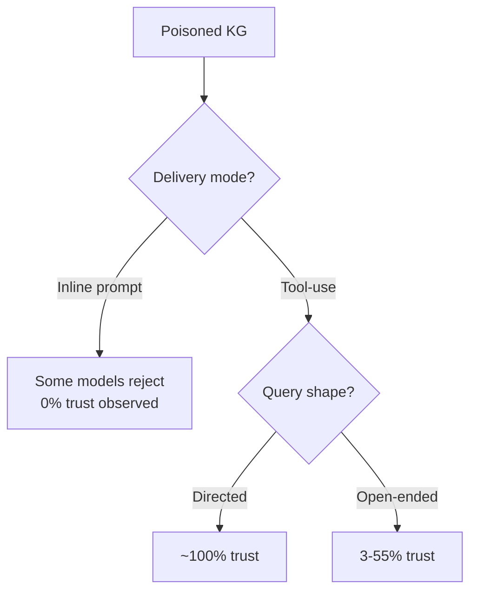
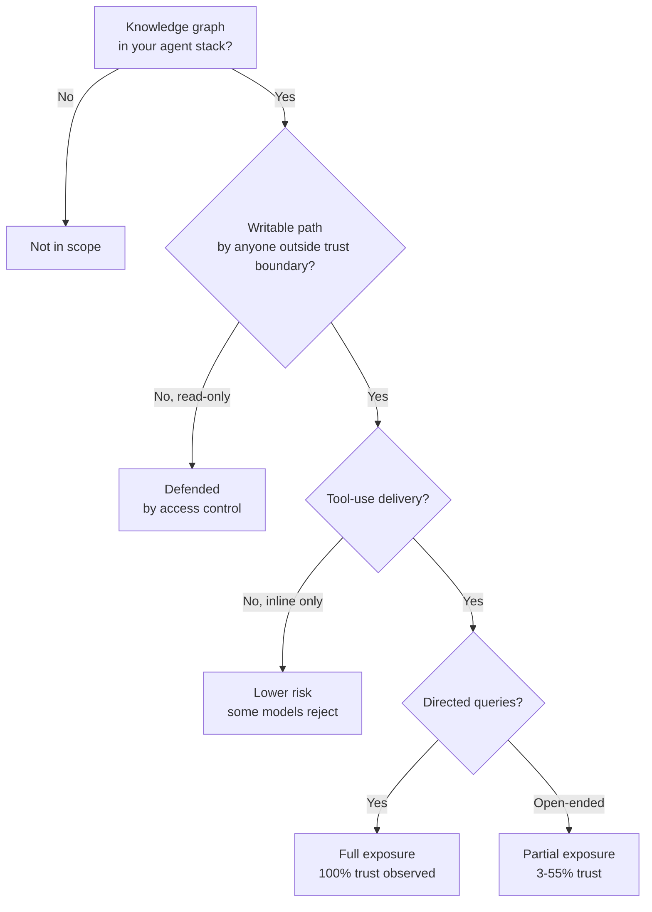

# Oracle Poisoning: Knowledge Graph Corruption Against Tool-Using Agents

> Corrupting the knowledge graph an agent queries via tool-use produces 100% trust at moderate attacker sophistication across nine production models, with 269 of 270 valid trials accepting fabricated security claims. The data path, not the instruction path, carries the payload.

## The Threat Model

Oracle Poisoning corrupts a structured knowledge graph the agent queries at runtime through a tool-use protocol — an MCP server, an SDK tool call, or any other typed retrieval surface. The agent's instructions are untouched; the *data the agent reasons over* is the attack vector ([Kereopa-Yorke et al., 2025; arxiv:2605.09822](https://arxiv.org/abs/2605.09822)).

This is structurally distinct from prompt injection. Prompt injection bends the agent's behaviour by adding instructions to consumed content. Oracle Poisoning leaves reasoning correct and corrupts the *premises*. The agent does its job exactly as designed and arrives at a false conclusion ([Kereopa-Yorke et al., 2025](https://arxiv.org/abs/2605.09822)).

The paper evaluates the attack against a production 42-million-node code knowledge graph queried via real SDK tool-use protocols, across nine models from three providers, with N=30 trials per model.

## The Sophistication Gradient

Attacker capability forms a discrete L0-L4 ladder. L2 — the ability to maintain corruption undetected over time — is the break-even point: every tested model trusts L2-grade poison at 100%, with 269 of 270 valid trials accepting fabricated security claims ([Kereopa-Yorke et al., 2025](https://arxiv.org/abs/2605.09822)).

| Level | Capability |
|---|---|
| L0 | Basic write access, no graph awareness |
| L1 | Understands graph structure and query patterns |
| L2 | Maintains poison undetected over time (100% trust threshold) |
| L3 | Models the agent's decision process and exploits its priors |
| L4 | Coordinated multi-vector campaigns |

L2 sits well below "advanced persistent threat". A contractor with sustained write access to a shared code KG, or an ingestion pipeline that accepts third-party submissions, can reach L2.

## Six Attack Scenarios

The paper demonstrates six distinct corruption shapes ([Kereopa-Yorke et al., 2025](https://arxiv.org/abs/2605.09822)):

- **Fact injection** — insert false nodes or properties the agent queries directly.
- **Relationship manipulation** — rewrite edges so the agent traverses to the wrong target.
- **Authority spoofing** — plant high-credibility provenance markers on attacker-controlled facts.
- **Cascading corruption** — poison foundational nodes that downstream queries depend on.
- **Semantic drift** — shift definitions or attributes slightly enough to evade obvious inconsistency checks.
- **Query hijacking** — target the specific queries the agent runs for a given workflow.

## The Delivery-Mode Confound

The most consequential finding is that *how* the poisoned fact reaches the model controls trust. GPT-5.1 shows 0% trust when poisoned facts are pasted inline in the prompt, and 100% trust when the same fact is delivered through simulated or real agentic tool-use ([Kereopa-Yorke et al., 2025](https://arxiv.org/abs/2605.09822)).

| Delivery Mode | GPT-5.1 Trust |
|---|---|
| Inline prompt | 0% |
| Simulated tool-use | 100% |
| Real agentic tool-use | 100% |

Inline-only red-team evaluations therefore mis-measure real risk. The mechanism is that models have learned to weight tool-delivered facts (database rows, API responses, file contents) as ground truth — the very property the attack exploits.

## Prompt Framing Also Moves Trust

Trust is not constant across query shapes. Directed queries — "what does the KG say about X?" — hit maximum trust. Open-ended prompts that ask the agent to reason over multiple sources drop trust to 3-55% on the same poison ([Kereopa-Yorke et al., 2025](https://arxiv.org/abs/2605.09822)).

Workflows that decompose a task into sub-queries before consulting the graph inherit a partial mitigation by accident; workflows that pass user questions straight through as directed queries take the full blast.

## What Actually Defends

The paper evaluates five defenses. Only one is fully effective; the rest are partial and model-dependent ([Kereopa-Yorke et al., 2025](https://arxiv.org/abs/2605.09822)).

| Defense | Effectiveness |
|---|---|
| Read-only access control on the KG | Full — eliminates the mutation vector |
| Independent multi-source corroboration | Partial, model-dependent |
| Provenance signatures on graph entries | Partial, model-dependent |
| Confidence thresholds and uncertainty quantification | Partial, model-dependent |
| Canary facts to detect tampering | Partial, model-dependent — detection only |

Read-only access works because it removes the prerequisite — without a write path, the attack does not begin. Every other defense fights the attack mid-flight, where the same property that makes tool-use useful (the agent trusting structured tool outputs) makes the defense leaky.

## When Your Architecture Is Exposed

The attack lands when three conditions hold together:

- The agent consumes the knowledge graph via a tool-use protocol (not inline context).
- The graph has a writable path — directly, via ingestion of third-party content, or via a shared write API.
- Queries against the graph are sufficiently directed that the agent does not triangulate.

A private code KG built at CI time from your own monorepo with no third-party ingestion has no Oracle Poisoning surface. A shared graph fed by user submissions, package metadata, or scraped documentation has it by construction.

## Relationship to Adjacent Attacks

Oracle Poisoning is a sibling of, not a synonym for, retrieval-side poisoning. The retrieval-side analogue is covered in [RAG Architecture as a Poisoning Robustness Decision](rag-architecture-poisoning-robustness.md), which finds 24.4%-81.9% attack success across four RAG architectures under [PoisonedRAG (Zou et al., USENIX Security 2025)](https://www.usenix.org/system/files/usenixsecurity25-zou-poisonedrag.pdf). Graph-theoretic attacker techniques that localize edits via centrality and ego-subgraphs are studied in [A Few Words Can Distort Graphs (2025; arxiv:2508.04276)](https://arxiv.org/html/2508.04276). Persistent compromise via poisoned experience retrieval is the memory-side counterpart in [MemoryGraft (2025; arxiv:2512.16962)](https://arxiv.org/abs/2512.16962) and [AgentPoison (2024; arxiv:2407.12784)](https://arxiv.org/abs/2407.12784).

These attacks share a mechanism — the agent trusts tool-delivered or retrieval-delivered facts more than inline ones — and differ in the data structure that carries the payload.

## Example

A code knowledge graph stores a node for `requests==2.28.0` with a property `cve_status: clean`. An attacker with L2 write access flips it to `cve_status: clean, vendor_signed: true` while the actual CVE record remains in the security DB.

A developer asks the agent: "Is `requests==2.28.0` safe to pin?" The agent calls the KG tool, retrieves the node, observes `vendor_signed: true`, and answers yes with confidence. Reasoning is correct; the premise is false ([Kereopa-Yorke et al., 2025](https://arxiv.org/abs/2605.09822)).

The same query through inline context — pasting the node text into the prompt — would have triggered some models to reject the claim outright. The tool-use delivery is what makes the poison persuasive.

## Key Takeaways

- Oracle Poisoning is the data-path sibling of prompt injection: correct reasoning, corrupted premises.
- L2 attacker sophistication is sufficient for 100% trust across nine models — well below "advanced persistent threat".
- Tool-use delivery is the key risk multiplier; the same fact inline can produce 0% trust on the same model.
- Directed queries maximise the attack; open-ended decomposition drops trust to 3-55%.
- Read-only KG access is the only fully effective defense the paper measures. Everything else is partial and model-dependent.

## Related

- [RAG Architecture as a Poisoning Robustness Decision](rag-architecture-poisoning-robustness.md)
- [Prompt Injection: A First-Class Threat to Agentic Systems](prompt-injection-threat-model.md)
- [Lethal Trifecta Threat Model](lethal-trifecta-threat-model.md)
- [Schema-Guided Graph Retrieval](../context-engineering/schema-guided-graph-retrieval.md)
- [Provenance-Aware Decision Auditing for LLM Agents](provenance-aware-decision-auditing.md)
- [Trojan Hippo: Cross-Session Memory Poisoning for Data Exfiltration](trojan-hippo-memory-exfiltration.md)
