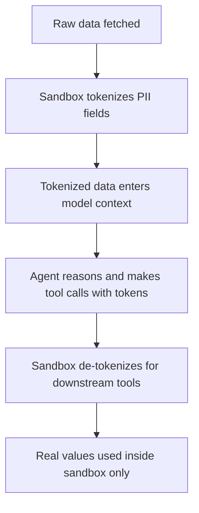

# PII Tokenization in Agent Context

> Use the code execution sandbox as a privacy boundary: sensitive fields are replaced with deterministic tokens before any data reaches the model, with real values never entering the context window.

PII tokenization replaces sensitive field values — emails, names, account numbers — with deterministic placeholder tokens before data enters the model's context window. The execution sandbox enforces this boundary: real values never reach the model, and de-tokenization only happens inside the sandbox when downstream tools need the original data.

## Why Model Context Is a Data Risk

Any data an agent reasons about enters its context window. That context may be logged, cached, or observed as part of inference infrastructure. For regulated domains — healthcare, finance, legal — allowing patient identifiers, financial account numbers, or personal contact details to appear in model context creates data residency and compliance exposure.

[Anthropic's MCP code execution research](https://www.anthropic.com/engineering/code-execution-with-mcp) describes using the execution sandbox as a privacy boundary: sensitive values move between tools inside the sandbox while the model sees only deterministic placeholders.

## How Tokenization Works

Before data surfaces to the model, the execution environment replaces sensitive field values with deterministic tokens:

| Original | Tokenized |
|----------|-----------|
| `alice@example.com` | `{{EMAIL_1}}` |
| `Jane Smith` | `{{NAME_1}}` |
| `4111-1111-1111-1111` | `{{CC_1}}` |

The execution environment maintains a mapping from token to real value. When a downstream tool requires the real value — to send an email, make a payment, or write to a database — the sandbox performs de-tokenization before the call, inside the sandbox boundary.

The model only ever sees tokens. Real values stay inside the sandbox.

## What the Agent Can Still Do

Tokenization does not prevent the agent from performing meaningful work. With tokenized data, the agent can:

- Count records: "There are 847 records with `{{EMAIL_N}}` fields"
- Filter by structure: "Find records where `{{CC_N}}` is present but `{{EMAIL_N}}` is missing"
- Detect patterns: "All `{{NAME_N}}` values in this batch follow a given format"
- Route records: "Send this record to the approval queue"

The agent reasons about structure, counts, relationships, and logic — not about the sensitive values themselves. For most analytical and routing tasks, this is sufficient.

## Deterministic Rules, Not Model Judgment

The critical property of this pattern is that the tokenization boundary is enforced by deterministic rules in the execution environment, not by the model's judgment. The model does not decide what is sensitive; the sandbox does.

This matters because model judgment is probabilistic. An instruction like "do not include email addresses in your reasoning" is a prompt — it may be followed, ignored, or misinterpreted. A sandbox that intercepts and replaces all fields matching `^[\w.-]+@[\w.-]+$` before data reaches the model is a deterministic control that cannot be reasoned around.

## Implementation Considerations

- **Token determinism**: the same real value must always produce the same token within a session, so the agent can correlate references across tool calls. `{{EMAIL_1}}` must refer to the same email address throughout.
- **Token namespace by type**: using type-prefixed tokens (`{{EMAIL_N}}`, `{{NAME_N}}`) helps the agent understand what kind of data the token represents without knowing the value.
- **De-tokenization audit log**: every de-tokenization event should be logged for compliance auditing — which token was expanded, when, and for which downstream call.
- **Scope and expiry**: tokens should be session-scoped and not persist beyond the current agent session. Short-lived token maps reduce compliance exposure and support GDPR right-to-erasure — once the map is deleted, de-tokenization becomes impossible by design.

## Example

A healthcare data-processing agent needs to summarize patient records. Before any data enters the model context, the execution environment scans each record and replaces sensitive fields with typed tokens. The model receives `{{NAME_1}}`, `{{EMAIL_1}}`, and `{{DOB_1}}` instead of real values and can still count, filter, and route records based on field presence and structure.

When the agent issues `send_summary(patient="{{NAME_1}}")`, the sandbox intercepts the call, resolves the token against the session token map, and passes the real name to the downstream API, logging the de-tokenization event with timestamp and call context for compliance audit.

## When This Backfires

Tokenization is a boundary control, not a complete privacy solution. It fails or becomes insufficient in these conditions:

- **Detection gaps**: regex-based PII detection misses contextual PII (job titles that uniquely identify a person, internal employee IDs, composite fields that individually appear benign). False negatives leave real values in model context unprotected.
- **Safety gate interference**: type-prefixed token labels like `SSN: {{IDENTIFIER_1}}` can trigger model safety refusals. The label alongside the token signals sensitive data even without the value — mitigation requires stripping or neutralizing the field label, adding complexity.
- **Overlong agent sessions**: when session-scoped token maps span many hours or tool calls, the map itself becomes a high-value target. Long-lived maps require the same access controls as the underlying PII vault.
- **Rich semantic tasks**: agents asked to draft a personalized email or generate a narrative report need the actual values. Tokenization forces a de-tokenize-then-inject step that partially re-exposes data in tool inputs, narrowing the boundary's effectiveness.

## Key Takeaways

- Sensitive values should never appear in the model's context window; the sandbox is the privacy boundary.
- Tokenization must be enforced by deterministic rules, not model judgment — instructions are insufficient controls for compliance.
- Agents can still reason about structure, counts, and relationships using tokenized representations.
- De-tokenization happens inside the sandbox when downstream tools require real values.
- Log every de-tokenization event for audit traceability.

## Related

- [Filter and Aggregate in the Execution Environment](../context-engineering/filter-aggregate-execution-env.md)
- [Secrets Management for Agent Workflows](secrets-management-for-agents.md)
- [Protecting Sensitive Files from Agent Context](protecting-sensitive-files.md)
- [Deterministic Guardrails Around Probabilistic Agents](../verification/deterministic-guardrails.md)
- [Dual Boundary Sandboxing](dual-boundary-sandboxing.md)
- [Enterprise Agent Hardening](enterprise-agent-hardening.md)
- [Scoped Credentials Proxy](scoped-credentials-proxy.md)
- [Scope Sandbox Rules to Harness-Owned Tools](sandbox-rules-harness-tools.md)
- [Defense-in-Depth Agent Safety](defense-in-depth-agent-safety.md)
- [Safe Outputs Pattern](safe-outputs-pattern.md)
- [Prompt Injection Resistant Agent Design](prompt-injection-resistant-agent-design.md)
- [The Lethal Trifecta Threat Model](lethal-trifecta-threat-model.md)
