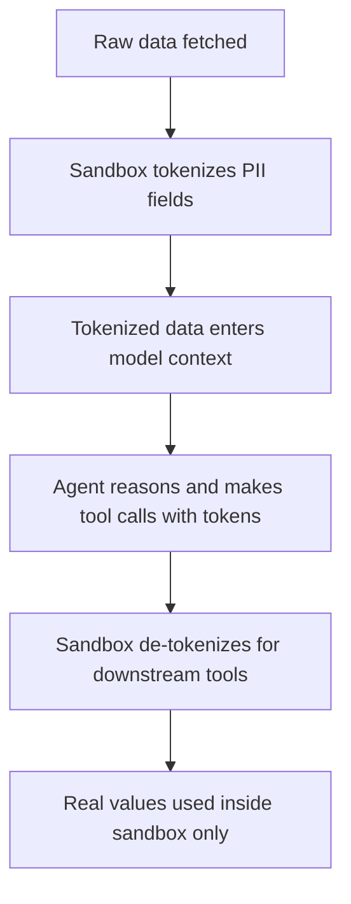

# Sandbox-Enforced PII Tokenization in Agent Workflows

> Use the code execution sandbox as a privacy boundary: sensitive fields are replaced with deterministic tokens before any data reaches the model, with real values never entering the context window.

PII tokenization replaces sensitive field values — emails, names, account numbers — with deterministic placeholder tokens before they reach the model's context window. The sandbox enforces the boundary: real values never reach the model, and de-tokenization happens only inside the sandbox when downstream tools need the original data.

## Why Model Context Is a Data Risk

Any data an agent reasons about enters its context window, where it may be logged, cached, or observed by inference infrastructure. For regulated domains — healthcare, finance, legal — patient identifiers, financial account numbers, or contact details in model context create data residency and compliance exposure.

[Anthropic's MCP code execution research](https://www.anthropic.com/engineering/code-execution-with-mcp) describes the sandbox-as-privacy-boundary pattern: sensitive values move between tools inside the sandbox while the model sees only deterministic placeholders.

## How Tokenization Works

Before data surfaces to the model, the execution environment replaces sensitive field values with deterministic tokens:

| Original | Tokenized |
|----------|-----------|
| `alice@example.com` | `{{EMAIL_1}}` |
| `Jane Smith` | `{{NAME_1}}` |
| `4111-1111-1111-1111` | `{{CC_1}}` |

The sandbox maintains a token-to-value mapping. When a downstream tool needs the real value — to send an email, make a payment, or write to a database — de-tokenization happens inside the sandbox before the call.

```mermaid
graph TD
    A[Raw data fetched] --> B[Sandbox tokenizes PII fields]
    B --> C[Tokenized data enters model context]
    C --> D[Agent reasons and makes tool calls with tokens]
    D --> E[Sandbox de-tokenizes for downstream tools]
    E --> F[Real values used inside sandbox only]
```

The model only ever sees tokens. Real values stay inside the sandbox.

## What the Agent Can Still Do

Tokenization does not block meaningful work. With tokenized data, the agent can:

- Count records: "847 records have `{{EMAIL_N}}` fields"
- Filter by structure: "Records where `{{CC_N}}` is present but `{{EMAIL_N}}` is missing"
- Detect patterns: "All `{{NAME_N}}` values follow a given format"
- Route records to queues

The agent reasons about structure, counts, and relationships — not the values themselves. For most analytical and routing tasks, this is sufficient.

## Deterministic Rules, Not Model Judgment

The boundary is enforced by deterministic rules in the execution environment, not by model judgment. The model does not decide what is sensitive; the sandbox does.

Model judgment is probabilistic. An instruction like "do not include email addresses in your reasoning" is a prompt — it may be followed, ignored, or misinterpreted. A sandbox that intercepts and replaces all fields matching `^[\w.-]+@[\w.-]+$` before data reaches the model is a deterministic control that cannot be reasoned around.

## Implementation Considerations

- **Token determinism**: the same real value must produce the same token within a session so the agent can correlate references across tool calls.
- **Token namespace by type**: type-prefixed tokens (`{{EMAIL_N}}`, `{{NAME_N}}`) let the agent reason about field kind without seeing the value.
- **De-tokenization audit log**: log every de-tokenization — which token, when, and for which downstream call.
- **Scope and expiry**: tokens should be session-scoped. Short-lived maps reduce compliance exposure and support GDPR right-to-erasure — delete the map and de-tokenization becomes impossible by design.

## Example

A healthcare data-processing agent needs to triage patient records. Before any data enters the model context, the execution environment scans each record and replaces sensitive fields with typed tokens. The model receives `{{NAME_1}}`, `{{EMAIL_1}}`, and `{{DOB_1}}` instead of real values and can still count, filter, and route records based on field presence and structure.

When the agent issues `send_summary(patient="{{NAME_1}}")`, the sandbox intercepts the call, resolves the token against the session map, passes the real name to the downstream API, and logs the de-tokenization event with timestamp and call context.

## When This Backfires

Tokenization is a boundary control, not a complete privacy solution. It fails or becomes insufficient in these conditions:

- **Detection gaps**: regex-based PII detection misses contextual quasi-identifiers — job titles, internal employee IDs, composite fields. [Google Cloud's de-identification reference architecture](https://cloud.google.com/architecture/de-identification-re-identification-pii-using-cloud-dlp) recommends post-tokenization re-identification risk analysis because pattern-matching alone leaves these gaps.
- **Safety gate interference**: type-prefixed token labels like `SSN: {{IDENTIFIER_1}}` can trigger model safety refusals. The label alongside the token signals sensitive data even without the value — mitigation requires stripping or neutralizing the field label, adding complexity.
- **Overlong agent sessions**: when session-scoped token maps span many hours or tool calls, the map itself becomes a high-value target. Long-lived maps require the same access controls as the underlying PII vault.
- **Rich semantic tasks**: agents asked to draft a personalized email or generate a narrative report need the actual values. Tokenization forces a de-tokenize-then-inject step that partially re-exposes data in tool inputs, narrowing the boundary's effectiveness.
- **Observability blind spots**: traces, error reports, and request logs around the inference path frequently capture raw prompts and tool inputs that bypass the redaction layer. Practitioner reports attribute [25–40% of discovered PII exposure to observability surfaces even when the inference path itself was well-redacted](https://www.statsig.com/perspectives/piiredactionprivacyllms). The audit log and any tracing pipeline that touches the sandbox must inherit the same access controls as the PII vault; see also [PII redaction guidance for MCP servers](https://mcpmanager.ai/blog/pii-redaction-for-mcp-servers/) on extending redaction to every returned artifact.

## Key Takeaways

- Sensitive values should never appear in the model's context window; the sandbox is the privacy boundary.
- Enforce tokenization with deterministic rules, not model judgment — instructions are insufficient controls.
- Agents can still reason about structure, counts, and relationships using tokenized representations.
- De-tokenization happens inside the sandbox when downstream tools require real values.
- Log every de-tokenization event for audit traceability.

## Related

- [Privacy-Preserving LLM Requests](privacy-preserving-llm-requests.md)
- [Filter and Aggregate in the Execution Environment](../context-engineering/filter-aggregate-execution-env.md)
- [Protecting Sensitive Files from Agent Context](protecting-sensitive-files.md)
- [Secrets Management for Agent Workflows](secrets-management-for-agents.md)
- [Deterministic Guardrails Around Probabilistic Agents](../verification/deterministic-guardrails.md)
- [Dual Boundary Sandboxing](dual-boundary-sandboxing.md)
- [Scoped Credentials Proxy](scoped-credentials-proxy.md)
- [Scope Sandbox Rules to Harness-Owned Tools](sandbox-rules-harness-tools.md)
- [The Lethal Trifecta Threat Model](lethal-trifecta-threat-model.md)
