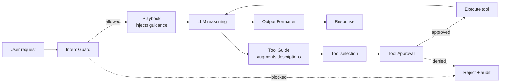

# Five-Stage Policy Layer Typology for Generalist Agents

> A policy-as-code layer wraps a generalist agent at five loop stages — intent, planning, tool selection, execution, output — covering gaps no single stage can.

A five-stage policy layer typology decomposes agent governance into five intervention points around one unmodified generalist LLM agent: **Intent Guard** (blocks or rewrites incoming requests), **Playbook** (injects procedural guidance), **Tool Guide** (augments tool descriptions at selection), **Tool Approval** (gates execution behind deterministic checks or human consent), and **Output Formatter** (filters the final response). The taxonomy comes from IBM Research's open-source [CUGA](https://github.com/cuga-project/cuga-agent), where each type is a separate SDK method (`agent.policies.add_intent_guard(...)`, `agent.policies.add_playbook(...)`) tested as an independent integration ([cuga-project/cuga-agent](https://github.com/cuga-project/cuga-agent/blob/main/README.md)).

## When This Applies

The typology earns its complexity only under specific conditions:

- **The agent loop has all five stages active.** A tool-only agent has no use for Playbook; a read-only agent has no use for Tool Approval. Adopting the full typology over a partial loop creates ceremonial slots that confuse policy authors.
- **The action surface spans multiple tools and sensitivity tiers.** Single-tool agents get equivalent guarantees from [action-selector-pattern](action-selector-pattern.md) plus a confirmation prompt.
- **Audit and compliance require typed intervention records.** Auditors who must show "a control at every stage of the loop" get the boundary labels from the taxonomy. Without that requirement, ad-hoc gates suffice.
- **You cannot fine-tune the underlying model.** The CUGA framing is policy composition over a generalist agent rather than weight-level changes ([cuga-project/cuga-agent](https://github.com/cuga-project/cuga-agent/blob/main/README.md)). Teams with fine-tuning available may get equivalent guarantees from a refusal-tuned model plus a thin deny list.

## The Five Stages

Each stage maps to a distinct point in the agent loop with different control characteristics:

| Stage | Where it runs | What it blocks | Enforcement class |
|-------|--------------|----------------|-------------------|
| Intent Guard | Before planning, on the raw user request | Off-policy intents that should never enter the loop | Model-mediated classifier |
| Playbook | During reasoning, as system-prompt scaffolding | Plan drift on complex multi-step workflows | Prompt injection (advisory) |
| Tool Guide | At tool selection, by augmenting tool descriptions | Misuse caused by underspecified tool semantics | Prompt augmentation (advisory) |
| Tool Approval | At execution, between proposal and side effect | Unauthorised or high-blast-radius calls | Deterministic gate (often human) |
| Output Formatter | After generation, on the final response | Data leakage and format violations | Deterministic or model-mediated post-processor |

CUGA's SDK includes an explicit priority system because multiple policies can match one call ([cuga-project/cuga-agent](https://github.com/cuga-project/cuga-agent)) — the typology imports an ordering concern when several types fire on the same request.

## Diagram



## Why It Works

The mechanism is **defense in depth at agent-loop boundaries**. Each stage targets a different failure class — intent misclassification, plan drift, tool misuse, unsafe execution, data leakage — and a single layer cannot cover all five because the failures appear at different loop points with different signals available. [Sigdel & Baral 2026](https://arxiv.org/abs/2603.18059) argue that model-centric, prompt-dependent mitigations are brittle and do not generalize to non-LLM callers, so explicit policy layers are required when safety boundaries must hold regardless of prompt variations.

The typology adds value by naming the boundaries where each control class belongs. Tool Approval is where deterministic enforcement lives, which is why [permission-framework-over-model](permission-framework-over-model.md) shows ask-to-continue harnesses swing overeager rates from 27.7% to 1.1% on identical weights — that is one stage of this typology in isolation.

## When This Backfires

- **Three of the five layers inherit LLM-classifier brittleness.** Intent Guard, Playbook, and Output Formatter are model-mediated. Bypass attacks on classifier-style guardrails via character distribution and tokenization edge cases are documented ([Mindgard](https://mindgard.ai/resources/bypassing-llm-guardrails-character-and-aml-attacks-in-practice)). Anthropic's classifier-based Auto Mode using Sonnet-4.6 with chain-of-thought still misses 17% of real overeager actions ([Anthropic Engineering 2026-03-25](https://www.anthropic.com/engineering/claude-code-auto-mode)). These stages reduce rates; they do not eliminate them.
- **Small action surfaces don't recoup the operational cost.** Three to five tools with a single operator get equivalent guarantees from a deny list plus a confirmation prompt. The five-type SDK adds policy versioning, conflict resolution, and upgrade overhead a small surface cannot pay back.
- **Headless automation collapses the typology to its deterministic subset.** Tool Approval that requires human confirmation has no signal in CI or scheduled agents — the taxonomy degrades to two layers.
- **Multi-policy compositions introduce ordering bugs.** The CUGA priority system exists because multiple types can match one call; smaller deployments avoid that failure class entirely.

## Example

A regulated healthcare workflow uses CUGA's policy SDK to wrap one generalist agent for patient-record lookup. Each type carries one distinct guarantee:

```python
# 1. Intent Guard — block requests that should never enter the loop.
agent.policies.add_intent_guard(
    name="block-bulk-export",
    condition="user requests bulk export of records",
    action="reject",
)

# 2. Playbook — inject workflow guidance for compound tasks.
agent.policies.add_playbook(
    name="record-lookup-flow",
    trigger="patient record query",
    steps=[
        "Verify clinician identity via the SSO tool first",
        "Restrict query to the active care team's patients",
        "Log the access reason before returning data",
    ],
)

# 3. Tool Guide — augment tool descriptions at selection time.
agent.policies.add_tool_guide(
    tool="record_search",
    guidance="Always pass `purpose` and `care_team_id`; never omit `purpose`.",
)

# 4. Tool Approval — deterministic gate before any write.
agent.policies.add_tool_approval(
    tool_pattern="record_update_*",
    require="clinician_approval",
)

# 5. Output Formatter — strip fields not permitted to the requester's role.
agent.policies.add_output_formatter(
    trigger="response contains PHI",
    transform="redact_fields_not_in_role_scope",
)
```

The Tool Approval policy carries the hard guarantee that no write reaches the database without explicit clinician consent. The other four reduce — not eliminate — drift in their respective stages.

## Key Takeaways

- The typology's value is **labelling the five loop boundaries**, not the controls themselves. The boundaries make audit coverage discoverable.
- Only **Tool Approval** and the deterministic portion of **Tool Guide** carry hard enforcement guarantees. The other three reduce error rates but inherit LLM-classifier brittleness.
- Adopt the full typology when the agent loop has all five stages, the action surface is broad, audit requires typed intervention records, and fine-tuning is unavailable.
- For small action surfaces, headless automation, or single-tool agents, prefer a [deny list](permission-gated-commands.md) plus a [confirmation prompt](human-in-the-loop-confirmation-gates.md) over the full typology.

## Related

- [Prompt-Only Tool Access Control](../anti-patterns/prompt-only-tool-access-control.md) — The anti-pattern this typology displaces: prompt-only restrictions leak 11–18 pp; architectural enforcement drives unauthorised invocation to 0%.
- [Permission Framework Choice Outweighs Model Choice for Limiting Overeager Actions](permission-framework-over-model.md) — Measures the Tool Approval stage in isolation: framework swings overeager rates from 27.7% to 1.1% on identical weights.
- [Hybrid Deterministic + Semantic Authorization for Agent Tool Calls](hybrid-deterministic-semantic-tool-authorization.md) — A different five-check decomposition focused on the agent-tool boundary; complements the Tool Approval stage with structural and semantic checks.
- [Action-Selector Pattern](action-selector-pattern.md) — The narrowest deterministic alternative; equivalent guarantees for tiny action surfaces without the typology overhead.
- [Sandbox + Approvals + Auto-Review Governance Triad](sandbox-approvals-auto-review-triad.md) — A different composition of governance layers when sandbox isolation is available alongside policy enforcement.
