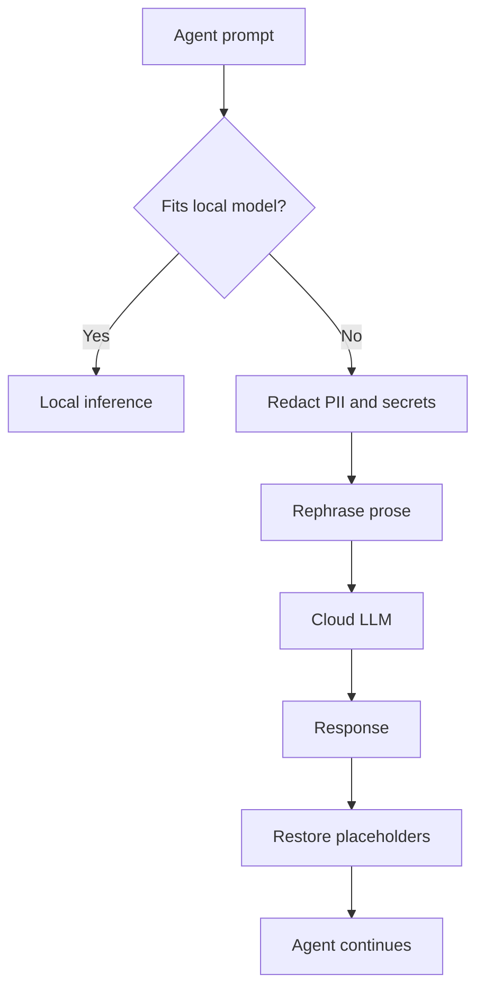

# Privacy-Preserving LLM Requests

> Eight techniques exist for keeping sensitive content out of cloud LLM APIs; only four are practical today, and the empirically strongest combination — local routing plus redact-and-rephrase — cuts PII leakage to 0.6% but leaves 31% of proprietary-code content exposed.

Coding agents and LLM-powered tools send prompts to cloud APIs that may log, retain, or train on request content. Organisation-level DLP and TLS address transport and egress; neither protects the content of the prompt itself. An empirical evaluation across 1,300 labelled samples compared eight techniques on leakage, utility, latency, and cost ([arXiv:2604.12064](https://arxiv.org/abs/2604.12064)).

## The Eight Techniques

| ID | Technique | Practical today |
|----|-----------|-----------------|
| A | Local-only inference | Yes |
| B | Redaction with placeholder restoration | Yes |
| C | Semantic rephrasing | Yes |
| D | Trusted Execution Environment (TEE) hosted inference | Research |
| E | Split inference across parties | Research |
| F | Fully homomorphic encryption | Research |
| G | Secret sharing via multi-party computation | Research |
| H | Differential-privacy noise | Yes |

D–G require hardware enclaves, cryptographic protocols, or multi-party coordination not generally available from cloud LLM providers. A, B, C, and H run on unmodified OpenAI-compatible APIs ([arXiv:2604.12064](https://arxiv.org/abs/2604.12064)).

## How A+B+C Compose

The authors benchmark every technique individually and in combination. The empirical winner is A+B+C:

1. **Route locally when possible (A).** A small local model handles requests that fit its capability envelope. The egress path never opens.
2. **Redact what remains (B).** Detect PII, secrets, and identifiers in the remaining prompts and substitute typed placeholders. The client keeps a placeholder → real-value map.
3. **Rephrase the prose (C).** Rewrite surrounding natural-language context so residual style, phrasing, and collocations do not re-identify the redacted entities.

The client restores placeholders in the response before the agent acts on it. The cloud model sees only typed shells and paraphrased context.

## Measured Leakage

Across 500 test prompts against the combined pipeline ([arXiv:2604.12064](https://arxiv.org/abs/2604.12064)):

| Content class | Combined leak rate | Exact leaks |
|---------------|--------------------|-------------|
| PII | 0.6% | 0 |
| Proprietary code | 31.3% | — |

PII redaction is near-complete because emails, account numbers, and names match regular patterns. Proprietary code is structural: function names, API shapes, architectural conventions, and domain idioms carry information that survives identifier renaming. A third of proprietary-code content leaks through even with A+B+C applied.

## Where Each Technique Fails

The evaluation reports that no single technique dominates — each has a characteristic failure mode that composition can mitigate but not remove ([arXiv:2604.12064](https://arxiv.org/abs/2604.12064)):

- **Local-only (A)** — constrained by local model capability. Tasks requiring frontier-class reasoning fall back to cloud, and the privacy gain is lost for that fraction.
- **Redaction (B)** — pattern-based detectors miss contextual identifiers: job title plus office, composite IDs, role-based references. Regex alone misses context-dependent PII, which is why hybrid detectors pair patterns with context-aware models ([RECAP, arXiv:2510.07551](https://arxiv.org/abs/2510.07551)).
- **Rephrasing (C)** — aggressive rephrasing degrades task utility when exact wording matters (code, legal text, structured output), and paraphrase models themselves are cloud-hosted in many deployments.
- **Differential-privacy noise (H)** — calibrated noise damages generation quality for tasks where token-level precision matters; the compute–privacy–utility tradeoff is characterised for DP language models ([arXiv:2501.18914](https://arxiv.org/abs/2501.18914)).

Composing A+B+C reduces leakage further but does not eliminate it — the 31.3% proprietary-code residual is the empirical floor reported for the combined pipeline ([arXiv:2604.12064](https://arxiv.org/abs/2604.12064)).

## Scope Limits for Production Use

The A+B+C combination is defensible for PII-heavy workloads — customer-support content, healthcare records, form data — where the 0.6% residual leak is tolerable against the compliance baseline. It is not a general privacy control for proprietary source code. For code bases where architectural leakage is disqualifying, the remaining defensible postures are:

- Full local inference (A alone), accepting capability ceilings
- Not sending the content to a cloud LLM at all
- Waiting for TEE-hosted inference (D) to reach general production availability

Treat the redaction pipeline as a layer, not a seal. For PII this is adequate for most threat models; for code it narrows but does not close the window.

## Relation to Tokenization at the Agent-Tool Boundary

[PII Tokenization in Agent Context](pii-tokenization-in-agent-context.md) addresses the same concern at a different layer: the sandbox boundary between the agent and downstream tools. Tokenization keeps sensitive values out of the model's reasoning context during tool use; request-level redaction keeps them out of the outbound API call. The layers are complementary.

## Example

A developer agent handles two tasks in the same session. The first is a customer-support summary from a ticket containing names and emails. The second is a refactor of an internal authentication module.

For the first, the client router sees tractable text and invokes the redactor: emails become `{{EMAIL_1}}`, names become `{{NAME_1}}`, and the surrounding prose is rephrased. The cloud LLM returns a summary referencing the placeholders; the client restores them before the agent posts the summary. Residual PII leak risk is 0.6% ([arXiv:2604.12064](https://arxiv.org/abs/2604.12064)).

For the second, the router detects proprietary code patterns. Even with placeholder substitution of internal function names, the call graph and module boundaries leak through — the 31.3% residual applies. The agent routes the refactor task to a locally-hosted code model instead, trading some capability for a closed egress path.

## Key Takeaways

- Eight privacy techniques exist for LLM requests; only A, B, C, and H are practical on unmodified cloud APIs today.
- The empirical best combination is A+B+C: local routing, redaction, and rephrasing.
- Measured leakage is 0.6% for PII and 31.3% for proprietary code across 500 samples.
- No single technique dominates; composition reduces but does not eliminate leakage.
- Code bases where structural leakage is disqualifying need full local inference or no cloud call, not redaction alone.

## Related

- [PII Tokenization in Agent Context](pii-tokenization-in-agent-context.md)
- [Secrets Management for Agent Workflows](secrets-management-for-agents.md)
- [Credential Hygiene for Agent Skill Authorship](credential-hygiene-agent-skills.md)
- [Scoped Credentials via Proxy Outside the Agent Sandbox](scoped-credentials-proxy.md)
- [Protecting Sensitive Files from Agent Context](protecting-sensitive-files.md)
- [Enterprise Agent Hardening: Governance, Observability, and Reproducibility](enterprise-agent-hardening.md)
