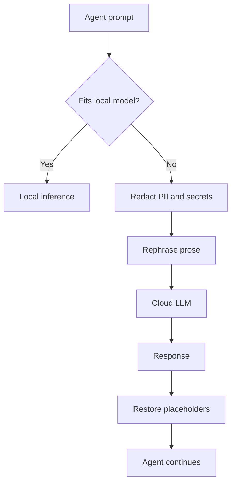

# Privacy-Preserving LLM Requests

> Privacy-preserving LLM requests combine local routing with redact-and-rephrase, cutting PII leakage to 0.6% while leaving 31% of proprietary code exposed.

Coding agents and LLM-powered tools send prompts to cloud APIs that may log, retain, or train on request content. Organization-level DLP and TLS protect transport and egress. Neither protects the content of the prompt itself. An empirical evaluation across 1,300 labeled samples compared eight techniques on leakage, utility, latency, and cost ([arXiv:2604.12064](https://arxiv.org/abs/2604.12064)).

## The eight techniques

| ID | Technique | Practical today |
|----|-----------|-----------------|
| A | Local-only inference | Yes |
| B | Redaction with placeholder restoration | Yes |
| C | Semantic rephrasing | Yes |
| D | Trusted Execution Environment (TEE) hosted inference | Research |
| E | Split inference across parties | Research |
| F | Fully homomorphic encryption | Research |
| G | Secret sharing via multi-party computation | Research |
| H | Differential-privacy noise | Yes |

D–G require hardware enclaves, cryptographic protocols, or multi-party coordination not generally available from cloud LLM providers. A, B, C, and H run on unmodified OpenAI-compatible APIs ([arXiv:2604.12064](https://arxiv.org/abs/2604.12064)).

## How A+B+C compose

The authors benchmark every technique on its own and in combination. The empirical winner is A+B+C:

1. Route locally when possible (A). A small local model handles requests that fit its capability envelope. The egress path never opens.
2. Redact what remains (B). Detect PII, secrets, and identifiers in the remaining prompts, then substitute typed placeholders. The client keeps a placeholder → real-value map, the same mechanism as [PII tokenization](pii-tokenization-in-agent-context.md) at the tool boundary.
3. Rephrase the prose (C). Rewrite the surrounding natural-language context so residual style, phrasing, and collocations do not re-identify the redacted entities.

```mermaid
graph TD
    A[Agent prompt] --> B{Fits local model?}
    B -->|Yes| C[Local inference]
    B -->|No| D[Redact PII and secrets]
    D --> E[Rephrase prose]
    E --> F[Cloud LLM]
    F --> G[Response]
    G --> H[Restore placeholders]
    H --> I[Agent continues]
```

The client restores placeholders in the response before the agent acts on it. The cloud model sees only typed shells and paraphrased context.

## Measured leakage

Across 500 test prompts against the combined pipeline ([arXiv:2604.12064](https://arxiv.org/abs/2604.12064)):

| Content class | Combined leak rate | Exact leaks |
|---------------|--------------------|-------------|
| PII | 0.6% | 0 |
| Proprietary code | 31.3% | — |

PII redaction is near-complete because emails, account numbers, and names match regular patterns. Proprietary code is structural: function names, API shapes, architectural conventions, and domain idioms carry information that survives identifier renaming. A third of proprietary-code content leaks through even with A+B+C applied.

## Where each technique fails

The evaluation reports that no single technique dominates. Each has a characteristic failure mode that composition can reduce but not remove ([arXiv:2604.12064](https://arxiv.org/abs/2604.12064)):

- Local-only (A) — limited by local model capability. Tasks that need frontier-class reasoning fall back to cloud, and the privacy gain is lost for that fraction.
- Redaction (B) — pattern-based detectors miss contextual identifiers: job title plus office, composite IDs, role-based references. Regex alone misses context-dependent PII, which is why hybrid detectors pair patterns with context-aware models ([RECAP, arXiv:2510.07551](https://arxiv.org/abs/2510.07551)).
- Rephrasing (C) — heavy rephrasing degrades task utility when exact wording matters (code, legal text, structured output), and paraphrase models themselves are cloud-hosted in many deployments.
- Differential-privacy noise (H) — calibrated noise damages generation quality for tasks where token-level precision matters. The compute–privacy–utility tradeoff is characterized for DP language models ([arXiv:2501.18914](https://arxiv.org/abs/2501.18914)).

Composing A+B+C reduces leakage further but does not eliminate it — the 31.3% proprietary-code residual is the empirical floor reported for the combined pipeline ([arXiv:2604.12064](https://arxiv.org/abs/2604.12064)).

## Scope limits for production use

The A+B+C combination is defensible for PII-heavy workloads — customer-support content, healthcare records, form data — where the 0.6% residual leak is tolerable against the compliance baseline. It is not a general privacy control for proprietary source code. For code bases where architectural leakage is disqualifying, the remaining defensible postures are:

- Full local inference (A alone), accepting capability ceilings
- Not sending the content to a cloud LLM at all
- Waiting for TEE-hosted inference (D) to reach general production availability

Treat the redaction pipeline as a layer, not a seal. For PII this is adequate for most threat models. For code it narrows the window but does not close it.

## Relation to tokenization at the agent-tool boundary

[PII Tokenization in Agent Context](pii-tokenization-in-agent-context.md) addresses the same concern at a different layer: the sandbox boundary between the agent and downstream tools. Tokenization keeps sensitive values out of the model's reasoning context during tool use. Request-level redaction keeps them out of the outbound API call. The two layers are complementary.

## Example

A developer agent handles two tasks in the same session. The first is a customer-support summary from a ticket containing names and emails. The second is a refactor of an internal authentication module.

For the first, the client router sees tractable text and invokes the redactor: emails become `{{EMAIL_1}}`, names become `{{NAME_1}}`, and the surrounding prose is rephrased. The cloud LLM returns a summary referencing the placeholders; the client restores them before the agent posts the summary. Residual PII leak risk is 0.6% ([arXiv:2604.12064](https://arxiv.org/abs/2604.12064)).

For the second, the router detects proprietary code patterns. Even with placeholder substitution of internal function names, the call graph and module boundaries leak through — the 31.3% residual applies. The agent routes the refactor task to a locally-hosted code model instead, trading some capability for a closed egress path.

## Key Takeaways

- Eight privacy techniques exist for LLM requests; only A, B, C, and H are practical on unmodified cloud APIs today.
- The empirical best combination is A+B+C: local routing, redaction, and rephrasing.
- Measured leakage is 0.6% for PII and 31.3% for proprietary code across 500 samples.
- No single technique dominates; composition reduces but does not eliminate leakage.
- Code bases where structural leakage is disqualifying need full local inference or no cloud call, not redaction alone.

## Related

- [PII Tokenization in Agent Context](pii-tokenization-in-agent-context.md)
- [Secrets Management for Agent Workflows](secrets-management-for-agents.md)
- [Credential Hygiene for Agent Skill Authorship](credential-hygiene-agent-skills.md)
- [Scoped Credentials via Proxy Outside the Agent Sandbox](scoped-credentials-proxy.md)
- [Protecting Sensitive Files from Agent Context](protecting-sensitive-files.md)
- [Enterprise Agent Hardening: Governance, Observability, and Reproducibility](enterprise-agent-hardening.md)
