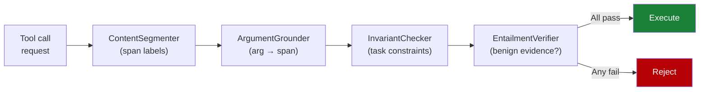

# Provenance-Aware Decision Auditing for LLM Agents

> Provenance-aware decision auditing traces how untrusted context propagates into each tool call, releasing the action only when benign-labeled spans alone justify it.

## The Gap This Closes

Most prompt injection benchmarks assume a static attack string against a fully specified user instruction. Real agents work over *context-dependent* tasks where the correct action depends on tool returns, retrieved documents, and inter-agent messages — defenses that filter only the user prompt or the immediate tool output miss attacks riding on legitimate-looking context ([Weng et al., 2026](https://arxiv.org/abs/2605.03378)).

Architectural defenses such as [CaMeL](camel-control-data-flow-injection.md) close this gap by separating control flow from data flow up front ([Debenedetti et al., 2025](https://arxiv.org/abs/2503.18813)). Provenance-aware decision auditing closes it the other way: let the agent reason over mixed context, then audit each consequential action against an explicit influence graph before execution.

## The Influence Provenance Graph

Nodes are content units the agent has seen — system prompt, user query, tool docs, tool returns, retrieved documents, memory entries, skill instructions, inter-agent messages. Edges record influence: which unit contributed to producing another. Each node carries:

- **Source type** and **base trust** τ₀ — 1.0 for system or user content, down to 0.3 for inter-agent messages
- **Span-level labels** — each character span tagged benign or anomalous by a content segmenter
- **Dynamic trust** — τ(v) = τ₀(v) · max(η, |benign chars| / |total chars|) with floor η = 0.1

Dynamic trust never reaches zero, so contaminated nodes keep minimum credibility while the score reflects contamination severity ([Weng et al., 2026](https://arxiv.org/abs/2605.03378)).

## The Four-Check Release Pipeline

```mermaid
graph LR
    A["Tool call<br/>request"] --> B["ContentSegmenter<br/>(span labels)"]
    B --> C["ArgumentGrounder<br/>(arg → span)"]
    C --> D["InvariantChecker<br/>(task constraints)"]
    D --> E["EntailmentVerifier<br/>(benign evidence?)"]
    E -->|"All pass"| F["Execute"]
    E -->|"Any fail"| G["Reject"]
    style F fill:#1a7f37,color:#fff
    style G fill:#b60205,color:#fff
```

Each check covers a complementary attack pathway, and the ARGUS ablations show every step is load-bearing ([Weng et al., 2026](https://arxiv.org/abs/2605.03378)):

| Component | What it does | ASR if removed |
|-----------|--------------|----------------|
| ContentSegmenter | Partitions each observation into benign and anomalous spans | 25.0% (+21.2 pp) |
| ArgumentGrounder | Traces every argument to a supporting span — copy, normalize, derive, resolve, or ungrounded | 7.5% (+3.7 pp) |
| InvariantChecker | Validates the action against 2-3 task constraints derived from the user query at init | 8.1% (+4.4 pp) |
| EntailmentVerifier | Confirms benign evidence alone justifies the action; flags whether anomalous content could have changed the decision | 11.2% (+7.5 pp) |

## What the Benchmark Measured

ARGUS was evaluated on AgentLure across 4 domains (Banking, Travel, Workspace, Slack) and 8 attack vectors — Capability Routing Hijacking, Argument Tampering, Conditional Flow Hijacking, Reasoning Hijacking, Persistent Context Poisoning, Inter-Agent Contagion, Skill Injection, and Workflow Hijacking. It reaches 3.8% attack success rate while preserving 87.5% of clean task utility; the closest baseline (MELON) reaches 1.6% ASR but drops utility to 65% ([Weng et al., 2026](https://arxiv.org/abs/2605.03378)). The two sit on different points of the same security/utility frontier.

## Where It Fails

The authors flag two boundary conditions ([Weng et al., 2026](https://arxiv.org/abs/2605.03378)):

- **Forged carriers.** When the entire untrusted document is fabricated — a wholly fake invoice, a poisoned RAG chunk with no benign reference — ArgumentGrounder has no benign span to anchor against. Carrier integrity is an explicit assumption, not something the defense provides.
- **Inter-agent contagion under adaptive attack.** ASR climbs from 2.5% to 15.0% on this vector when the attacker has white-box access. Inter-agent messages start at the lowest base trust (0.3), but heavy reliance on agent handoffs remains the weakest line. Broader adaptive-attack work confirms that defenses evaluated against static strings tend to fail under optimization-based pressure ([Nasr et al., 2025](https://arxiv.org/abs/2510.09023)), so treat the published ASR as a ceiling rather than a stable bound.

For fixed-action agents or workflows that never accumulate cross-turn context, the [action-selector pattern](action-selector-pattern.md) or a stateless [behavioral firewall](behavioral-firewall-tool-call-trajectories.md) cover the same risk at lower runtime cost.

The same influence-provenance machinery generalizes beyond injection defense. Recent work extends evidence tracing and execution provenance into a broader trust, debug, and audit tool — tracing which evidence supported each claim, whether each tool call was justified, and how memory influenced later decisions ([From Agent Traces to Trust: Evidence Tracing and Execution Provenance in LLM Agents](https://arxiv.org/abs/2606.04990)).

## Key Takeaways

- The defense converts the implicit instruction/data boundary inside the model into an explicit data-flow audit at the harness.
- An influence provenance graph plus four checks — segment, ground, invariant, entail — release a tool call only when benign spans alone justify it.
- Every check is load-bearing: removing the segmenter alone jumps attack success from 3.8% to 25.0%.
- Carrier integrity and inter-agent contagion are stated weak points; pair the audit with carrier authenticity controls and minimum-trust agent handoffs.
- The runtime cost is non-trivial. Use it where the agent must reason over partially-trusted retrieved context; prefer fixed-action or stateless defenses where the action space allows.

## Related

- [CaMeL: Defeating Prompt Injections by Separating Control and Data Flow](camel-control-data-flow-injection.md) — architectural cousin operating at planning time
- [Designing Agents to Resist Prompt Injection](prompt-injection-resistant-agent-design.md) — six provable patterns this audit composes with
- [Prompt Injection: A First-Class Threat to Agentic Systems](prompt-injection-threat-model.md) — parent threat model
- [Behavioral Firewall for Tool-Call Trajectories](behavioral-firewall-tool-call-trajectories.md) — stateless runtime alternative
- [Audit-Record Divergence as an Agent Runtime Invariant](action-audit-divergence-taxonomy.md) — post-hoc reconciliation dual
- [Indirect Injection Discovery](indirect-injection-discovery.md) — finding the injection vectors this audit then constrains
