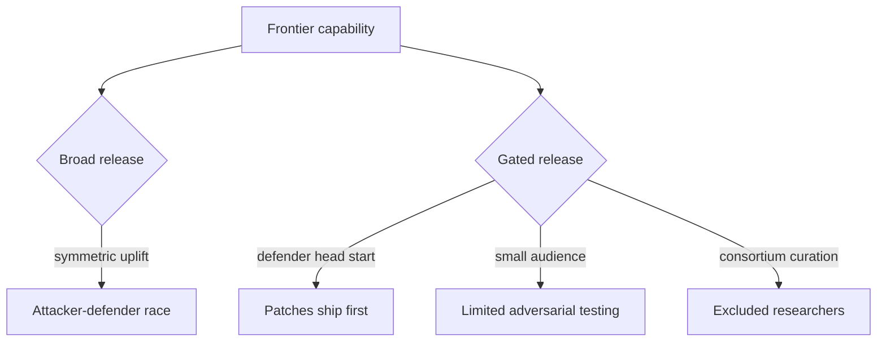

# Restricted-Access Defensive AI: Project Glasswing as a Deployment Model

> Invitation-only release of frontier vulnerability-discovery models to vetted defenders is a deployment category in its own right, distinct from public API and enterprise tier — appropriate when the same capability raises the offensive ceiling more than broad access raises the defensive floor.

## The Deployment Model

Project Glasswing distributes Claude Mythos Preview — an unreleased frontier model — through invitation-only access to twelve launch partners (AWS, Anthropic, Apple, Broadcom, Cisco, CrowdStrike, Google, JPMorganChase, the Linux Foundation, Microsoft, NVIDIA, Palo Alto Networks) and "over 40 additional organizations that build or maintain critical software infrastructure" ([Project Glasswing](https://www.anthropic.com/glasswing)). Anthropic's docs page formalises it: *"Claude Mythos Preview is offered separately as a research preview model for defensive cybersecurity workflows as part of Project Glasswing. Access is invitation-only and there is no self-serve sign-up"* ([Claude models overview](https://platform.claude.com/docs/en/about-claude/models)).

Three deployment-level decisions distinguish this pattern from the standard enterprise tier ([Project Glasswing](https://www.anthropic.com/glasswing)):

- **Curated eligibility, no purchase path.** Corporate partners are bilaterally invited; open-source maintainers apply through the Claude for Open Source program.
- **Suspended pricing during preview.** Anthropic commits $100M in usage credits plus $4M in donations ($2.5M Alpha-Omega/OpenSSF, $1.5M Apache Software Foundation). Post-preview list price is $25 / $125 per million input/output tokens on Claude API, Bedrock, Vertex AI, and Microsoft Foundry.
- **Upstream-enforced disclosure cadence.** For unfixed findings, Anthropic publishes a cryptographic hash of the details and reveals specifics only after a fix ships.

## Why Restrict Access

The justification rests on a measured capability gap. On CyberGym vulnerability-reproduction, Mythos Preview scores 83.1% versus Opus 4.6 at 66.6%. On Anthropic's internal Firefox 147 exploit benchmark, Opus 4.6 produced working exploits twice across several hundred attempts; Mythos Preview produced 181 and gained register control on 29 more ([Willison, 2026](https://simonwillison.net/2026/Apr/7/project-glasswing/)). Anthropic frames the gating as separating capability release from safeguard maturation: *"we need to make progress in developing cybersecurity safeguards that detect and block the model's most dangerous outputs. We plan to launch new safeguards with an upcoming Claude Opus model"* ([Project Glasswing](https://www.anthropic.com/glasswing)).

## What the Pattern Buys

Gated release shifts the latency budget toward defenders. The Mozilla collaboration that preceded Glasswing — using Opus 4.6, not Mythos — produced 22 Firefox vulnerabilities in two weeks; 14 high-severity ones shipped in Firefox 148 before any broader release ([Anthropic Frontier Red Team](https://red.anthropic.com/2026/firefox/), [MFSA 2026-13](https://www.mozilla.org/en-US/security/advisories/mfsa2026-13/)). Defender patch cycles run in weeks; exploitation runs in hours — a head start of weeks-to-months on high-blast-radius targets compounds before broader release.

## Trade-offs



- **Limited adversarial testing of the gating itself.** A vetted audience cannot pressure-test the gating mechanism, the partner-vetting process, or the safeguarded successor model under adversarial use.
- **Concentration risk.** Capability sits inside a hand-picked consortium with the deepest commercial threat-intel reach; independent researchers operate outside it.
- **Lock-in.** A team that builds detection around Mythos faces re-pricing risk at GA and capability-regression risk if the safeguarded successor cannot reproduce findings.
- **Marketing-overlap.** "Defensive-only" is a deployment posture, not a model property — any model that finds vulnerabilities autonomously can also exploit them. The gating is what makes the framing meaningful, and only as long as it holds.

## When the Pattern Does Not Apply

Restricted access is the wrong default when the capability gap is small or the open disclosure pipeline already absorbs the output. By April 2026, Linux kernel and curl maintainers were already working with Opus-4.6-class outputs in the open ([Willison, 2026](https://simonwillison.net/2026/Apr/7/project-glasswing/)) — for that tier, broad release with strong responsible-disclosure norms outperformed a curated trust circle. Gating earns its place only when the offense-defense asymmetry is large enough that broad release would proliferate working exploits faster than defenders patch.

## Adoption Guidance for AppSec Teams

Evaluating an offer of restricted-access defensive AI:

- **Ask for the safeguard roadmap.** The vendor's plan to ship a safeguarded GA model is the deployment-model exit criterion; absence of that plan turns gating into permanent dependency.
- **Treat governance terms as contract.** Glasswing requires partners to share findings and accept a 90-day public-reporting cadence ([Project Glasswing](https://www.anthropic.com/glasswing)).
- **Don't displace structural controls.** The gated model raises offensive search efficiency; it does not replace [Blast Radius Containment](blast-radius-containment.md), [Defense-in-Depth Agent Safety](defense-in-depth-agent-safety.md), or [Enterprise Agent Hardening](enterprise-agent-hardening.md).
- **Plan for the GA-tier price.** $25 / $125 per MTok is roughly 5x current Opus pricing — size the hardening loop on post-credit cost, not preview credits.
- **Read "defensive-only" as a deployment claim, not a capability claim.** The same model exploits what it discovers; gating is the property that makes the framing real.

## Example

Project Glasswing's gating contract is the reference structure for the pattern. The components a partner accepts:

```yaml
access:
  type: invitation-only
  self_serve: false
  eligibility: curated   # corporate partners + critical-infrastructure maintainers
  application_path: claude-for-open-source  # OSS maintainers only

usage:
  preview_credits: $100M  # Anthropic-funded across consortium
  ga_pricing: { input: $25/MTok, output: $125/MTok }
  endpoints: [claude-api, aws-bedrock, gcp-vertex, microsoft-foundry]

disclosure:
  unfixed_findings: cryptographic-hash-only
  fix_first_then_disclose: true
  vendor_public_report: 90-days

partner_obligations:
  share_findings: true
  share_best_practices: true
  use_focus: [vuln-detection, binary-blackbox, endpoint-securing, pentest]

vendor_obligations:
  safeguard_program: upcoming-opus-with-cyber-safeguards
  ga_timeline: tied-to-safeguard-readiness
```

The disclosure-then-fix cadence and the safeguard-readiness exit criterion are the load-bearing elements. Without them, gating drifts from "deployment model" to "indefinite vendor lock" ([Project Glasswing](https://www.anthropic.com/glasswing)).

## Key Takeaways

- Restricted access is a distinct deployment category, not a marketing posture — it earns its place only when the offense-defense asymmetry is large enough that broad release would proliferate exploits faster than defenders patch.
- The mechanism is asymmetric latency: weeks of defender head start on high-blast-radius targets compound before broader release.
- Validate the vendor's safeguard roadmap; absent an exit criterion, gating becomes permanent dependency.
- The gating supplements, not replaces, structural controls like blast-radius containment and defense-in-depth.
- Plan integration cost against post-credit pricing, not preview credits.

## Related

- [Security Budget as Token Economics](security-budget-token-economics.md)
- [Close the Attack-to-Fix Loop](close-attack-to-fix-loop.md)
- [Enterprise Agent Hardening: Governance, Observability, and Reproducibility](enterprise-agent-hardening.md)
- [Lifecycle-Integrated Security Architecture for Agent Harnesses](lifecycle-security-architecture.md)
- [Defense-in-Depth Agent Safety](defense-in-depth-agent-safety.md)
- [Blast Radius Containment: Least Privilege for AI Agents](blast-radius-containment.md)
