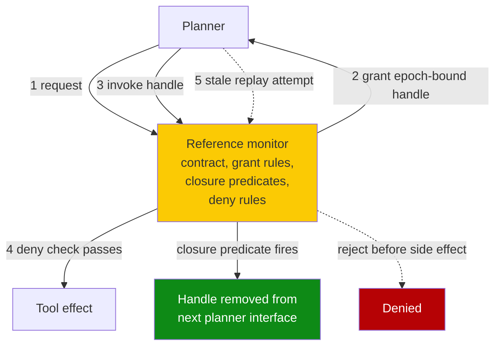

# Revocable Resource-and-Effect Capabilities for Coding Agents (PORTICO)

> Materialise each subgoal-scoped capability as a revocable epoch-bound handle — closure removes it from the planner and stale replay is rejected.

## When This Recommendation Applies

The pattern produces a real security delta only inside these conditions ([Santos-Grueiro, 2026](https://arxiv.org/abs/2606.22504)):

- **All effectful tool traffic is mediated** — every write, exec, and egress call traverses the reference monitor. Raw shellouts, embedded SDK calls, and cached state bypass it.
- **The tool catalog is typed and sound** — closure predicates and deny rules are written against named effects. A wildcard `bash` tool makes every handle a wildcard handle and the closure check has nothing concrete to gate.
- **Subgoals are long enough that stale replay is a real risk** — the lifecycle pays for itself only when a capability outlives the work that justified it. Short single-subgoal sessions are already bounded by transport-level TTLs.
- **The task contract is hand-authored or vetted** — if the planner auto-generates closure predicates from the user's natural-language prompt, the predicates inherit the planner's mistakes.

Outside these conditions, short-TTL transport-level credentials plus [task-scope-security-boundary](task-scope-security-boundary.md) close the same gap with less authorship cost. See [When This Backfires](#when-this-backfires).

## What Lingering Authority Is

A coding agent receives broad tool access for an entire task even when a resource is needed only for one subgoal. "Run the migration" grants write access to the production database for the migration step; once the migration returns, the planner can still call `db.write(...)` for the rest of the session — including in a later turn whose justification an attacker controls. The capability lingers past the episode that authorised it ([Santos-Grueiro, 2026](https://arxiv.org/abs/2606.22504)).

This is distinct from [permission-laundering across composition](monotonic-capability-attenuation.md) — there the *combination* of legal calls produces an illegal effect; here a single previously-legal call becomes illegal *because the work justifying it has closed*. It is also distinct from [authority confusion](authority-confusion-untrusted-context.md) — there the *issuer* is the wrong principal; here the issuer is correct but the *window* has expired.

## How the Request-Grant-Invoke Lifecycle Works

PORTICO compiles an explicit task contract into four artifacts: initial capabilities, grant rules, **trusted closure predicates**, and **global deny rules**. Any expansion beyond the initial set materialises as an **opaque, epoch-bound handle** through three phases ([Santos-Grueiro, 2026](https://arxiv.org/abs/2606.22504)):

| Phase | What happens | Failure mode it closes |
|---|---|---|
| **Request** | Planner asks the monitor for a capability that the contract's grant rules permit | Capability creation outside the contract |
| **Grant** | Monitor issues an opaque, epoch-bound handle; the planner never sees the underlying token | Handle forgery, capability re-derivation from the planner side |
| **Invoke** | Each tool call dereferences the handle through the monitor; a global deny rule may still reject it | Composition that the contract forbids even with valid handles |
| **Close** | A trusted closure predicate fires; the handle is removed from the next planner interface and any later invoke is rejected as stale replay | Lingering authority — replay after the justifying subgoal has closed |

The closure step is the load-bearing one. Removing the handle from the next planner interface means the planner cannot name the capability to replay it, even under prompt injection — replay is structurally impossible, not merely policy-discouraged ([Santos-Grueiro, 2026](https://arxiv.org/abs/2606.22504)).

## Why It Works

The lifecycle shifts the enforcement boundary from "per-tool call" to "per-subgoal handle lifetime" — the layer at which lingering authority accrues. The reference-monitor design then holds the property regardless of model behaviour: the planner cannot replay a capability whose handle it can no longer name. This is the same local-enforceability property [CaMeL](camel-control-data-flow-injection.md) achieves via dual-LLM and a Python interpreter, applied to **effect-handles over time** rather than **values across composition**. On real repository layouts with file writes, git mutations, and network egress, the paper reports zero executed contract-forbidden effects, 10/10 post-closure reuses rejected (a non-revoking comparator permitted all 10), and 0/6 versus 6/6 stale-write outcomes ([Santos-Grueiro, 2026](https://arxiv.org/abs/2606.22504)).

## When This Backfires

The mechanism degrades or fails outside its operating envelope.

- **Off-protocol egress bypasses the monitor.** Raw shell `curl`, embedded SDK calls, headless browsers, or cached filesystem state that skips the reference monitor sits outside its reach — the same mediated-control-plane limitation that bounds [monotonic capability attenuation](monotonic-capability-attenuation.md) and the [MCP runtime control plane](mcp-runtime-control-plane.md).
- **Untyped tool surfaces collapse the closure check.** Closure predicates and deny rules are written against a typed catalog of tools and effects. A generic `bash` tool, a free-form `exec`, or a wildcard MCP server makes every handle a wildcard handle — the lifecycle runs but the close step gates nothing concrete. Pattern-based permission rules without typed catalogs are coarse-grained and cannot capture context-sensitive policies ([Augment Code, *Common Agentic Attack Patterns*](https://www.augmentcode.com/guides/common-agentic-attack-patterns)).
- **Short single-subgoal sessions get no benefit.** When the entire agent lifecycle fits inside one subgoal, short-TTL transport-level credentials (OAuth token exchange, fine-grained PATs, SPIFFE/SPIRE SVIDs) already bound the replay window without an in-harness lifecycle. The request-grant-invoke loop adds bookkeeping for zero realised security delta ([Strata, *2026 OAuth Token Exchange & Agentic AI*](https://www.strata.io/blog/agentic-identity/why-agentic-ai-demands-more-from-oauth-6a/)).
- **Naive task-contract authoring inherits planner mistakes.** Auto-generating closure predicates from the user's natural-language prompt is the same failure mode as naive manifests in [monotonic capability attenuation](monotonic-capability-attenuation.md) — the defense reduces to whatever the planner inferred, which is the principal it was meant to constrain. Hand-authored or vetted contracts are a prerequisite, not a nice-to-have.
- **Confused-deputy via the closure predicate itself.** If the closure predicate reads untrusted runtime context — "close the handle when this returned object has `done=true`" — an attacker controlling the data path can keep the handle alive indefinitely. Closure must evaluate against trusted state only.
- **Authorship cost compounds.** Capability-based systems carry a well-known implementation cost: someone must enumerate the capability claims that today are implicit ([Capability Myths Demolished](http://zesty.ca/capmyths/new.html)). PORTICO multiplies this by adding per-subgoal closure predicates on top of the per-tool catalog.

When the envelope does not hold, the pragmatic alternative is short-TTL transport credentials plus [task-scope-security-boundary](task-scope-security-boundary.md) and a closed [lethal trifecta](lethal-trifecta-threat-model.md) leg — these close lingering authority deterministically without a reference monitor in the harness.

## How It Relates to Adjacent Patterns

PORTICO, [monotonic capability attenuation](monotonic-capability-attenuation.md), and [HBHC](heartbeat-bound-hierarchical-credentials.md) are three different cuts at the same family of risk:

| Pattern | What it scopes to | Revocation event | Authorship cost |
|---|---|---|---|
| [Monotonic capability attenuation](monotonic-capability-attenuation.md) | A *value*'s sink budget across composition | None — authority can only shrink through composition | Expert-crafted sink budgets per value class |
| [Heartbeat-bound hierarchical credentials](heartbeat-bound-hierarchical-credentials.md) | A *credential* across an agent hierarchy | Parent stops heartbeating; descendants expire within `W_max + Δ_h + ε` | NTP discipline + parent keys in an enclave |
| Revocable resource-and-effect capabilities (this page) | A *capability handle* across a subgoal's lifetime | Trusted closure predicate fires | Hand-authored task contract + typed catalog + closure predicates |

The mechanisms compose — value-level attenuation, hierarchy-level liveness, and subgoal-level closure address orthogonal axes. None alone covers the others' failure modes ([Santos-Grueiro, 2026](https://arxiv.org/abs/2606.22504)).

## Key Takeaways

- PORTICO addresses lingering authority — capabilities that remain exposed after the subgoal that justified them closes — by materialising every expansion as an opaque, epoch-bound handle and removing the handle from the planner's interface at closure.
- The reported security delta is large in its envelope: zero executed contract-forbidden effects, 10/10 post-closure reuses rejected versus 10/10 permitted by a non-revoking comparator on real repository layouts.
- The envelope is narrow: mediated tools, sound typed catalog, hand-authored contracts, and subgoals long enough that replay is a real risk. Outside it, short-TTL transport credentials plus narrow task scope close the same gap with less complexity.
- Closure predicates must evaluate against trusted state only — reading untrusted runtime context to decide whether a handle closes reintroduces the confused-deputy problem this page was meant to close.
- Pair with [task-scope](task-scope-security-boundary.md), [blast-radius containment](blast-radius-containment.md), and a closed [lethal trifecta](lethal-trifecta-threat-model.md) leg — the reference monitor is a layer, not a substitute.

## Related

- [Monotonic Capability Attenuation for Composition-Safe Tool Use](monotonic-capability-attenuation.md)
- [Heartbeat-Bound Hierarchical Credentials for Agent Swarms](heartbeat-bound-hierarchical-credentials.md)
- [Treat Task Scope as a Security Boundary](task-scope-security-boundary.md)
- [Authority Confusion: Untrusted Context Must Not Authorize Side Effects](authority-confusion-untrusted-context.md)
- [Blast Radius Containment: Least Privilege for AI Agents](blast-radius-containment.md)
- [MCP Runtime Control Plane: Policy Evaluation Between Agent and Tool](mcp-runtime-control-plane.md)
- [CaMeL: Defeating Prompt Injections by Separating Control and Data Flow](camel-control-data-flow-injection.md)
- [Lethal Trifecta Threat Model](lethal-trifecta-threat-model.md)
