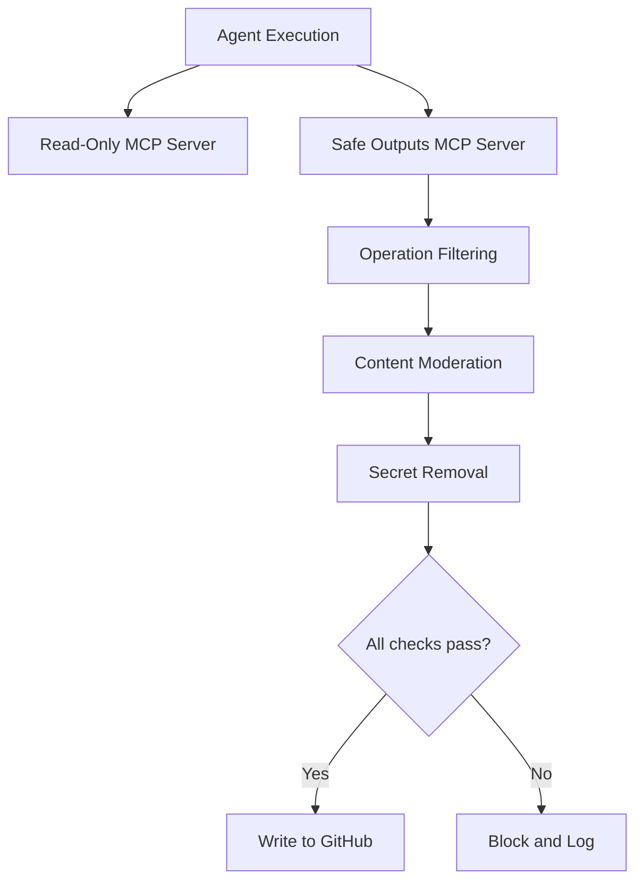

# Safe Outputs Pattern

> Agents operate with read-only permissions by default and must be granted explicit write permissions for specific output types, creating a deterministic blast radius for any agent action.

## The Principle

Every agent starts with zero write access. Read operations — querying files, reading issues, inspecting PR state — are unrestricted. Write operations — creating PRs, posting comments, modifying files — require explicit per-type authorization. This inverts the typical permission model where agents receive broad access and rules attempt to constrain behavior after the fact [unverified].

GitHub's agentic workflows [implement this as a foundational trust pattern](https://github.blog/ai-and-ml/generative-ai/under-the-hood-security-architecture-of-github-agentic-workflows/): agents access repository state through a read-only MCP server by default, and all write operations flow through a separate safe outputs MCP server that buffers and validates every modification.

## How Safe Outputs Work



The pipeline applies [three sequential deterministic checks](https://github.blog/ai-and-ml/generative-ai/under-the-hood-security-architecture-of-github-agentic-workflows/) before any write reaches the repository:

1. **Operation filtering** — workflow authors specify which operation types are permitted and set volume limits (e.g., "at most three pull requests"). Any operation outside the declared set is rejected.
2. **Content moderation** — pattern analysis removes unwanted elements such as URLs or other content that violates policy.
3. **Secret removal** — output sanitization strips exposed credentials before the artifact reaches the repository.

Only artifacts that pass through the entire pipeline are written. Each stage's side effects are transparent and audited.

## Declaring Safe Outputs

Workflow authors [enumerate permitted output types during workflow definition](https://github.blog/ai-and-ml/automate-repository-tasks-with-github-agentic-workflows/), choosing which subset of GitHub updates are allowed: creating issues, comments, or pull requests. The workflow compiler decomposes this into [explicit stages with defined permissions](https://github.blog/ai-and-ml/generative-ai/under-the-hood-security-architecture-of-github-agentic-workflows/) for each phase, creating deterministic boundaries between agent execution and repository mutation.

This declaration-time approach means the blast radius is known before the agent runs. There is no runtime permission escalation — the agent cannot request additional write access beyond what the workflow author declared.

## Applying Beyond GitHub

The pattern generalizes to any agent execution environment:

- **File system agents** — default to read-only filesystem access; explicitly grant write to specific directories
- **Database agents** — default to SELECT-only connections; explicitly grant INSERT/UPDATE on specific tables
- **API agents** — default to GET requests; explicitly grant POST/PUT/DELETE to specific endpoints
- **Deployment agents** — default to dry-run mode; explicitly grant actual deployment to specific environments

In each case, the same structure applies: enumerate the write operations, set volume limits, validate content before execution, and log everything.

## Example

A GitHub Actions workflow declares its safe outputs before execution. The agent is granted permission to create pull requests and post issue comments, with a volume cap of three pull requests per run. Any attempt to push commits directly or modify workflow files is blocked at the operation-filtering stage.

```yaml
safe-outputs:
  permitted:
    - type: pull_request
      max_volume: 3
    - type: issue_comment
      max_volume: 10
  content_moderation: true
  secret_removal: true
```

At runtime, the agent calls the safe outputs MCP server for every write. The server checks the operation type against the declared list, runs content moderation, strips secrets, then proxies the write to GitHub. A fourth pull request attempt is rejected and logged without reaching the repository.

## Key Takeaways

- Default to read-only; require explicit per-type write authorization for every agent
- Declare permitted outputs before execution, not as runtime guardrails
- Apply sequential validation (operation filtering, content moderation, secret removal) to every write
- Volume limits on output types prevent runaway agent behavior
- The pattern applies to any agent environment, not just GitHub workflows

## Unverified Claims

- Typical permission model gives agents broad access with rules constraining behavior after the fact `[unverified]`

## Related

- [Blast Radius Containment: Least Privilege for AI Agents](./blast-radius-containment.md)
- [Dual Boundary Sandboxing](./dual-boundary-sandboxing.md)
- [Enterprise Agent Hardening](./enterprise-agent-hardening.md)
- [Defense in Depth Agent Safety](./defense-in-depth-agent-safety.md)
- [Continuous AI (Agentic CI/CD)](../workflows/continuous-ai-agentic-cicd.md)
- [Permission-Gated Commands](./permission-gated-commands.md)
- [Prompt Injection Threat Model](./prompt-injection-threat-model.md)
- [Scoped Credentials via Proxy](./scoped-credentials-proxy.md)
- [Secrets Management for Agents](./secrets-management-for-agents.md)
- [Treat Task Scope as a Security Boundary](./task-scope-security-boundary.md)
- [Scope Sandbox Rules to Harness-Owned Tools](./sandbox-rules-harness-tools.md)
- [Human-in-the-Loop Confirmation Gates](./human-in-the-loop-confirmation-gates.md)
- [Designing Agents to Resist Prompt Injection](./prompt-injection-resistant-agent-design.md)
- [Tool Signing and Signature Verification](./tool-signing-verification.md)
- [Code Injection Defence in Multi-Agent Pipelines](./code-injection-multi-agent-defence.md)
- [Lethal Trifecta Threat Model](./lethal-trifecta-threat-model.md)
- [Guarding Against URL-Based Data Exfiltration](./url-exfiltration-guard.md)
