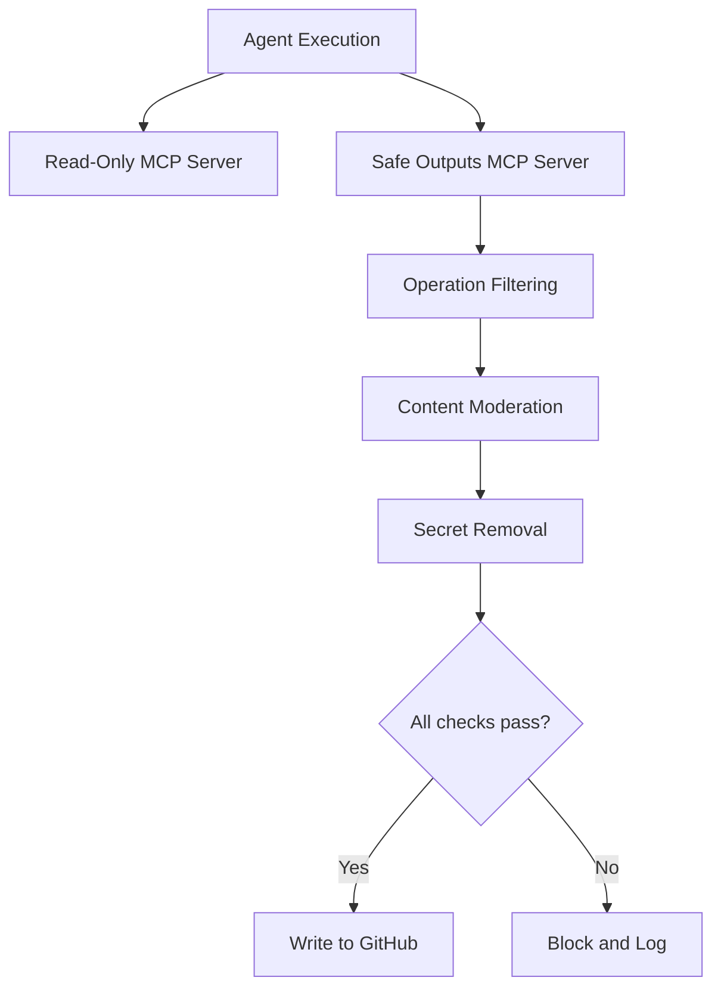

# Safe Outputs Pattern

> The safe outputs pattern gives agents read-only access by default and gates every write behind explicit per-type authorization, bounding the blast radius.

Related lesson: [Capstone — Symptom to Mitigation](https://learn.agentpatterns.ai/security/the-capstone/) covers this concept in a hands-on lesson with quizzes.

## The principle

Every agent starts with zero write access. Read operations are unrestricted: querying files, reading issues, inspecting PR state. Write operations need explicit per-type authorization: creating PRs, posting comments, modifying files. This inverts the default GitHub Actions trust model, where [everything runs in the same trust domain](https://github.blog/ai-and-ml/generative-ai/under-the-hood-security-architecture-of-github-agentic-workflows/) and rogue agents can interfere with MCP servers, read authentication secrets, and reach arbitrary hosts over the network.

GitHub's agentic workflows [implement this as a foundational trust pattern](https://github.blog/ai-and-ml/generative-ai/under-the-hood-security-architecture-of-github-agentic-workflows/). By default, agents read repository state through a read-only MCP server. All write operations flow through a separate safe outputs MCP server that buffers and validates every change.

## How safe outputs work


```mermaid
graph TD
    A[Agent Execution] --> B[Read-Only MCP Server]
    A --> C[Safe Outputs MCP Server]
    C --> D[Operation Filtering]
    D --> E[Content Moderation]
    E --> F[Secret Removal]
    F --> G{All checks pass?}
    G -->|Yes| H[Write to GitHub]
    G -->|No| I[Block and Log]
```

The pipeline applies [three sequential deterministic checks](https://github.blog/ai-and-ml/generative-ai/under-the-hood-security-architecture-of-github-agentic-workflows/) before any write reaches the repository:

1. Operation filtering. Workflow authors set which operation types are allowed and cap the volume, for example "at most three pull requests". Any operation outside the declared set is rejected.
2. Content moderation. Pattern analysis removes unwanted elements such as URLs (see [the URL exfiltration guard](./url-exfiltration-guard.md)) and other content that breaks policy.
3. Secret removal. Output sanitization strips exposed credentials before the artifact reaches the repository.

Only artifacts that pass through the whole pipeline are written. Each stage's side effects are transparent and audited.

## Declaring safe outputs

Workflow authors [list permitted output types when they define the workflow](https://github.blog/ai-and-ml/automate-repository-tasks-with-github-agentic-workflows/), choosing which GitHub updates are allowed: creating issues, comments, or pull requests. The workflow compiler breaks this into [explicit stages with defined permissions](https://github.blog/ai-and-ml/generative-ai/under-the-hood-security-architecture-of-github-agentic-workflows/) for each phase. This draws deterministic boundaries between agent execution and repository changes.

This declaration-time approach means you know the blast radius before the agent runs. There is no runtime permission escalation. The agent cannot ask for more write access than the workflow author declared.

## Applying beyond GitHub

The pattern works in any agent execution environment:

- File system agents default to read-only filesystem access; grant write to specific directories
- Database agents default to SELECT-only connections; grant INSERT or UPDATE on specific tables
- API agents default to GET requests; grant POST, PUT, or DELETE on specific endpoints
- Deployment agents default to dry-run mode; grant actual deployment to specific environments

The same structure applies each time: list the write operations, cap the volume, validate content before execution, and log everything.

## Why it works

The security guarantee is architectural, not behavioral. Routing every write through a separate MCP server that buffers requests before execution creates a deterministic checkpoint. Constraints are enforced there, before any change reaches the repository. [Post-hoc analysis is reactive](https://github.blog/ai-and-ml/generative-ai/under-the-hood-security-architecture-of-github-agentic-workflows/): by the time detection runs, the damage already exists publicly. Staged mediation is preventive instead. Each stage's side effects are explicit and vetted, so a prompt-injected or hallucinating agent cannot overwhelm maintainers with spam, embed malicious content in outputs, or leak secrets before detection.

## When this backfires

- Write operation not in the declared list. If a legitimate task needs a write type the workflow author did not list, the operation fails silently at the filtering stage. The blast-radius guarantee turns into an accidental availability denial for valid use cases.
- Volume caps too tight. A refactoring agent that creates many small PRs may hit caps designed to stop spam. Tuning the limits means you first need to understand how the workload spreads.
- Content moderation false positives. Pattern-based URL removal or content filtering can strip legitimate technical content, for example documentation links in PR descriptions, without telling the agent it failed.
- No protection for the read surface. The pattern bounds the write blast radius, but a compromised agent still reads all repository state. Exfiltration risks need separate controls such as scoped credentials or network isolation.

## Example

A GitHub Actions workflow declares its safe outputs before execution. The agent may create pull requests and post issue comments, with a cap of three pull requests per run. Any attempt to push commits directly or change workflow files is blocked at the operation-filtering stage.

```yaml
safe-outputs:
  create-pull-request:
    max: 3
  add-comment:
    max: 10
```

At runtime, the agent calls the safe outputs MCP server for every write. The server checks the operation type against the declared list, runs content moderation, strips secrets, then passes the write to GitHub. A fourth pull request attempt is rejected and logged without reaching the repository.

## Key Takeaways

- Default to read-only; require explicit per-type write authorization for every agent
- Declare permitted outputs before execution, not as runtime guardrails
- Apply sequential validation (operation filtering, content moderation, secret removal) to every write
- Volume limits on output types prevent runaway agent behavior
- The pattern applies to any agent environment, not just GitHub workflows

## Related

- [Blast Radius Containment: Least Privilege for AI Agents](./blast-radius-containment.md)
- [Permission-Gated Commands](./permission-gated-commands.md)
- [Human-in-the-Loop Confirmation Gates](./human-in-the-loop-confirmation-gates.md)
- [Scoped Credentials via Proxy](./scoped-credentials-proxy.md)
- [Secrets Management for Agents](./secrets-management-for-agents.md)
- [Treat Task Scope as a Security Boundary](./task-scope-security-boundary.md)
- [Prompt Injection Threat Model](./prompt-injection-threat-model.md)
- [Guarding Against URL-Based Data Exfiltration](./url-exfiltration-guard.md)
