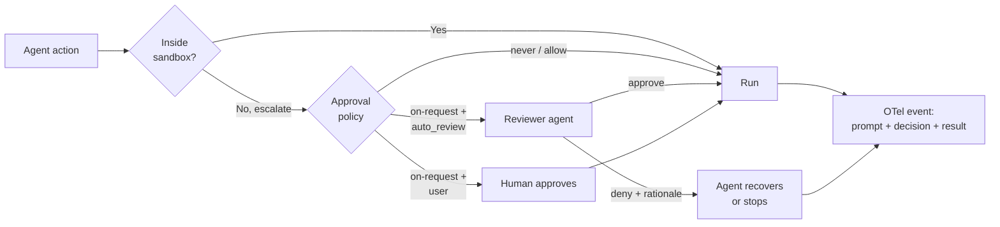

# Sandbox + Approvals + Auto-Review Governance Triad

> Compose a sandbox boundary, a tiered approval policy, an auto-review reviewer for boundary crossings, and agent-native telemetry as one production governance posture — and only adopt the triad when the conditions that make the trade pay off actually hold.

The triad wires four controls — execution boundary, when-to-ask policy, reviewer for boundary-crossing requests, and per-action audit logs — into one governance posture for coding agents. OpenAI's published Codex posture states it directly: "Approvals and sandboxing work together. The sandbox defines the technical execution boundary... Approval policy determines when Codex must ask to perform an action." ([Running Codex safely at OpenAI](https://openai.com/index/running-codex-safely/))

## When the Triad Pays Off

The triad adds cost — reviewer tokens, latency, an LLM-as-judge attack surface — and pays back only when all four conditions hold:

- **Action volume produces approval fatigue.** OpenAI's internal numbers show ~720 out-of-sandbox actions per 10,000-action snapshot, past the rubber-stamp threshold ([Auto-review of agent actions](https://alignment.openai.com/auto-review/)).
- **Configuration is admin-enforced.** If a user can flip `--dangerously-bypass-approvals-and-sandbox` or rewrite the policy file inside the workspace, the triad collapses to whichever layer the attacker reaches first.
- **Agent-native telemetry exists.** Without per-action OTel events, reviewer decisions are unauditable.
- **Irreversible actions are not routed through auto-review.** Production deploys, money movement, and credential rotation belong on a human or cryptographic gate — not behind a 99% auto-approval rate.

If any condition fails, simpler postures dominate: sandbox + on-request + human reviewer for low-volume work, or an isolated runner (microVM, ephemeral container) where the sandbox alone bounds harm.

## The Four Layers

| Layer | What it enforces | Where it fails |
|-------|-----------------|----------------|
| **Sandbox** | OS-enforced filesystem + network limits via Seatbelt (macOS), bubblewrap (Linux), Windows sandbox; configured via `sandbox_mode` and `sandbox_workspace_write.writable_roots` ([Codex Sandboxing](https://developers.openai.com/codex/concepts/sandboxing)) | Kernel CVE; misconfigured writable roots; agent reasons around denylist |
| **Approval policy** | Harness-level enum (`untrusted`, `on-request`, `never`) deciding when the agent must stop and ask before crossing the sandbox edge ([Codex Agent Approvals](https://developers.openai.com/codex/agent-approvals-security)) | Approval fatigue — user rubber-stamps or escapes to `--yolo` ([Approval Fatigue Is an Agent Security Bug](https://www.developersdigest.tech/blog/approval-fatigue-agent-security-bug)) |
| **Auto-review** | A separate reviewer agent grades boundary-crossing requests instead of interrupting the user, set via `approvals_reviewer = "auto_review"` ([Codex Agent Approvals](https://developers.openai.com/codex/agent-approvals-security)) | LLM-as-judge can be prompt-injected to approve attacker actions ([Stop Letting Models Grade Their Own Homework — Lakera](https://www.lakera.ai/blog/stop-letting-models-grade-their-own-homework-why-llm-as-a-judge-fails-at-prompt-injection-defense)) |
| **Agent-native telemetry** | OTel log export of user prompts, tool approval decisions, tool execution results, MCP usage, and network proxy decisions — the audit substrate for the other three ([Running Codex safely at OpenAI](https://openai.com/index/running-codex-safely/)) | Missing or unaggregated; logs without query infrastructure are not an audit |

Each layer is documented separately: [Dual-Boundary Sandboxing](dual-boundary-sandboxing.md), [Pre-Execution Risk Classification](pre-execution-command-risk-classification.md), [Human-in-the-Loop Confirmation Gates](human-in-the-loop-confirmation-gates.md), [Cryptographic Governance Audit Trail](cryptographic-governance-audit-trail.md). The triad framing decides when to wire all four together.



## Why It Works

Each layer enforces a different invariant, and the layer that catches a failure is rarely the one that produced it. The sandbox enforces what is technically possible at the OS level — prompt content cannot override `bubblewrap` or Seatbelt. The approval policy converts "should I run this?" into a small auditable enum shipped via managed configuration. Auto-review addresses the human-factors failure of the approval policy: when reviewer volume exceeds attention budget, humans rubber-stamp and the policy degrades to `never` in practice. OpenAI states the mechanism: "The main agent is optimized to complete the user's task. This creates pressure to treat an approval boundary as just another obstacle to overcome. Auto-review has a narrower job: decide whether a proposed boundary-crossing action should run." ([Auto-review of agent actions](https://alignment.openai.com/auto-review/))

The empirical effect: Codex sessions stop for human approval **~200x less often** in auto-review mode than in manual mode while still catching the actions that should stop. In a 10,000-action snapshot, 9,280 actions ran inside the sandbox without review; 720 escalated to auto-review; the reviewer approved 713, denied 7, and the main agent recovered via a safer path in 4 of those 7 denials ([Auto-review of agent actions](https://alignment.openai.com/auto-review/)). Telemetry makes the first three legs auditable — without per-action OTel events, layers can be bypassed without forensic trace.

## When This Backfires

- **Solo developer, low action volume.** Three escalations an hour do not produce fatigue. Adding an auto-review subagent costs tokens, latency, and a new attack surface for zero attention gain. Sandbox + on-request + user reviewer is the right tier.
- **Fully isolated runner (microVM, ephemeral container).** When the agent has no access to host or production and the runner is destroyed after the task, the sandbox alone bounds harm. Auto-review adds an LLM-as-judge surface that can itself be prompt-injected to approve attacker actions; the CI/CD pattern is "blast radius equals container, do not gate further."
- **Irreversible actions routed through auto-review.** A 99% approval rate is the wrong tier for production deploys, money movement, or credential rotation. Auto-review is designed for *routine* boundary crossings; route true high-stakes actions to a human gate or [Cryptographic Governance Audit Trail](cryptographic-governance-audit-trail.md).
- **Untrusted configuration surface.** If attackers can write to the file that defines the sandbox or approval policy (e.g. an in-workspace `.vscode/settings.json` or `config.toml`), the [YOLO attack chain](https://ajbuilds.medium.com/the-yolo-attack-how-hackers-are-hijacking-ai-agents-by-flipping-one-switch-f8a7ff586310) bypasses the triad entirely. The pattern requires admin-enforced managed configuration (OpenAI's `requirements.toml` with `allowed_sandbox_modes` and `allowed_approvals_reviewers`) — without it, the triad provides false confidence.
- **Reviewer-agent prompt injection.** Auto-review is itself an LLM-as-judge and inherits the documented failure modes — peer-reviewed work shows judges can be misled by the same injections they are supposed to detect, and red-team findings in OpenAI's own evaluations identified cases where auto-review could be tricked into approving without user authorization ([How Not to Detect Prompt Injections with an LLM, ACM AISec 2025](https://dl.acm.org/doi/10.1145/3733799.3762980); [Auto-review of agent actions](https://alignment.openai.com/auto-review/)).
- **No telemetry pipeline.** OTel events without aggregation, retention, and query are not an audit. The fourth leg is load-bearing for regulated deployments.

## Example

OpenAI's published internal posture wires the four layers via two files — a user-editable `config.toml` and an admin-enforced `requirements.toml`. The split matters: the user file enables auto-review and the OTel exporter; the admin file makes `danger-full-access` un-selectable and pins the reviewer choice.

```toml
# config.toml (per user — can be edited)
approvals_reviewer = "auto_review"
sandbox_workspace_write.writable_roots = ["~/development"]

[otel]
log_user_prompt = true
environment = "prod"

[otel.exporter.otlp-http]
endpoint = "http://localhost:14318/v1/logs"
protocol = "binary"
```

```toml
# requirements.toml (admin-enforced — users cannot override)
allowed_sandbox_modes = ["read-only", "workspace-write"]
allowed_web_search_modes = ["cached"]

[experimental_network]
enabled = true
allow_local_binding = true
denied_domains = ["pastebin.com"]
allowed_domains = ["login.microsoftonline.com", "*.openai.com"]
```

The verbatim snippets come from [Running Codex safely at OpenAI](https://openai.com/index/running-codex-safely/). The TOML syntax is Codex-specific, but the four-layer composition is tool-agnostic — Claude Code expresses the same posture through `permissions.deny`, `acceptEdits` mode, sub-agent tool allowlists, and OTel exporters; Cursor expresses it through per-rule allow/deny and audit settings.

## Key Takeaways

- The triad is sandbox + approval policy + auto-review reviewer + agent-native telemetry, composed; treat the four as one posture or do not adopt the pattern.
- Auto-review is a *reviewer swap*, not a permission grant — it does not expand writable roots, enable network access, or weaken protected paths.
- Adopt the triad only when action volume is high enough to fatigue a human reviewer, the configuration surface is admin-enforced, OTel telemetry is wired, and irreversible actions are *not* routed through auto-review.
- The dominant failure mode is approval fatigue causing escape to YOLO mode or overly permissive prefix rules — the triad addresses that failure, not the underlying sandbox bypass.
- LLM-as-judge brittleness is a real attack surface against auto-review; pair the reviewer with rate-limited rejection trajectories and external monitoring, not blind trust.

## Related

- [Dual-Boundary Sandboxing](dual-boundary-sandboxing.md) — the sandbox layer in isolation; filesystem and network boundaries enforced at the OS level
- [Selective Network Sandbox Mode](selective-network-sandbox-mode.md) — finer-grained control of the network half of the sandbox boundary referenced by the first leg of the triad
- [Pre-Execution Risk Classification for Terminal Commands](pre-execution-command-risk-classification.md) — an attention-allocation lever for the approval layer, complementary to auto-review
- [Human-in-the-Loop Confirmation Gates for Consequential Agent Actions](human-in-the-loop-confirmation-gates.md) — the human-reviewer baseline that auto-review replaces for routine boundary crossings
- [Policy-as-Code Layer Typology](policy-as-code-layer-typology.md) — sibling typology for composing governance layers when sandbox isolation is unavailable
- [Cryptographic Governance Audit Trail](cryptographic-governance-audit-trail.md) — the telemetry leg hardened for regulated environments where OTel alone is insufficient
- [Enterprise Agent Hardening: Governance, Observability, and Reproducibility](enterprise-agent-hardening.md) — the broader production-readiness frame the triad fits into
- [Four-Layer Taxonomy of Agent Security Risks](four-layer-agent-security-taxonomy.md) — the layer model that locates each leg of the triad against attack surfaces
