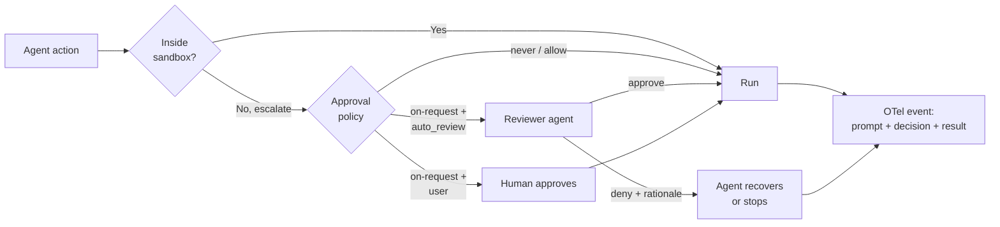

# Sandbox + Approvals + Auto-Review Governance Triad

> Compose a sandbox boundary, tiered approvals, an auto-review reviewer, and agent-native telemetry as one governance posture — adopt it only when the trade-off conditions hold.

The triad wires an execution boundary, a when-to-ask policy, a reviewer for boundary-crossing requests, and per-action audit logs into one governance posture for coding agents. As OpenAI's Codex posture puts it, "the sandbox defines the technical execution boundary" while "approval policy determines when Codex must ask" ([Running Codex safely at OpenAI](https://openai.com/index/running-codex-safely/)).

## When the Triad Pays Off

The triad adds cost — reviewer tokens, latency, an LLM-as-judge attack surface — and pays back only when all four conditions hold:

- **Action volume produces approval fatigue** — OpenAI reports ~720 out-of-sandbox actions per 10,000, past the rubber-stamp threshold ([Auto-review of agent actions](https://alignment.openai.com/auto-review/)).
- **Configuration is admin-enforced** — otherwise a user flips `--dangerously-bypass-approvals-and-sandbox` or rewrites the in-workspace policy file and the triad collapses.
- **Agent-native telemetry exists** — without per-action OTel events, reviewer decisions are unauditable.
- **Irreversible actions stay off auto-review** — deploys, money movement, and credential rotation belong on a human or cryptographic gate, not a 99% auto-approval rate.

Fail any condition and a simpler posture dominates: sandbox + on-request + human reviewer for low volume, or an isolated runner where the sandbox alone bounds harm.

## The Four Layers

| Layer | What it enforces | Where it fails |
|-------|-----------------|----------------|
| **Sandbox** | OS-enforced filesystem + network limits via Seatbelt (macOS), bubblewrap (Linux), Windows sandbox; configured via `sandbox_mode` and `sandbox_workspace_write.writable_roots` ([Codex Sandboxing](https://developers.openai.com/codex/concepts/sandboxing)) | Kernel CVE; misconfigured writable roots; agent reasons around denylist |
| **Approval policy** | Harness-level enum (`untrusted`, `on-request`, `never`) deciding when the agent must stop and ask before crossing the sandbox edge ([Codex Agent Approvals](https://developers.openai.com/codex/agent-approvals-security)) | Approval fatigue — user rubber-stamps or escapes to `--yolo` ([Approval Fatigue Is an Agent Security Bug](https://www.developersdigest.tech/blog/approval-fatigue-agent-security-bug)) |
| **Auto-review** | A separate reviewer agent grades boundary-crossing requests instead of interrupting the user, set via `approvals_reviewer = "auto_review"` ([Codex Agent Approvals](https://developers.openai.com/codex/agent-approvals-security)) | LLM-as-judge can be prompt-injected to approve attacker actions ([Stop Letting Models Grade Their Own Homework — Lakera](https://www.lakera.ai/blog/stop-letting-models-grade-their-own-homework-why-llm-as-a-judge-fails-at-prompt-injection-defense)) |
| **Agent-native telemetry** | OTel log export of user prompts, tool approval decisions, tool execution results, MCP usage, and network proxy decisions — the audit substrate for the other three ([Running Codex safely at OpenAI](https://openai.com/index/running-codex-safely/)) | Missing or unaggregated; logs without query infrastructure are not an audit |

Each layer is documented separately (see Related); the triad framing decides when to wire all four together.



## Why It Works

Each layer enforces a different invariant, and the layer that catches a failure is rarely the one that produced it. The sandbox bounds what is technically possible at the OS level — prompt content cannot override `bubblewrap` or Seatbelt. The approval policy turns "should I run this?" into a small auditable enum. Auto-review addresses that policy's human-factors failure: when reviewer volume exceeds attention budget, humans rubber-stamp and the policy degrades to `never` in practice. The split works because the main agent treats an approval boundary as "just another obstacle," whereas auto-review "has a narrower job: decide whether a proposed boundary-crossing action should run" ([Auto-review of agent actions](https://alignment.openai.com/auto-review/)).

The measured effect: Codex stops for human approval **~200x less often** in auto-review mode — in a 10,000-action snapshot, 9,280 ran in-sandbox, 720 escalated, and the reviewer denied 7 (the agent recovered via a safer path in 4). Without per-action OTel events, a bypass leaves no forensic trace.

## When This Backfires

- **Solo developer, low action volume.** A few escalations an hour produce no fatigue, so auto-review costs tokens, latency, and a new attack surface for zero attention gain. Sandbox + on-request + user reviewer is the right tier.
- **Fully isolated runner (microVM, ephemeral container).** When the agent cannot reach host or production and the runner is destroyed after the task, the sandbox alone bounds harm. Auto-review only adds an LLM-as-judge surface; the CI/CD rule is "blast radius equals container, do not gate further."
- **Irreversible actions routed through auto-review.** A 99% approval rate is the wrong tier for production deploys, money movement, or credential rotation — route those to a human gate or [Cryptographic Governance Audit Trail](cryptographic-governance-audit-trail.md). Auto-review can itself misclassify: a reported Codex incident had the reviewer auto-approve an `rm -rf` of the original project (`risk=medium`, `user_authorization=high`) when the agent prematurely judged a rewrite "wrapping up" ([codex#18840](https://github.com/openai/codex/issues/18840)). The fix is a hard risk-threshold floor forcing manual fallback for destructive operations.
- **Untrusted configuration surface.** If attackers can write the file defining the sandbox or approval policy (an in-workspace `.vscode/settings.json` or `config.toml`), the [YOLO attack chain](https://ajbuilds.medium.com/the-yolo-attack-how-hackers-are-hijacking-ai-agents-by-flipping-one-switch-f8a7ff586310) bypasses the triad. It requires admin-enforced configuration (OpenAI's `requirements.toml`).
- **Reviewer-agent prompt injection.** Auto-review is itself an LLM-as-judge: peer-reviewed work shows judges can be misled by the same injections they detect, and OpenAI's red-team evaluations found cases where it could be tricked into approving without user authorization ([ACM AISec 2025](https://dl.acm.org/doi/10.1145/3733799.3762980); [Auto-review of agent actions](https://alignment.openai.com/auto-review/)).
- **No telemetry pipeline.** OTel events without aggregation, retention, and query are not an audit — the fourth leg is load-bearing for regulated deployments.

## Example

OpenAI's published internal posture wires the four layers via two files — a user-editable `config.toml` and an admin-enforced `requirements.toml`. The split matters: the user file enables auto-review and the OTel exporter; the admin file makes `danger-full-access` un-selectable and pins the reviewer choice.

```toml
# config.toml (per user — can be edited)
approvals_reviewer = "auto_review"
sandbox_workspace_write.writable_roots = ["~/development"]

[otel]
log_user_prompt = true
environment = "prod"

[otel.exporter.otlp-http]
endpoint = "http://localhost:14318/v1/logs"
protocol = "binary"
```

```toml
# requirements.toml (admin-enforced — users cannot override)
allowed_sandbox_modes = ["read-only", "workspace-write"]
allowed_web_search_modes = ["cached"]

[experimental_network]
enabled = true
allow_local_binding = true
denied_domains = ["pastebin.com"]
allowed_domains = ["login.microsoftonline.com", "*.openai.com"]
```

The verbatim snippets come from [Running Codex safely at OpenAI](https://openai.com/index/running-codex-safely/). The TOML is Codex-specific, but the four-layer composition is tool-agnostic — Claude Code expresses it through `permissions.deny`, `acceptEdits` mode, sub-agent tool allowlists, and OTel exporters; Cursor through per-rule allow/deny and audit settings. Cursor frames the same triad from the autonomy angle: a classifier decides per-call whether to route a boundary crossing through review rather than bypassing it in headless runs ([Cursor — Agent autonomy and auto-review](https://cursor.com/blog/agent-autonomy-auto-review)). Its SDK exposes that leg as a concrete first-party API: `local.autoReview` routes headless tool calls through a classifier steered by natural-language `autoRun.allow_instructions` / `block_instructions` declared in `permissions.json` ([Cursor — SDK updates, June 2026](https://cursor.com/changelog/sdk-updates-jun-2026)).

## Key Takeaways

- The triad is sandbox + approval policy + auto-review reviewer + agent-native telemetry, composed; treat the four as one posture or do not adopt the pattern.
- Auto-review is a *reviewer swap*, not a permission grant — it does not expand writable roots, enable network access, or weaken protected paths.
- Adopt the triad only when action volume is high enough to fatigue a human reviewer, the configuration surface is admin-enforced, OTel telemetry is wired, and irreversible actions are *not* routed through auto-review.
- The dominant failure mode is [approval fatigue](pre-execution-command-risk-classification.md) causing escape to YOLO mode or overly permissive prefix rules — the triad addresses that failure, not the underlying sandbox bypass.
- LLM-as-judge brittleness is a real attack surface against auto-review; pair the reviewer with rate-limited rejection trajectories and external monitoring, not blind trust.

## Related

- [Dual-Boundary Sandboxing](dual-boundary-sandboxing.md) — the sandbox layer in isolation; filesystem and network boundaries enforced at the OS level
- [Selective Network Sandbox Mode](selective-network-sandbox-mode.md) — finer-grained control of the network half of the sandbox boundary referenced by the first leg of the triad
- [Pre-Execution Risk Classification for Terminal Commands](pre-execution-command-risk-classification.md) — an attention-allocation lever for the approval layer, complementary to auto-review
- [Human-in-the-Loop Confirmation Gates for Consequential Agent Actions](human-in-the-loop-confirmation-gates.md) — the human-reviewer baseline that auto-review replaces for routine boundary crossings
- [Policy-as-Code Layer Typology](policy-as-code-layer-typology.md) — sibling typology for composing governance layers when sandbox isolation is unavailable
- [Cryptographic Governance Audit Trail](cryptographic-governance-audit-trail.md) — the telemetry leg hardened for regulated environments where OTel alone is insufficient
- [Enterprise Agent Hardening: Governance, Observability, and Reproducibility](enterprise-agent-hardening.md) — the broader production-readiness frame the triad fits into
- [Four-Layer Taxonomy of Agent Security Risks](four-layer-agent-security-taxonomy.md) — the layer model that locates each leg of the triad against attack surfaces
