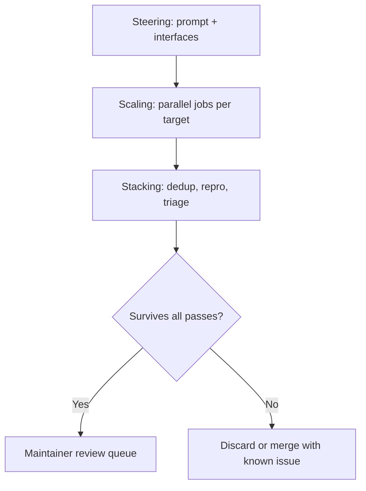

# Harness Composition for Scaled Security Audits

> Compose three primitives — steering, scaling, and stacking — so an audit harness produces actionable findings at maintainer-tolerable triage cost rather than slop.

## The Asymmetric-Cost Problem

AI-generated security bug reports through 2025 were mostly slop. Mozilla frames the economics: "it's cheap and easy to prompt an LLM to find a 'problem' in code, but slow and expensive to respond to it" ([Mozilla Hacks, May 2026](https://hacks.mozilla.org/2026/05/behind-the-scenes-hardening-firefox/)). The curl project received 20 AI-generated submissions in early 2026 with zero confirmed vulnerabilities ([IT Pro](https://www.itpro.com/software/open-source/ai-slop-security-reports-are-driving-open-source-maintainers-mad)). Any system whose validation cost stays human while generation cost falls to inference loses on volume ([Bugcrowd](https://www.bugcrowd.com/blog/sloptimism-is-breaking-any-system-built-on-human-validation/)).

Mozilla's Firefox security team inverted this gradient. Through 2025 they shipped 17–31 fixes per month; April 2026 shipped 423, with 271 identified by an internal harness running on [Claude Mythos Preview](restricted-access-defensive-ai.md) ([Mozilla Hacks](https://hacks.mozilla.org/2026/05/behind-the-scenes-hardening-firefox/)). The team credits model capability gains plus "dramatically improved techniques for *harnessing* these models — steering them, scaling them, and stacking them to generate large amounts of signal and filter out the noise" ([Mozilla Hacks](https://hacks.mozilla.org/2026/05/behind-the-scenes-hardening-firefox/)).

This pattern is distinct from prompt-decomposition in [AI-Powered Vulnerability Triage](../workflows/ai-powered-vulnerability-triage.md). Decomposition splits one audit into sequential stages with fresh contexts; composition runs many audits in parallel and stacks filtering passes against their output.

## Three Composition Primitives



### Steering — shape one pass before scaling

Steering is the iteration loop on a single job. Mozilla supervised early runs in a terminal "to observe the process in real-time and tune the prompts and logic" before scaling out ([Mozilla Hacks](https://hacks.mozilla.org/2026/05/behind-the-scenes-hardening-firefox/)). Steering also fixes which interfaces the model can call — for an audit harness, dynamic test execution, not static analysis alone. Earlier audits on GPT-4 and Claude Sonnet 3.5 against static code "showed some promise, but the high rate of false positives made them impractical to scale" ([Mozilla Hacks](https://hacks.mozilla.org/2026/05/behind-the-scenes-hardening-firefox/)).

### Scaling — partition the target, run in parallel

Once a single pass produces tractable output, scaling fans it out. Mozilla "parallelized the jobs across multiple ephemeral VMs, each tasked to hunt for bugs within a specific target file and write its findings back to a bucket" ([Mozilla Hacks](https://hacks.mozilla.org/2026/05/behind-the-scenes-hardening-firefox/)). The partition unit — file, module, syscall surface — sets the corpus size. See [Sub-Agents and Fan-Out](../multi-agent/sub-agents-fan-out.md) and [Bounded Batch Dispatch](../multi-agent/bounded-batch-dispatch.md) for fan-out mechanics.

### Stacking — filter in inference, not maintainer hours

Stacking is the lifecycle wrapper around discovery: "deduplicating against known issues, tracking bugs, triaging them, and getting fixes shipped" ([Mozilla Hacks](https://hacks.mozilla.org/2026/05/behind-the-scenes-hardening-firefox/)). Each pass discards non-actionable findings at machine cost rather than letting them reach humans. A finding must survive reproducibility, deduplication, and severity triage before a Firefox engineer sees it.

This is the load-bearing primitive. Steering and scaling without stacking produce slop at higher throughput.

## Why It Works

The mechanism is signal-to-noise inversion against an asymmetric cost gradient. A model run against a large codebase produces O(N) findings of which a small fraction are real; without composition, maintainers face O(N) triage cost regardless of yield. Composition reverses the math: scaling produces *more* raw findings, but each stacking pass discards non-actionable candidates at machine cost, so the maintainer queue holds only the residual. Mozilla makes the mechanism concrete: "given the right interfaces and instructions, [the harness] can create and run reproducible test cases to dynamically test hypotheses about bugs in code... we built our own harness atop our existing fuzzing infrastructure" ([Mozilla Hacks](https://hacks.mozilla.org/2026/05/behind-the-scenes-hardening-firefox/)). The reproducibility check is what discriminates — a finding the harness cannot turn into an executable test case never reaches a reviewer.

The pipeline is durable across model swaps: "Once the end-to-end pipeline is in place, it's trivial to swap in different models... model upgrades increase the effectiveness of the entire pipeline" ([Mozilla Hacks](https://hacks.mozilla.org/2026/05/behind-the-scenes-hardening-firefox/)). The wrapper is project-specific; the three primitives are reusable.

## Example

Mozilla built its harness on top of [existing browser fuzzing infrastructure](https://hacks.mozilla.org/2021/02/browser-fuzzing-at-mozilla/) — the dynamic-test substrate the agent calls into. A minimal recreation of the composition pattern wires the three primitives explicitly:

```yaml
# Steering: one prompt, one target file, supervised
steer:
  target: dom/base/nsContentUtils.cpp
  prompt: |
    There is a security bug in this file. Find it and build a
    reproducible testcase using the fuzzing harness at <path>.

# Scaling: fan out across the target corpus
scale:
  parallelism: 64
  targets: <file-list-from-priority-heuristic>
  output_bucket: s3://harness-findings/raw/

# Stacking: filtering passes before any human sees a finding
stack:
  - id: reproducibility-check
    drop_if: testcase_does_not_reproduce
  - id: dedup
    drop_if: matches_known_issue
  - id: severity-triage
    drop_if: severity < sec-moderate
  - id: defense-in-depth-check
    drop_if: blocked_by_existing_mitigation
```

The April spike reflects the full stack working end-to-end; over 100 contributors handled the resulting fix load ([Mozilla Hacks](https://hacks.mozilla.org/2026/05/behind-the-scenes-hardening-firefox/)).

## When This Backfires

- **No dynamic execution layer.** Stacking can only filter findings the harness can reproduce; static-analysis-only output reproduces the GPT-4-era false-positive ceiling.
- **Stacking step is human review.** If maintainers sit inside the filter chain rather than at the end, scaling pushes more work toward them, not less.
- **Small targets.** Scaling adds no value when the audit surface fits in one context window.
- **No fuzzing or test substrate.** Mozilla layered on existing fuzzing; greenfield projects pay a higher integration cost before signal appears.
- **Lethal-trifecta exposure.** A harness combining `WebFetch`, private repo read, and write-capable egress is the canonical [lethal trifecta](lethal-trifecta-threat-model.md). Treat fetched content as data, isolate research from audit phases, and gate outbound actions behind explicit confirmation.

## Key Takeaways

- The unlock is signal-to-noise inversion: stacked filtering passes paid in inference cost replace human triage as the rate-limiting step.
- Steering, scaling, and stacking are reusable primitives; the pipeline that wires them is project-specific.
- Without the stacking layer, steering and scaling produce slop faster — the maintainer-cost gradient stays inverted.
- The harness must include a dynamic test-execution interface; static-only auditing reproduces the false-positive ceiling that made earlier LLM audits impractical.
- Once the pipeline holds, model swaps are cheap and compound across discovery, proof-of-concept generation, and pathology articulation.

## Related

- [AI-Powered Vulnerability Triage](../workflows/ai-powered-vulnerability-triage.md)
- [FLARE: Coverage-Guided Fuzzing for Multi-Agent LLM Systems](../verification/flare-multi-agent-fuzzing.md)
- [Coverage-Guided Fuzz Harness Generation](../verification/coverage-guided-fuzz-harness-generation.md)
- [Decomposed Red-Teaming Agent Monitors](../verification/decomposed-red-teaming-agent-monitors.md)
- [Close the Attack-to-Fix Loop](close-attack-to-fix-loop.md)
- [Lethal Trifecta Threat Model](lethal-trifecta-threat-model.md)
- [Sub-Agents and Fan-Out](../multi-agent/sub-agents-fan-out.md)
