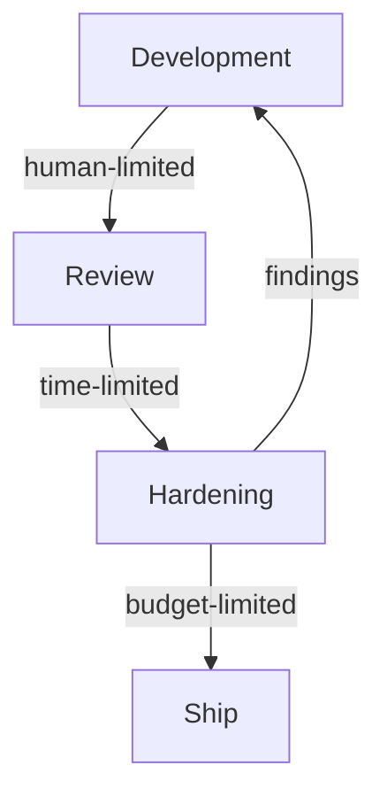

# Security Budget as Token Economics

> When vulnerability-discovery quality scales with inference spend, pre-release hardening reduces to an outspend duel against attackers — useful as a budgeting frame only where the scaling curve has not yet plateaued and downstream triage can absorb findings.

## The Framing

Drew Breunig extracts the economic consequence of Anthropic's Mythos Preview evaluation into one sentence: *"to harden a system you need to spend more tokens discovering exploits than attackers will spend exploiting them"* ([Breunig, 2026](https://www.dbreunig.com/2026/04/14/cybersecurity-is-proof-of-work-now.html)). The argument rests on the UK AI Security Institute's evaluation of Claude Mythos Preview, which showed vulnerability-discovery performance continuing to scale with token budget across three frontier models, with no diminishing returns visible inside the 100M-token-per-attempt range tested ([AISI, 2026](https://www.aisi.gov.uk/blog/our-evaluation-of-claude-mythos-previews-cyber-capabilities)). Simon Willison summarises the debate and its open-source corollary ([Willison, 2026](https://simonwillison.net/2026/Apr/14/cybersecurity-proof-of-work/)).

The primary evidence point: Mythos Preview is the first model to solve "The Last Ones" — a 32-step corporate-network attack simulation AISI estimates at 20 human-hours — completing it 3 times in 10 attempts and averaging 22 of 32 steps per run ([AISI, 2026](https://www.aisi.gov.uk/blog/our-evaluation-of-claude-mythos-previews-cyber-capabilities)). Breunig prices the same budget at roughly $12,500 per attempt, $125k for all ten runs ([Breunig, 2026](https://www.dbreunig.com/2026/04/14/cybersecurity-is-proof-of-work-now.html)).

## The Mechanism

Vulnerability discovery is a search problem with verifiable outcomes: the agent proposes inputs or attack paths, a sandbox confirms success or failure, and the reward signal is crisp. Inference-time compute buys more candidates and longer reasoning traces, which is why AISI's curves keep climbing inside the tested range ([AISI, 2026](https://www.aisi.gov.uk/blog/our-evaluation-of-claude-mythos-previews-cyber-capabilities)). Because attackers and defenders search the same surface, whichever side funds the longer search against the same target finds more bugs first. That is the causal basis for the proof-of-work analogy.

## Budgeting Loop

Breunig proposes splitting agentic coding into three phases with different limiters ([Breunig, 2026](https://www.dbreunig.com/2026/04/14/cybersecurity-is-proof-of-work-now.html)):

1. **Development** — human intuition and feedback bound the rate.
2. **Review** — per-PR automated checks; Anthropic's code-review product lists at $15–20 per review ([Anthropic docs](https://code.claude.com/docs/en/code-review)).
3. **Hardening** — autonomous exploit discovery until budget exhausts.

Review and hardening are distinct because review runs constantly on cheap gardening work while hardening concentrates spend on a stable artifact before release.

## Conditions for the Frame to Apply

The outspend equation only holds under specific conditions. Outside them, raw token spend buys noise or attacker advantage.

**Search curve still climbing.** The AISI finding is bounded: no diminishing returns inside 100M tokens per attempt on synthetic ranges ([AISI, 2026](https://www.aisi.gov.uk/blog/our-evaluation-of-claude-mythos-previews-cyber-capabilities)). A real three-week LLM-assisted hardening sprint on Wasmtime produced 11 issues but visibly plateaued after week 1 and surfaced no new unique issues after week 2 ([Bytecode Alliance, 2026](https://bytecodealliance.org/articles/wasmtime-security-advisories)). Track your own marginal-finding rate and stop when it flattens.

**Triage capacity downstream.** LLM bug detection carries high false-positive rates and produces noise without validation — the bottleneck migrates to human review ([Wen et al., 2025, §4](https://arxiv.org/html/2504.13474v1)). A team that can generate 100 findings per day but validate only 5 loses signal, not gains it.

**Shared target with amortization.** Tokens spent hardening a widely used OSS library amortize across every consumer; tokens spent on a single closed-source app do not. The amortization argument is why OSS becomes *more* valuable under this regime, not less — "given enough tokens, all bugs are shallow" extends [Linus's law](https://en.wikipedia.org/wiki/Linus%27s_law) in the direction of reuse, not replacement ([Willison, 2026](https://simonwillison.net/2026/Apr/14/cybersecurity-proof-of-work/)).

**Weakly defended target.** AISI's ranges lack active defenders, endpoint detection, and real-time incident response; AISI explicitly notes this means results "cannot say for sure whether Mythos Preview would be able to attack well-defended systems" ([AISI, 2026](https://www.aisi.gov.uk/blog/our-evaluation-of-claude-mythos-previews-cyber-capabilities)). Mature defensive telemetry raises attacker cost through mechanisms the token-outspend frame does not model.

## What the Frame Does Not Cover

The equation treats the defender's token spend as the whole cost of security, but the asymmetry runs the other way in most deployed systems: historical cyber economics places defender cost at roughly 1000× attacker cost per engagement (e.g., DDoS at $38/hr to launch vs. $40k/hr to defend) ([Ng, 2021](https://www.linkedin.com/pulse/defenders-attackers-economic-asymmetry-cyber-ng-cissp-ccnp)). Safety training on defender models also creates an alignment tax attacker-side forks do not pay, so the same dollar budget can buy less usable defensive output ([CSO Online, 2026](https://www.csoonline.com/article/4138149/when-ai-safety-constrains-defenders-more-than-attackers.html)). Treat token-economics as a sizing frame for pre-release audit spend, not a substitute for [Blast Radius Containment](blast-radius-containment.md), [Defense-in-Depth Agent Safety](defense-in-depth-agent-safety.md), or the [Lifecycle-Integrated Security Architecture](lifecycle-security-architecture.md) that raise attacker cost structurally.

## Example

AISI's published budget for "The Last Ones" — a 32-step network takeover range — was 100M tokens per attempt, 10 attempts per model ([AISI, 2026](https://www.aisi.gov.uk/blog/our-evaluation-of-claude-mythos-previews-cyber-capabilities)). Breunig prices this at $12,500 per attempt and $125k for the full ten-run sweep at Mythos list pricing ([Breunig, 2026](https://www.dbreunig.com/2026/04/14/cybersecurity-is-proof-of-work-now.html)). Mythos Preview's curve kept climbing to the 100M ceiling, so the dataset offers no lower budget that is demonstrably "enough" — the sizing decision is open-ended until an internal plateau is observed.

Contrast with the Bytecode Alliance's reported three-week Wasmtime sprint: 11 security issues surfaced, with diminishing returns after week 1 and no new unique issues after week 2 ([Bytecode Alliance, 2026](https://bytecodealliance.org/articles/wasmtime-security-advisories)). On a concrete codebase the plateau appeared within weeks, not at arbitrarily large budgets — a signal to stop funding search on that artifact.

## Key Takeaways

- Inference-time compute scales vulnerability-discovery performance with no diminishing returns visible inside 100M tokens per attempt on AISI's synthetic ranges.
- Real-codebase sprints plateau much sooner; measure marginal findings and stop when the curve flattens.
- Open-source amortizes hardening spend across all consumers — strengthens, not weakens, the case for shared dependencies.
- Downstream human triage capacity is a hard cap on useful findings.
- The frame sizes pre-release audits on greenfield or OSS code; it does not replace structural controls that raise attacker cost.

## Related

- [Blast Radius Containment: Least Privilege for AI Agents](blast-radius-containment.md)
- [Defense-in-Depth Agent Safety](defense-in-depth-agent-safety.md)
- [Lifecycle-Integrated Security Architecture for Agent Harnesses](lifecycle-security-architecture.md)
- [Close the Attack-to-Fix Loop](close-attack-to-fix-loop.md)
- [Enterprise Agent Hardening](enterprise-agent-hardening.md)
