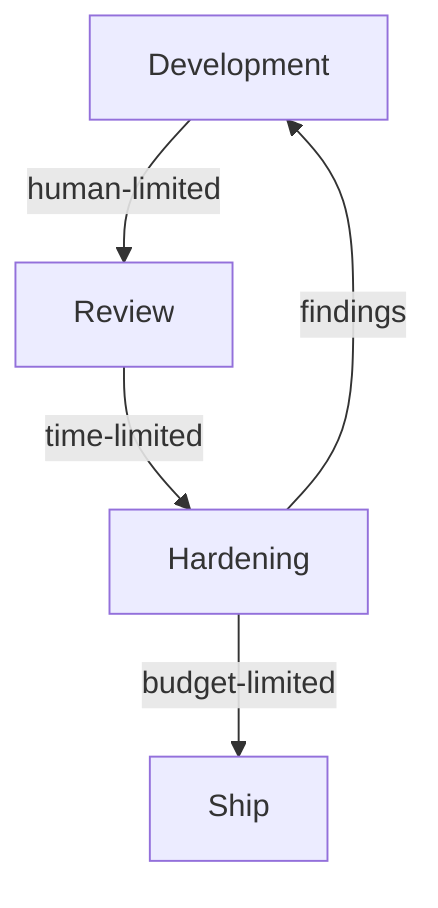

# Security Budget as Token Economics

> Size a security audit as a token budget: when exploit discovery scales with spend, hardening becomes an outspend duel that ends when the curve plateaus.

## The Framing

Drew Breunig compresses the economic consequence of Anthropic's [Mythos Preview](restricted-access-defensive-ai.md) evaluation: *"to harden a system you need to spend more tokens discovering exploits than attackers will spend exploiting them"* ([Breunig, 2026](https://www.dbreunig.com/2026/04/14/cybersecurity-is-proof-of-work-now.html)). The UK AI Security Institute's evaluation showed vulnerability-discovery performance scaling with token budget across three frontier models, with no diminishing returns visible inside the 100M-token-per-attempt range ([AISI, 2026](https://www.aisi.gov.uk/blog/our-evaluation-of-claude-mythos-previews-cyber-capabilities)); Simon Willison summarises the open-source corollary ([Willison, 2026](https://simonwillison.net/2026/Apr/14/cybersecurity-proof-of-work/)).

The headline result: Mythos Preview is the first model to solve "The Last Ones" — a 32-step corporate-network simulation AISI estimates at 20 human-hours — completing it 3 of 10 attempts at roughly $12,500 per attempt ([AISI, 2026](https://www.aisi.gov.uk/blog/our-evaluation-of-claude-mythos-previews-cyber-capabilities); [Breunig, 2026](https://www.dbreunig.com/2026/04/14/cybersecurity-is-proof-of-work-now.html)).

## The Mechanism

Vulnerability discovery is a search problem with verifiable outcomes: the agent proposes inputs, a sandbox confirms success or failure, and the reward signal is crisp. Inference-time compute buys more candidates and longer reasoning traces — which is why AISI's curves keep climbing. Because attackers and defenders search the same surface, whichever side funds the longer search finds more bugs first. That is the causal basis for the proof-of-work analogy.

## Budgeting Loop

Breunig splits agentic coding into three phases with different limiters ([Breunig, 2026](https://www.dbreunig.com/2026/04/14/cybersecurity-is-proof-of-work-now.html)):

```mermaid
graph TD
    A[Development] -->|human-limited| B[Review]
    B -->|time-limited| C[Hardening]
    C -->|budget-limited| D[Ship]
    C -->|findings| A
```

1. **Development** — human intuition and feedback bound the rate.
2. **Review** — per-PR automated checks; Anthropic's code-review product lists at $15–20 per review ([Anthropic docs](https://code.claude.com/docs/en/code-review)).
3. **Hardening** — autonomous exploit discovery until budget exhausts.

Review runs constantly on cheap gardening work; hardening concentrates spend on a stable artifact before release.

## Conditions for the Frame to Apply

The outspend equation holds only under specific conditions; outside them, raw token spend buys noise or attacker advantage.

**Search curve still climbing.** AISI's no-diminishing-returns bound is measured on synthetic ranges. A three-week LLM-assisted Wasmtime sprint produced 11 issues but plateaued after week 1 and surfaced no new unique issues after week 2 ([Bytecode Alliance, 2026](https://bytecodealliance.org/articles/wasmtime-security-advisories)). Track marginal-finding rate and stop when it flattens.

**Triage capacity downstream.** LLM bug detection has high false-positive rates; without validation the bottleneck migrates to human review ([Wen et al., 2025, §4](https://arxiv.org/html/2504.13474v1)). Generating 100 findings per day and validating 5 loses signal.

**Shared target with amortization.** Tokens spent hardening a widely used OSS library amortize across every consumer; tokens spent on a single closed-source app do not. OSS becomes *more* valuable under this regime — "given enough tokens, all bugs are shallow" extends [Linus's law](https://en.wikipedia.org/wiki/Linus%27s_law) in the direction of reuse ([Willison, 2026](https://simonwillison.net/2026/Apr/14/cybersecurity-proof-of-work/)).

**Weakly defended target.** AISI's ranges lack active defenders, endpoint detection, and real-time incident response; AISI notes the results "cannot say for sure whether Mythos Preview would be able to attack well-defended systems" ([AISI, 2026](https://www.aisi.gov.uk/blog/our-evaluation-of-claude-mythos-previews-cyber-capabilities)). Defensive telemetry raises attacker cost through mechanisms this frame does not model.

## What the Frame Does Not Cover

The equation treats defender token spend as the whole cost of security, but the asymmetry runs the other way in deployed systems: historical cyber economics places defender cost at roughly 1000× attacker cost per engagement — DDoS at $38/hr to launch vs. $40k/hr to defend ([Ng, 2021](https://www.linkedin.com/pulse/defenders-attackers-economic-asymmetry-cyber-ng-cissp-ccnp)). Safety training also imposes an alignment tax attacker-side forks do not pay ([CSO Online, 2026](https://www.csoonline.com/article/4138149/when-ai-safety-constrains-defenders-more-than-attackers.html)). Treat token-economics as a sizing frame for pre-release audit spend, not a substitute for [Blast Radius Containment](blast-radius-containment.md), [Defense-in-Depth Agent Safety](defense-in-depth-agent-safety.md), or the [Lifecycle-Integrated Security Architecture](lifecycle-security-architecture.md).

## Example

AISI's "The Last Ones" budget was 100M tokens per attempt across 10 attempts per model — roughly $12,500 per attempt, $125k for the full sweep at Mythos list pricing ([AISI, 2026](https://www.aisi.gov.uk/blog/our-evaluation-of-claude-mythos-previews-cyber-capabilities); [Breunig, 2026](https://www.dbreunig.com/2026/04/14/cybersecurity-is-proof-of-work-now.html)). The curve kept climbing to the 100M ceiling, so the dataset offers no lower budget demonstrably "enough" — sizing is open-ended until an internal plateau appears.

Contrast Bytecode Alliance's three-week Wasmtime sprint: 11 security issues surfaced, diminishing returns after week 1, no new unique issues after week 2 ([Bytecode Alliance, 2026](https://bytecodealliance.org/articles/wasmtime-security-advisories)). On a concrete codebase the plateau appeared within weeks — a signal to stop funding search on that artifact.

## Key Takeaways

- Inference-time compute scales vulnerability-discovery performance with no diminishing returns visible inside 100M tokens per attempt on AISI's synthetic ranges.
- Real-codebase sprints plateau much sooner; measure marginal findings and stop when the curve flattens.
- Open-source amortizes hardening spend across all consumers — strengthens, not weakens, the case for shared dependencies.
- Downstream human triage capacity is a hard cap on useful findings.
- The frame sizes pre-release audits on greenfield or OSS code; it does not replace structural controls that raise attacker cost.

## Related

- [Blast Radius Containment: Least Privilege for AI Agents](blast-radius-containment.md)
- [Defense-in-Depth Agent Safety](defense-in-depth-agent-safety.md)
- [Lifecycle-Integrated Security Architecture for Agent Harnesses](lifecycle-security-architecture.md)
- [Close the Attack-to-Fix Loop](close-attack-to-fix-loop.md)
- [Enterprise Agent Hardening](enterprise-agent-hardening.md)
- [Unbounded Consumption: Bounding Agent Resource Use Against DoS and Denial-of-Wallet](unbounded-consumption-resource-bounds.md) — the runtime-bounds complement; this page sizes pre-release spend, the bounds page caps in-flight spend
