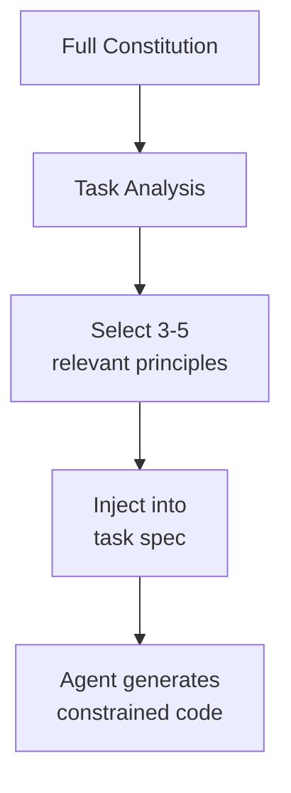
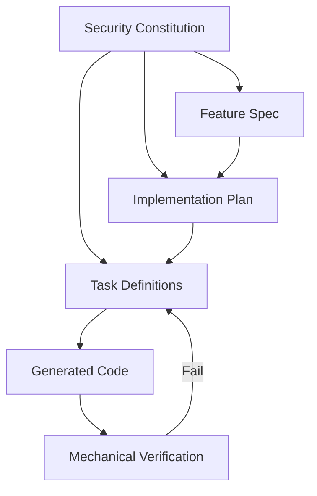

# Security Constitution for AI Code Generation

> Formalize security constraints as a versioned, machine-readable document that agents consume at specification time — enforcing security by construction, not post-hoc review.

## The Problem

AI coding agents optimize for functional correctness. Without explicit security constraints, they produce code that works but contains vulnerabilities — SQL injection, hardcoded secrets, missing input validation. Veracode's [2025 GenAI Code Security Report](https://www.veracode.com/wp-content/uploads/2025_GenAI_Code_Security_Report_Final.pdf) found 45% of AI-generated samples introduced a known security flaw. Post-hoc review catches these at high cost: rework cycles, delayed builds, and compounding security debt.

The alternative: embed security rules in the specification layer so agents never generate the vulnerable pattern in the first place.

## Constitution Structure

A security constitution is a versioned document where each principle maps to a specific weakness class — typically drawn from the [MITRE CWE Top 25](https://cwe.mitre.org/top25/) — and carries an enforcement level ([Marri, 2026](https://arxiv.org/abs/2602.02584)):

```yaml
# security-constitution.yml
principles:
  - id: SEC-001
    cwe: CWE-89
    level: MUST        # MUST | SHOULD | MAY
    constraint: "All database queries use parameterized statements"
    pattern: "Use ORM query builders or prepared statements; never concatenate user input into SQL strings"
    rationale: "SQL injection remains a top-25 CWE; string concatenation is the root cause"

  - id: SEC-002
    cwe: CWE-798
    level: MUST
    constraint: "No credentials in source code"
    pattern: "Read secrets from environment variables or a secrets manager; fail fast if missing"
    rationale: "Hardcoded credentials in AI-generated code are common and persist across sessions"
```

Each principle contains:

| Field | Purpose |
|---|---|
| `id` | Stable reference for traceability |
| `cwe` | Links to Common Weakness Enumeration for auditability |
| `level` | MUST/SHOULD/MAY — distinguishes hard requirements from guidance |
| `constraint` | What the agent must ensure |
| `pattern` | How to implement it — the positive pattern, not just the prohibition |
| `rationale` | Why — agents follow constraints better when they understand the reasoning ([Marri, 2026](https://arxiv.org/abs/2602.02584)) |

The two principles above target real weakness classes with independent evidence of prevalence. CWE-89 (SQL injection) sits at rank 3 on the [2024 CWE Top 25](https://cwe.mitre.org/top25/archive/2024/2024_cwe_top25.html). Hardcoded credentials are disproportionately common in AI-assisted code: GitGuardian's [State of Secrets Sprawl 2026](https://www.helpnetsecurity.com/2026/03/27/gitguardian-exposed-credentials-risk-report/) reports that repositories with active Copilot usage leak secrets at roughly 40% above the public-repo baseline.

## Progressive Disclosure: Select Relevant Principles

Including the full constitution in every prompt degrades compliance. A case study found that injecting 3–5 task-relevant principles achieved 96% compliance versus 78% with the complete document, because context truncation caused the model to lose track of distant principles ([Marri, 2026](https://arxiv.org/abs/2602.02584)). This applies the same load-on-demand principle that [progressive disclosure for agent definitions](../agent-design/progressive-disclosure-agents.md) uses for skills.



Front-load the constraints that matter for the current task. A database migration task gets SEC-001 (SQL injection) and SEC-002 (no hardcoded credentials). An API endpoint task gets input validation and authentication principles instead.

## Three-Phase Integration

Security principles inject at each phase of a spec-driven workflow ([Marri, 2026](https://arxiv.org/abs/2602.02584)):

**Specification phase** — The feature spec references which constitution principles apply. Select 3–5 relevant principles here.

**Planning phase** — The implementation plan includes security constraints as acceptance criteria. "All endpoints validate input against schema" becomes a plan step, not an afterthought.

**Task phase** — Each task definition carries its applicable principles inline. The agent sees the constraint at the point of code generation.



## Mechanical Enforcement

A constitution in a prompt is guidance. A constitution backed by linters, CI gates, and hooks is enforcement. The document serves both roles — human-readable constraints that also feed automated checks.

**Linters and static analysis** — Map each MUST principle to a linter rule. SEC-001 maps to a SQL injection scanner (see [CWE-89](https://cwe.mitre.org/data/definitions/89.html)). SEC-002 maps to secret detection tools like [`gitleaks`](https://github.com/gitleaks/gitleaks) or [`trufflehog`](https://github.com/trufflesecurity/trufflehog). See [secrets management for agents](secrets-management-for-agents.md) for the broader credential handling pattern.

**Pre-commit hooks** — Block commits that violate MUST principles before they reach the repository. Claude Code's [`PreToolUse` hooks](https://docs.claude.com/en/docs/claude-code/hooks) can intercept file writes and run validation ([deterministic guardrails](../verification/deterministic-guardrails.md)).

**CI gates** — Run the full constitution's MUST principles as a CI check. SHOULD principles generate warnings; MAY principles are informational.

The constitution becomes the single source of truth for both agent prompts and automated enforcement. See [defense-in-depth agent safety](defense-in-depth-agent-safety.md) for the broader pattern of layered safety mechanisms.

## Integration with Existing Workflows

The constitution pattern works with instruction files already in use:

- **CLAUDE.md / `.github/copilot-instructions.md`** — Reference the constitution file and include a directive to load relevant principles per task. See [hierarchical instruction files](../instructions/hierarchical-claude-md.md).
- **Spec-driven development** — The constitution becomes an input to the specification phase, alongside requirements and architecture constraints. See [spec-driven development](../workflows/spec-driven-development.md).
- **Deterministic guardrails** — Constitution MUST principles map directly to guardrail rules. See [deterministic guardrails](../verification/deterministic-guardrails.md).

## Limitations

The published evidence comes from a single case study: one developer, one AI assistant, one domain (banking microservices). The reported 73% reduction in CWE violations is indicative but not yet independently replicated ([Marri, 2026](https://arxiv.org/abs/2602.02584)).

The 16-hour upfront investment is from a single practitioner. Teams with existing security standards can adapt faster; teams without them will need more time. Whether the same structure works for other domains (embedded systems, frontend applications, data pipelines) is untested.

## Key Takeaways

- Formalize security rules as structured, versioned principles with CWE mappings — not prose paragraphs in a wiki
- Inject 3–5 relevant principles per task rather than the full constitution — context window limits make selective loading more effective than exhaustive inclusion
- Back every MUST principle with a mechanical check (linter, hook, CI gate) — prompts guide, guardrails enforce
- Integrate at the specification phase, not as a post-implementation review step

## Related

- [Defense-in-Depth Agent Safety](defense-in-depth-agent-safety.md) — Layered safety mechanisms that a constitution feeds into
- [Deterministic Guardrails](../verification/deterministic-guardrails.md) — Mechanical enforcement layer for constitution MUST principles
- [Hierarchical Instruction Files](../instructions/hierarchical-claude-md.md) — Where constitution references live in project configuration
- [Spec-Driven Development](../workflows/spec-driven-development.md) — Workflow where the constitution becomes a specification input
